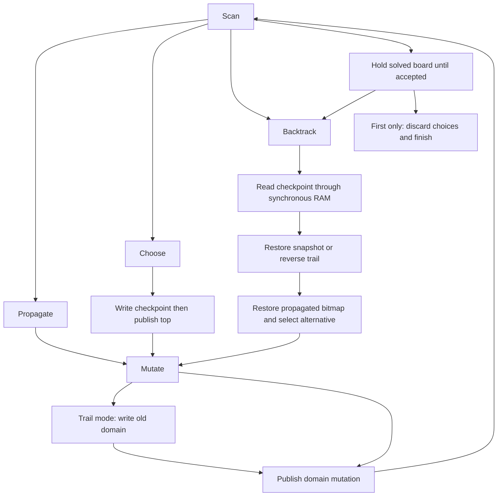

# Eight-queens rollback engine

This laboratory implements deterministic constraint search as a synchronous FPGA state machine. It places one queen in each of eight columns and emits all 92 legal boards, or accepts the first board and terminates when `FIRST_ONLY=1`. The board implementation targets the Olimex GateMate A1 EVB at 10 MHz. It reuses the first laboratory's RAM, reset, UART, and pin constraints.

## State and propagation

`domains[c]` is an eight-bit mask: bit `r` means row `r` remains permitted in column `c`. All masks start at `FF`. A singleton mask fixes a queen. The propagated bitmap identifies singleton columns whose attacks have already been removed from all other columns. Zero masks are contradictions.

The controller scans columns in increasing order. It propagates the first unpropagated singleton before making another choice. For a queen at `(c,r)`, target column `t` loses row `r` and rows `r ± abs(t-c)` when those rows exist. If propagation reaches a contradiction, the controller restores the newest choice. Otherwise, it selects the first unresolved column and its least significant permitted row.

```text
repeat:
    if any domain is zero: backtrack()
    else if an unpropagated singleton exists:
        remove its attacks from each other column
        mark it propagated
    else if all domains are singleton:
        hold result until accepted
        if FIRST_ONLY: discard choices; establish cut; finish
        else: backtrack()
    else:
        reserve choice and mutation capacity
        save checkpoint with remaining alternatives
        narrow chosen domain to its least significant row
```

## Two recovery implementations

`rtl/queens_core.sv` owns all semantic state. `USE_TRAIL` chooses the recovery storage at elaboration, while retaining the same propagation and search order. This makes the cost comparison attributable to recovery rather than different search heuristics.

The snapshot configuration writes an entire checkpoint: 64 domain bits and 40 metadata bits. Restoration copies the saved domains and propagated bitmap. The trail configuration stores a 40-bit choice record and logs each changed domain in a separate 20-bit record before publishing the domain write. It restores records in reverse order until the saved mark, then restores the propagated bitmap.

| Record | Fields, most significant first |
|---|---|
| Choice, 40 bits | variable 3, remaining rows 8, trail mark 7, propagated bitmap 8, reserved 14 |
| Snapshot, 104 bits | domains 64, choice metadata 40 |
| Trail, 20 bits | column 3, previous domain 8, choice level 5, reserved 4 |

The RAMs have registered synchronous read outputs. The controller separates requesting a record, waiting for the RAM output, capturing it, validating it, and applying it. A new choice becomes live only after its RAM write. A domain mutation becomes visible only after the corresponding trail write. No-change domain operations consume no trail entry; zero-domain writes do consume an entry because they must be reversible.



## Interfaces and faults

The core uses `result_valid`, `result_ready`, and `result_data[23:0]`. Column zero occupies bits 2:0. A result and its supporting semantic state remain stable throughout backpressure. `solution_count` counts accepted boards. The first board is `[0,4,7,5,2,6,1,3]`, encoded as `672BE0`.

`FIRST_ONLY` applies its cut only on a successful result handshake. It clears the choice stack and moves the trail base to the current top; old trail contents remain physically present but inaccessible. No subsequent rollback is allowed. Reset restores initial masks and pointer ownership without clearing RAM contents.

The logical trail capacity is 0–64 entries; choice capacity is 0–8. Physical RAM depths remain 64 and 8 even in zero-capacity tests. Capacity is checked before consuming an alternative or performing a protected write. Faults preserve the attempted operation's state, not the complete search history.

| Code | Meaning |
|---|---|
| 1 | `TRAIL_FULL` |
| 2 | `CHOICE_FULL` |
| 3 | `BAD_DOMAIN_INDEX`, reserved; the internal three-bit column representation cannot exceed seven |
| 4 | `BAD_ONEHOT` propagation source |
| 5 | `TRAIL_INTEGRITY`, including invalid checkpoint marks, record flags, levels, or restoration masks |

`trace_valid/trace_kind` expose semantic events for simulation: CREATE, UPDATE, WRITE, PROPAGATED, CONTRADICTION, RESTORE, RESTORED, POP, OUTPUT, COMPLETE, and FAULT (codes 1–11). State exports include packed domains, propagated bitmap, choice top, trail top, and trail base. Profiling outputs count cycles, domain writes, history requests, choice writes, and blocked result cycles. These debug ports are not connected to the board UART.

`rtl/queens_result_printer.sv` serializes accepted results and explicit terminal records. At 115200 baud, 8N1, the output is:

```text
Q:672BE0\r\n       first board (six hexadecimal digits)
D:0000005C\r\n     completed enumeration (eight hexadecimal digits)
F:01\r\n           trail capacity fault (two hexadecimal digits)
```

The printer retains each record through its last transmitted byte. A physical FPGA capture verifies the externally visible result sequence and terminal status; internal restoration traces are collected in simulation.

## Build and validation

```sh
source /home/manuel/fpga/oss-cad-suite/environment
cd queens_rollback
make test
make bit CORE=trail FIRST_ONLY=0
make load CORE=trail FIRST_ONLY=1
make bit CORE=snapshot FIRST_ONLY=0
```

`scripts/make_synth.py` generates the synthesis script with explicit parameters. `TRAIL_CAPACITY`, `CHOICE_CAPACITY`, and `PNR_SEED` are Make variables; the default route seed is 2. Generated products remain in ignored `build/`. Use tmux for long builds and physical UART capture. The ticket's `scripts/05-hardware.py` builds and loads three variants with serial capture armed before programming, then checks the complete byte stream against the reference model.

`tools/oracle.py` is an independent recursive geometric solver. It does not reuse domain propagation or undo logic. `tools/queens_model.py` is the stepwise architectural model. `sim/test_rtl.py` compares every semantic event, live checkpoint, and live trail record with that model; the testbench also checks state stability on cycles between events. Tests inject corrupted records, reset during logging/restoration/output, vary result readiness, exhaust shallow capacities, and hold the first result before cut. `sim/test_top.py` decodes the actual UART waveform and verifies records across board reset. The complete suite contains 58 tests.

## Measured algorithmic costs

These are checked RTL runs with results always ready. UART output stalls are excluded.

| Measurement | Snapshot | Trail |
|---|---:|---:|
| Solutions | 92 | 92 |
| Cycles | 53,951 | 74,523 |
| Domain writes | 3,980 | 3,980 |
| Choice record writes | 672 | 672 |
| Maximum live choices | 6 | 6 |
| Maximum live trail entries | — | 32 |
| Complete-record write traffic, bits | 69,888 | 106,480 |
| Complete-record read request traffic, bits | 69,888 | 106,480 |

Request traffic counts consumed records at their physical record widths. It excludes incidental RAM outputs that the controller does not consume. Logical protected-state counters must not be added to metadata counters to estimate physical traffic: the snapshot fields overlap. The trail performs more operations on this small, densely propagated problem. It reduces the choice-record width, but does not reduce total traffic or execution cycles here.

The implementation ticket contains build logs, physical captures, detailed diary, print receipts, and measured mapping/timing results: [GATEMATE-SYMBOLIC-004](../ttmp/2026/09/04/GATEMATE-SYMBOLIC-004--laboratory-2-rollback-constraint-solving-on-gatemate/index.md). The intern-oriented design rationale remains in ticket GATEMATE-SYMBOLIC-005.

## Physical measurements

| Configuration | CPE_LT | CPE_FF | RAM_HALF | Routed Fmax | UART result |
|---|---:|---:|---:|---:|---|
| snapshot | 2221 | 577 | 3 | 30.19 MHz | 92 boards, exact match |
| trail | 2070 | 460 | 2 | 30.98 MHz | 92 boards, exact match |
| trail-first | 2125 | 467 | 2 | 33.72 MHz | 1 boards, exact match |

All variants use the same 10 MHz constraint and routing seed 2. Frequencies are final post-route estimates, not the earlier placement estimates. Resource columns retain nextpnr units: CPE_LT and CPE_FF are subresources, and RAM_HALF counts half blocks; they must not be relabeled as whole CPEs or whole BRAMs. UART captures were armed before programming and continued for eight seconds. The final loaded image is trail-first. Internal semantic traces are simulation evidence; the board captures expose results and explicit terminal status.
