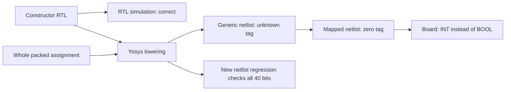

# Correctness repair design

## Objective and scope

Repair review findings F1–F9 while preserving the Python machine's specified instruction semantics. The starting implementation is unchanged from `c7f9dc9`; review-only commits culminate in `4336966`. This ticket changes the assembler, two RTL cores, simulation observation, random generation, and accompanying documentation. No compatibility layer is needed or planned.

The primary acceptance condition is architectural agreement: after every retirement, both logical stacks, the PC, output stream, halted state, and fault state must match the executable model. Internal memory reads may take extra clocks but must not change visible state. A green demonstration alone is insufficient: the review's minimized defects must become regressions.

## P1: instruction and assembler guards

The BRAM PUSH/DUP case must reject DUP when depth is zero before using top0. Register-core EXECUTE must initialize its retirement candidate from current PC/depth, so JMP and SWAP cannot reuse an old depth after EMIT. Preserve instruction-specific overrides.

The assembler must explicitly distinguish blank/comment lines from syntax errors. Invalid nonempty source raises ValueError with line context. Capacity is checked on the common instruction-emission path before either WORD, immediate placeholders, or ordinary instructions append a word. Validate positive ROM size and correct stale tuple annotations/comments.

Regression inputs include empty DUP, DUP after consuming the last value, DUP at capacity, EMIT followed by JMP/SWAP, malformed multi-operand lines, and raw/mixed instructions exceeding capacity. Establish failing tests before fixes, then run the complete suite.

## P2: atomic return state and correct fault context

Introduce `nrdepth_q/d` as staged return depth. EXECUTE initializes it from rdepth and CALL/RET override the candidate. Only COMMIT assigns the architectural rdepth from the candidate, together with the return-address array write and PC update. A per-cycle monitor must detect changes in either live stack outside retirement; the return stack cannot publish an address as live before it has been written.

The BRAM machine may have tc=1 and dc>0. In this state the second logical value is RAM[dc-1], while opnd_q may contain stale data. Generalize decode operand-context acquisition to fetch this value for every instruction when needed, not only arithmetic/SWAP. For DROP/JZ/EMIT the same read also supplies pop refill. This uses one additional read cycle for some instructions but preserves the existing fault tag contract without new public interfaces.

## P3: ROM escape and continuation addresses

Retain the model's existing behavior: an instruction at ROM_DEPTH-1 may retire and advance PC to ROM_DEPTH; the following fetch faults BAD_BRANCH_TARGET with mnemonic FETCH. CALL at the last word saves ROM_DEPTH, and a later RET restores it before the fetch fault. HALT at the last address stays legal.

Separate architectural PC width `clog2(ROM_DEPTH+1)` from physical ROM address width `clog2(ROM_DEPTH)`. Update PC candidates, return addresses, trace PC fields, fault PC fields, debug signals, and benches together. Never fetch an out-of-range memory index; drive a safe physical address while checking the architectural PC in FETCH. For BRAM fetch faults, acquire valid second-operand context first when tc=1/dc>0.

Add explicit `trace_fetch` and `fault_fetch` flags to distinguish a synthetic fetch failure from an actual 5-bit instruction opcode. The flags accompany the existing trace/fault interfaces; no undefined opcode becomes an executable FETCH instruction. The testbench formats FETCH using the flag; the model remains unchanged. Normal instruction faults still retain their actual opcode.

Support ROM sizes 2 through 32768 and stack/return depths at least 2, with parameter checks for invalid configurations. Compare the complete immediate against integer ROM_DEPTH rather than slicing 32768 to a zero 15-bit value. Test small power-of-two and non-power-of-two ROMs and the default 1024 boundary.

## P4: full-state differential verification and useful generation

Add testbench snapshot records containing every live 40-bit data value and every live return address at each retirement/fault. Reconstruct BRAM order as RAM[0:dc], then top1 if tc=2, then top0 if tc>=1. Snapshot only live storage; stale unused words remain permitted.

```text
on a retirement/fault pulse:
    compare pc, complete live data, complete live returns to model
on any other clock after reset:
    require those architectural values to remain unchanged
on FAULT:
    require the pre-instruction architectural values to remain unchanged
```

Existing helpers will compare these snapshots in addition to TRACE/FINAL so directed and random suites share the stronger check. Random generation will use the executable model to select only successful instruction fragments; include bounded CALL/RET and branch fragments with explicit continuations. Deliberate fault injection must actually fault. Legal generation must halt without falling into padding. Capture seed-based opcode/fault/branch and cache-transition coverage rather than equating seed count with coverage.

Add production stack-capacity boundary tests (512 deep + two cached), arithmetic extremes, constructed noncanonical Boolean and flag-bearing values, and reset/output checks where harness support permits. Mechanically verify handwritten ISA/fault/tag/event mirrors against Python metadata instead of introducing generated semantic logic that would reduce model independence.

## P5: documentation, build, and board evidence

Update stale README, Makefile, interface, and playbook statements. Run the full test suite and metadata consistency check; run synthesis, placement/routing, and packing with the current source and selected program recorded. Capture hardware UART for arithmetic, type-fault, Fibonacci, and a burst-output program if the configured board interface is available. Distinguish physical-board evidence from simulation and explicitly record any unavailable interface.

Retain the two-BRAM budget and inspect routed frequency against the 10 MHz clock. Store commands/logs under this ticket and use tmux for long-running build or serial capture sessions. No external source download is needed: the reviewed code and archived specification already supply the contract.

## Commit, diary, and printed phase boundaries

Print one overall plan and a plan/status slip before/after each of P1–P5 using the brutalist work-slip script. Preserve YAML and command receipts in `reference/slips`. Commit the design before implementation, then commit each tested phase and update the diary with commands, observed failures, design choices, and commit IDs. Finish with docmgr doctor and a clean working tree.

## Risks and alternatives

The main interface change is wider architectural PCs plus explicit fetch flags. All in-repository consumers change in the same phase. The extra BRAM operand-context read trades a cycle for reliable fault metadata. Full snapshots are simulation-only and cost no FPGA memory. The model is still not a formal proof, so independent boundary assertions and fixed expected examples remain valuable.

## Implemented outcome and review map

The implementation follows the five phases above. Core logic changes are committed
as `a3b50fb` (guards), `3213364` (retirement/context), and `c9805a6` (ROM escape).
Verification is `662843a`; current-contract documentation and explicit router seed
are `49807a4`. The detailed diary records pre-fix failures separately from successful
post-fix runs, including checked edit-script failures that occurred before edits
were written.

The suite grew from 123 to **198 passing tests**. Full-state observation now covers
all live data values and return addresses, accepted output including flags, and
architectural stability between retirements and on faults. The final run records
all nine fault kinds, every opcode, both JZ outcomes, and cache-count transitions.
Constructed RTL states test noncanonical Booleans, signed arithmetic extremes, and
flag-bearing values. The 514-slot hardware capacity is tested directly. Board
simulation tests button restart during computation and partial serial transmission.

Before the constructor repair below, the initial router seed converged at 15.60 MHz after a long period of
alternating congestion. It completed before the attempted cancellation, so it was
not a failed build. Explicit seed 2 completed in 72 router iterations at **15.52 MHz**
(PASS at 10 MHz). Both use two BRAM blocks and one multiplier; the reported packing
step creates 392 CPEs. The seed is now a Makefile parameter rather than an implicit
router default.

Hardware capture results and bitstream hashes are in
`reference/validation/P5-hardware.json`, with raw serial bytes and loader/build logs
per program. These captures compare the actual board stream against the model for
Fibonacci, arithmetic, type-fault, and countdown. UART silence for type-fault confirms
only absence of emitted bytes; complete fault-state preservation is established by
simulation, not by this serial capture. Trace RAM remains a future extension.

The initial board-discovery command ran inside a sandbox without USB/serial access.
An outside-sandbox check found DirtyJTAG and both ttyACM interfaces; no physical
reconnection was necessary. Build provenance starts from `662843a`; seed selection
and comment/documentation-only updates were pending during the first image builds
and are committed in `49807a4`. Per-image SHA256 values identify the actual tested
bitstreams independently of that working-tree timing.

### Additional P5 repair: constructor lowering

The first physical countdown capture ended with `T0:00000001` instead of the
model's `T1:00000001`. Repeated capture reproduced the mismatch. Production-size
RTL simulation was correct, but the mapped netlist reproduced the board result.
The generic Yosys netlist contained unknown upper bytes for constant constructor
results: `40'hxx00000001` and `40'hxx00000000`. Dynamic constructors retained their
tags, explaining why arithmetic-only board checks had passed.

The minimized regression synthesizes a probe with constant true, false, and zero,
plus dynamic signed integer and Boolean arguments. Icarus executes the generated
netlist and checks all 40 bits. It failed before the repair and passed afterward.
Constructors now assign the entire packed result directly:

```text
mk_int(x)  = concatenate(INT_TAG, zero_flags, x[31:0])
mk_bool(b) = concatenate(BOOL_TAG, zero_flags, 31 zero bits, b)
```

This keeps the same representation and canonical Boolean semantics while avoiding
the supported frontend's constant-folding error for field-assigned temporaries.
Commit `605f41d` contains the repair and regression. The full suite passes 198
tests. Original failed board evidence remains in
`reference/validation/before-constructor-fix/`; final captures occupy the normal
P5 evidence paths. Raw serial files are explicitly binary in Git to retain CRLF.

The repaired build at `605f41d` routes Fibonacci at **16.03 MHz**, passing the
10 MHz constraint. All four final board streams match the model. Countdown now
ends with the correct `T1:00000001`; its repaired image hash is
`6d2c0fe0283de49faca2efcd49d56427d29f316a431ef8a8ce15dfd4e17cbd03`.
The synthesis/build logs preserve resource and timing details for each program.



The failing path in the diagram describes the original field-assignment form.
The repaired form is verified independently at the constructor netlist boundary
and by the rebuilt board output; neither check alone proves all synthesized core
states equivalent to the model.

### File-level implementation references

- `rtl/symbolic_types_pkg.sv`, `sim/constructor_probe.sv`,
  `sim/tb_constructor.sv`, `sim/test_synthesis.py`: whole packed constructors
  and an executable synthesized-netlist regression (`605f41d`).

- `rtl/stack_core.sv`: default candidate depth, staged return depth, wider PCs,
  fetch bounds and explicit fetch context.
- `rtl/stack_core_bram.sv`: empty DUP guard, generalized operand-context read,
  staged return depth, fetch-context states and wider addresses.
- `rtl/top.sv`: wider debug PC and new fetch-flag port wiring.
- `tools/asm20.py`: syntax rejection, common pre-emission capacity check, ROM limits.
- `sim/tb_stack_core*.sv`: simulation state injection, STATE/XFER observations,
  return/data/PC stability and fault-context checks.
- `sim/state_checks.py`: executable-model comparison of complete snapshots and
  transfers; aggregated execution coverage.
- `sim/program_generation.py`: validated bounded fragments with nested calls and
  explicit branch joins; genuine fault injection.
- `sim/test_repairs.py`, `sim/test_verification.py`: minimized review regressions,
  ROM/capacity boundaries, full-width values, metadata and generator properties.
- `sim/tb_top.sv`, `sim/test_top.py`: reset-aware serial decoder, restart during
  compute/transmit, final LED assertion.
- `scripts/check_isa.py`: handwritten metadata/name mirror validation.
- `Makefile`, README, PB-01 through PB-04: explicit routing seed and current APIs,
  observations, test count, program selection and reset behavior.

Archived edit scripts in this ticket reproduce the investigation steps from their
original starting revisions; they are intentionally checked one-shot edits, not an
idempotent installer. Normal verification uses `make test`, `make bit PROG=fib`,
and the standalone ISA check. Final evidence consistency is checked by ticket
`scripts/13-validate-delivery.py` without reprinting or reprogramming the board.
