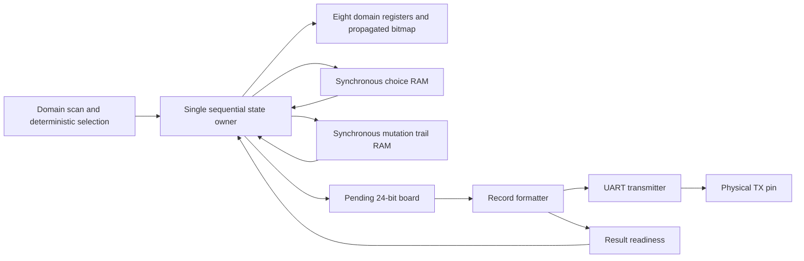
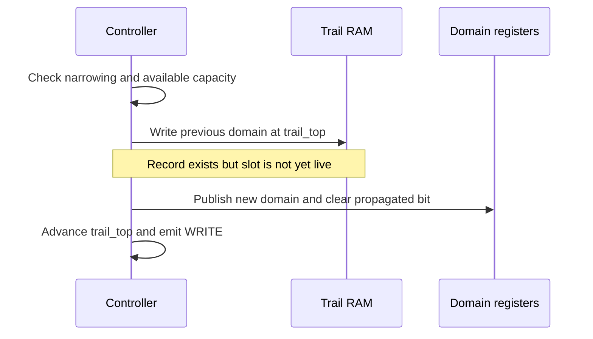

# Inside an FPGA Rollback Solver: Eight Queens, Reversible State, and Synchronous Memory

The second GateMate symbolic-computing laboratory implements an eight-queens search engine directly in synchronous logic. Its registers hold candidate row sets; its controller propagates constraints, chooses alternatives, detects contradictions, and restores earlier state. Two storage configurations execute the same search: one saves complete domain snapshots, while the other records individual mutations in a trail. Both produce all 92 ordered solutions on the physical FPGA, and a first-result mode terminates after accepting exactly one board.

This report explains the implemented machine from its mathematical constraints through its clocked memory operations and measured behavior. Familiarity with binary numbers and basic sequential logic is sufficient; the search-specific concepts are introduced before their representations. The central question is how a computation can repeatedly modify state and then reconstruct the exact state required to try another alternative, while keeping accepted output permanent.

The source snapshot is commit `4345ee4a9eb3460d6e94646d77e08dffa91489a0` in `/home/manuel/code/wesen/2026-09-04--gatemate-symbolic`. Implementation paths below are relative to `queens_rollback/` unless stated otherwise. This is an analysis of local primary evidence: RTL, executable models, tests, captured traces, and archived synthesis and board logs. The report's execution examples are checked by ticket script `09-report-examples.py`; it compares model events with the previously verified RTL trace rather than inventing illustrative states.

> [!summary]
> - A search state includes domains, propagation bookkeeping, and remaining alternatives. Restoring only domain bits is insufficient.
> - Trail writes precede protected domain writes, and synchronous RAM responses are captured before restoration uses them.
> - Output acceptance is irreversible within a run. First-result termination discards alternatives only after that acceptance.
> - For this eight-variable problem, the trail reduces mapped memory resources but increases execution cycles and complete-record traffic.

## 1. The problem represented by the circuit

Let `q[c]` be the row occupied by the queen in column `c`, where both indices range from zero through seven. Assigning exactly one row to every column already satisfies the one-queen-per-column requirement. For every pair of distinct columns `c` and `t`, the remaining conditions are:

```text
q[c] != q[t]                  different rows
abs(q[c] - q[t]) != abs(c-t)   different diagonals
```

A complete board is therefore an eight-element tuple. Before the tuple is known, the machine represents each variable by a set of permitted rows, called its domain. The domain is an eight-bit mask `D[c]`; bit `r` is one precisely when row `r` is still allowed. All domains begin at `FF`, or all eight rows. A zero mask means no assignment is possible for that column. A singleton mask contains exactly one bit and therefore determines a queen's row.

For example, `D[2] = A0` permits rows five and seven. Choosing row five narrows that mask to `20`. Propagation can subsequently remove rows from other domains, sometimes reducing a domain to a singleton without making an explicit choice. This distinction explains why the maximum measured choice depth is six even though a solved board contains eight queens.

The machine is specialized for this fixed problem. It has no instruction fetch, assembler, general heap, or programmable constraint language. The preceding laboratory's tagged stack CPU is a separate circuit in `symbolic_eval/`; this laboratory reuses its RAM wrapper, reset synchronizer, UART transmitter, and board constraints. Search behavior is implemented by the state machine in `rtl/queens_core.sv`, rather than by a new CPU instruction.

## 2. Propagation and deterministic search order

When column `s` contains a queen at row `r`, that queen attacks three possible rows in target column `t`: `r`, `r + (t-s)`, and `r - (t-s)`. Values outside zero through seven are omitted. The function `attack(s,r,t)` returns the corresponding bit mask. Propagation computes:

```text
D[t] = D[t] AND NOT attack(s,r,t)
```

Each update can only remove possibilities. This monotonic narrowing is a useful invariant: `new_mask & ~old_mask` must be zero. The RTL checks that condition before applying a forward mutation. Restoration has the opposite relationship: the saved old mask must contain every row still present in the current mask.

The controller also stores `P`, an eight-bit propagated bitmap. `P[s] = 1` means the singleton in column `s` has already had its attacks removed from every target column. It is set only after the complete target scan succeeds. A mutation clears the target column's propagated bit so a newly established singleton will be processed. The bitmap records completed work, rather than merely which columns happen to be singleton.

The priority order in `S_SCAN` is part of the implemented semantics:

1. Any zero domain takes priority and causes backtracking.
2. Otherwise, the first singleton whose propagated bit is clear becomes the propagation source.
3. If every domain is singleton and no propagation remains, the board becomes a pending result.
4. Otherwise, the first unresolved column becomes the next choice variable.

Sources and targets are visited in increasing column order. A choice selects the least significant permitted row. Its unselected rows become the remaining alternatives in a checkpoint. These rules produce a deterministic ordered sequence, which is stronger than checking only the final set of boards. Changing the variable heuristic or row order could preserve the mathematical answer while invalidating the recorded execution trace and performance comparison.

```text
search():
    initialize D = [FF, FF, FF, FF, FF, FF, FF, FF], P = 00
    repeat:
        if any D[c] == 0:
            backtrack()
        else if an unpropagated singleton exists:
            s = first such column
            for t = 0 through 7, excluding s:
                protected_write(t, D[t] & ~attack(s, row(D[s]), t))
                if D[t] == 0: stop this propagation scan
            if no contradiction: P[s] = 1
        else if all domains are singleton:
            offer_board_and_wait_for_acceptance()
        else:
            c = first unresolved column
            bit = least_significant_bit(D[c])
            checkpoint(c, remaining=D[c] & ~bit)
            protected_write(c, bit)
```

Only singleton consequences are propagated. The implementation does not enforce all forms of consistency between unresolved domains, perform symmetry reduction, or use a minimum-domain heuristic. Its correctness does not depend on those optimizations: propagation removes only attacked positions, and explicit choices eventually consider every remaining permitted row.

## 3. What must be reversible

The architectural state can be written as `(D, P, C, T, base, O, F, done)`. `D` and `P` are the domains and propagated bitmap. `C` is the live choice stack. `T` is the live mutation trail in the trail configuration. `base` bounds the history that may be undone. `O` denotes the sequence of accepted boards, while `F` and `done` describe terminal status. The hardware stores an accepted-output count and emits transfers; it does not retain an unbounded `O` array.

A choice record identifies the selected variable, its untried rows, the trail mark at the checkpoint, and the saved propagated bitmap. In the snapshot configuration it also contains all eight domains. A mark is the trail's first-free index at checkpoint creation. Later trail entries represent mutations performed after that checkpoint; older entries must remain available for still older choices.

| Representation | Bit range | Meaning |
|---|---|---|
| Choice metadata | 39:37 | Chosen column |
| Choice metadata | 36:29 | Remaining row mask |
| Choice metadata | 28:22 | Trail mark |
| Choice metadata | 21:14 | Saved propagated bitmap |
| Choice metadata | 13:0 | Reserved, written zero and checked on read |
| Snapshot extension | 103:40 | Eight domains; column zero occupies 47:40 |
| Trail entry | 19:17 | Mutated column |
| Trail entry | 16:9 | Previous domain mask |
| Trail entry | 8:4 | Choice level |
| Trail entry | 3:0 | Reserved, written zero and checked on read |

The choice RAM has eight physical entries. Its width is 104 bits for snapshots and 40 bits for the trail. The trail RAM has 64 physical entries of 20 bits. Choice and trail tops point to the first free entry, not the newest live entry. Thus choice addresses need three bits, but the top needs four bits to represent eight. Trail addresses need six bits, but the top and mark need seven bits to represent 64.

The record stores no arbitrary program counter or continuation address. Recovery always resumes at the controller's fixed retry state and then returns to the scan. The Python model retains complete domain tuples even in trail mode so it can assert exact restoration; those verification copies are absent from the trail hardware record. Including them in a hardware storage estimate would misrepresent the implementation.

## 4. Why there is one controller and two storage modes

`USE_TRAIL` is an elaboration parameter of one core. It changes checkpoint width and recovery sequencing, while leaving variable selection, propagation, output ordering, and fault boundaries under the same sequential owner. The board top defaults to trail mode; direct instantiation of the core defaults to snapshot mode, so experiments explicitly set the parameter.

Keeping the search policy identical makes the experiment interpretable. Both modes perform 3,980 forward domain writes and produce the same 92 boards. Their cost difference arises from how prior state is preserved and restored. A comparison between two independently optimized solvers would mix recovery costs with heuristic and controller differences.



The domain array is a set of registers, which permits combinational inspection of all eight masks during scan. Choice and trail storage use the shared `sync_sdp_ram` wrapper. Profiling and trace ports expose internal behavior to simulation, but the board top leaves those ports unconnected so synthesis can eliminate unused instrumentation.

## 5. Synchronous memory and publication order

The RAM wrapper writes and updates its registered read output on a rising clock edge. A controller executing on that same edge observes the previous registered output because both blocks use nonblocking assignments. A read address therefore cannot be changed and immediately consumed as if the RAM were a combinational array.

The checkpoint read path moves through `S_BACK`, `S_CP_WAIT`, and `S_CP_CAPTURE`. The newest live address is derived from `choice_top - 1`; the wait state gives the registered RAM output time to become available, and the capture state validates reserved fields before loading `cp_q`. Trail reads likewise pass through `S_TCHECK`, `S_TWAIT`, `S_TCAPTURE`, and `S_TAPPLY`.

The write path separates physical storage from architectural publication. For a newly created choice, `S_CHOOSE` prepares the record, `S_CP_WRITE` writes the inactive RAM slot, and `S_CP_PUBLISH` advances the top and emits CREATE. An observer never sees a live choice whose record has not yet been stored. Updating an existing choice's remaining rows emits UPDATE on the RAM write edge itself because that slot is already live.

For a changed domain in trail mode, the sequence is:

| State | Work performed | Published semantic change |
|---|---|---|
| `S_MUTATE` | Validate narrowing, detect no-op, check capacity, capture old mask | None |
| `S_LOG_WRITE` | Write old mask and column into the inactive trail slot | None |
| `S_APPLY` | Change domain, clear its propagated bit, advance trail top | WRITE |
| `S_AFTER_WRITE` | Return to propagation or scan | None |

This order makes each visible mutation recoverable. The inactive physical slot may contain a prepared record before its top advances, but it is not yet part of the live history. Reset can invalidate all such work by resetting ownership pointers. Neither correctness nor reset requires clearing every RAM cell.



No-change writes bypass logging and capacity consumption. A changed mask of zero does not bypass logging: zero is the contradictory state that the controller must subsequently undo. Checking for contradiction before storing the old mask would destroy the information needed to recover from that branch.

## 6. A concrete beginning: choose row zero

The initial choice selects column zero and row zero. The remaining row mask is `FE`; the saved propagated bitmap and trail mark are both zero. The 40-bit metadata word is `1FC0000000`. The CREATE event publishes a choice top of one while all domains remain `FF`. Only the following protected mutation sets `D[0]` to `01`.

The first trail record is `1FE10`: column zero, previous domain `FF`, choice level one, and zero reserved flags. Its value follows directly from `(0 << 17) | (FF << 9) | (1 << 4)`. Propagating that queen produces the following state:

| Column | Removed rows | Domain after propagation |
|---|---|---|
| 0 | The selected queen remains fixed | `01` |
| 1 | 0, 1 | `FC` |
| 2 | 0, 2 | `FA` |
| 3 | 0, 3 | `F6` |
| 4 | 0, 4 | `EE` |
| 5 | 0, 5 | `DE` |
| 6 | 0, 6 | `BE` |
| 7 | 0, 7 | `7E` |

The machine has performed eight changed writes: the chosen domain and seven target domains. The trail top is eight, the choice top is one, and `P = 01`. Packed domains are `7EBEDEEEF6FAFC01`, with column zero in the least significant byte. The next unresolved column is one, whose lowest remaining row is two. The next checkpoint therefore saves mark eight and propagated bitmap `01`, then narrows `D[1]` from `FC` to `04`.

This example also distinguishes a checkpoint from a mutation record. One checkpoint covers the entire alternative and its propagated consequences. The trail contains an entry for every changed domain under that alternative, including repeated changes to the same column.

## 7. Contradiction, reverse restoration, and retry

The first failed branch reaches a zero domain in column six. Immediately before contradiction detection, the WRITE event has already stored its previous mask and published the zero. The packed domains are `4000080280100401`, the propagated bitmap is `AF`, the choice top is three, and the trail top is 29.

The following lines are selected from the checked RTL trace. An `E` record contains event code, packed domains, propagated bitmap, choice top, trail top, trail base, accepted-output count, pending result, and fault code. Intermediate restoration events are omitted between the second and last RESTORE shown.

```text
E 3 4000080280100401 af 3 29 0 0 000000 0   WRITE zero domain
E 5 4000080280100401 af 3 29 0 0 000000 0   CONTRADICTION
E 6 4002080280100401 af 3 28 0 0 000000 0   RESTORE column 6
E 6 4002088280100401 af 3 27 0 0 000000 0   RESTORE column 4
...
E 6 7a3a9acae2f00401 af 3 15 0 0 000000 0   last domain RESTORE
E 7 7a3a9acae2f00401 03 3 15 0 0 000000 0   RESTORED checkpoint
E 2 7a3a9acae2f00401 03 3 15 0 0 000000 0   UPDATE alternatives
E 3 7a3a9acae2200401 03 3 16 0 0 000000 0   WRITE next row
```

The newest checkpoint has mark 15. Fourteen trail records must therefore be undone. The first old mask restores column six from `00` to `02`; the next restores column four from `02` to `82`. Every reverse application decrements the trail top. The same column can appear multiple times, so reversing order is essential: applying older values before newer ones would leave the domain at an intermediate state.

The propagated bitmap deliberately remains `AF` during the individual domain restorations. Only after the trail top reaches 15 does `S_RESTORE` install the saved bitmap `03` and emit RESTORED. During this interval the controller is exclusively in recovery; it does not use the partially restored state for ordinary propagation. An invariant requiring a complete checkpoint match belongs at RESTORED, not after every individual RESTORE.

The checkpoint for column two has remaining rows `E0`. Retry chooses row five (`20`), updates the remaining mask to `C0`, and then narrows the restored domain `F0` to `20`. The new mutation uses the now-free trail slot 15. History below the mark remains untouched so an eventual failure at this level can still propagate to older choices.

```text
backtrack():
    if choice_top == 0: complete enumeration
    cp = read newest checkpoint through synchronous RAM
    require base <= cp.mark <= trail_top
    while trail_top > cp.mark:
        entry = read trail[trail_top - 1] through synchronous RAM
        validate entry
        D[entry.column] = entry.old_domain
        trail_top -= 1
    P = cp.saved_propagated
    publish RESTORED
    if cp.remaining == 0:
        pop checkpoint
        continue backtracking
    else:
        reserve mutation capacity
        bit = least_significant_bit(cp.remaining)
        persist cp.remaining without bit
        protected_write(cp.variable, bit)
```

The snapshot configuration replaces the reverse loop with copying eight saved masks from the 104-bit checkpoint. It restores the same bitmap and follows the same retry path. The explicit trail loop is therefore the main source of its extra recovery cycles.

## 8. Capacity faults and integrity checks

Logical capacities can be smaller than the physical RAM depths, including zero. This permits direct tests of exhaustion without constructing invalid zero-depth memories. `CHOICE_CAPACITY` ranges from zero through eight and `TRAIL_CAPACITY` from zero through 64. Parameter validation rejects values outside those ranges.

Before a new choice, the controller checks choice capacity first and then trail capacity. Both resources are needed before the first protected assignment. Before retry consumes a remaining alternative, it checks trail capacity again. Propagation also checks capacity before every changed write. A no-op remains legal when the trail is full because it consumes no storage.

Fault precision applies to the attempted operation. A propagation fault does not roll back every earlier narrowing in the branch. It preserves the current domains and live history at the point where another change could not safely be performed. This is why tests compare state across the fault event rather than expecting the initial board.

| Code | Fault | Boundary or check |
|---|---|---|
| 1 | `TRAIL_FULL` | No available slot for a changed domain |
| 2 | `CHOICE_FULL` | No available checkpoint slot before choosing |
| 3 | `BAD_DOMAIN_INDEX` | Reserved in the hardware interface; internal column indices are exactly three bits |
| 4 | `BAD_ONEHOT` | A propagation source is not singleton |
| 5 | `TRAIL_INTEGRITY` | Invalid record flags, bounds, levels, or mask relationships |

Integrity checks include nonzero old masks, a nonzero choice level no greater than the live choice top, reserved fields equal to zero, and checkpoint marks between the trail base and top. The checks are structural defenses, not a checksum or proof that arbitrary memory corruption will always be detected. A corrupted value that still satisfies these relationships can evade them.

For the recorded search order, six choice entries and 32 trail entries suffice for full enumeration. Tests at choice depths below six and trail capacity 31 expose exhaustion. These observed minima are properties of this fixed solver and search order, not general capacity bounds for other constraint problems.

## 9. A solution becomes permanent at acceptance

A solved board is packed into 24 bits, three bits per column. The first result is `[0,4,7,5,2,6,1,3]`, and its encoding is:

```text
word = 0 + (4 << 3) + (7 << 6) + (5 << 9)
         + (2 << 12) + (6 << 15) + (1 << 18) + (3 << 21)
     = 0x672BE0
```

The core latches this word in `pending_q` and enters `S_OUTPUT`. `result_valid` is true in that state; a transfer occurs on a clock edge where `result_ready` is also true. Until that edge, the core retains the pending result, domains, propagated bitmap, and live recovery structures. Cycle and stall counters may continue changing because they describe elapsed execution rather than semantic search state.

In enumeration mode, acceptance increments the solution count and resumes backtracking. The emitted board is not removed from the output sequence when its supporting domains are later restored. The search explores alternatives to find additional boards while previously accepted results remain part of the run's externally visible history.

In `FIRST_ONLY` mode, that same acceptance edge clears the choice top and sets `trail_base = trail_top`. Completion follows in `S_COMPLETE`. The first solution's actual trace shows top and base both becoming 29:

```text
E 9 0802400420801001 ff 0 29 29 1 672be0 0   accepted result and cut
E 10 0802400420801001 ff 0 29 29 1 672be0 0  completed
```

The cut does not erase RAM. It changes which history is permitted to participate in recovery and removes the alternatives that could initiate further search. Performing it when the result is merely offered would abandon alternatives before the consumer had accepted anything. The tests therefore hold the first result blocked for at least 200 cycles and check both stable state and the absence of later restoration after acceptance.

## 10. From accepted board to physical UART bytes

`queens_result_printer` is a one-record formatter between the core and `uart_tx`. In IDLE it can accept a board when the UART is ready. It copies the board into its own value register, then emits the prefix, colon, hexadecimal digits, carriage return, and line feed. While sending that record it deasserts the core's readiness. Its LAST state waits for the final byte to finish before returning to IDLE.

```text
Q:672BE0\r\n       10 bytes: one board, six hexadecimal digits
D:0000005C\r\n     12 bytes: completed, 92 accepted boards
F:01\r\n            6 bytes: terminal fault code one
```

Completion and fault records make terminal status explicit. Silence alone would not distinguish successful termination from a stuck controller or resource fault. The formatter gives a pending board priority and waits until its current record has drained before selecting terminal status. Its `terminal_sent` flag is set when that terminal record is selected, despite the name: it is a duplicate-suppression flag, not proof that the final serial bit has reached the pin.

Core acceptance, formatter ownership, and physical transmission are separate events. After the printer accepts a board, enumeration may compute the next board while the previous record is still transmitting. Once that next board is ready, the core stalls until the formatter becomes available. In first-only mode the core can already be done while its first board and completion record are still being serialized. Reset can abort that serialization; acceptance is not a durable delivery guarantee across reset.

The transmitter uses 8N1 framing. Its rounded divider at 10 MHz and nominal 115200 baud is 87 clocks per bit, giving about 114943 baud. A 932-byte complete-enumeration stream requires at least `932 × 10 × 87 = 810840` clock periods for serial bits, or 81.084 milliseconds, before inter-byte and search gaps. This derived lower bound is distinct from a measured end-to-end runtime. The archived eight-second capture window verifies the complete stream and subsequent observation interval; it is not the solver's execution duration.

The top-level reset combines the configuration reset signal with a synchronized button signal and the reused reset synchronizer. The UART receive pin is present in the board interface but unused. A button reset starts a fresh search. The LED indicates core completion or activity/fault blinking; it does not establish that all terminal bytes have drained.

## 11. How the evidence establishes correctness

The verification structure uses different levels of independence. `tools/oracle.py` is a recursive solver that checks pairs of queen coordinates directly. It does not reuse domain propagation or trail restoration. `tools/queens_model.py` expresses the architectural event sequence, including checkpoints, trail contents, result blocking, and cut. The RTL is then compared against that model at complete semantic boundaries.

Each traced event carries packed state plus complete live choice and trail records. The comparison therefore catches errors that a final solution count could miss: an incorrectly retained alternative, an erroneous saved propagated bit, or an undo entry with the wrong old mask. The testbench additionally watches cycles between events and checks that protected state has not changed without publication. Those checks cover a gap left by event-only comparison.

The recorded suite contains 58 tests: 16 model tests, 34 core RTL tests, and eight board/UART integration tests. It exercises complete enumeration and first-only behavior, shallow capacities, seeded output stalls, resets during checkpoint creation and logging/restoration/output, and injected integrity errors. Board-level simulation decodes the UART waveform rather than reading the formatter's internal value register.

Physical execution adds evidence about synthesis, mapping, routing, reset, pin assignments, and serial transmission. Three bitstreams were loaded: snapshot enumeration, trail enumeration, and trail first-only. Each capture began before programming, continued for eight seconds, and matched every expected byte, including the terminal count. Image hashes and complete loader/build logs are archived with the captures.

The evidence has defined limits. Physical UART captures do not expose internal domain or trail transitions. Complete internal first-result traces come from simulation. Integrity fault injection, shallow-capacity faults, and reset boundary checks are simulation evidence; the three recorded physical runs are normal enumeration and cut runs. The suite is not a formal proof over every corrupted memory image or every possible reset waveform.

## 12. What snapshots and trails actually cost here

Both backend profiles run checked RTL with result readiness always asserted. They measure computation without UART backpressure. The common search performs 257 new checkpoint creations, 672 choice record writes including updates, 3,980 forward domain writes, and 92 accepted results.

| Measurement | Snapshot | Trail |
|---|---:|---:|
| Full-search cycles | 53,951 | 74,523 |
| Time derived at 10 MHz, without output stalls | 5.3951 ms | 7.4523 ms |
| Forward domain writes | 3,980 | 3,980 |
| Choice record writes | 672 | 672 |
| Consumed choice reads | 672 | 672 |
| Trail record writes/reads | 0 / 0 | 3,980 / 3,980 |
| Maximum live choices | 6 | 6 |
| Maximum live trail entries | — | 32 |
| Complete-record write request bits | 69,888 | 106,480 |
| Complete-record read request bits | 69,888 | 106,480 |

The trail takes about 38.1% more cycles and transfers about 52.4% more requested record bits in each direction. The record-traffic calculation is explicit:

```text
snapshot writes = 672 × 104 = 69,888 bits
trail writes    = 672 × 40 + 3,980 × 20 = 106,480 bits
```

Snapshot retry writes replace the complete 104-bit record even when only remaining-row metadata changes. This is why multiplying only 257 checkpoint creations by 104 understates physical record-write traffic. The corresponding read counts happen to produce the same totals here. The metrics count logically consumed read requests; the synchronous RAM has no read-enable port and can update incidental outputs that the controller never uses. These are not measurements of all electrical memory activity or energy.

Allocated record capacity is also distinct from traffic. Eight snapshot records require 832 logical bits. Eight trail choice records plus 64 trail entries require 1600 logical bits. At the observed simultaneous-capacity requirements, provisioning six choices and 32 trail slots would represent 880 bits, still more than six 104-bit snapshots at 624 bits. Changing only logical capacity parameters does not necessarily reduce inferred physical RAM depth in this implementation.

Yet physical mapping favors the narrower trail records:

| Configuration | CPE_LT | CPE_FF | RAM_HALF | Final routed Fmax | Physical output |
|---|---:|---:|---:|---:|---|
| Snapshot enumeration | 2221 | 577 | 3 | 30.19 MHz | 92 boards, exact match |
| Trail enumeration | 2070 | 460 | 2 | 30.98 MHz | 92 boards, exact match |
| Trail first-only | 2125 | 467 | 2 | 33.72 MHz | 1 board, exact match |

The table preserves nextpnr's resource units. `RAM_HALF` is a half-block resource, while `CPE_LT` and `CPE_FF` are subresources rather than complete CPE counts. Memory packing depends on width and legal physical configurations, so logical bits do not predict mapped block count by themselves. The trail's smaller reported memory count is measured; it does not imply smaller logical allocated capacity.

All builds use the same 10 MHz constraint and router2 seed two. Frequencies are the final post-route estimates, not the earlier placement estimates, and no experiment clocked the board at those maximum frequencies. The small difference between 30.19 and 30.98 MHz does not establish a universal timing advantage. The larger first-only mapped logic count likewise shows that adding a compile-time termination rule does not guarantee a smaller optimized circuit.

The useful conclusion is specific: this implementation exchanges additional recovery operations and traffic for narrower physical memory records. It is not evidence that trails are always cheaper or that snapshots are always preferable. A larger state vector or sparser mutation pattern would change the quantities in the comparison; that hypothesis requires another measured implementation.

## 13. Source navigation and reproduction

Read the model's `_run()` alongside the RTL state groups rather than expecting a one-event-per-clock correspondence. Model events define the semantic boundaries; intermediate RTL states implement capacity checks and synchronous memory timing. The model's saved domain tuples are verification state, and the RTL's staging registers are implementation state. Their roles differ even when both appear in a debugger.

| File or artifact | What it establishes |
|---|---|
| `tools/oracle.py` | Independent geometric solution ordering and validity |
| `tools/queens_model.py` | Executable architectural events, protected writes, recovery, and cut |
| `rtl/queens_types_pkg.sv` | Mask helpers and event/fault encodings |
| `rtl/queens_core.sv:106` | Scan priority and output preparation |
| `rtl/queens_core.sv:117` | Choice reservation and publication |
| `rtl/queens_core.sv:137` | Protected domain mutation |
| `rtl/queens_core.sv:177` | Checkpoint capture and reverse trail recovery |
| `rtl/queens_core.sv:220` | Output acceptance, cut, completion |
| `rtl/queens_result_printer.sv` | Record ownership and serialization |
| `rtl/queens_top.sv` | Board reset, core/printer/UART integration, and LED |
| `sim/tb_queens.sv`, `sim/test_rtl.py` | Event comparison, cycle stability, reset, and corruption checks |
| `sim/tb_queens_top.sv`, `sim/test_top.py` | UART waveform and board-reset verification |
| `Makefile`, `scripts/make_synth.py` | Parameterized build and synthesis inputs |

The shared memory/reset/UART files are under the repository's `symbolic_eval/rtl/`. Ticket `GATEMATE-SYMBOLIC-004` lives under `ttmp/2026/09/04/`; its `reference/validation/` directory holds `backend-profile.json`, `P5-measurements.json`, `P5-hardware.json`, raw UART binaries, and the two `*-first-solution-trace.log` files. Its `scripts/04-profile-backends.py` reproduces checked RTL profiles; `scripts/05-hardware.py` and `06-hardware.sh` reproduce the physical runs. Ticket `GATEMATE-SYMBOLIC-005` contains the earlier intern-oriented design guide.

```sh
source /home/manuel/fpga/oss-cad-suite/environment
cd /home/manuel/code/wesen/2026-09-04--gatemate-symbolic/queens_rollback
make test
make bit CORE=trail FIRST_ONLY=0
make bit CORE=snapshot FIRST_ONLY=0
make load CORE=trail FIRST_ONLY=1
```

The `make load` command programs the connected board; long builds and serial capture should run in tmux. Generated products remain in ignored `build/`. Hardware reproduction requires exclusive UART access so another reader cannot consume bytes from the capture. The recorded compiler was Yosys `0.68+130`, revision `dd83bbad2-dirty`; detailed tool output and image hashes remain in the archived build evidence.

The reviewed source and evidence are accessible at the immutable [implementation snapshot](https://github.com/wesen/2026-09-04--gatemate-symbolic/tree/4345ee4a9eb3460d6e94646d77e08dffa91489a0/queens_rollback) and [ticket evidence directory](https://github.com/wesen/2026-09-04--gatemate-symbolic/tree/4345ee4a9eb3460d6e94646d77e08dffa91489a0/ttmp/2026/09/04/GATEMATE-SYMBOLIC-004--laboratory-2-rollback-constraint-solving-on-gatemate/reference/validation). These links identify the analyzed revision even if later work changes the branch.

## 14. Questions for a technical review

The architecture is best reviewed through its invariants. Every live trail record must have been stored before the corresponding mutation became visible. Every checkpoint must reconstruct both domains and propagation bookkeeping before retry. Every accepted result must remain part of the output history even when the search state is restored. Capacity exhaustion must preserve the operation that could not be safely performed.

Three exercises make those obligations concrete. First, remove the no-op test conceptually and calculate how logging unchanged domains would affect traffic and capacity. Second, try restoring the same column's two saved masks in forward order and identify the incorrect final domain. Third, move the first-only cut from acceptance to result preparation and examine a consumer that never becomes ready. Each change violates a different contract, despite leaving much of the nominal search algorithm recognizable.

The current implementation satisfies its fixed-eight-queens scope with tested deterministic behavior and physical output evidence. Extensions should preserve the distinction between reversible search state and irreversible accepted output, and should repeat the storage and timing measurements for the new workload. Those distinctions are what make the implemented recovery mechanism understandable, verifiable, and experimentally comparable.
