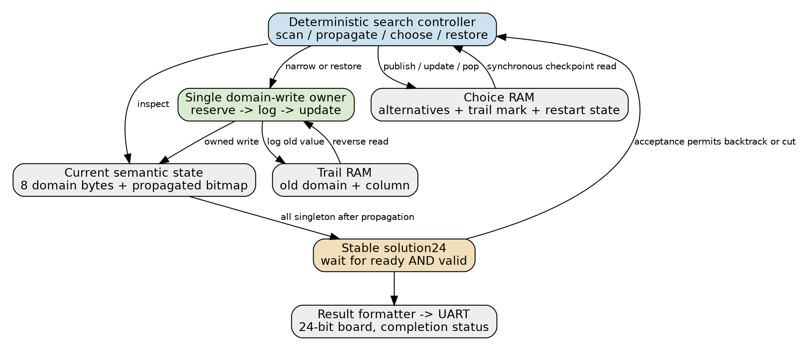
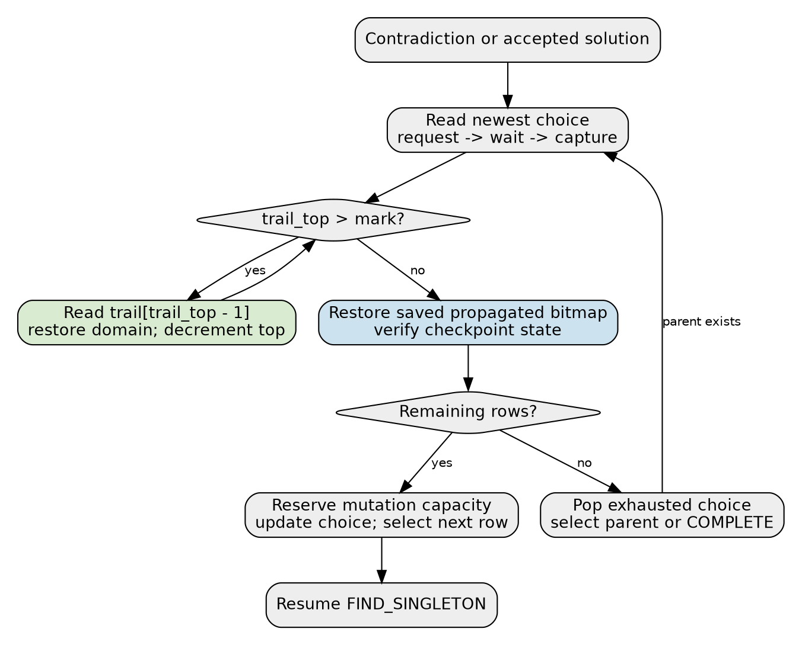

# Laboratory 2: from board snapshots to a mutation trail

## 1. Purpose, status, and reading order

Laboratory 2 builds a hardware search engine that places eight queens on an eight-by-eight board without sharing a row, column, or diagonal. Its architectural subject is reversible state: a decision narrows the permitted positions, propagation derives consequences, and a failed branch restores an earlier state before another alternative is tried. A completed solution crosses an output interface and must not be duplicated or withdrawn by subsequent search rollback.

This document is the design package for project ticket **GATEMATE-SYMBOLIC-004**, stored in the newly requested documentation ticket **GATEMATE-SYMBOLIC-005**. The requested refactoring means replacing the book's full-state snapshot baseline with compact choice records and a mutation trail. There is no existing Lab 2 solver to refactor today. Current production code is the Lab 1 tagged stack CPU in `symbolic_eval/`; proposed Lab 2 paths below do not yet exist. The only new executable work in this ticket is a bounded Python design experiment, not production solver RTL.

The guide is intended for an intern who can read Python and basic sequential logic but has not implemented a backtracking accelerator. Read sections 2–5 to establish the state and algorithm, sections 6–10 for implementation contracts, and sections 11–16 for the refactoring sequence, verification, resource analysis, and review decisions. Pseudocode states semantic ordering. Cycle tables describe proposed hardware schedules, which must subsequently be checked in simulation and synthesis.

Three evidence categories are kept separate throughout:

- **Book requirement:** Laboratory 2 of the archived *Composable Hardware Patterns for Symbolic Computers*, lines 4569–4961, plus the rollback substrate at lines 3724–3884.
- **Existing implementation:** the Lab 1 modules and harness at source revision `6d48b5b`, available for direct reuse or as examples.
- **Proposed design or measured software experiment:** the architecture below and ticket `scripts/01-queens-design-experiment.py`. No Lab 2 FPGA resource or timing result has been measured.

## 2. Required behavior and scope boundaries

The full solver must emit exactly 92 distinct boards. With columns considered from left to right and rows considered from least to most significant domain bit, the first board is `[0,4,7,5,2,6,1,3]`, where list index is the column and list value is the queen's row. A `FIRST_ONLY` configuration emits that board, accepts it at the output boundary, discards remaining alternatives, and completes. Completing a search means no alternatives remain; encountering a contradiction means only the current branch is inconsistent.

The baseline is fixed at eight columns and eight rows. Wider boards, minimum-domain branching, conflict learning, shared propagators, and multiple search contexts are extensions in the book. They are excluded from the initial implementation because each changes state size, scheduling, or ownership. The goal is to make one deterministic engine inspectable before introducing those changes.

| Requirement | Meaning for implementation | Acceptance evidence |
|---|---|---|
| Complete enumeration | Emit the complete ordered stream once | Compare 92 distinct tuples with an independent solver |
| Deterministic first solution | Preserve branch variable and row ordering | First tuple is exactly `0,4,7,5,2,6,1,3` |
| Precise trail capacity | Do not change a domain when logging capacity is unavailable | Small-capacity trace and state assertions |
| Precise choice capacity | Do not consume an alternative when no choice slot is available | Capacity-zero logical limit over a valid physical memory |
| Exact restoration | Undo domain writes in reverse order; restore propagation metadata | Full checkpoint-state comparison |
| Output backpressure | Hold offered solution and supporting search state stable | Randomized and long deterministic stalls |
| First-result cut | Cut only after accepted result, then never resume alternatives | Exactly one accepted tuple and terminal completion |
| Measured refactoring | Compare snapshots and trail with identical search policy | Traffic, cycles, storage, synthesis reports |
| Physical feasibility | Simplify around two RAM blocks and 3,000 CPEs | GateMate synthesis and routed timing reports |

The result channel and rollback engine can reuse established hardware principles without making queens an opcode of the stack CPU. There is no requirement to add a new instruction set, compile queens into Lab 1 bytecode, or preserve a second compatibility interface. The proposed solver is a dedicated finite-state controller.

## 3. Current repository: what exists and what must be added

The Lab 1 processor already separates provisional calculations from architectural retirement, exposes ready/valid output, uses synchronous RAM wrappers, and has model-versus-RTL state checking. These are useful foundations. Its architectural state, however, is a PC and two stacks, not domains and a search frontier. Reusing the entire CPU controller would import unrelated instruction fetch, opcode dispatch, and typed arithmetic into this fixed search problem.

| Existing path, relative to repository root | What it supplies | Proposed use |
|---|---|---|
| `symbolic_eval/rtl/sync_sdp_ram.sv:9` | Parameterized one-write/one-read synchronous memory | Direct module dependency for trail and choice storage |
| `symbolic_eval/rtl/reset_sync.sv:6` | Async assertion and clocked reset release | Direct module dependency for board integration |
| `symbolic_eval/rtl/uart_tx.sv:7` | Byte transmitter at 10 MHz / nominal 115200 baud | Direct module dependency, with a new board-result formatter |
| `symbolic_eval/rtl/rv_reg.sv:10` | One-entry elastic buffer, generic width | Optional later buffering; not needed for initial result ownership |
| `symbolic_eval/rtl/top.sv:23` | Board reset wiring, LED convention, value-printer example | Read for board conventions; create a queens-specific top |
| `symbolic_eval/sim/test_top.py:27` | Icarus runner and byte-stream checks | Reuse testing pattern, not its CPU output schema |
| `symbolic_eval/sim/state_checks.py:10` | Full live-state differential comparison | Model for a queens-specific comparator |
| `symbolic_eval/Makefile:66` | Synthesis, router seed, packing and loading flow | Adapt source list and top name in a separate Lab 2 Makefile |
| `symbolic_eval/constraints/` | Board pins and 10 MHz clock constraint | Reuse with matching top port names |

`sync_sdp_ram` registers read data on a rising edge and has no response-valid signal. A controller must know when an issued read is available. Its address width uses `$clog2(DEPTH)`, so a physical depth of one is unsuitable without a wrapper change. Keep physical depths at least two and vary a separate logical capacity, including zero, when testing exhausted resources. No global refactoring of this wrapper is required for the lab.

The proposed layout is `queens_rollback/` with its own `rtl/`, `tools/`, `sim/`, `scripts/`, and ignored `build/`. Its build manifest references the three shared Lab 1 primitive sources directly. That introduces a visible repository dependency but avoids copying implementations or extracting a new common package before a second consumer has demonstrated its exact needs. A later extraction can be evaluated independently; it is not a compatibility layer or an initial requirement.

The existing Lab 1 tests remain a regression gate if shared files change. Adding queens-only modules should not require changing the CPU semantics, assembler, program images, or output text. All proposed filenames in the implementation plan are design targets, not claims of completed files.

## 4. The semantic state and its representations

### 4.1 Domains and assignments

Represent each column `c` by an eight-bit domain mask. Bit `r` is one when row `r` remains permitted in that column. An all-zero mask is a contradiction. A mask with one bit is an assigned queen. A nonzero mask with more than one bit remains unresolved. Initial domains are all `0xff`.

```text
singleton(mask) = mask != 0 and (mask & (mask - 1)) == 0
first_bit(mask) = mask & -mask                 // only after nonzero check
row_of(mask)   = index of its single set bit   // only after singleton check
```

In SystemVerilog, use bounded eight-bit masks and explicit unsigned intermediate widths for bit selection. Do not use a one-hot decode result when no bit is set. For attack calculation, signed row arithmetic needs enough width for values below zero and above seven before testing bounds; truncating a negative row to three bits would incorrectly turn it into a valid row.

The `propagated` bitmap records which current singleton columns have already constrained all other columns. Narrowing any domain clears that column's bit. A domain can become a new singleton after a different queen propagates, so failing to clear the bit can suppress required work. Clearing all bits after rollback could be a conservative alternative, but it changes the exact work schedule. The initial design restores the saved bitmap for deterministic transition comparison.

### 4.2 Four distinct state categories

```text
SearchState = (
    domains[8], propagated,
    source_column, source_row, target_column, scan_cursor,
    choices, choice_top,
    trail, trail_top, trail_base,
    pending_solution, solution_count,
    first_only, status, fault
)
```

Current semantic state consists of domains and propagation progress. Restart state identifies the branch variable, untried alternatives, a trail boundary, and saved propagation metadata. Undo data contains old domain masks. Accepted results and profiling counters have a separate lifetime: rollback must not decrement the accepted solution count or erase measured work.

At a branch checkpoint, propagation is quiescent and the chosen resume state is `FIND_SINGLETON`. This boundary makes scan and target cursors reconstructible; they do not need to be copied from the middle of a propagation pass. Checkpoint creation in the middle of a pass would require storing more control state and is deliberately excluded.



### 4.3 Candidate record formats

Keep the domain array in registers: all eight bytes are read frequently, and one location changes at a time. Use separately addressed memories for trail and choice records. Logical capacity and physical mapping are different parameters; small arrays may map to registers or LUTs rather than BRAM, and synthesis must settle that physical question.

The proposed trail entry is 20 bits, matching the book's example:

| Bits | Field | Interpretation |
|---|---|---|
| 19:17 | `column` | Domain location to restore |
| 16:9 | `old_domain` | Entire prior mask |
| 8:4 | `decision_level` | Diagnostic nesting level at write |
| 3:0 | `flags` | Initially zero; no semantic interpretation |

For a logical trail capacity up to 64, a proposed 40-bit choice entry is:

| Bits | Field | Interpretation |
|---|---|---|
| 39:37 | `variable` | Selected column |
| 36:29 | `remaining_options` | Rows not yet tried |
| 28:22 | `trail_mark` | First free trail position at checkpoint, 0–64 |
| 21:14 | `saved_propagated` | Propagation bitmap at checkpoint |
| 13:10 | `resume_state` | Initially only FIND_SINGLETON is valid |
| 9:0 | reserved | Write zero, verify zero when useful |

`trail_top` always denotes the first free entry. Therefore the newest live entry is at `trail_top-1`, and a capacity of 64 requires a seven-bit count even though physical entry indices need six bits. Apply the same count-versus-address distinction to the choice stack. Packed struct constructors should assign the complete packed result, following the synthesis-tested approach in `symbolic_eval/rtl/symbolic_types_pkg.sv:75`.

The full-snapshot baseline stores the eight domain bytes and propagated bitmap at each choice, plus the same variable, remaining-options, and resume metadata. The protected-state payload is 72 bits. Its physical layout is a separate design decision: a padded multiword record must publish validity only after all words are written. Do not equate 72 logical bits with one physical memory write.

## 5. Deterministic constraint propagation and search

### 5.1 Computing attacks

A queen at `(c0,r0)` attacks the same row in every other column and the two diagonals at offsets `+(c-c0)` and `-(c-c0)`. Only rows zero through seven contribute bits. The source column is skipped. Effective narrowing is an intersection, so it never adds possible rows during forward execution.

```text
attack_mask(c0, r0, c):
    mask = bit(r0)
    delta = signed(c) - signed(c0)
    if 0 <= r0 + delta < 8: mask |= bit(r0 + delta)
    if 0 <= r0 - delta < 8: mask |= bit(r0 - delta)
    return mask

new_domain = old_domain & (~attack_mask & 0xff)
```

For example, selecting row zero in column zero first changes its domain from `ff` to `01`. Propagating that queen changes columns one through seven to `fc, fa, f6, ee, de, be, 7e`. Each effective change logs the previous mask before making the new mask visible. A target whose mask is already unaffected causes no write and no trail traffic.

An eight-by-eight-by-eight attack table contains 512 eight-bit masks, or 4096 logical bits. It is a viable alternative to bounded shifts and arithmetic, but an inferred synchronous ROM could add latency and a physical RAM block. Start with combinational fixed-size logic or a generated case table; inspect synthesis before choosing a ROM mapping.

### 5.2 Propagation order

Fix both source and target scans to increasing column order. At a scheduling boundary, if a zero domain exists, take the contradiction path. Otherwise select the first singleton whose propagated bit is clear. Propagate it across columns zero through seven, skipping itself. If a write creates zero, commit that reversible write and then begin backtracking. If the pass finishes, mark the source propagated and return to the scan.

```text
find_work():
    if any domain == 0: return CONTRADICTION
    source = first singleton column with propagated[source] == 0
    if source exists: return PROPAGATE(source, target=0)
    if all domains are singleton: return SOLUTION
    return MAKE_CHOICE(first unresolved column)
```

The book's illustrative scan checks for an unpropagated singleton before checking a zero domain. This proposal gives zero immediate priority at a scheduling boundary; the normal path also branches to failure directly after committing the zero-producing write. Record that choice in both models rather than treating pseudocode ordering as unspecified.

A singleton domain alone does not prove that all singleton queens are mutually consistent during every transient state. A newly selected queen can conflict with another singleton until propagation detects the contradiction. Assert mutual nonattack for accepted solutions and completed consistent propagation boundaries, not unconditionally on every intermediate domain state. This is an example of translating a book invariant into the correct hardware observation boundary.

### 5.3 Choices and alternatives

When propagation is quiescent but some domain remains unresolved, choose the first such column and its least significant row bit. Save the other bits as remaining alternatives. Reserve resources for both the choice and the upcoming effective domain write before publishing either change. This combined preflight is possible because there is only one mutation owner and the branch write is known to narrow a multi-bit domain.

```text
make_choice(v):
    require choice_top < CHOICE_CAPACITY, else CHOICE_FULL
    require trail_top < TRAIL_CAPACITY, else TRAIL_FULL
    chosen = first_bit(domain[v])
    cp = (v, domain[v] & ~chosen, trail_top,
          propagated, FIND_SINGLETON)

    write all cp fields to choice[choice_top]
    publish choice_top + 1 after the record is complete
    write_domain(v, chosen) using the reserved trail slot
    resume FIND_SINGLETON
```

The published checkpoint precedes the branch mutation as required by the book. Preflight avoids consuming an alternative and only then discovering that the domain write cannot be logged. A runtime fault after an already published checkpoint would need a separately specified recovery contract; avoid creating that ambiguity in the first implementation.

Retries update the existing top choice record rather than pushing a second checkpoint for every row. Before clearing the next remaining bit, reserve the mutation resource. Other search work cannot interleave between reservation and protected write. Choice creation and domain narrowing are separate trace events, but the sequence is owned by one controller and does not admit an unrelated mutation.

## 6. The central mutation interface and commit boundary

All forward domain changes must pass through a single mutator. The controller supplies a column and narrowed mask; the mutator decides whether anything changed, checks capacity, logs the old value, updates the domain, and clears its propagated bit. Do not scatter direct domain assignments among propagation, branch selection, and retries. Reverse restoration is a separately selected write mode under the same domain owner.

The proposed internal interface is deliberately small:

```systemverilog
input  logic       mut_valid;
output logic       mut_ready;
input  logic [2:0] mut_column;
input  logic [7:0] mut_new_domain;
input  logic [4:0] mut_level;
output logic       mut_done;
output logic       mut_changed;
output logic       mut_fault;
output logic [3:0] mut_fault_code;
```

Acceptance of `mut_valid && mut_ready` captures one request, not completion of its protected state change. `mut_ready` goes low while the operation is in flight. `mut_done` pulses when an unchanged request completes or the protected write commits; `mut_fault` terminates a rejected request without a domain write. No second request can overtake the first. The exact ports may be internal wires in the initial monolithic core, but their meanings should remain explicit.

Validation order is column validity at the internal boundary, mask narrowing, unchanged-value detection, and then trail capacity for a changed request. An unchanged write must succeed even when the trail is full. If the external interface physically restricts a column to three bits, an invalid-column fault applies to internal wider indices or corrupted decoded records, not to an impossible four-bit input on that port.

### 6.1 Proposed synchronous write schedule

Domains are registers, so their old value is available without an additional RAM read. A conservative mutator still separates physical log storage from architectural domain publication:

| State/cycle | Action at the next edge | Live semantic change |
|---|---|---|
| ACCEPT | Latch request and old domain; reserve free trail slot | None |
| LOG_WRITE | Write the complete old-value entry into reserved RAM slot | No domain or live-top change |
| APPLY | Advance live trail top, narrow domain, clear propagated bit, emit DOMAIN_WRITE | One protected mutation completes |

The reserved trail slot is physically written before it becomes reachable through `trail_top`. Reset between LOG_WRITE and APPLY leaves an unreachable stale record, which is safe because reset discards the entire search. No other request may reserve that slot while this transaction owns it. The trace observes the APPLY boundary; it should not infer a domain mutation from a RAM write to an as-yet inactive entry.

```text
write_domain(c, mask):
    old = domain[c]
    if mask == old: complete unchanged
    require mask is a subset of old
    require a free trail entry
    reserve entry t = trail_top
    persist trail[t] = (c, old, level, flags=0)
    then publish together:
        trail_top = t + 1
        domain[c] = mask
        propagated[c] = 0
        DOMAIN_WRITE event
```

The mask-zero case is an ordinary successful protected mutation followed by a contradiction event. Contradiction is a search outcome, not a capacity or integrity fault. Treating it as a fault would terminate enumeration prematurely; suppressing its trail entry while still writing zero would make rollback incorrect.

## 7. Reverse unwind and checkpoint restoration

Backtracking first reads the newest choice record through the synchronous memory interface. Its `trail_mark` names a boundary in the trail, not an array entry that must be restored. While `trail_top > trail_mark`, read the entry at `trail_top-1`, restore the named old domain, and decrement the live top. Domain restoration never creates another trail entry.



```text
backtrack():
    if choice_top == 0: complete exhausted search
    cp = synchronous_read(choice[choice_top - 1])
    require trail_base <= cp.trail_mark <= trail_top

    while trail_top > cp.trail_mark:
        entry = synchronous_read(trail[trail_top - 1])
        publish together:
            domain[entry.column] = entry.old_domain
            trail_top = trail_top - 1
            RESTORE_WRITE event

    propagated = cp.saved_propagated
    reset source/target/scan cursors to the resume boundary
    publish RESTORE_COMPLETE

    if cp.remaining_options == 0:
        pop this choice and backtrack to its parent
    else:
        reserve one mutation slot
        choose first remaining bit and update cp
        write_domain(cp.variable, chosen_bit)
        resume FIND_SINGLETON
```

The old domains must be applied in reverse chronological order. If a location changes from `ff` to `f0` and then to `10`, the trail contains `(column,ff)` followed by `(column,f0)`. Reverse restoration applies `f0` and then `ff`. Forward restoration ends at `f0` and fails to recreate the checkpoint.

Individual restore writes may temporarily produce a mixture of values from different moments of the branch. That mixture is not a runnable search state. Propagation and solution detection remain disabled until RESTORE_COMPLETE has also restored `saved_propagated`. The book's informal statement that domains and the bitmap are restored at the end of the trail loop must be read together with its following bitmap assignment; the bitmap is not individually recorded in each trail entry.

A safe proposed read schedule is REQUEST, WAIT/CAPTURE, then APPLY. REQUEST presents the address before the RAM edge, WAIT captures the registered response, and APPLY uses the captured entry to update the domain and top together. The cost is conservative but makes latency explicit. A later overlap optimization must preserve address/response association and the single restoration writer.

Compare a full snapshot of `(domains, propagated)` at RESTORE_COMPLETE, not just a hash and not after every individual restore. The testbench may keep checkpoint copies even though the implementation under test uses a trail; test instrumentation need not obey the hardware storage optimization. Also verify live choice fields and that the resumed variable retains exactly its not-yet-tried options.

## 8. Results, cut, completion, and reset

### 8.1 Solver result API

The solver offers a 24-bit board: column zero's row occupies bits 2:0, column one's row bits 5:3, and so on. The first required board packs to hexadecimal `672be0`, verified by the design experiment. A host reconstructs row `c` with `(solution24 >> (3*c)) & 7`.

```systemverilog
module queens_core #(
    parameter int TRAIL_CAPACITY = 64,
    parameter int CHOICE_CAPACITY = 8,
    parameter bit FIRST_ONLY = 1'b0
) (
    input  logic        clk,
    input  logic        rst_n,
    output logic        result_valid,
    input  logic        result_ready,
    output logic [23:0] result_data,
    output logic        done,
    output logic        fault_valid,
    output logic [3:0]  fault_code,
    output logic [31:0] solution_count
    // Simulation/debug event signals specified separately below.
);
```

On entry to SOLUTION_WAIT, all domains are singleton and propagation has completed. Latch `solution24` and assert valid until accepted. While ready is low, freeze the current domains, propagation bitmap, choice/trail tops, and offered tuple. An instrumentation counter for stalled cycles may advance; “freeze state” refers to search state, not elapsed-work counters.

On the edge where valid and ready are both true, increment the accepted-solution count exactly once. Normal enumeration then backtracks. FIRST_ONLY instead sets `choice_top=0`, advances `trail_base` to the current `trail_top`, latches completion, and disables future restoration. Retain the committed domains for inspection. There is no need to clear RAM contents or undo the winning branch.

The initial top connects the solver result directly to a formatter's acceptance signal. This keeps the book's ownership rule visible: until acceptance the domains support the pending tuple. A later `rv_reg #(24)` may decouple them, but then buffer acceptance becomes the semantic boundary and the buffer owns the committed result. That is a real architectural decision and should not be introduced silently.

### 8.2 Board-visible protocol

Propose a dedicated fixed text protocol rather than labeling a board as a Lab 1 INT value:

```text
Q:672BE0\r\n     one accepted board, six uppercase hexadecimal digits
D:0000005C\r\n   enumeration complete, accepted count 92
F:01\r\n         terminal fault code, example only
```

The formatter latches a tuple only when idle, sends its bytes through the existing UART transmitter, then becomes ready again. `done` and `fault_valid` are latched levels. The formatter must send at most one terminal status per reset and must finish an accepted result before sending completion. If FIRST_ONLY sets done on the same edge as its first result is accepted, the latched result takes priority over terminal status.

These text lines are proposed Lab 2 APIs, not existing behavior. Host capture tests must assert full ordered content, including the terminal count; an empty capture does not establish a hardware fault. The FPGA may already be done computing while the UART is still transmitting. Capture must begin before programming or releasing reset so a short run cannot finish before the host opens the device.

Reset aborts the whole experiment, including partial serial output. It resets domains to `ff`, clears propagated and live tops, invalidates pending results, clears terminal status and counters, and restarts deterministically. Memory contents are not cleared: no old entry is live after top reset. Define button synchronization and release using the existing board reset pattern.

## 9. Event model, observability, and fault contracts

The Lab 1 event schema is tied to instruction retirement. Lab 2 needs event kinds that correspond to reversible semantic operations. Proposed event metadata includes sequence number, kind, column, old/new mask where relevant, choice depth, trail top, propagated bitmap, and optional result/fault payload. The testbench additionally prints all eight domains at every semantic event.

| Event | Observation boundary |
|---|---|
| CHOICE_CREATE | Complete checkpoint has become reachable, before branch mutation |
| CHOICE_UPDATE | Next alternative removed from the top record under reserved mutation ownership |
| DOMAIN_WRITE | Log entry and narrowed domain are jointly live |
| PROPAGATED | A source singleton has finished its target scan |
| CONTRADICTION | A zero-domain branch is about to unwind |
| RESTORE_WRITE | One reverse old-value restoration completes |
| RESTORE_COMPLETE | Domains, propagated bitmap, and resume state match checkpoint |
| CHOICE_POP | An exhausted choice is removed |
| SOLUTION_ACCEPT | Ready/valid edge accepted one tuple |
| CUT | No pre-cut choice remains eligible for restoration |
| COMPLETE / FAULT | Terminal status becomes visible |

SOLUTION_ACCEPT and CUT may coincide on the same hardware edge. A single-event port must either encode cut as a flag on the acceptance event or use a subsequent administrative event without delaying the actual cut. The proposed baseline uses an `is_cut` bit on SOLUTION_ACCEPT, then emits COMPLETE on the following cycle. Do not invent an additional output transfer merely to serialize debug events.

Snapshot and trail implementations intentionally have different internal memory events. Compare their logical scheduling projection—domain narrowing, propagation completion, choices, accepted solutions, and restored checkpoints—rather than demanding identical RESTORE_WRITE sequences. Compare a trail RTL core to its trail transaction model at the finer-grained event boundaries. This preserves semantic equivalence without erasing legitimate implementation differences.

Proposed fault codes are `NONE=0`, `TRAIL_FULL=1`, `CHOICE_FULL=2`, `BAD_DOMAIN_INDEX=3`, `BAD_ONEHOT=4`, and `TRAIL_INTEGRITY=5`. They belong to a new `queens_types_pkg`, not to the CPU opcode/fault enumeration. Invalid indices and one-hot decodes are internal integrity checks. `TRAIL_INTEGRITY` covers invalid marks, underflow, or corrupted entry context. A fault stops new work, preserves already completed protected changes and accepted results, and exposes a latched record.

“Precise” here names the failed protected operation, not an automatic rollback of the entire search decision. If propagation has already narrowed three domains before a fourth write hits capacity, those three changes remain live and trailed. The failed fourth write makes no change. A future recoverable-capacity policy could unwind or spill, but it is outside this terminal-fault baseline.

## 10. Software evidence and what it does not prove

The ticket experiment implements an independent recursive row-placement solver and two domain solvers sharing a deterministic propagation policy. One domain solver restores snapshots; the other restores a mutation trail. Both are checked against the independent ordered solution list, not merely against each other. The experiment also compares their semantic event lists, asserts checkpoint restoration, introduces seeded abstract result stalls, checks the first-result prefix, and forces two tiny-capacity failures.

Observed results from `reference/validation/design-experiment.json` are:

| Measurement | Full snapshot | Trail |
|---|---:|---:|
| Accepted solutions | 92 | 92 |
| Choice records created | 257 | 257 |
| Alternatives attempted | 672 | 672 |
| Effective forward domain writes | 3980 | 3980 |
| Propagation target visits, including source skips | 11176 | 11176 |
| Contradictions | 324 | 324 |
| Maximum active choices | 6 | 6 |
| Successful checkpoint restoration checks | 672 | 672 |
| Domain/propagation snapshot bits saved | 18504 | Not applicable |
| Trail pushes / pops | Not applicable | 3980 / 3980 |
| Maximum live trail entries | Not applicable | 32 |

The full ordered solution list hashes to `b9e16197f78bdda8780ae3a48c5f47e2caff8b0640c49273dadabf44c8582048` under the script's JSON serialization. The first-result run visits 18 choice points, tries 42 alternatives, records 244 forward writes and 215 pops, and leaves 29 trail entries supporting the winning state. Its maximum trail depth is 30. These counts describe the specified Python scheduling, not FPGA cycles.

This experiment does not implement synchronous memories, an RTL handshake, physical cut-pointer publication, reset behavior, or a UART formatter. Its stall loop simply holds abstract state and verifies no mutation while waiting. Returning the first solution from recursive calls checks the desired result prefix; it is not a proof that the future hardware cannot restore below a cut fence. Those remain explicit RTL acceptance tests.

### 10.1 The trail is not automatically cheaper

For this experiment, saving 257 domain/propagation snapshots writes 18504 logical bits, or 2313 bytes, excluding choice metadata. Writing 3980 proposed 20-bit trail records writes 79600 bits, or 9950 bytes, also excluding choice metadata. Thus this workload produces more undo-record write traffic in the trail version. Old domains are small and propagation changes many of them, so the usual expectation of cheaper incremental logging must be measured rather than asserted.

The comparison is not yet a complete physical cost model. Snapshot restoration rewrites 72 bits per attempted alternative in the experiment; trail restoration rewrites one domain per popped entry. Choice creation and alternative updates also require traffic, and multiword snapshot layouts introduce different RAM operations. Report protected-store writes, history writes, history reads, and choice-record traffic separately, then aggregate actual bus-width-adjusted bits and controller cycles. Keep identical output stall schedules when comparing core timings, and report stall cycles separately.

### 10.2 Conservative storage bounds

Along a forward path every effective domain write strictly removes at least one permitted bit, while no forward operation adds a bit. Eight eight-bit domains contain at most 64 permitted bits initially. With logging only for changed narrowing writes, at most 64 live trail entries can arise before rollback; restoring and popping entries preserves the same path argument for subsequent alternatives. This is a conservative bound for the fixed algorithm, not a bound for arbitrary future domain assignments or multi-context execution.

Similarly, each nested choice resolves a previously multi-bit column, and forward propagation does not make it unresolved again. Eight logical choice entries conservatively suffice. The experiment reaches only six choices and 32 trail entries, but defaults should retain the conservative 8/64 limits until RTL measurements and stronger proofs justify reducing them. Parameterized undersized memories remain useful for pressure tests.

## 11. Refactoring plan: preserve semantics while changing recovery storage

The refactoring boundary is recovery storage and restoration, not the entire propagation algorithm. First establish a deterministic snapshot implementation. Then replace how a checkpoint captures protected state and how rollback reconstructs it. Keep the board result format, branch ordering, mutation semantics, and accepted-solution rules fixed throughout the comparison.

### Phase A: independent oracle and explicit semantic model

Create `queens_rollback/tools/oracle.py` with `solve_rows() -> list[tuple[int,...]]`, using pairwise row/diagonal checks independent of domain propagation. Create `tools/queens_model.py` with explicit status, domain, choice, output, and event state. Suggested model entry points are `reset()`, `step(result_ready: bool) -> Event | None`, and `snapshot() -> SearchSnapshot`. `step` advances one defined semantic/controller boundary, not a whole recursive solve, so it can express stalls and terminal faults.

Create tests that validate each board independently, verify count and uniqueness, and confirm exact ordering. Port the ticket experiment's examples as design evidence, but do not call that research script the production oracle without separating its responsibilities. Exit only when repeated runs produce the same complete solution stream and the chosen event schema is documented.

### Phase B: full-snapshot hardware baseline

Create `rtl/queens_types_pkg.sv`, `rtl/queens_core_snapshot.sv`, and `sim/tb_queens_snapshot.sv`. Keep current domains and propagated bitmap in registers, and store complete checkpoint payloads. Publish a checkpoint top only after a multiword snapshot is complete. On restore, block propagation until every domain and restart field is restored; emit RESTORE_COMPLETE at that boundary.

The baseline need not match the trail's internal cycle schedule. It must match the oracle's complete stream and the semantic model's stable checkpoints. Instrument snapshot bytes written, restore bytes, choice operations, cycles, and result stalls. Exit with 92 solutions, the correct first board, deterministic event projection, and measured baseline resource usage.

### Phase C: introduce the trail behind the same search semantics

Create `rtl/queens_core_trail.sv`, `rtl/queens_mutator.sv`, and explicit trail/choice memory control. Replace checkpoint domain payloads with marks and saved propagated bits. Route every forward domain change through the mutator. Route every restore write through the selected unwind mode. Keep the snapshot baseline as a comparison implementation; it is an experimental baseline, not a production compatibility adapter.

Start by testing the mutator and unwind engine in isolation. Validate repeated writes to one column, no-change writes at full capacity, and the exact synchronous read schedule. Then connect the deterministic propagation controller. Exit only when both implementations produce the same complete ordered stream and checkpoint states, with the trail implementation additionally matching its fine-grained model events.

### Phase D: faults, result stalls, reset, and FIRST_ONLY

Add `sim/test_capacity.py`, `sim/test_rollback.py`, and `sim/test_output.py`. Force capacity boundaries by logical limits smaller than physical arrays. Stall before and during a result offer. Verify no search mutation while blocked and no cut before acceptance. After cut, hold ready high and low for many cycles and assert no new solution, choice, or restoration event. Reset during a reserved log write, mid-unwind, and blocked output; every new run must start from the initial state.

This phase is where precise-fault and cut semantics become executable rather than prose. Exit with exact state preservation at each failed operation and reproducible event histories for every pressure path.

### Phase E: board integration and measured comparison

Create `rtl/queens_top.sv`, `rtl/queens_result_printer.sv`, `sim/tb_queens_top.sv`, and `scripts/synth.ys`. Use the existing clock, button/reset, UART, pin, and timing conventions. Create `Makefile` targets for tests, synthesis, routing, packing, and loading each implementation/configuration. Proposed commands such as `make bit CORE=trail FIRST_ONLY=1` are implementation targets; they do not work until this phase defines them.

Use tmux for long-running build and serial capture sessions. Arm raw serial capture before programming. Preserve tool versions, source commit, parameter values, router seed, bitstream hash, synthesis statistics, routed timing, full ordered output, and completion count. Compare the snapshot and trail cores with the same clock, output readiness schedule, and instrumentation settings. Exit with physical first-solution evidence, complete enumeration capture, and a report that distinguishes measured resource/timing results from model operation counts.

## 12. Detailed verification matrix

| Test class | Stimulus | Required observation |
|---|---|---|
| Attack function | Exhaust all 8 source columns, 8 rows, 8 targets | Match independent geometric predicate |
| One-hot helpers | All 256 masks | Zero rejected; singletons decoded exactly; multiple bits rejected |
| Narrowing | Unchanged and changed subset masks | Unchanged needs no trail entry; changed logs exact old mask |
| Log ordering | Observe log-write and APPLY cycles | Domain cannot change before saved old value exists |
| Repeated location | `ff -> f0 -> 10`, restore to prior mark | Restore `f0`, then `ff`, without adding new log entries |
| Choice publication | Multiword baseline record | No live choice points at incomplete payload |
| Retry | Several rows in remaining mask | Consume each exactly once; restore before selecting next |
| Tiny trail | Fill logical capacity before a protected write | Failed write leaves domains, bitmap, live top unchanged |
| Tiny choices | Capacity zero or one | Reject next choice before branch selection |
| Full output | Long stable ready-low interval at a solution | Tuple and search state stable; count unchanged |
| Same-edge cut | FIRST_ONLY acceptance | Exactly one count increment; zero remaining choices; no later unwind |
| Exhaustion | Complete normal enumeration | 92 unique accepted boards; done without fault |
| Reset | Log reserved, restore active, output pending | Initial state restored; stale memory unreachable |
| Invalid metadata | Corrupt mark or internal decoded record | Integrity fault without out-of-bounds memory access |
| Differential | Both backends, identical deterministic policy | Ordered solutions and semantic projection match |
| Physical serial | Capture before load, drain through terminal status | Exact board lines and final count, no duplicates |

For full-state testing, print domains in a fixed column order as two-digit masks, then propagated, live choice records, live trail records, pending result, count, and status. Ignore inactive RAM addresses. Do not rely solely on solution count: duplicate boards and missing boards can still total 92. Do not rely solely on hashes: the testbench has enough memory to compare full saved snapshots and report the first differing field.

Counters should include cycles, decisions, alternatives attempted, propagation visits, effective domain writes, trail pushes/pops, contradictions, solutions, maximum live trail/choice depth, and result-stall cycles. Define whether source-column skips count as visits; the ticket experiment includes them. Use wide counters for whole runs and make overflow behavior explicit if profiling configurations can run indefinitely.

## 13. Decision records

### D1: dedicated solver alongside Lab 1

- **Context:** The current CPU has no domain or rollback instruction set, while the book specifies a direct search controller.
- **Options considered:** Extend the CPU ISA; write solver bytecode; add a dedicated Lab 2 core.
- **Decision:** Propose a dedicated `queens_rollback/` core and direct dependencies on existing primitive RTL.
- **Rationale:** Keeps the search state and mutation ownership explicit without unrelated fetch/execute machinery.
- **Consequences:** Adds a second top and harness; shared primitive changes require regression testing both consumers.
- **Status:** proposed.

### D2: snapshot baseline remains an experimental comparator

- **Context:** The book requires a measured snapshot-to-trail comparison, and the software experiment shows higher trail write traffic for this board.
- **Options considered:** Implement trail only; delete snapshots after migration; retain both for controlled experiments.
- **Decision:** Propose retaining a snapshot implementation and a trail implementation with common semantic observations.
- **Rationale:** Enables repeatable comparison and an independent recovery representation.
- **Consequences:** Two backends need tests; this is not a backward-compatibility interface.
- **Status:** proposed.

### D3: one in-flight protected mutation

- **Context:** Trail reservation, log persistence, and domain publication must be ordered.
- **Options considered:** Pipelined concurrent mutations; monolithic same-edge writes; conservative request/log/apply sequencing.
- **Decision:** Propose one in-flight transaction with explicit log-before-apply states.
- **Rationale:** Reduces ownership ambiguity and makes assertions direct.
- **Consequences:** Additional cycles per write; optimize only after measurements identify it as useful.
- **Status:** proposed.

### D4: exact propagation restart state

- **Context:** Restoring domains does not restore the propagated bitmap, and singleton work can otherwise be skipped.
- **Options considered:** Save the bitmap; clear and recompute it; trail bitmap updates individually.
- **Decision:** Propose saving the bitmap in each choice and restoring it at RESTORE_COMPLETE.
- **Rationale:** Matches the book's compact restart record and deterministic event schedule.
- **Consequences:** Eight bits per choice; comparisons must wait for the complete restore boundary.
- **Status:** proposed.

### D5: direct result ownership before buffering

- **Context:** The book forbids backtracking while a result is blocked unless a committed buffer takes ownership.
- **Options considered:** Hold current domains; introduce an elastic result buffer immediately.
- **Decision:** Propose holding domains and tuple until the formatter accepts.
- **Rationale:** Makes result acceptance and FIRST_ONLY cut timing observable in the first implementation.
- **Consequences:** Search can stall for serial output; report stalls separately and add buffering only as a measured extension.
- **Status:** proposed.

### D6: fixed-size capacities with explicit physical mapping review

- **Context:** The finite eight-queen state admits small conservative bounds, but inferred RAM mapping is tool-dependent.
- **Options considered:** General N-queens datapath; fixed eight-queen design; force large RAM arrays before measuring.
- **Decision:** Propose eight-bit domains, default logical capacities 64 trail / 8 choices, and physical depths at least two.
- **Rationale:** Captures the intended algorithm and pressure tests without broad arithmetic or premature BRAM forcing.
- **Consequences:** Synthesis may choose distributed storage; the two-block budget is a limit to inspect, not an inference guarantee.
- **Status:** proposed.

## 14. Risks and review questions

The primary correctness risk is confusing ownership with physical storage. A trail entry can physically exist before it is live, a partially restored domain array cannot yet run propagation, and a serialized byte can leave the board after the solver has completed. Each boundary needs one named owner and an assertion at the correct observation point.

The primary performance risk is assuming incremental logging is inherently smaller or faster. The design experiment already shows that conclusion would be wrong for one logical write metric. The lab remains valuable because it isolates the reversible-write mechanism and provides a controlled basis for discussing workloads where it might help. Final claims must include record widths, memory cycles, choice updates, and instrumentation cost.

Questions to resolve during implementation, with proposed defaults already specified here, are the exact baseline snapshot packing, whether small memories infer BRAM or logic, the area/timing cost of attack-mask logic versus a table, and the breadth of board-visible diagnostic output. None requires inventing heap management, generic rollback services, compatibility adapters, or multiple contexts for the baseline.

The book's roughly two-RAM and 3,000-CPE threshold is a stop-and-simplify guideline. A routed timing estimate must pass the actual 10 MHz constraint. Preserve the full utilization report rather than interpreting a single packing message as final area. Keep unconnected debug paths and measured debug-enabled builds distinct, since broad trace buses can dominate an otherwise small controller.

## 15. Intern review checklist and first working session

Before writing RTL, an intern should be able to explain why `propagated` is checkpoint state, why unchanged writes do not consume trail capacity, why reverse order restores repeated writes correctly, why a zero domain is a branch failure rather than a machine fault, and why FIRST_ONLY waits for result acceptance. These explanations should use concrete masks and clock edges, not just pattern names.

The first working session should run the ticket experiment and inspect the exact first solution, then implement a separate conventional oracle and a stepwise domain model in the proposed production directory. The experiment can guide expected results; it should not silently supply both sides of a differential test. Next define the event schema and checkpoint snapshot structure. Only then implement the snapshot controller and its synchronous memory schedule.

Review each phase by reading the model transition, the corresponding RTL state, and the test that observes its publication boundary. Require a focused commit after a tested phase, a diary entry with commands and failures, and an updated task list. If a refactor changes the semantic event projection or result order, treat that as a behavior change requiring explanation rather than updating expected files without investigation.

## 16. Source references and reproduction

The authoritative local book is `ttmp/2026/09/04/GATEMATE-SYMBOLIC-001--symbolic-computer-patterns-and-designs-for-gatemate-analysis-design-and-intern-implementation-guide/sources/Composable_Hardware_Patterns_for_Symbolic_Computers.md`. Laboratory 2 spans lines 4569–4961. The checkpoint/trail/commit substrate spans lines 3724–3884. No new external sources were downloaded for this package; the existing book and repository supply the relevant contract.

The parent project brief is ticket GATEMATE-SYMBOLIC-004 `index.md`. Existing reusable APIs are `sync_sdp_ram`, `reset_sync`, `uart_tx`, and optionally `rv_reg`; their actual ports and timing remain in `symbolic_eval/rtl/`. Existing comparison patterns are in `symbolic_eval/sim/state_checks.py`, `test_top.py`, and the core testbenches. Build integration must adapt `symbolic_eval/Makefile` and `scripts/synth.ys` rather than accidentally synthesizing the Lab 1 top.

Within this design ticket:

- `scripts/01-queens-design-experiment.py` executes the independent oracle, snapshot/trail domain experiment, restoration assertions, prefix check, abstract stalls, and tiny-capacity checks.
- `reference/validation/design-experiment.json` records the measured software counts and exact solution hashes.
- `reference/validation/solutions.json` contains all 92 independently validated boards in deterministic order.
- `scripts/02-architecture.dot`, `03-rollback.dot`, and `04-render-figures.sh` reproduce the embedded diagrams.
- `reference/01-investigation-diary.md` records research, decisions, validation, and delivery chronology.

Reproduce the bounded experiment from the repository root with:

```bash
python3 ttmp/2026/09/04/GATEMATE-SYMBOLIC-005--lab-2-rollback-solver-analysis-design-and-intern-implementation-guide/scripts/01-queens-design-experiment.py
```

The document is ready for design review and implementation planning. Lab 2 production code, synchronous-memory tests, resource measurements, and physical board validation remain future work under the project ticket; the research experiment does not claim to complete them.
