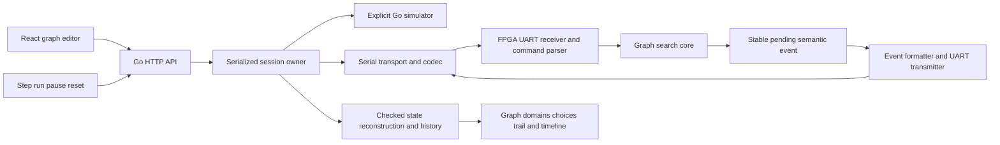
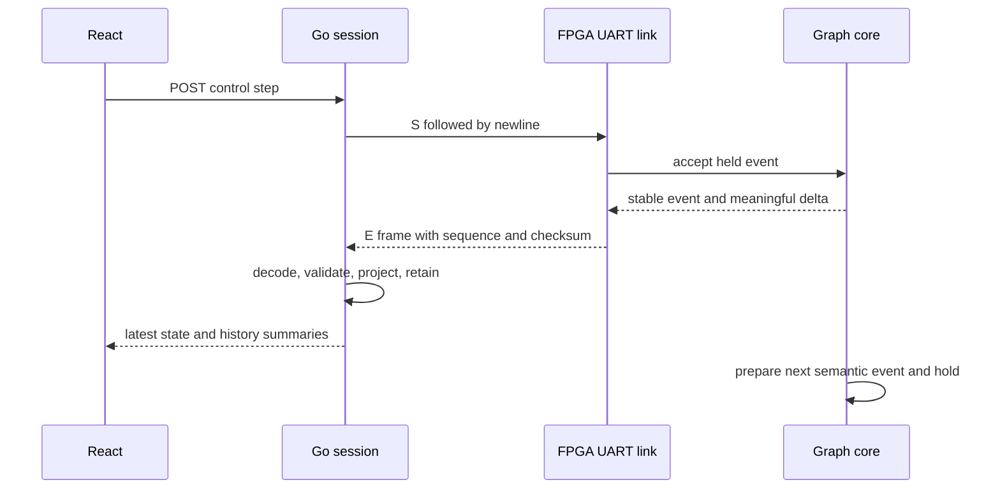

# Graph Coloring Search Microscope - Intern Analysis Design and Implementation Guide

## Executive Summary

This implemented laboratory provides a browser application that loads a small graph into the GateMate FPGA, advances its coloring search through observable semantic events, and displays domain propagation, choices, restoration, and accepted solutions. A Go service owns the serial connection and presents a typed HTTP API. A TypeScript/React frontend uses Redux Toolkit and RTK Query to edit graphs, control execution, and inspect the current or a retained historical state.

The first implementation supports one through eight vertices and one through eight colors. Edges are undirected, self-loops are rejected, and every active vertex initially permits every configured color. Search is deterministic: select the first unresolved vertex and its lowest permitted color; propagate singleton colors to adjacent vertices; undo changes through a mutation trail. Full enumeration and first-solution cut are supported. Historical inspection changes the browser's selected snapshot; it does not reverse the physical FPGA.

The design preserves the previous laboratories as standalone experiments. New graph RTL derives its scheduling and recovery discipline from the proven queens engine, with graph configuration and a genuine event handshake added. The software model is an explicitly labeled simulator and verification reference. It must never be presented as FPGA execution.

## Problem Statement

The current solver computes a fixed geometric problem and exports only solved boards and terminal UART records. Its internal trace is visible in simulation, but the board cannot receive a graph or stop under host control at each mutation. A useful search inspector needs both capabilities. Sampling debug registers asynchronously would produce inconsistent or missing states because propagation is much faster than UART transmission.

The main engineering requirement is therefore ownership at event boundaries. When the FPGA publishes an event, its supporting semantic state must remain stable until the host accepts that event. The host must own one serial exchange at a time. The browser must distinguish the latest device state from a previously captured state and must never infer that a dropped connection means successful completion.

### Acceptance criteria

- Load a validated graph from the browser through Go and UART into a newly configured graph solver without rebuilding the bitstream.
- Step exactly one semantic event; run continuously by repeating the same step exchange; pause without losing an event or corrupting serial framing; reset the loaded graph.
- Display vertices and edges, candidate colors, propagation bits, live choices, trail records, solution count, terminal status, and event history.
- Select a trail entry and identify its affected vertex; select a retained historical event and inspect its complete recorded state.
- Demonstrate a triangle with three colors (six labeled colorings), a triangle with two colors (unsatisfiable), and a path with two colors (two colorings), plus first-only termination.
- Compare Go model and RTL semantic events and verify actual graph loading and stepping on the connected FPGA.
- Serve the built UI and API from one Go binary; keep compiled JS/CSS under `/static/` URLs and use Bootstrap styling.

## Current system and reusable principles

The source baseline is `f6fce4e` in `/home/manuel/code/wesen/2026-09-04--gatemate-symbolic`. At that baseline the implementation was SystemVerilog and Python; this ticket added the root Go module and frontend package. The root Go module introduced by this lab must be the only module in the repository.

| Existing source | Observed behavior and relevance |
|---|---|
| `queens_rollback/rtl/queens_core.sv:106` | Scans zero domains before singleton propagation, then output, then choices. |
| `queens_rollback/rtl/queens_core.sv:117` | Reserves choice and trail capacity before choosing; writes a checkpoint before publishing its top. |
| `queens_rollback/rtl/queens_core.sv:137` | Logs changed domains before applying them; no-ops do not consume trail space. |
| `queens_rollback/rtl/queens_core.sv:177` | Waits for synchronous RAM reads and restores trail records in reverse order. |
| `queens_rollback/rtl/queens_core.sv:220` | Accepts a result before applying first-only cut. |
| `queens_rollback/rtl/queens_top.sv` | Connects reset, core, formatter, UART, and LED; receive pin is unused. |
| `symbolic_eval/rtl/sync_sdp_ram.sv` | Registered synchronous read output and a separate write port. |
| `symbolic_eval/rtl/uart_tx.sv` | Ready/start/data transmitter with 8N1 framing and a rounded baud divider. |
| `queens_rollback/tools/queens_model.py` | Executable event semantics and complete checkpoint/trail state. |
| `queens_rollback/sim/tb_queens.sv` | Event and between-event state checks, reset injection, corruption checks. |

The previous physical result is 92 exact ordered queen boards from both recovery modes. This establishes a useful recovery baseline, not proof that graph input or trace pacing works. Those are new mechanisms and require their own tests.

## Foundations: graph coloring as domain propagation

A graph has vertices `0..n-1` and undirected edges. A valid coloring assigns each vertex a value in `0..k-1` such that connected vertices have different values. The adjacency row `A[v]` is an eight-bit mask; bit `u` identifies an edge from `v` to `u`. For an undirected graph, `A[v][u]` must equal `A[u][v]`. Bits referring to inactive vertices and all diagonal bits must be zero.

The domain `D[v]` is an eight-bit set of candidate colors. Active domains begin at `(1 << k) - 1`. Inactive physical slots are initialized to singleton `01` and marked propagated, so fixed-size hardware scans do not treat them as unresolved vertices. They are excluded from the displayed result and from graph constraints.

If `D[v]` is singleton and `v` has not propagated, remove that singleton color from each neighbor's domain. Non-neighbors are unchanged. A zero domain is a contradiction. The propagated bitmap records completion of the entire source scan, not simply that a vertex is singleton.

```text
propagate(v):
    require D[v] is singleton
    for u in increasing vertex order:
        if adjacency[v][u]:
            mutate(u, D[u] AND NOT D[v])
            if D[u] == 0: return contradiction
    propagated[v] = true

choose():
    v = first non-singleton active vertex
    color = lowest set bit of D[v]
    reserve checkpoint and trail capacity
    save(v, D[v] without color, trail_top, propagated)
    mutate(v, color)
```

This is singleton propagation, not a general consistency algorithm. Colors remain labeled; symmetry-equivalent assignments are still separate solutions. A three-vertex triangle with three colors has six outputs. With two colors, the same triangle eventually exhausts all alternatives and reports completion with zero outputs.

## Architecture and state ownership



The service selects its engine at startup: `--engine model` for a simulator or `--engine serial --device /dev/ttyACM0` for hardware. The API always reports the selected engine prominently. The browser cannot choose arbitrary filesystem device paths. A single session owns the engine; this lab is a local instrument, not a multi-user hosted service.

### Semantic state versus implementation state

Semantic state comprises domain masks, propagation bits, live choice/trail records and tops, trail base, accepted solution count, pending result, fault, and completion. Controller states, staging registers, UART bit counters, and temporary parser bytes are implementation state. The GUI receives complete semantic observations at events. It does not require a dump of every register on every clock.

The graph core publishes `trace_valid` and accepts `trace_ready`. When valid is asserted without ready, all semantic state and the event metadata remain stable. Its sequential controller and both RAM write enables must be gated by the same advance condition. Gating the controller alone would leave a write-enable state repeatedly writing RAM while the event is blocked.

```text
advance = NOT trace_valid OR trace_ready
if reset: initialize semantic state from accepted graph configuration
else if advance:
    clear old trace_valid
    perform one controller state transition
    if a semantic event occurs: publish trace_valid and event kind

choice_ram_write_enable = advance AND checkpoint_write_state
trail_ram_write_enable  = advance AND trail_write_state
```

An acknowledged event permits the core to continue until its next event. The transport does not grant a large free-running window. This bounds buffering and makes pause independent of FPGA event rate. While an event is being serialized, the core may prepare the next one and then hold it; the browser's accepted sequence still advances one event per step exchange.

## Record and trace contracts

The graph trail uses the established formats: choice metadata is 40 bits (column 3, remaining mask 8, mark 7, saved propagated 8, reserved 14), and a trail record is 20 bits (vertex 3, old mask 8, choice level 5, reserved 4). Physical depths remain eight choices and 64 trail entries. Logical capacities are elaboration parameters for testing. Runtime graph input cannot request arbitrary memory sizes.

**Implementation finding:** Unlike queens, a one-color graph begins with singleton domains and can perform root propagation before creating a checkpoint. Its valid trail entries have choice level zero. Graph integrity checks must permit zero when it matches the current root depth; copying the queens nonzero-level guard would incorrectly reject this valid case. A root contradiction completes with zero solutions and no checkpoint to restore.

| Event code | Name | Projection update |
|---|---|---|
| 1 | CREATE | Append the published choice metadata. |
| 2 | UPDATE | Replace the newest choice metadata. |
| 3 | WRITE | Append the published old-domain trail record. |
| 4 | PROPAGATED | Install the reported propagated bitmap. |
| 5 | CONTRADICTION | Preserve records and report the zero domain. |
| 6 | RESTORE | Remove the newest trail record; reported domains contain its old mask. |
| 7 | RESTORED | Domains and propagated bits now represent the complete checkpoint. |
| 8 | POP | Remove the newest choice. |
| 9 | OUTPUT | Increment accepted count; first-only may clear choices and set base. |
| 10 | COMPLETE | Mark terminal success, including zero-solution exhaustion. |
| 11 | FAULT | Mark terminal fault; protect the attempted operation's state. |

Every event also carries packed domains, propagated bitmap, tops/base, count, result, and fault code. The newest choice word is meaningful for CREATE and UPDATE; the trail word is meaningful for WRITE and RESTORE. Other events may carry stale staging words, which the projection must ignore. This distinction allows exact architecture checking without pretending that internal staging has semantic meaning.

The host reconstructs full live stacks from these deltas and checks lengths against reported tops. A missing sequence number, invalid checksum, impossible top transition, or invalid restoration stops the run and records a transport/projection error. It must not silently fill gaps from the model. Historical snapshots are deep copies, so later restoration cannot mutate earlier GUI views.

## Serial wire protocol

Use a bounded ASCII hexadecimal request/response protocol at nominal 115200 baud, 8N1. Hex encoding is simple to inspect in captures and avoids delimiter escaping. The host permits one outstanding exchange. There is no automatic retry of a side-effecting command after timeout because the device may already have accepted it.

### Commands

| Command | Bytes | Effect and response |
|---|---|---|
| Load | `L` + 24 hex digits + LF | Twelve bytes encoded as hex: n, k, first-only, eight adjacency rows, XOR checksum. Validate completely, then atomically install configuration/reset; reply `A` + LF. |
| Step | `S` + LF | Accept one pending event and send its event record. |
| Reset | `R` + LF | Reset the current accepted graph and event numbering; reply `A` + LF. |

The load checksum is the XOR of the first eleven decoded bytes. `first-only` must be zero or one. Both Go and FPGA validate bounds, symmetry, self-loops, and inactive bits. A malformed or partial input must not replace the accepted graph. The parser bounds its line length and abandons a partial command after an idle timeout. The UART receiver samples the start bit and data centers, checks stop framing, and synchronizes the asynchronous input.

Errors use `!` followed by a two-digit code and LF. Reserve separate codes for syntax/framing, invalid graph, and checksum. Terminal stepping can return `Z` + LF once no further event exists. The host normally prevents this by recognizing COMPLETE or FAULT. Commands sent while a response is active are outside the stop-and-wait contract; the host serial owner prevents them.

### Event record

An event is `E`, 66 hexadecimal digits representing the 33-byte payload below, two hexadecimal XOR-checksum digits, and LF: 70 bytes total. Numeric fields are serialized most significant byte first. The checksum is XOR of all payload bytes. This detects simple line corruption; it is not an authentication mechanism or a strong error-correcting code.

| Payload field | Width | Notes |
|---|---:|---|
| Sequence | 32 bits | Starts at one after load/reset; strictly increments for delivered events. |
| Event kind | 8 bits | Codes 1–11. |
| Domains | 64 bits | Vertex zero in least significant byte. |
| Propagated | 8 bits | Includes pre-propagated inactive slots. |
| Choice top | 8 bits | Logical range 0–8. |
| Trail top | 8 bits | Logical range 0–64. |
| Trail base | 8 bits | No greater than trail top. |
| Accepted count | 32 bits | Permanent within a run. |
| Result | 24 bits | Three bits per vertex; ignore inactive slots. |
| Fault | 8 bits | Zero or existing solver fault code. |
| Choice word | 40 bits | Meaningful for CREATE/UPDATE. |
| Trail word | 24 bits | Low 20 bits contain the record; upper four are zero. |

At 10 MHz, the UART divider is 87 clocks per bit. Seventy bytes require at least 60,900 clocks of serial framing, about 6.09 ms, plus command and controller overhead. The microscope intentionally prioritizes complete observability over uninstrumented solver throughput.

## Go packages and API boundaries

Create module `github.com/wesen/2026-09-04--gatemate-symbolic` at repository root. Keep reusable domain types under `pkg/microscope`, HTTP/session code under `internal/microscope`, and the command under `cmd/search-microscope`. The frontend lives in `web/`. No nested go.mod files are introduced.

```go
type Graph struct {
    Vertices int      `json:"vertices"`
    Colors   int      `json:"colors"`
    Edges    [][2]int `json:"edges"`
    FirstOnly bool    `json:"firstOnly"`
}

type Engine interface {
    Load(context.Context, Graph) error
    Step(context.Context) (Event, error)
    Reset(context.Context) error
    Close() error
}
```

Graph validation constructs symmetric eight-row adjacency and rejects duplicate edges, including reversed duplicates, before serial encoding. The model implements the same Engine contract as serial hardware, but maintains its own explicit semantic state machine. The independent test oracle enumerates assignments and checks edge inequalities directly, without reusing propagation or rollback.

Serial reads need bounded timeouts and cancellation checks. Use `go.bug.st/serial` with `Open`, a baud `Mode`, `SetReadTimeout`, and close on shutdown. Short reads and short writes are normal transport conditions and must be handled. After a timeout or malformed response, mark the link unsynchronized and require explicit reset/reload recovery; do not keep issuing steps into an unknown response boundary.

### HTTP API

| Endpoint | Contract |
|---|---|
| `GET /api/state` | Engine identity, accepted graph, generation, running/terminal/error status, latest snapshot, retained history summaries. |
| `POST /api/graph` | Strict JSON Graph. Validate before touching the engine; load atomically and clear prior history on success. |
| `POST /api/control` | `{ "action": "step" | "run" | "pause" | "reset" }`. Reject incompatible actions with a structured error. |
| `GET /api/events/{sequence}?generation=N` | Deep immutable snapshot; generation is required (400 if absent), wrong generation returns 409, and evicted history returns 404. |
| `GET /` | Application HTML. |
| `GET /static/{path...}` | Only the compiled app.js and app.css assets. |

Use `http.ServeMux`, bounded request bodies, strict JSON decoding, and JSON error responses. Unknown API paths must return API errors or 404, not the application's HTML. Default listening address is loopback. The device path is a CLI field, not an HTTP argument. Read-only status requests never drive the solver.

The session serializes all engine exchanges. Run executes the same Step operation repeatedly in an errgroup-managed worker, with a modest pacing interval. Pause stops scheduling new exchanges and waits for any already-started bounded exchange to finish. Holding a session lock over a bounded exchange is acceptable for this single-device lab; an unbounded read while holding it is not. Shutdown stops the worker, closes the device, and shuts down HTTP with a deadline.

Retain at most 256 complete event snapshots in memory. State responses include short summaries rather than every full snapshot. Historical lookup is explicitly bounded: an evicted sequence is unavailable. A generation counter distinguishes runs after load/reset, and the frontend clears its historical selection when generation changes.

The CLI uses Glazed fields and a BareCommand for the long-running server, with flags for listen address, engine, device, and log level. Zerolog records load/control/transport failures without logging device authentication secrets (none are needed here). Contexts propagate through engine operations; background work uses errgroup. Build and analyzer versions are pinned to the selected Glazed module.

## React interface and state flow

The interface has a graph editor and a live inspector. Presets include triangle, path, square, and a graph that requires rollback. The editor exposes vertex count, color count, first-only mode, and a comma/whitespace-separated edge list. Invalid input gets a concrete error before device state is changed. The accepted graph remains visible separately from an unsubmitted edit.

An SVG graph places vertices around a circle and draws edges underneath. A singleton domain fills the vertex with its assigned color; unresolved vertices show candidate swatches; zero domains display a contradiction marker. Color names/numbers accompany swatches so color is not the only information channel. A domain table shows numeric masks and propagated status.

The choice table shows variable, remaining candidates, mark, and saved propagation bits. The trail table shows index, vertex, old mask, and choice level. Clicking a trail row selects that vertex in the graph and explains what restoration would install. Cut history below the base is visibly distinguished from undoable entries.

The timeline lists sequence, event name, and compact state changes. Selecting an event fetches its retained snapshot and displays a historical-inspection label. A Return to live control restores the latest view. Step, Run, Pause, Reset, and Load are disabled while inspecting history. Return to live must be selected before mutating the current session.

Use one RTK Query API slice for state polling, control/load mutations, and historical lookup. Use a Redux UI slice for selected sequence and vertex. Polling observes current server state; it does not create events. Successful mutations install the returned state into the query cache immediately; polling refreshes it every 250 ms. Failed HTTP requests must show their errors instead of leaving the UI apparently running. Bootstrap provides layout and accessible controls; source files use TypeScript throughout.

## Decision records

### Decision: bounded graph coloring first

- **Context:** The prior suggestion included a generic finite-domain engine and a live microscope.
- **Options considered:** Arbitrary compatibility tables, graph coloring only, or visualization of fixed queens.
- **Decision:** Implement runtime graph coloring with up to eight vertices/colors and complete event inspection.
- **Rationale:** This adds a new programmable problem and physical input while retaining a small, testable propagation rule.
- **Consequences:** Arbitrary binary constraints and larger memories remain future extensions, not hidden features.
- **Status:** accepted.

### Decision: stop-and-wait semantic events

- **Context:** UART cannot carry every event at core clock rate.
- **Options considered:** Lossy sampling, a large event FIFO, or backpressure at every semantic boundary.
- **Decision:** The core holds one pending event until the host requests it.
- **Rationale:** Complete history and deterministic stepping matter more than peak throughput for this instrument.
- **Consequences:** Runtime includes observation latency. Every RAM write enable must obey the advance condition.
- **Status:** accepted.

### Decision: bounded server snapshots and historical inspection

- **Context:** Full stack/trail views need more information than a result stream, but unbounded history is unsafe for enumeration.
- **Options considered:** Full RAM dumps per event, delta reconstruction with bounded snapshots, or browser-only reconstruction.
- **Decision:** Go validates deltas and retains 256 full snapshots; the browser requests selected history.
- **Rationale:** One checked projection serves all views and bounds memory independently of run duration.
- **Consequences:** Old history can be evicted, and the interface must report that explicitly. Historical viewing is not reverse execution.
- **Status:** accepted.

### Decision: preserve prior laboratory implementations

- **Context:** The measured queen backend is valuable evidence and does not have trace backpressure or graph input.
- **Options considered:** Rewrite queens as a configurable solver or create a separate graph laboratory with direct reuse of low-level components.
- **Decision:** Add graph-specific RTL and retain earlier laboratories unchanged.
- **Rationale:** The new experiment has a distinct input/observation contract. Shared RAM/reset/UART modules are reused directly; no compatibility shim is introduced.
- **Consequences:** Some controller structure is intentionally repeated across laboratory snapshots. Later generalization should be a separately justified refactor.
- **Status:** accepted.

## Proposed Solution

The preceding contracts define the implementation. Start with the Go model and protocol codec so the same typed events can feed unit tests, serial transport, HTTP, and the browser. Adapt the graph core with runtime masks and adjacency, then add real UART reception and the bounded command/event formatter. Verify the wire path before treating the GUI as a debugging tool.

```text
HTTP step:
    acquire serialized session ownership
    require loaded, not running, not terminal, synchronized transport
    event = engine.Step(context with bounded timeout)
    require event.sequence == previous.sequence + 1
    next = checked_projection(previous, event)
    append immutable next to bounded history
    publish latest state

HTTP load:
    validate graph without device mutation
    acquire serialized session ownership; require paused
    engine.Load(graph)
    only after acknowledgement:
        install graph, increment generation, clear history and terminal/error
```

## Design Decisions

The accepted decisions above are implementation constraints. If measurements force a change, update this document with the final contract and record the evidence in the diary rather than leaving code and guide inconsistent.

## Alternatives Considered

A browser-only simulator would make a useful teaching tool but would not satisfy graph loading and live FPGA inspection. A generic compatibility-table engine would broaden problem scope but add table memory and configuration complexity before the input/trace transport is proven. A high-speed trace FIFO would permit short uninterrupted runs, but capacity overflow would require either stalling anyway or losing precisely the evidence the microscope is intended to preserve.

## Implementation Plan

### P1 — Design and delivery

Create this guide, relate existing evidence, archive consulted APIs under sources using Defuddle, initialize the diary and task list, print plan/start slips, run docmgr doctor, and dry-run then upload the guide to reMarkable. Commit the concrete design before beginning implementation.

### P2 — Go model and serial contract

Add root go.mod; `pkg/microscope/graph.go`, `model.go`, `protocol.go`, and `projection.go`; add oracle and codec/projection tests. Exercise satisfiable and unsatisfiable graphs, all labeled outputs, first-only, shallow capacity, zero-domain logging, malformed input, checksum corruption, and sequence gaps. Commit the executable contract.

### P3 — FPGA graph execution and transport

Add `graph_microscope/rtl/graph_core.sv`, `uart_rx.sv`, `graph_link.sv`, and `graph_top.sv`; add simulation benches and build scripts. Compare semantic events with the Go model, hold trace readiness low, test invalid loads and reset, synthesize/route at 10 MHz, and load real graphs over UART. Record complete captured events and timing/resource evidence. Commit hardware and tests.

### P4 — Go service

Add serial Engine implementation, session owner, HTTP handlers, embedded assets contract, and Glazed server command. Test cancellation, bounded exchanges, load validation, run/pause sequencing, retained snapshots, error responses, and concurrent requests with the race detector. Commit a usable API before building the final UI.

### P5 — React microscope

Add pnpm/Vite/React/TypeScript, Bootstrap, Redux and RTK Query; implement graph editor, controls, SVG view, masks, choice/trail tables, and historical event selection. Add focused interaction tests, type checking, and deterministic embedded build generation. Commit the interface.

### P6 — Integrated evidence and handoff

Run the Go tests/race checks/build/vet/analyzer, frontend tests/build, graph RTL simulations, and the existing queens regression suite where shared infrastructure is involved. Start the server in tmux and exercise the real browser. Demonstrate physical triangle/path/unsatisfiable and first-only runs through the service; inspect selected trail/history entries in the UI. Update final docs and diary, archive screenshots/evidence, print completion, commit and push.

Every phase has a printed start and completion slip, with immutable commit references on completion. The overall plan adds one slip, for thirteen total. Scripts belong in scripts directories; downloaded resources belong in sources; build outputs remain ignored.

## Validation strategy and evidence limits

The independent oracle enumerates color assignments and directly checks every edge. The model supplies the exact semantic order. RTL tests compare all architectural fields at events plus meaningful choice/trail deltas, then test stability between accepted events. UART simulation verifies encoded bytes and malformed commands. Physical capture establishes configuration, clock/reset, pin mapping, serial framing, and real solver events.

HTTP tests use both a deterministic model and a controlled failing engine to exercise transport errors without hardware. Concurrent controls must never cause overlapping serial exchanges. Browser tests check what the user can see and do, including clear engine identity, errors, history selection, and return to live. A software-mode browser test is not physical FPGA evidence; records must identify their engine.

Hardware acceptance includes six triangle colorings with three colors, zero with two, two path colorings with two, and one with first-only. Timing must pass the actual 10 MHz constraint. Resource reports retain tool units such as RAM_HALF and CPE_LT. Instrumentation adds cost; compare with the old solver only with that difference stated.

## Open Questions

No user decision blocks this scoped implementation. Remaining engineering risks are UART resynchronization after a truncated command, event-stall gating of memory writes, input validation in both Go and RTL, and loss of ownership during reset. These require tests, not speculative workarounds. The design does not promise arbitrary-size graphs, multiple concurrent devices, hardware reverse stepping, external-network authentication, or unbounded event retention.

Any deviation discovered during implementation must be recorded with its effect on the public contract. A physical-board failure must not be hidden by switching the service to model mode. A failed upload must not be described as reMarkable delivery. A queued print job must not be described as printed without the printer receipt.

## References

- The existing queens core, model, UART wrapper, shared RAM, and validation evidence are mapped in the current-system table above. The detailed prior technical report is ticket GATEMATE-SYMBOLIC-004 reference/02-inside-the-eight-queens-rollback-engine-technical-project-report.md.
- [RTK Query overview](https://redux-toolkit.js.org/rtk-query/overview): API slices define fetching/mutation endpoints, generated React hooks, and Redux middleware integration. Archived as sources/rtk-query.md.
- [Go serial package API](https://pkg.go.dev/go.bug.st/serial): Open, Mode, Port read/write/close, and bounded read timeouts. Archived as sources/go-serial.md.
- [Go HTTP ServeMux API](https://pkg.go.dev/net/http#ServeMux): method/path patterns and request routing. Pattern specificity determines matching; route registration order is not used as application precedence. Archived as sources/go-http.md.
- Local Glazed APIs are inspected under /home/manuel/code/wesen/go-go-golems/glazed/pkg/cmds and pkg/cli before command authoring. The chosen module version must match the analyzer version.

## Implemented system and measured walkthrough

The implementation is complete across RTL, Go, and React. The original design and phase plan above explain the intended contracts; this section records their concrete realization and verification. The standalone earlier laboratories remain available. The root module now requires Go 1.26.8 after the final vulnerability scan identified advisories in the installed 1.26.1 toolchain.

### Read the source in dependency order

An intern should first read `pkg/microscope/graph.go`, which defines legal inputs, event codes, packed words, and the Engine interface. Then read `model.go` to understand semantic execution independently of clock cycles. `projection.go` explains what evidence a device event must carry for the service to reconstruct a valid state. `protocol.go` maps those values to UART bytes, and `serial.go` implements bounded exchanges and explicit recovery.

Next read `graph_microscope/rtl/graph_core.sv` beside the model. Its controller introduces extra cycles around synchronous memory reads and writes, but publishes equivalent semantic events. `graph_link.sv` owns graph loading, command parsing, sequence numbering, event serialization, and terminal responses. `uart_rx.sv` samples physical bytes, while `graph_top.sv` joins the core, transport, clock/reset, pins, and indicator.

Finally read `internal/microscope/session.go`, `http.go`, and `web/src/store.ts` before the React view. This order makes ownership clear: the session owns the engine, HTTP calls the session, and React renders server snapshots. `App.tsx` implements interaction and view selection; `GraphView.tsx` renders topology and candidate colors; `graph.ts` validates editor input and defines presets. `types.ts` mirrors the JSON boundary rather than importing hardware encodings into component logic.

| Concrete API | Responsibility and invariant |
|---|---|
| `Graph.Adjacency` | Reject invalid dimensions, endpoints, self-loops, and repeated undirected edges before constructing eight symmetric adjacency rows. |
| `Engine.Load`, `Step`, `Reset`, `Close` | Shared execution boundary for the physical serial engine and explicitly labeled software model. |
| `Serial.exchange` | Write all command bytes, accumulate a bounded response, check framing, and poison synchronization after an ambiguous result. |
| Checked projection `Apply` | Verify sequence and mutation/checkpoint meaning, then construct an independent snapshot. |
| `Session.Control` | Serialize Step/Run/Pause/Reset; stop scheduling on failure or completion. |
| `Session.Event` | Retrieve a retained immutable snapshot only in its matching generation. |
| `NewHandler` | Enforce strict request decoding, bounded bodies, route-specific responses, and static asset allowlisting. |
| RTK Query state/event hooks | Observe latest state and selected history; neither query advances hardware. |

### A concrete triangle execution

Load vertices 0, 1, 2 with edges 0–1, 1–2, 0–2 and three colors. Each active domain starts at hexadecimal 07, representing candidates 0, 1, 2. Inactive slots 3–7 have domain 01 and propagation bits already set, so the initial propagation mask is F8. Inactive slots are internal fixed values and do not add graph vertices or extra solution multiplicity.

Event 1 is CREATE. The engine chooses vertex 0, saves the old propagation mask F8 and trail mark 0, and retains candidates 1 and 2 as alternatives (mask 06). This event publishes the checkpoint before narrowing the domain. Event 2 is WRITE: trail entry 0 records vertex 0, old domain 07, and level 1; the domain becomes 01. The UI therefore shows one checkpoint and one trail entry. Selecting the trail entry highlights vertex 0 and explains that restoration would install 07.

Propagation removes color 0 from the two neighbors. These are separate WRITE events because each change must be recoverable. Once all neighbors have been processed, PROPAGATED records that vertex 0 has been handled. The next unresolved vertex is 1, whose domain is now 06. A second checkpoint chooses color 1 and retains color 2. Narrowing and propagation eventually leave domains 01, 02, 04, yielding the first accepted coloring [0, 1, 2]. OUTPUT increments the permanent accepted count.

In enumeration mode, recovery reads trail records in reverse order until the checkpoint mark is reached, reinstalls its saved propagation mask, and tries the next remaining color. The accepted count does not roll back. In first-only mode, the accepted result is preserved, live choices are cut, and the trail base advances to the retained top. The UI marks those retained records as cut history rather than claiming they remain undoable.

```text
load triangle(3 colors): D = [07,07,07], P = F8
CREATE: choices = [(vertex=0, remaining=06, mark=0, savedP=F8)]
WRITE:  trail = [(vertex=0, old=07, level=1)], D = [01,07,07]
WRITE:  D = [01,06,07]    // neighbor 1 loses color 0
WRITE:  D = [01,06,06]    // neighbor 2 loses color 0
PROPAGATED: P includes vertex 0
... choose vertex 1, propagate, publish OUTPUT ...
enumeration: restore, retry, repeat until no choices remain
first-only:  preserve accepted result, cut choices, COMPLETE
```

This exact first branch was visible through the physical browser. Complete measured runs produced the following results. Event totals include COMPLETE and all semantic writes/recovery events; they are not clock-cycle counts.

| Graph | Physical events | Accepted labeled colorings |
|---|---:|---:|
| Triangle, 3 colors | 86 | 6 |
| Triangle, 2 colors | 26 | 0 |
| Four-vertex path, 2 colors | 32 | 2 |
| Triangle, 3 colors, first-only | 12 | 1 |
| Root contradiction test | 3 | 0 |

### Why event stepping is lossless

The core advances when no event is pending or the transport accepts the pending event. The same condition gates controller transitions and checkpoint/trail write enables. This is essential: freezing only the controller while leaving a RAM write enabled would repeatedly perform an operation during UART transmission. The simulation hold monitor checks architectural stability between accepted events.



The FPGA can prepare the next pending event after accepting the previous one. The UI describes the latest delivered event, not an asynchronous view of all current physical registers. No additional semantic event is delivered until the next step. Continuous Run uses the same exchange, paced by a 25 ms worker ticker; the serial framing alone costs about 6.09 ms per event at the configured clock/divider. Observed runtime is therefore dominated by instrumentation and host pacing.

### Failure and retention behavior

Malformed or timed-out serial responses leave uncertainty about which response boundary the device reached. The serial engine marks itself unsynchronized and rejects further Step calls. Explicit reset or reload waits 250 ms, longer than the FPGA parser's 200 ms partial-command timeout, drains pending input, and begins a new acknowledged exchange. No automatic retry can silently advance the solver twice.

HTTP graph input uses temporary variable-length edge arrays and requires exactly two endpoints before constructing `[2]int` pairs. This avoids Go JSON array decoding silently accepting extra endpoints. Unknown fields, trailing JSON, inappropriate content types, and bodies beyond 4096 bytes are rejected. The frontend validates the same obvious input rules for immediate feedback; backend and FPGA validation remain authoritative.

History retains 256 complete snapshots with independent slices. A generation identifies a load/reset run, so sequence 1 from an older graph cannot be confused with sequence 1 from the new graph. A historical request requires both sequence and generation. A wrong generation returns 409; a missing or evicted sequence returns 404. The browser uses the query's currentData field so a previous successful response cannot appear under a newly selected event label while a request is pending.

### Build and validation evidence

The production asset contract is exactly index.html, app.js, and app.css. `scripts/build-web.py`, invoked by `go generate ./internal/microscope`, runs the TypeScript/Vite build and copies those three files into ignored embed inputs. The default build reads generated assets from disk; the `embed` build uses blank-imported Go embedding to include them in the executable. Only JS/CSS are exposed under `/static/`. See `graph_microscope/README.md` for runnable commands.

The routed graph design used 4,242 CPE_LT, 1,007 CPE_FF, and 2 RAM_HALF. Final routed timing was 26.76 MHz, passing the actual 10 MHz constraint. These units are the implementation tool's resource categories. The graph design includes runtime input and complete event transport, so its resource count should not be treated as an isolated comparison of propagation algorithms.

The final evidence set includes Go race tests with seven real UART simulations, an independent exhaustive oracle over all 64 simple four-vertex graphs at one through three colors, ten frontend tests, TypeScript and production builds, default/embedded Go builds, vet and the version-matched Glazed analyzer, and 58 original queens tests. Physical event captures compare the board against the model; the embedded HTTP smoke confirms complete user-facing runs. Desktop and 390-pixel mobile browser checks verified trail selection, historical labeling, disabled historical controls, return to live, and no horizontal overflow. The embedded page produced no console errors.

The first vulnerability scan found 12 reachable Go 1.26.1 standard-library advisories. Updating the root requirement to Go 1.26.8 resolved the reachable findings on the first repair attempt. The final scanner reported zero affected vulnerabilities, while noting one advisory in imported packages and five in required modules whose vulnerable symbols the project does not appear to call. The original and final logs are preserved; this is a point-in-time scan, not a claim about future dependencies. The consulted [official Go release history](https://go.dev/doc/devel/release) is archived in sources/go-release-history.md.

Evidence files reside in reference/validation: P3 hardware and routing logs, api-serial-smoke.json, P6 test/build/lint/vulnerability logs, and desktop/mobile screenshots. The detailed chronological diary explains failed attempts and corrections. Printer receipts reside in reference/slips. The initial design was uploaded before implementation; the completed guide is delivered as a separate reMarkable document to preserve any annotations on the original.
