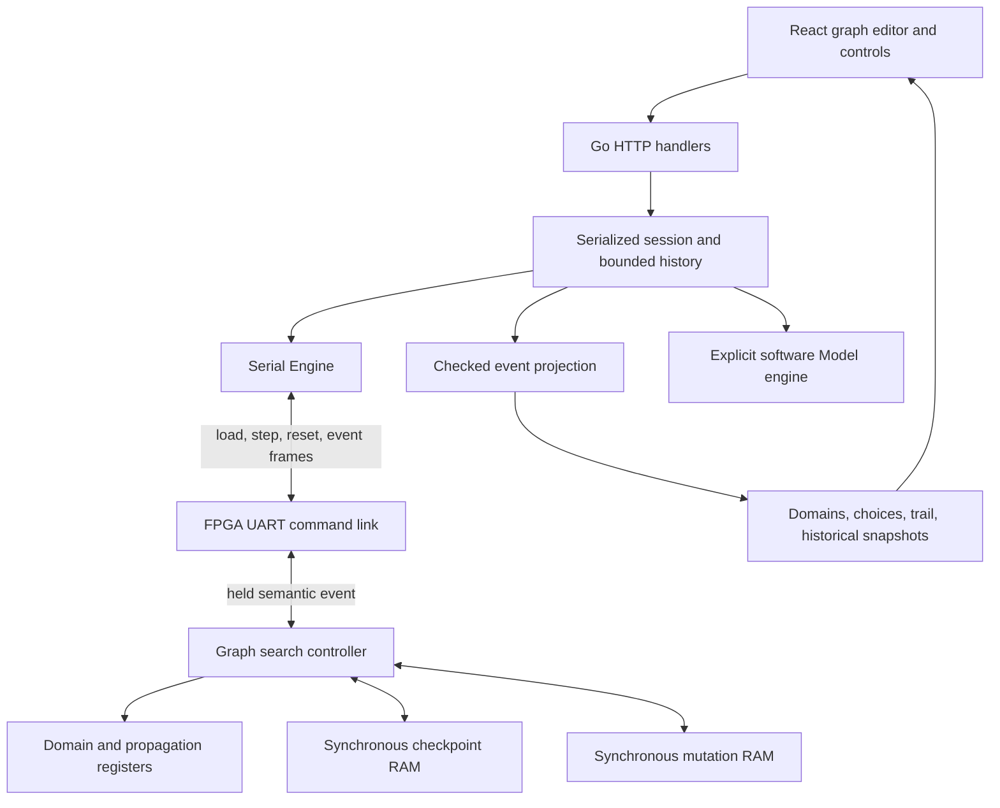
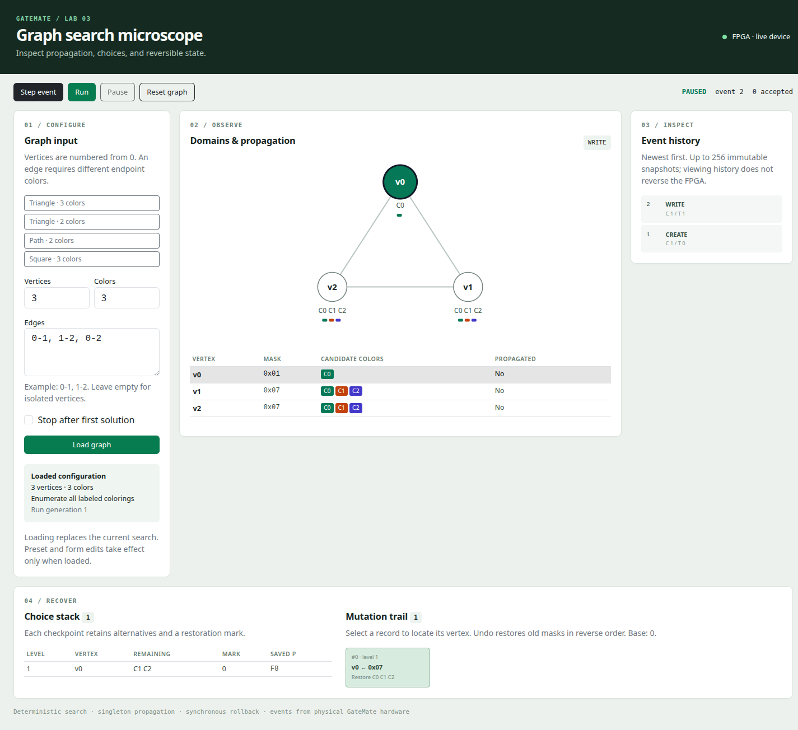
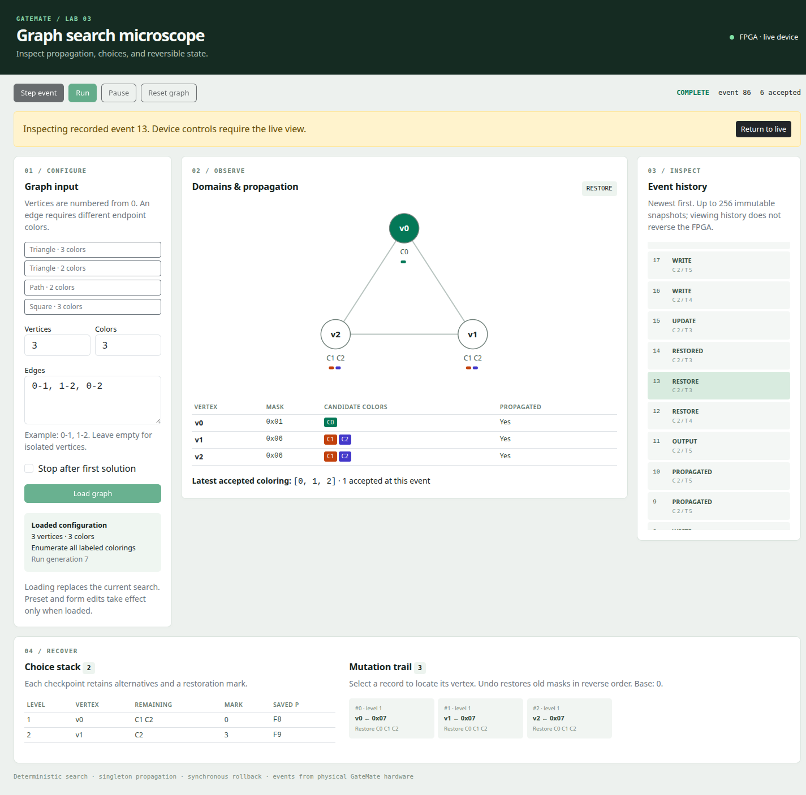
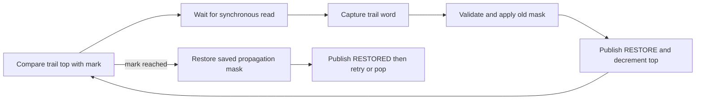
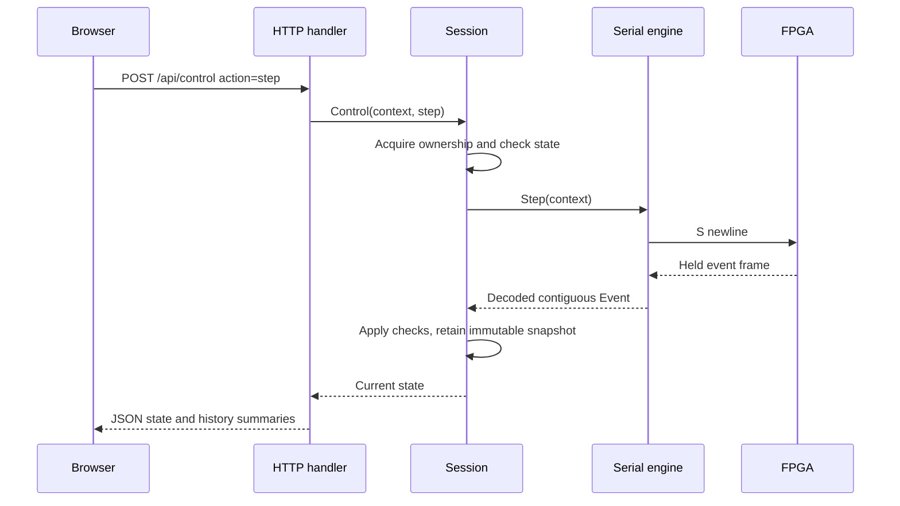
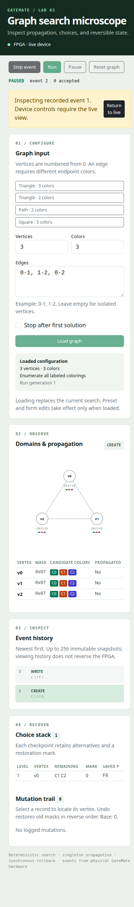

# Inside the Graph Coloring Search Microscope: Reversible FPGA Search from Constraints to a Browser

The graph-coloring laboratory implements a complete, configurable search system across an FPGA, a Go service, and a React application. The FPGA stores candidate color sets, propagates inequalities, chooses alternatives, and restores state when a branch ends. The host loads graphs over UART and accepts one semantic event at a time. The browser displays the resulting domains, checkpoints, mutation trail, accepted colorings, and retained historical states.

This report explains the implemented system through its mathematical problem, state representation, clocked execution, communication protocol, and user interface. It concentrates on how the machine works. Its execution examples come from captured physical GateMate UART records, decoded independently for this report and checked against direct enumeration. The source revision is `9e7868721c3e80208b3534a33ac7aa98f4ec4407` in `/home/manuel/code/wesen/2026-09-04--gatemate-symbolic`; source paths below are relative to that repository unless identified otherwise.

The implemented limits are one through eight labeled vertices, one through eight labeled colors, eight checkpoint slots, and 64 mutation records. Graphs are undirected and simple: a vertex cannot connect to itself, and an edge cannot occur twice. Full enumeration and termination after the first accepted coloring are both supported. The physical board and the Go model implement the same event contract, with their execution source explicitly identified in the interface.

> [!summary]
> - Domains encode remaining candidates; checkpoints encode untried alternatives; trail records encode the old values required for restoration.
> - A semantic event describes a defined execution boundary. Synchronous memory operations can require several clock cycles before that boundary is published.
> - UART backpressure stops further event delivery without discarding mutations. Go validates the received transitions before retaining snapshots.
> - Historical browser inspection selects recorded state. It does not restore the FPGA or create a new search branch.

## 1. The mathematical problem and its observable answers

Let a graph be `G = (V, E)`, with `V = {0, …, n−1}` and a configured color set `C = {0, …, k−1}`. A coloring assigns one color to each vertex. A valid coloring satisfies an inequality for every edge:

```text
color : V -> C
for every (u, v) in E:
    color[u] != color[v]
```

The project solves this problem for a supplied value of `k`. It does not compute the minimum possible number of colors. A user can investigate that question by running the same graph with different color counts, but there is no automatic chromatic-number search in the implementation.

Vertices and colors retain their labels. A triangle with three colors has six accepted colorings because all permutations of `[0,1,2]` are distinct assignments. A triangle with two colors has none. A four-vertex path with two colors has exactly `[0,1,0,1]` and `[1,0,1,0]`: after choosing the first vertex, each subsequent vertex is forced by its predecessor. These small examples provide independent expectations before any hardware behavior is considered.

An empty graph has `k^n` valid assignments because no edge restricts a pair of vertices. This also explains why the eight-vertex input limit does not imply short runs. Eight independent vertices with eight colors have 16,777,216 assignments. The device can represent that problem, but complete event-by-event enumeration over UART is a large observation workload. Capacity, search complexity, and practical interactive runtime are separate properties.

## 2. The architecture and ownership of state

The system has one authoritative engine per service instance. In serial mode that engine communicates with the physical FPGA; in model mode it executes a software state machine. The service never substitutes a model result after a hardware error. The UI identifies the selected source as either FPGA execution or software simulation.



The FPGA owns search progress. The Go session owns serial exchange ordering, accepted host state, and snapshot retention. React owns editor drafts and view selection. A color typed into the form has no effect on the device until Load succeeds. A selected historical event changes what is rendered, while the session continues to have one latest delivered state.

This division also explains the two software representations. The model generates semantic events by executing the algorithm. The projection consumes events from either engine and checks whether their state changes are internally consistent. The projection does not choose a vertex or perform a new propagation step. Its role is reconstruction and validation, which makes the same browser usable with either execution source.



*Figure 1. The physical interface after triangle event 2. Vertex 0 has domain `01`; the remaining vertices still have `07`. The checkpoint retains colors 1 and 2, and the selected trail entry records the old domain `07`. This screenshot was captured during final implementation validation and is reused here.*

## 3. Candidate domains as fixed-width sets

The search maintains a domain `D[v]` for every vertex. A domain is the set of colors still permitted at that vertex under the current branch. The representation is an eight-bit mask: bit `c` is one precisely when color `c` remains a candidate. This turns set membership, intersection, and deletion into small combinational operations.

| Mask | Candidate set | Interpretation |
|---|---|---|
| `07` | `{0,1,2}` | Three candidates remain. |
| `06` | `{1,2}` | Color 0 has been removed. |
| `02` | `{1}` | The vertex is assigned color 1. |
| `00` | `{}` | The current branch is inconsistent. |
| `FF` | `{0,1,2,3,4,5,6,7}` | All eight supported colors remain. |

The active initial domain is `(1 << k) - 1`. The array always has eight entries, even for a smaller graph. Inactive entries have domain `01`, and their propagation bits are already set. Their adjacency rows are zero. These fixed entries satisfy the controller's internal singleton scan without participating in the external graph or multiplying its outputs.

For a nonzero mask `d`, the predicate `d & (d-1) == 0` identifies a singleton. The expression `d & -d`, evaluated at the mask width, selects its lowest set bit. For example, the lowest bit of `06` is `02`, selecting color 1. `pkg/microscope/graph.go` implements these primitives and the conversion between singleton domains and packed result colors.

The graph itself occupies eight adjacency bytes. Bit `v` of row `u` indicates edge `u–v`; symmetry requires the corresponding bit in row `v`. A three-vertex triangle therefore has rows `06`, `05`, and `03`, followed by zero rows. Host validation rejects duplicate edges, including reversed duplicates, before constructing this representation. Device validation separately checks symmetry, endpoint activity, and a zero diagonal.

## 4. Propagation, search order, and fixed points

An assigned vertex restricts its neighbors. If `D[u]` is a singleton containing color `c`, every neighbor `v` must remove that color:

```text
if adjacent[u][v]:
    new_domain[v] = old_domain[v] AND NOT D[u]
else:
    new_domain[v] = old_domain[v]
```

This is a sound deduction: any assignment using the same color at both endpoints would violate the edge inequality. It can create further singleton domains, which then propagate to their own neighbors. It can also create an empty domain, which proves that the current branch cannot be extended to a solution.

An eight-bit propagation mask `P` records which singleton vertices have already had their outgoing constraints processed. Narrowing a vertex clears its bit. Once the controller finishes scanning all target slots for a source, it sets that source's bit and publishes PROPAGATED. The scan examines targets in increasing order, skipping self-comparison and leaving non-neighbors unchanged. A no-op domain operation consumes no trail record and publishes no WRITE event.

The main scan uses a deliberate priority order. Empty domains are handled first, then pending singleton propagation, then a completely singleton assignment, then a new choice. This ordering prevents accepting a coloring before all necessary inequalities have been processed and avoids branching before available deductions have been applied.

```text
repeat at a scan boundary:
    if any domain is empty:
        publish CONTRADICTION
        recover an alternative
    else if a singleton vertex has P[v] = 0:
        propagate the first such vertex
    else if every domain is singleton:
        accept the coloring
    else:
        choose the first unresolved vertex
        select its lowest candidate color
```

The chosen heuristic is the first unresolved vertex, not the vertex with the smallest domain. This keeps ordering deterministic and small in hardware. Stronger ordering heuristics could reduce work on some graphs, but would change both circuit structure and event order. The current model and physical examples rely on the implemented ordering.

Propagation is local. A state with no empty domain and no pending singleton propagation can still be globally unsatisfiable. In a two-color triangle, all initial domains are `03`; no singleton exists from which to start. A choice is necessary before the inconsistency becomes visible. The absence of a propagation deduction is therefore not a proof that a solution exists.

## 5. The complete reversible state

Candidate domains alone are insufficient to resume search. The machine must also know which candidates have already been tried, which deductions have been propagated, and how to reconstruct the state at the next alternative. These responsibilities are divided between registers, checkpoints, and a mutation trail.

| State | Representation | Lifetime |
|---|---|---|
| Domains | Eight 8-bit registers | Narrow within a branch; expand during restoration. |
| Propagation mask | One 8-bit register | Changes during propagation and is restored from checkpoints. |
| Checkpoint | 40-bit word | Persists while alternatives remain at a choice level. |
| Mutation record | 20-bit word | Persists until undone or retained below a cut base. |
| Choice top | Count from 0 through 8 | Determines the live checkpoint prefix. |
| Trail top/base | Counts from 0 through 64 | Define live records and the lower restoration boundary. |
| Accepted count/result | 32-bit count and 24-bit coloring | Persist across rollback within a run. |

A checkpoint stores four semantic fields: the chosen vertex, its remaining alternatives, the trail position at the choice boundary, and the saved propagation mask. The packed format puts the vertex in bits 39–37, remaining mask in 36–29, mark in 28–22, and propagation mask in 21–14. Bits 13–0 are reserved and must be zero when interpreted as a checkpoint.

A mutation record stores the affected vertex in bits 19–17, its previous domain in 16–9, and the choice level in 8–4. Bits 3–0 are reserved. The level is an integrity aid; restoration order is determined by trail position and the checkpoint mark. The record contains the old mask because that is the value needed to undo the mutation. The new mask is already present in the published domain state.

The physical checkpoint RAM has eight words. The trail RAM has 64 words. Their logical payload capacities are therefore `8 × 40 = 320` bits and `64 × 20 = 1280` bits. These figures describe useful stored bits, not the FPGA's allocated memory block granularity. Mapped resource accounting appears later in the report.

## 6. A choice is published before its mutation

Suppose vertex 0 has domain `07`. Choosing its lowest candidate means trying `01` and retaining `06`. The machine first constructs a checkpoint with the current trail top and propagation mask, stores it in RAM, and publishes CREATE after the checkpoint becomes live. The domain still reads `07` at that event. A subsequent WRITE records and applies the narrowing to `01`.

This separation makes the control dependency observable. At CREATE there is a recoverable alternative, but no domain change has yet occurred. At WRITE the old value has been persisted and the new value has been installed. Treating these as one arbitrary sampled register image would conceal the ordering that makes recovery possible.

```text
choose(v):
    require choice_top < choice_capacity
    require trail_top < trail_capacity
    bit = lowest_set_bit(D[v])
    checkpoint = (v, D[v] without bit, trail_top, P)
    store checkpoint in checkpoint RAM
    increment choice_top
    publish CREATE
    narrow(v, bit)

narrow(v, new):
    require new is a subset of D[v]
    if new == D[v]: return
    require trail_top < trail_capacity
    store (v, old=D[v], level=choice_top) in trail RAM
    D[v] = new
    P[v] = 0
    increment trail_top
    publish WRITE
```

Capacity checks occur before the protected operation. A full trail cannot justify changing a domain without preserving its old value. The same mutation path handles an initial choice, a retry, and neighbor propagation. This centralizes the narrowing rule and ensures an empty result is logged with the same discipline as any other domain change.

The controller uses synchronous memory, so “store” and “publish” are different clocked stages. A choice passes through `S_CP_WRITE` and `S_CP_PUBLISH`; a mutation passes through `S_LOG_WRITE` and `S_APPLY`. The intervening stages are functional requirements of the storage interface, not additional search decisions.

## 7. Restoration and the propagation-mask boundary

After an output or a contradiction, the controller reads the top checkpoint. It restores trail entries in reverse order until the trail top equals the checkpoint's mark. Each record reinstalls one old domain and produces RESTORE. Only after all required domains have been restored does the controller install the checkpoint's saved propagation mask and publish RESTORED.

The distinction between RESTORE and RESTORED matters when reading a trace. During intermediate restoration, a propagation bit can still describe the branch being undone. The controller is in a recovery state and does not run its normal propagation scan there. The saved mask becomes authoritative for resumed search at RESTORED.

```text
recover():
    if choice_top == 0:
        publish COMPLETE
        stop
    cp = read top checkpoint with synchronous read latency
    require trail_base <= cp.mark <= trail_top
    while trail_top > cp.mark:
        entry = read trail[trail_top - 1] with synchronous read latency
        require current domain is a subset of entry.old
        D[entry.vertex] = entry.old
        decrement trail_top
        publish RESTORE
    P = cp.saved_propagation
    publish RESTORED
    if cp.remaining == 0:
        pop checkpoint
        publish POP
        recover()
    else:
        bit = lowest_set_bit(cp.remaining)
        remove bit from cp.remaining and store checkpoint
        publish UPDATE
        narrow(cp.vertex, bit)
        resume scan
```

The current domain must be a subset of the recorded old mask. Restoration is allowed to reintroduce candidates removed by the branch; an old mask that cannot contain the current state indicates corrupt recovery data. Reserved bits, marks, and record levels provide further integrity checks. A malformed state produces a FAULT event instead of silently continuing with unreliable alternatives.

The accepted count and last accepted result are outside this reversible state. Restoring domains after a solution does not retract that solution. A reader can therefore see a count of one while the domains again contain unresolved candidates. That is a normal point in enumeration, not a contradictory interface state.

## 8. Walking through the physical three-color triangle

The following table is decoded from `reference/validation/hardware-triangle-wire.log`. Domain bytes are listed in vertex order, `P` is hexadecimal, and `C` and `T` are the live choice and trail counts. The inactive slots are omitted from the domain column but remain represented by the high propagation bits.

| Event | Meaning | D0 D1 D2 | P | C | T | Accepted |
|---:|---|---|---|---:|---:|---:|
| 1 | CREATE | `07 07 07` | `F8` | 1 | 0 | 0 |
| 2 | WRITE | `01 07 07` | `F8` | 1 | 1 | 0 |
| 3 | WRITE | `01 06 07` | `F8` | 1 | 2 | 0 |
| 4 | WRITE | `01 06 06` | `F8` | 1 | 3 | 0 |
| 5 | PROPAGATED | `01 06 06` | `F9` | 1 | 3 | 0 |
| 6 | CREATE | `01 06 06` | `F9` | 2 | 3 | 0 |
| 7 | WRITE | `01 02 06` | `F9` | 2 | 4 | 0 |
| 8 | WRITE | `01 02 04` | `F9` | 2 | 5 | 0 |
| 9 | PROPAGATED | `01 02 04` | `FB` | 2 | 5 | 0 |
| 10 | PROPAGATED | `01 02 04` | `FF` | 2 | 5 | 0 |
| 11 | OUTPUT | `01 02 04` | `FF` | 2 | 5 | 1 |
| 12 | RESTORE | `01 02 06` | `FF` | 2 | 4 | 1 |
| 13 | RESTORE | `01 06 06` | `FF` | 2 | 3 | 1 |
| 14 | RESTORED | `01 06 06` | `F9` | 2 | 3 | 1 |
| 15 | UPDATE | `01 06 06` | `F9` | 2 | 3 | 1 |
| 16 | WRITE | `01 04 06` | `F9` | 2 | 4 | 1 |
| 17 | WRITE | `01 04 02` | `F9` | 2 | 5 | 1 |
| 18 | PROPAGATED | `01 04 02` | `FB` | 2 | 5 | 1 |
| 19 | PROPAGATED | `01 04 02` | `FF` | 2 | 5 | 1 |
| 20 | OUTPUT | `01 04 02` | `FF` | 2 | 5 | 2 |

Events 3 and 4 remove color 0 from vertices 1 and 2. Event 6 chooses vertex 1 from its remaining domain `06`, saving mark 3 and mask `F9`. Its first candidate is color 1. Event 8 then removes color 1 from vertex 2, leaving color 2. The source completion events establish that all singleton constraints have been processed before OUTPUT.

The first result is `[0,1,2]`. Its packed integer is `0 + (1 << 3) + (2 << 6) = 136`, or hexadecimal `000088`. Each vertex occupies three result bits, so the result uses 24 bits for the fixed eight-slot representation. The browser extracts only the active vertices.

Recovery at events 12 and 13 undoes the two writes made after mark 3. Event 14 reinstalls `F9`. The checkpoint still contains color 2 as its remaining alternative, so event 15 updates that checkpoint and event 16 selects color 2 at vertex 1. The second result is `[0,2,1]`, packed as `000050`.

The complete physical output order is:

```text
[0,1,2], [0,2,1], [1,0,2], [1,2,0], [2,0,1], [2,1,0]
```

It takes 86 delivered events to enumerate all six results and terminate. The trace contains four CREATE events, five UPDATE events, 21 WRITE events, 21 RESTORE events, 15 PROPAGATED events, nine RESTORED events, four POP events, six OUTPUT events, and one COMPLETE event. The equal write/restore totals describe this fully unwound run; first-only and root-level termination need not have that equality.



*Figure 2. A new physical-board capture for this article, inspecting event 13 after the run completed at event 86. The toolbar reports the latest run totals; the historical inspector shows the earlier domains, two choices, and three trail records. Its propagation mask is still `FF`; the next event restores `F9`. The yellow banner and disabled controls identify historical viewing.*

## 9. Contradictions, root propagation, and first-result cut

In the two-color triangle, choosing color 0 at vertex 0 forces both other vertices to color 1. Those two vertices are also adjacent, so propagating vertex 1 removes the only remaining candidate at vertex 2. The machine first records that mutation and only then reports the contradiction.

| Event | Meaning | D0 D1 D2 | P | Trail top |
|---:|---|---|---|---:|
| 4 | Both neighbors narrowed | `01 02 02` | `F8` | 3 |
| 5 | Vertex 0 propagation complete | `01 02 02` | `F9` | 3 |
| 6 | WRITE empties vertex 2 | `01 02 00` | `F9` | 4 |
| 7 | CONTRADICTION | `01 02 00` | `F9` | 4 |
| 8–11 | Four RESTORE events | Finally `03 03 03` | `F9` | 0 |
| 12 | RESTORED | `03 03 03` | `F8` | 0 |
| 13 | UPDATE selects next alternative | `03 03 03` | `F8` | 0 |

The alternative starting with color 1 fails symmetrically. The physical run terminates after 26 events with zero accepted colorings. An empty domain is therefore an ordinary search outcome. FAULT is reserved for invalid machine operations or resource/integrity failures; unsatisfiability is not a hardware fault.

Propagation can occur before the first choice. Consider two adjacent vertices with one color. Their initial domains are both `01`; propagating vertex 0 immediately empties vertex 1. The physical trace is WRITE, CONTRADICTION, COMPLETE, with a choice top of zero and a trail top of one. That WRITE legitimately has level zero. With no alternatives to explore, termination does not require unwinding the root mutation. This is why a nonempty trail at COMPLETE does not by itself indicate a recovery defect.

First-only execution changes the action taken at OUTPUT. After accepting the coloring, the controller clears the live choice stack and advances the trail base to its current top. The accepted domains and mutation records remain visible. In the triangle capture, event 11 has count one, choice top zero, trail top five, and base five; event 12 is COMPLETE. There are no restoration events in this run.

The base distinguishes records retained as evidence from records that may still be undone. A future feature that resumes search after a cut cannot merely decrement the base: the alternatives have been discarded. The implemented operation is terminal first-result acceptance, not a reversible pause at the first solution.

## 10. Clocked memory and the event handshake

The shared `sync_sdp_ram` provides a registered read result. Reading a checkpoint or trail record therefore requires allowing the address to reach the memory, waiting for its registered output, and capturing that value before applying it. The graph controller names these states explicitly: `S_CP_WAIT` and `S_CP_CAPTURE` for checkpoints, and `S_TWAIT`, `S_TCAPTURE`, and `S_TAPPLY` for trail restoration.



A published event must remain available while the host is not accepting it. The core computes `advance = !trace_valid || trace_ready`. The controller's sequential updates are gated by this condition, and checkpoint/trail RAM write enables use the same gate. Gating only the state register would be insufficient: a state held at a memory-write phase could otherwise keep asserting writes while the host was stalled.

The handshake operates at semantic boundaries. A core step may contain several internal clock cycles, and some internal states perform no observable mutation. When an event is published, the link can hold it indefinitely until a host Step command is pending. At acceptance, the link captures the complete event payload into its own frame register. UART serialization then proceeds from that captured register while the core prepares its next held event.

This means the latest delivered snapshot is a historical fact even in the live view. The FPGA may already have prepared the next event internally. The claim of lossless stepping is that no semantic event is omitted between deliveries and that each accepted frame represents a stable defined boundary. It does not mean the browser samples every physical register in real time or that one button press equals one FPGA clock.

Initialization uses a constant asynchronous reset followed by synchronous `S_INIT` loading of the accepted runtime domains. The configuration registers belong to the UART link. An accepted load or reset holds the core in reset briefly and then lets `S_INIT` install those values. This preserves synthesizable reset behavior while allowing runtime graph changes without rebuilding the bitstream.

## 11. UART commands and exact event encoding

The board communicates at nominal 115200 baud, eight data bits, no parity, and one stop bit. With a 10 MHz clock, the rounded divider is 87 clocks per bit. The receive path synchronizes the incoming pin through two flip-flops, confirms the start bit near its midpoint, samples eight data bits, and checks the stop bit. Invalid stop framing produces a command error.

Commands are line oriented and use ASCII hexadecimal where a payload is needed. This keeps captured traffic inspectable while retaining fixed frame sizes. The host uses stop-and-wait: it finishes one response before sending another command. The FPGA parser is not a command queue and does not promise acceptance of pipelined commands during transmission.

| Command or response | Meaning |
|---|---|
| `L` plus 24 hex digits and newline | Load twelve bytes: vertex count, color count, first-only flag, eight adjacency rows, checksum. |
| `S` plus newline | Accept and return one pending semantic event. |
| `R` plus newline | Restart the accepted graph. |
| `A` plus newline | Successful load/reset acknowledgement. |
| `E` plus 68 hex digits and newline | A 33-byte event payload and one checksum byte. |
| `Z` plus newline | No event remains after terminal consumption. |
| `!01`, `!02`, `!03` plus newline | Command/framing, graph validation, or checksum error respectively. |

The checksum is the XOR of payload bytes. The receiver checks that XOR over payload plus checksum is zero. It detects many accidental corruptions but provides no cryptographic authentication and cannot detect every multi-bit error. Sequence continuity and semantic validation add different checks; they do not turn XOR into a strong checksum.

The actual triangle load from the archived physical capture is:

```text
> L030300060503000000000000
< A
```

The leading `03 03 00` configures three vertices, three colors, and full enumeration. The adjacency bytes are `06 05 03 00 00 00 00 00`. Their XOR with the header is zero, so the final checksum byte is also zero. The total command length is 26 bytes including the initial `L` and newline.

| Event payload field | Bytes | Interpretation |
|---|---:|---|
| Sequence | 4 | Big-endian unsigned number, starting at one after load/reset. |
| Kind | 1 | CREATE through FAULT, codes 1–11. |
| Domains | 8 | Packed register value transmitted high byte first; vertex 0 is the low byte. |
| Propagation mask | 1 | All eight slots, including inactive bits. |
| Choice top, trail top, base | 3 | One byte each with bounded logical ranges. |
| Accepted count | 4 | Big-endian unsigned count. |
| Result | 3 | Three bits per vertex. |
| Fault code | 1 | Zero for normal events. |
| Checkpoint word | 5 | Meaningful on CREATE and UPDATE. |
| Trail word | 3 | Low 20 bits meaningful on WRITE and RESTORE. |

Field byte order and vertex numbering are different concerns. An event containing active domains `01 02 04` transmits the eight-byte packed domain register with inactive high slots first; decoding reverses that byte ordering into vertex order. `pkg/microscope/protocol.go` is the exact Go reference for this layout.

The checkpoint and trail fields are event-specific deltas. Outside their meaningful event kinds, they may expose staging values and must not be interpreted as changes to the logical stacks. The RTL/model comparison deliberately normalizes these irrelevant fields before comparing entire event structures. The projection reads them only when the event contract assigns them meaning.

## 12. Serial failures and host reconstruction

`Serial.exchange` handles short writes and accumulates short reads until newline. The receive buffer is bounded to 128 bytes; a complete event frame has exactly 70 bytes. The port has a 50 ms read timeout, and the exchange checks a two-second context deadline between operations. These bounds prevent normal read waits from holding session ownership indefinitely. The code does not configure a separate OS write timeout, so the context does not forcibly interrupt an arbitrary blocked device write; this remains a transport limitation to consider when extending beyond the tested local UART.

An invalid checksum, malformed frame, unexpected extra bytes, or sequence gap leaves the transport unsynchronized. A further Step is rejected until an explicit Reset or Load. Retrying Step automatically would be ambiguous because the FPGA might already have accepted the previous event even though its response was lost.

Recovery waits 250 ms, exceeding the FPGA's 200 ms incomplete-command timeout, drains host input, and sends an explicit acknowledged command. This creates a new known run boundary rather than guessing where a damaged response ended. A failed load is not installed as the host's accepted configuration; the session retains its previous state plus an error until successful recovery.

The checked projection then applies semantic validation. On WRITE it verifies the old value in the trail delta, a strict narrowing operation, the affected domain, the cleared propagation bit, and the resulting trail count. On RESTORE it requires the exact top trail word and checks the old mask relation. CREATE and UPDATE validate checkpoint content; RESTORED checks the mark; OUTPUT verifies singleton domains, packed colors, every graph edge, and the accepted count.

These checks are strong local consistency tests, but they are not a second complete execution oracle. For example, the projection checks that a WRITE narrows the reported domain; it does not independently infer which neighbor the FPGA must currently be processing. Exact deterministic execution is checked separately by comparing the model and RTL event streams. Keeping this distinction explicit prevents overstating what runtime validation proves.

## 13. Go session ownership and the HTTP API

The `Engine` interface has four operations: `Load(context.Context, Graph)`, `Step(context.Context)`, `Reset(context.Context)`, and `Close()`. The serial engine and software model implement it directly. `internal/microscope/session.go` adds the application lifecycle: one accepted graph, one latest snapshot, a running flag, an error, a generation number, and bounded history.

All engine operations occur under a session mutex. The Run worker uses an `errgroup` and a 25 ms ticker. Each tick performs the same checked Step operation used by the HTTP button. Pause acquires the same mutex, so any already-started exchange finishes before Pause returns; then no new worker step is scheduled while the running flag is false. Pause does not abandon a response partway through its bytes.



Successful Load and Reset increment the generation, clear history and errors, and publish an initial READY snapshot with sequence zero. Sequence zero is not a delivered FPGA event. The first returned event has sequence one. A generation distinguishes that event from sequence one in every previous run.

| HTTP endpoint | Contract |
|---|---|
| `GET /api/state` | Engine identity, accepted graph, generation, latest state, running/error status, and history summaries. |
| `POST /api/graph` | Validate and load a graph into a paused session. |
| `POST /api/control` | Execute `step`, `run`, `pause`, or `reset`. |
| `GET /api/events/{sequence}?generation=N` | Retrieve one retained full snapshot from the specified run. |
| `GET /` | Application HTML. |
| `GET /static/app.js`, `/static/app.css` | Compiled frontend assets. |

Requests use strict JSON decoding with a 4096-byte body bound. Unknown fields and trailing JSON are rejected. Edges are first decoded as variable-length arrays and checked for exactly two endpoints before conversion to `[2]int`; directly decoding into a fixed array would not provide that same explicit input-shape check. Errors use a JSON `error` string, with 400 for invalid input, 409 for session/generation conflicts, 404 for unavailable history or unknown endpoints, and 502 for engine failures.

The server defaults to loopback. When a mutation request includes Origin, the handler checks its host against the request host. This is a local single-operator service, without authentication, persistent device ownership across processes, or a multi-client collaboration protocol. Concurrent requests in one process are serialized; two independent processes opening the same UART are outside that ownership guarantee.

## 14. The React inspector and historical meaning

The frontend uses TypeScript, React, Bootstrap, Redux Toolkit, and RTK Query. Editor inputs remain local draft state until Load succeeds. The accepted configuration is displayed separately, which matters when a user edits a color count while still inspecting an earlier loaded graph. Preset buttons change the draft; they do not immediately mutate the device.

The main view has four functions. Graph input configures the problem. The domain view renders an SVG topology and numeric mask table. The timeline selects delivered events. The memory view shows complete reconstructed checkpoint and trail contents. Candidate colors have numeric labels as well as swatches, so interpreting a domain does not depend on distinguishing colors alone.

Clicking a trail record selects its vertex in the graph. Its text states the old mask that restoration would install. Records below a first-only cut base are marked as retained after cut. The choice table shows remaining candidates, trail mark, and saved propagation mask, exposing the data needed to explain an upcoming retry rather than displaying only a depth counter.

RTK Query polls state every 250 ms. Successful mutations immediately install the returned state in the cache, and invalidation/polling refreshes it. Polling never advances the search. Historical queries are keyed by sequence and generation, while a small Redux UI slice holds the selected sequence and vertex. The component clears selection when generation changes.

The selected historical query uses `currentData`, so a cached result for another argument cannot appear under a new event label while the requested snapshot is pending. In historical mode, Step, Run, Pause, Reset, and Load are disabled until Return to live. The form submission handler also checks that boundary, covering keyboard submission rather than relying only on the Load button's disabled state.



*Figure 3. The verified 390-pixel mobile view reuses the same event semantics and controls. Event 1 is selected, so the domain and checkpoint views describe CREATE while the toolbar identifies the latest delivered event. Load and execution controls are disabled until the user returns to live. This implementation-validation screenshot is reused as a full-resolution local asset.*

The live toolbar and selected inspector can legitimately show different accepted counts. After a complete six-solution run, selecting event 13 shows the earlier count of one inside that snapshot. The toolbar still describes current session completion. The historical banner communicates the distinction; neither value should be silently substituted for the other.

History is retained in the Go process as at most 256 full snapshots. Each snapshot has independent slices, so future mutations cannot rewrite earlier choice or trail contents. Evicted snapshots return 404, and a mismatched generation returns 409. Retention bounds memory but limits retrospective analysis: at 40 events per second, 256 entries represent roughly 6.4 seconds of recent execution. That duration is a calculation from the configured pace, not a measured persistence guarantee. A long run requires trace export if its full history must survive eviction or process restart.

## 15. Deployment and the source map

The command is a Glazed BareCommand with flags for engine, serial device, listen address, and log level. It creates the selected engine, constructs the session, and serves HTTP using the standard library. Zerolog records lifecycle and error events; signal cancellation coordinates the worker and HTTP shutdown through contexts and errgroups.

The production application is a single Go executable containing three generated frontend files. Vite builds `index.html`, `app.js`, and `app.css`; `scripts/build-web.py`, invoked by `go generate`, copies them to ignored embedding inputs. The `embed` build includes those bytes. A default build remains possible without the tag and reads generated assets from disk when serving the UI.

```sh
# From the repository root; use tmux for a persistent server.
make frontend
go run -tags embed ./cmd/search-microscope \
  --engine serial --device /dev/ttyACM0 \
  --listen 127.0.0.1:8086 --log-level info
```

For a machine without the board, use `--engine model`; the page identifies that source explicitly. Programming the board is a separate operation using `make -C graph_microscope load` with the CAD toolchain available. The project README documents the local Olimex board and device assignments, which may change if USB devices are reconnected.

| Read this file | To understand |
|---|---|
| `pkg/microscope/graph.go` | Inputs, event constants, packed checkpoint/trail/result fields, Engine interface. |
| `pkg/microscope/model.go` | Deterministic semantic algorithm without FPGA cycle detail. |
| `graph_microscope/rtl/graph_core.sv` | Controller states, mutation ordering, synchronous recovery, event backpressure. |
| `graph_microscope/rtl/graph_link.sv` | Runtime configuration, command parser, sequence numbers, UART event formatter. |
| `graph_microscope/rtl/uart_rx.sv` | Synchronization and sampled 8N1 reception. |
| `pkg/microscope/protocol.go`, `serial.go` | Exact framing, checksums, exchange ownership, resynchronization. |
| `pkg/microscope/projection.go` | Meaningful deltas and snapshot consistency checks. |
| `internal/microscope/session.go`, `http.go` | Serialized execution, bounded history, API validation and routes. |
| `web/src/App.tsx`, `store.ts`, `GraphView.tsx` | Draft inputs, mutations, current/history queries, topology and memory rendering. |
| `pkg/microscope/rtl_test.go`, `hardware_test.go` | Simulation and physical model comparisons. |

The graph laboratory directly reuses the earlier labs' synchronous RAM, reset, UART transmitter, and helper/event package. Its controller was derived from the queens rollback structure, replacing geometric queen attacks with runtime adjacency. The deployed link uses the trail configuration. Residual controller support for the prior snapshot parameter is not an alternative graph protocol offered by this application; the report's measurements and reconstruction contract concern the trail build.

## 16. Measured hardware results and observation cost

The captured physical runs and independently checked outputs are summarized below. The report's script `08-report-evidence.py` verifies frame checksums, contiguous sequence numbers, terminal counts, and the set of accepted assignments against a direct Cartesian-product oracle. It reads archived captures and does not open the UART.

| Physical case | Events | Accepted colorings | Terminal |
|---|---:|---:|---|
| Triangle, three colors | 86 | 6 | COMPLETE |
| Triangle, two colors | 26 | 0 | COMPLETE |
| Four-vertex path, two colors | 32 | 2 | COMPLETE |
| Triangle, three colors, first-only | 12 | 1 | COMPLETE |
| Two adjacent vertices, one color | 3 | 0 | COMPLETE |

The four primary cases also ran through the embedded HTTP service, with the same event and output totals. The article's new rollback figure came from another physical three-color triangle run with six outputs and 86 events. Screenshot captions distinguish these new captures from the reused implementation-validation figures.

The routed FPGA design used 4,242 CPE_LT, 1,007 CPE_FF, and two RAM_HALF resources. The final routed timing report gave 26.76 MHz and passed the actual 10 MHz clock constraint. A preceding tool stage reported 68.98 MHz; that earlier estimate is not the final routed result. Resource names are preserved in the tool's units rather than converted to a different vendor's categories.

At 87 clocks per serial bit, a 70-byte event requires at least `70 × 10 × 87 = 60,900` clock periods, or 6.09 ms at 10 MHz, for framing alone. The Step command, formatter transitions, core work, OS serial handling, and HTTP path add overhead. With no such overhead, 86 event frames alone would take about 0.524 seconds. The 25 ms Run ticker instead imposes a nominal 2.15-second pacing contribution for 86 ticks. These are calculated bounds and pacing estimates, not measurements of uninterrupted solver throughput.

The controller's cycle counter advances only when the event gate permits progress, and it is not included in the public event frame. It therefore cannot be inferred from UI event count, nor should it be interpreted as wall-clock time including host stalls. A performance experiment would need an explicit timing methodology and counter export appropriate to the question being measured.

The observability hardware and host protocol are part of the measured design. Its area cannot be used as an isolated comparison between coloring and queens propagation, because runtime input, receive logic, event framing, and backpressure differ. The project's demonstrated value is complete inspected execution of a configurable search problem; it does not establish a speed advantage over a general-purpose CPU.

## 17. What the validation establishes

Correctness evidence comes from several levels with different responsibilities. The independent model test enumerates all 64 simple four-vertex graphs at one, two, and three colors: 192 graph/color configurations. It checks output sets against a direct oracle. Additional tests cover boundaries, first-only operation, limited capacity, cancellation, malformed frames, sequence failures, invalid projections, and immutable snapshots.

The UART simulation test compiles the actual receive/link/core path with Icarus. Seven cases include satisfiable and unsatisfiable triangles, a path with reset, first-only cut, root contradiction, root solution, and eight colors. The test compares architectural event fields and meaningful deltas against the Go model. A separate monitor checks stability while an event is held. The UART simulation uses accelerated bit timing; the physical captures establish behavior at the board's actual clock and serial configuration.

Physical comparisons verify events from the programmed board, not merely final result counts. They establish that the configured graph traverses the expected semantic execution and that the UART path transports its state. They do not constitute exhaustive verification of every supported eight-vertex graph or every electrical fault. The report's independent decoder adds a check on the archived evidence and its worked examples, while using the same documented wire layout.

The final implementation checks passed Go race tests, both Go build modes, TypeScript/Vite builds, ten frontend tests, vet and the version-matched Glazed analyzer, and 58 regressions from the earlier queens laboratory. The recorded Go 1.26.8 vulnerability scan reported zero reachable findings, with other dependency advisories reported for symbols the scanner did not find reachable. That result belongs to the archived scan date and toolchain, not a permanent guarantee about dependencies.

Browser checks exercised a real serial-engine session, trail selection, retained history, return to live, desktop/mobile rendering, and disabled historical mutation controls. The final tested page had no console errors and no horizontal overflow at a 390-pixel viewport. These checks establish the exercised interactions; they are not a comprehensive accessibility or cross-browser certification.

## 18. Limits and directions supported by this design

Several extensions follow directly from the implemented boundaries. Persistent event export would allow full-run analysis beyond 256 in-memory snapshots. Such a format should retain the accepted graph, generation, event schema version, and source identity alongside the frames; otherwise a sequence of mask values loses the problem definition needed to interpret it.

More general constraints would require replacing adjacency inequality with a propagation relation capable of describing supported value pairs. The checkpoint/trail machinery could still restore masks, but the graph-loading payload, model, validation rules, and explanatory UI would need to change together. The present API should not be described as an arbitrary constraint engine merely because its recovery mechanism is reusable.

Larger graphs affect more than array lengths. They widen vertex indexes, propagation masks, domains or memory addressing, packed records, serial frames, and browser layouts. More colors also change candidate widths and result packing. A versioned protocol and measured memory/timing budget would become necessary before such an extension could preserve the current inspection guarantees.

A different branching heuristic could reduce the number of failed branches while changing the exact trace. Its value should be tested against an independent oracle and compared using explicit metrics such as accepted outputs, semantic events, mutations, and elapsed time under the same transport policy. Changing a heuristic without changing the oracle is possible; using the old deterministic event sequence as the only correctness criterion is not.

The enduring property of this implementation is the explicit relationship between a search transition and the state needed to explain and undo it. A candidate disappears through a logged WRITE. An alternative persists in a checkpoint. Recovery reinstalls old masks and then restores propagation bookkeeping. An accepted result survives that recovery. The UART link preserves each defined event boundary, and the Go/React layers expose those facts in a form that can be inspected against the source and physical evidence.

## Evidence and reproducibility references

The source paths in this report refer to the pinned implementation revision. The main repository is [wesen/2026-09-04--gatemate-symbolic](https://github.com/wesen/2026-09-04--gatemate-symbolic/tree/9e7868721c3e80208b3534a33ac7aa98f4ec4407). The report and its decoded evidence reside in ticket `GATEMATE-SYMBOLIC-006` under `ttmp/2026/09/04/`.

- `reference/validation/hardware-*-wire.log` preserves the original physical command/response captures. `hardware-summary.json` records their model-comparison outcomes.
- `scripts/08-report-evidence.py` independently decodes those captures; `reference/validation/report-decoded-traces.json` and `08-report-trace-tables.md` preserve the derived examples and event histograms.
- `reference/validation/P3-nextpnr.log` contains resource utilization and final routed timing. `P3-image.sha256` identifies the programmed image captured during implementation.
- `reference/validation/api-serial-smoke.json` records the four embedded-service acceptance runs. `P6-*.log` preserves the corresponding test, build, lint, and dependency evidence.
- `graph_microscope/README.md` supplies launch and validation commands. The ticket's design guide provides the complete initial and reconciled implementation contract; its diary records the development history separately from this technical account.
