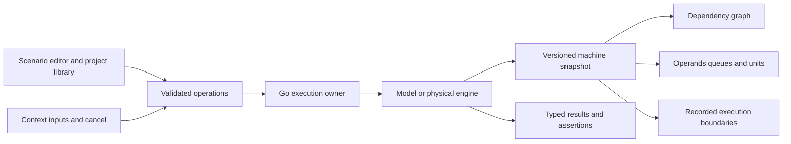

# Dataflow IDE: Go Service, React Workspace, and Physical Engine Inspection

## Executive summary

Build a complete local IDE for authoring, executing, and explaining experiments on the new elastic dataflow engine. Its central editable artifact is an execution scenario: typed operand injections, enabled-cycle advances, cancellation, output expectations, and reusable context input sets. The fixed hardware descriptor graph is displayed as an interactive dependency graph. The IDE combines a scenario editor, context controls, operand and activation inspection, pipeline/queue views, an execution timeline, and a result/assertion console.

The user requested the IDE during P2. It will be designed now, its necessary debug interfaces included before RTL is finalized, and its Go/React implementation scheduled after the engine and physical protocol are qualified. This avoids implementing the interface against imaginary hardware state. P6 builds the IDE and P7 validates browser/device integration. The original five-phase plan is superseded by a seven-phase plan while its printed receipt is preserved.

This is an IDE for the fixed-descriptor laboratory, not an arbitrary HDL or graph compiler. Users can edit complete executable experiments, save/load projects, run them on the model or board, debug one enabled cycle at a time, and inspect results. Editing the descriptor topology requires a later versioned hardware graph-loader feature. The graph view must make this restriction visible and must never appear to deploy a graph the FPGA cannot execute.

## 1. Foundations and existing code

`pkg/dataflow/types.go` defines the shared typed values, 80-bit tokens, seven descriptors, and source mapping. `semantic.go` computes results without pipeline timing; `transaction.go` models queues, issue delay, unit latency, cancellation, and output ownership. These are the new project's foundations. The existing `internal/microscope` and `web/src/App.tsx` demonstrate a single-owner service, immutable historical snapshots, explicit engine identity, and React/RTK Query integration, but their graph-coloring API is a different contract.

The new backend belongs in `internal/dataflowide`, and the host-facing engine API remains in `pkg/dataflow`. The frontend will use a separate dataflow entry within the existing pnpm/React/TypeScript toolchain, under `web/src/dataflow/`, with its own Vite entry/build configuration and generated embed inputs. It will be served by the dataflow command on loopback port 8087. The graph-coloring page on 8086 remains a separate application; only one physical process may own the board UART at a time.

The same source identity must survive all layers. The backend records `engine: model` or `engine: serial`; the header and exported traces display it. A failed physical command stops execution and reports the error. The server never obtains replacement values from the model to keep a physical run looking successful.

## 2. The workspace the user sees

The workspace has six coordinated areas. A project/source pane edits the scenario and displays syntax or validation errors with useful locations. The graph pane displays nodes 0–6, their operation names and edges, and readiness/issued state for the selected context. The context pane shows live epoch, open/closed/error state, and editable source inputs. A machine pane shows operand values, validity bits, ready reservations, issue state, arithmetic stages, and queue occupancy. The timeline lists recorded control operations and snapshot cycle boundaries. The result console shows typed outputs, expected values, and failed assertions.



Controls include Reset engine, Inject selected inputs, Step cycle, Advance N cycles, Run scenario, Pause, Cancel selected context, Poll outputs, and Return to live. A pending mutation disables conflicting controls. Pause means stop scheduling further bounded operations and await the current exchange, not cancel a partially transmitted UART frame. A model configuration can select multiplier latency and queue depths before Reset; the physical configuration is read from the bitstream and shown as immutable capabilities.

Graph nodes show operation, required ports, received operands, pending activation, and issue/completion information when present. Clicking a node selects its operand row and relevant pipeline records. Clicking a token selects its context, epoch, producer, and destination. Numeric tags and values accompany color cues. The context/epoch labels remain visible when tokens from canceled epochs are still in flight.

## 3. Scenario source and project model

A scenario is versioned JSON. It contains a name, description, engine-independent actions, and expected outputs. JSON is deliberately constrained: the server does not execute shell commands or arbitrary JavaScript. The editor supports formatting, reset-to-example, import/export, and explicit Save. The initial examples cover the book's interleaved 58/12 run, in-flight cancellation and reuse, COPY fanout, duplicate operand, and bad-tag/overflow behavior.

```json
{
  "version": 1,
  "name": "two contexts",
  "description": "Evaluate the book expression with interleaved inputs",
  "actions": [
    {"op": "reset"},
    {"op": "inputs", "context": 0, "values": [7, 6, 3, 5, 2, 9]},
    {"op": "inputs", "context": 1, "values": [10, -2, 4, 8, 7, 1]},
    {"op": "tick", "cycles": 200},
    {"op": "poll"},
    {"op": "expect", "context": 0, "epoch": 0, "value": 58},
    {"op": "expect", "context": 1, "epoch": 0, "value": 12}
  ]
}
```

The exact action schema will be implemented as typed Go structs and TypeScript discriminated unions. Inputs expands six integers into the fixed source node/port mapping. An explicit Inject action accepts context, epoch, node, port, and a typed value; this is necessary for malformed/stale-operand experiments. Cancel targets a context and reports whether the device accepted it. Tick is bounded. Poll drains available outputs without advancing computation. Expect checks already captured results by context and epoch, independent of output order.

The first implementation must not silently treat an unaccepted injection as executed. If the bounded ingress queue is full, the scenario pauses with an actionable error or uses an explicit configured advance-and-retry policy. The chosen default is explicit failure: source actions and Tick actions show exactly when progress occurs. Example scenarios therefore interleave injection and advances when using shallow configurations. A cancellation blocked by a held output is likewise reported; it is not guessed successful.

Project storage uses a configured workspace directory and a restricted project ID. The Go store writes a validated document to a temporary file and renames it atomically. IDs cannot contain path separators or escape the workspace. The API stores data only; no project action can select an arbitrary device path, execute a command, or change server configuration. Saved projects remain distinct from the draft in the editor until Save succeeds.

## 4. Backend ownership and HTTP contract

The IDE session serializes all device actions and snapshot reads. A Run worker advances through the scenario's actions in order under a cancellable session lifecycle. Pause stops between actions. HTTP requests enqueue or execute bounded operations through that owner. Read-only state requests return the latest cached snapshot and never issue an engine Tick.

```go
type Engine interface {
    Inject(context.Context, dataflow.Token) error
    Cancel(context.Context, uint8) error
    Tick(context.Context, uint32) error
    Poll(context.Context) (*dataflow.Token, error)
    Snapshot(context.Context) (dataflow.Snapshot, error)
    Reset(context.Context) error
    Close() error
}

type SessionState struct {
    Engine string
    Generation uint64
    Running bool
    Error string
    Snapshot dataflow.Snapshot
    Results []dataflow.Token
    History []BoundarySummary
}
```

The interface is new and will be introduced directly, with model and serial implementations. No compatibility layer is required. Hardware protocol failure marks the physical driver unsynchronized until an explicit global Reset. Reset increments the IDE generation, clears prior results/history, and records the hardware's new initial snapshot. Context cancellation changes the context's epoch, not the whole IDE generation.

| Endpoint | Purpose |
|---|---|
| `GET /api/dataflow/state` | Cached engine identity, capabilities, current snapshot, results, and boundary summaries. |
| `POST /api/dataflow/control` | Typed reset/inject/inputs/tick/cancel/poll/run/pause actions. |
| `POST /api/dataflow/scenario/validate` | Parse and validate source without device mutation. |
| `POST /api/dataflow/scenario/run` | Validate and begin a paused-session scenario. |
| `GET /api/dataflow/history/{id}?generation=N` | One retained immutable boundary snapshot. |
| `GET /api/dataflow/projects` | List saved scenario metadata. |
| `GET /api/dataflow/projects/{id}` | Read one validated project. |
| `PUT /api/dataflow/projects/{id}` | Save a validated project under a safe ID. |
| `GET /` and `GET /static/...` | Embedded dataflow HTML and compiled JS/CSS. |

Request bodies have explicit size bounds, reject unknown fields/trailing JSON, and return structured errors. Input errors use 400, conflicting ownership/generation uses 409, unavailable history/project uses 404, and physical exchange failures use 502. The service binds loopback by default and validates Origin when present. This is local tooling without an authentication or multi-user deployment claim.

## 5. Snapshots require physical debug interfaces

The IDE requires real visibility into the machine. P3/P4 must expose a versioned debug snapshot of context epochs and closure/error bits, A/B operand values and validity, pending/issued maps, issue metadata, unit stage occupancy/tokens, queue contents or explicitly bounded heads, router delivery mask, and metrics. The Go model can expose this directly; the FPGA needs an addressed read interface.

The UART control plane remains live while computation is halted. A paged Query command reads fixed-width debug records. Operand memory reads use a debug address mux only while the compute engine is paused, with the same synchronous latency as normal issue. Queue and pipeline records expose validity alongside data, so invalid stale RAM bits are never presented as live work. The exact page map and capability version are frozen with the P4 codec and documented in the engine guide.

A full snapshot is collected under exclusive host ownership after the Tick command finishes. No other action can mutate the device while those pages are read. The service then publishes the complete snapshot atomically. Partial reads are not merged into a plausible-looking new state after a communication error. This method trades serial bandwidth for consistency, which is appropriate for a teaching/debugging IDE.

The debug path must not alter architectural behavior when inactive. Synthesis and timing measurements include its cost. Existing block RAM read ports cannot be treated as combinational ports; debug access arbitrates them only at a stopped boundary and returns after a defined read latency. Tests compare snapshots against direct RTL state and model expectations.

## 6. Cycle stepping, history, and observation limits

One Step advances one enabled computation cycle and then captures state. A larger Tick advances the requested number and captures the ending boundary. The timeline must display the interval, such as cycles 40–72, rather than implying that every internal transition in that interval was recorded. Run can batch advances for responsiveness, with batch size visible and configurable within bounds.

History retains a bounded number of complete snapshots, initially 128. Selecting one switches every machine pane to that recorded snapshot and disables device mutations until Return to live. The latest toolbar may still show current run status, but it must be labeled accordingly. A generation mismatch or evicted history entry is an explicit error. Snapshot slices and queue/token arrays are deep-copied so subsequent work cannot rewrite history.

A per-cycle journal is not required for the first implementation because each enabled cycle can be stepped and captured individually. Exported history records its sampling intervals and engine identity. Counters account for internal activations and stale drops during batched advances; the UI must not fabricate unobserved transitions by replaying the software model in physical mode.

## 7. Frontend data flow and error presentation

Use one RTK Query API slice for state, projects, validation, actions, and history. A Redux UI slice stores selected context/node/token, historical boundary, and editor/project identity. Local editor text remains a draft. Mutation responses update cached state immediately; periodic state polling observes cached backend data and does not advance hardware.

```text
click Step:
    require live view and no conflicting mutation
    POST tick(cycles=1)
    owner advances engine and obtains complete snapshot
    install response in RTK Query cache
    render graph, operands, queues, units, and counters from one snapshot

select history:
    request (generation, boundary id)
    show loading until currentData for that exact key is available
    render recorded state with a historical label
    require Return to live before engine mutation
```

Connection failures show an error banner and mark the last view stale. A scenario assertion failure identifies the action index, expected context/epoch/value, and actual observed outputs. Tagged hardware faults appear as results with their code and producer. Editor validation errors are distinct from transport errors and do not imply that the device changed.

Bootstrap supplies form controls, tables, layout, and responsive behavior. SVG renders the fixed dependency graph, with keyboard-selectable nodes and textual readiness labels. A code-oriented textarea with formatting and diagnostics is sufficient for version-one JSON scenario editing; richer editor integrations can be added without changing the project schema. Source IDs, context labels, and payload values remain selectable/copyable text.

## 8. Design decisions and alternatives

### Implement after engine qualification, design debug visibility now

- **Context:** A full IDE depends on stable control and state-inspection contracts.
- **Options:** Build a model-only UI immediately, postpone all IDE design, or specify visibility now and implement after P5.
- **Decision:** Add this design during P2; include debug access in P3/P4; implement Go/React in P6 and validate in P7.
- **Rationale:** Avoids pretending that model internals are observed FPGA state and prevents expensive late debug-port changes.
- **Consequences:** The ticket expands to seven phases and a revised printed plan. Engine qualification remains a prerequisite for physical IDE claims.
- **Status:** accepted.

### Scenario editor with fixed topology

- **Context:** The first bitstream has fixed descriptors, while experiments need flexible inputs and cancellation schedules.
- **Options:** Arbitrary topology editor, fixed demos only, or editable versioned scenarios over the fixed graph.
- **Decision:** Full scenario editing, storage, validation, execution, and assertions, with a clearly identified fixed topology view.
- **Rationale:** Delivers useful IDE workflows within the actual hardware contract. Dynamic graph loading remains a separate engine extension.
- **Consequences:** The UI must not expose deployable topology editing that the hardware cannot honor.
- **Status:** accepted.

### Atomic paused snapshots

- **Context:** UART cannot sample all operands and queues simultaneously while they mutate at 10 MHz.
- **Options:** Asynchronous sampling, large hardware trace RAM, or halted paged reads under one owner.
- **Decision:** Read complete versioned snapshots between enabled-cycle advances.
- **Rationale:** Produces consistent inspection with bounded hardware and transport complexity.
- **Consequences:** Interactive speed includes snapshot transfer time. Batched execution records intervals rather than every internal cycle.
- **Status:** accepted.

## 9. Implementation tasks and acceptance

P3 adds a stopped-engine debug read port and exports live validity metadata. P4 specifies/query-tests the page map and implements serial Snapshot alongside Inject/Cancel/Tick/Poll. P5 validates debug noninterference, snapshot consistency, and physical in-flight cancellation before UI work starts.

P6 adds the Go IDE session, bounded immutable history, typed scenario executor, safe project store, strict HTTP API, and embedded frontend build. It then implements the React scenario editor, graph/context panes, operand/queue/unit inspectors, timeline, and results/assertions. Each subsystem has focused tests: project traversal/atomic writes, scenario validation and expected-output matching, serialized mutations, history generations, UI error handling, and selection/return-to-live behavior.

P7 starts the service in tmux and exercises the browser against the physical board. It loads/runs the book example, inspects a waiting node, steps arithmetic through the pipeline, cancels and reuses a context, verifies stale work, and checks historical viewing. Capture desktop/mobile screenshots, archive actual device responses, run builds and relevant regressions, update both guides, upload the completed document bundle, print final completion, and commit/push.

Acceptance requires a usable scenario editor with save/load/import/export, valid source diagnostics, correct physical and model execution identity, real machine-state inspection, context cancellation, bounded cycle controls, result assertions, historical snapshots, and visible failures. The interface must explain what was actually observed. No dynamic graph editor, source compiler, breakpoint mechanism, or browser-only reverse execution is claimed unless separately implemented and tested.

## Implemented outcome and authoritative follow-through

The engine, UART host, and separate Go/React IDE are implemented and have passed model, RTL, physical-board, and browser qualification. The physical build meets the 10 MHz board clock. See the [implemented API/register reference](../reference/02-dataflow-api-and-debug-register-reference.md) for the command-based Go interface and exact debug pages, and the [handoff and screenshot atlas](../reference/03-implemented-laboratory-handoff-and-screenshot-atlas.md) for the final file map, execution examples, measurements, reproduction commands, and limitations. The design sketches above preserve the reasoning that preceded implementation; the two references describe the final contract.
