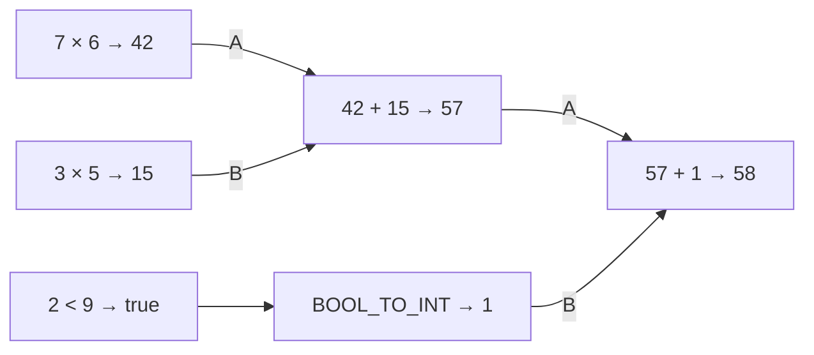

# Implemented laboratory handoff and screenshot atlas

## The system that now exists

Laboratory 3 is a concurrent expression evaluator implemented in GateMate RTL, with two executable Go references, a framed UART control plane, a Go host, and a React scenario IDE. Four contexts share a fixed seven-node descriptor graph. Six external operands normally evaluate `a*b + c*d + int(e<f)`. An optional COPY node supplies one value to both multiplier inputs. The graph is fixed in the bitstream; the IDE edits schedules, values, context operations, and assertions.

The central execution rule is readiness rather than source order. A node becomes eligible when its required operand ports are valid. A pending bit reserves that activation. The scheduler captures its operands and admits it to the corresponding arithmetic unit when that unit has credit. A completion carries enough context and destination information to continue through the graph without consulting an instruction pointer.

The data value is a 40-bit tagged record. The transport envelope is 80 bits and additionally identifies context, epoch, destination node and port, producer, finality, and subtype. Arithmetic checks canonical tags, Boolean payloads, signed ranges, and overflow. A context fault is isolated: its pending activations are canceled and a terminal error is retained until output capacity is available, while other contexts can still finish.

The implementation does not assume unbounded message storage. Input, completion, and output queues are finite; arithmetic pipeline stages retain valid records while blocked. Each operand slot has its own pending activation reservation, avoiding a dependency on a shared ready FIFO during operand commit. COPY routing retains a delivered-destination mask so its two destinations are each committed once.

## Read the implementation in this order

1. Read the archived [laboratory text](../sources/laboratory-3.md), then the [intern design guide](../design-doc/01-elastic-dataflow-engine-intern-analysis-design-and-implementation-guide.md).
2. Read [types.go](../../../../../../pkg/dataflow/types.go) for tagged arithmetic, token bytes, and descriptors. Read [semantic.go](../../../../../../pkg/dataflow/semantic.go) for timing-independent behavior and [transaction.go](../../../../../../pkg/dataflow/transaction.go) for finite storage and cycle advancement.
3. Read [dataflow_core.sv](../../../../../../elastic_dataflow/rtl/dataflow_core.sv), then [df_unit.sv](../../../../../../elastic_dataflow/rtl/df_unit.sv) and [df_fifo.sv](../../../../../../elastic_dataflow/rtl/df_fifo.sv). Follow a source token into an operand bank, through issue, and back through the completion router.
4. Read the [API/register reference](02-dataflow-api-and-debug-register-reference.md) beside [dataflow_link.sv](../../../../../../elastic_dataflow/rtl/dataflow_link.sv) and [protocol.go](../../../../../../pkg/dataflow/protocol.go). Byte order and validity masks are part of the interface contract.
5. Read [serial.go](../../../../../../pkg/dataflow/serial.go) for exchange ownership and uncertainty handling. Read [session.go](../../../../../../internal/dataflowide/session.go) for application ownership, snapshot generations, and scenario execution.
6. Read the [IDE design](../design-doc/02-dataflow-ide-go-react-architecture-and-intern-implementation-guide.md), [scenario.go](../../../../../../internal/dataflowide/scenario.go), and [App.tsx](../../../../../../web/src/dataflow/App.tsx). The frontend reads complete snapshots and submits explicit operations; it does not simulate missing hardware state.

## One execution, with actual values

For context zero, take `a=7`, `b=6`, `c=3`, `d=5`, `e=2`, and `f=9`. Nodes zero and one produce 42 and 15. Node two adds them to 57. Node three computes the Boolean value true. Node four converts that Boolean to integer one. Node five adds 57 and one and emits final integer 58.

These dependencies permit different legal arrival and execution orders. The less-than branch can finish before or after the multiply branch. The final node cannot issue until both its A and B ports are valid. Once issued, its issued bit prevents a second activation in the same context epoch. A duplicate write to an already valid operand port is a fault rather than an implicit re-evaluation.



The checked CLI's interleaved two-context schedule produced 58 and 12 using twelve activations: four multiply activations and eight ALU activations. It consumed 68 enabled cycles under that host schedule. The browser's grouped input actions and 96-cycle tick request produce a different total, because the host may first advance a few cycles to obtain input credit. These totals describe the submitted schedules, not a claimed minimum expression latency.

## Cancellation and debugger visibility

Every context has an epoch. Cancellation increments it and clears that context's operand validity, issued, and pending metadata. Records already inside queues or units retain the old epoch and are discarded at later boundaries. A new expression can use the same context number with the new epoch. Epoch equality is therefore required in addition to context equality.

The cancellation experiment deliberately stops with a multiplier occupied. On the physical board after six enabled cycles, stage zero contained context two, epoch zero, node zero, and value 42. The operand RAM pages showed A=7, B=6, valid mask 3, issued=true, and pending=false. After canceling context two, an explicitly stale source and the old multiplier result were both discarded. New epoch-one inputs produced result 12, and the physical stale counter was two.

Cancellation is refused when a fresh output for that context is already offered at the queue head. This preserves the ready/valid stability contract: a blocked observer must continue seeing the same record. The UI demonstrates that refusal and leaves the epoch unchanged. Epoch wrap is additionally refused until all message storage, pending activations, issue, units, router, and terminal errors are drained. Incomplete operand slots alone do not prevent wrap after that drain.

```text
on cancel(context):
    if fresh offered output belongs to context:
        reject without changing epoch
    if increment would wrap and machine is not drained:
        reject without changing epoch
    epoch[context] += 1
    clear operand metadata and pending activations for context

on observing a stored record:
    if record.epoch != epoch[record.context]:
        discard and count stale work
    else:
        continue the normal handshake
```

The debugger reads a stopped physical machine. The control plane continues clocking while computational enable is false. Synchronous operand reads wait for the selected address response, and issue tracks response ownership across debug reads. Captured issue operands are separate registers. A complete multi-page snapshot is published only after every required response has arrived under the serial owner's lock.

## Using the IDE

From the repository root, build the frontend assets and run the model server:

```sh
pnpm --dir web install --frozen-lockfile
make frontend
tmux new-session -d -s dataflow-ide-model \
  'go run -tags embed ./cmd/dataflow-ide --engine model --listen 127.0.0.1:8087'
```

Open `http://127.0.0.1:8087/`. The source selector provides book, COPY, fault, and cancellation scenarios. Run from start executes the source's explicit initial reset and then the complete action list. Next action executes one source action and records its boundary snapshot. Pause stops a running scenario at an action boundary. The single-cycle button advances one engine cycle; Advance submits the selected bounded cycle count. Poll consumes an offered result. Cancel targets the currently selected context.

Source validation rejects malformed JSON, unknown fields, invalid actions, missing reset, invalid operand lists, and oversized scenarios. Save writes a validated project through a temporary file and atomic rename inside an `os.Root`. Import and export round-trip scenario JSON. Saved projects default to `elastic_dataflow/projects`, which is ignored as runtime user data; the exported example used for verification is archived under this ticket's sources folder.

Snapshot history contains up to 128 complete operation boundaries. Selecting a historical frame disables engine controls. The server also checks the expected live frame ID on mutations, so stale tabs cannot bypass this by sending an old request. Reset starts a new generation and clears earlier history. The result and console panes are session records; each snapshot's queue and pipeline inspectors describe that specific frame.

To switch to the physical device, stop the current web server using the repository-required port command, then start serial mode:

```sh
lsof-who -p 8087 -k
tmux new-session -d -s dataflow-ide-fpga \
  'go run -tags embed ./cmd/dataflow-ide --engine serial --device /dev/ttyACM0 --listen 127.0.0.1:8087'
```

The board must already contain the dataflow bitstream. `elastic_dataflow/scripts/build-board.sh` performs synthesis, placement, routing, and bitstream packing under the installed CAD environment. `make -C elastic_dataflow load`, with that environment loaded, programs the generated bitstream. The IDE and standalone CLI must not own the same serial device simultaneously.

## Qualification results and their limits

| Layer | Evidence |
| --- | --- |
| Go references | Typed arithmetic, errors, envelope round trips, 240 latency/depth/seed schedules, randomized contexts, cancellation, COPY, output hold, and reduced epoch wrap |
| Directed RTL | Twelve queue-depth/multiply-latency configurations passed all directed invariants |
| Randomized RTL | 600 schedules, 2,400 expressions, and 14,400 activation values matched the Go model |
| UART simulation | Pause, exact ticks, RAM pages, cancellation, polling, reset, bounds, checksum rejection, and incomplete-command timeout |
| Physical timing | 12.80 MHz achieved against a 10.00 MHz constraint; two operand block RAMs |
| Physical examples | Book 58/12, COPY 78, isolated duplicate fault, and in-flight cancellation result 12 |
| Physical stress | 128 randomized expressions, offered-output stability, and a full 256-cancellation drained epoch wrap |
| IDE browser | Model and serial runs, project save/load, JSON export/import, source validation, history controls, occupied units, real operand pages, and cancellation |
| Repository checks | Race tests, ordinary and embedded builds, vet, Glazed lint, vulnerability scan, frontend tests, and TypeScript checks passed |

The Go transaction model and RTL are not cycle-identical microarchitectures. Their result and activation values were compared; exact stage position was not equated. The model showed the cancellation multiply in stage one at cycle six, while the FPGA showed it in stage zero. Both observations are explicitly labeled and both preceded a successful cancellation experiment.

The multiply unit carries its result through configurable elastic stages. This implementation computes the signed 16-bit product at admission; increasing the stage count changes latency and in-flight storage, not the combinational multiplier's arithmetic depth. The physical build used latency four and queue depths eight. Other parameter configurations were simulated, not individually placed and programmed. The tests provide substantial evidence but are not a formal proof over all possible token schedules.

A transport timeout can leave a mutation's outcome unknown. The serial host then requires an explicit reset. The project does not provide dynamic descriptor loading, source-to-graph compilation, reverse execution, or multi-user device sharing. Historical views are observation records, not rollback states.

## Screenshot atlas for the diary and later report

All images were captured from the running UI. Desktop images use a 1600-pixel viewport and include the full page. The mobile image uses a 390 × 844 viewport. The first image is an implementation checkpoint before the graph-port labels were polished; prefer images 02 onward for a report.

| Image | Source | What it documents |
| --- | --- | --- |
| [01 initial book](screenshots/01-model-book-initial.png) | model | first working end-to-end UI |
| [02 book complete](screenshots/02-model-book-complete.png) | model | results 58/12 and final operand graph |
| [03 history](screenshots/03-model-history.png) | model | historical frame and disabled controls |
| [04 multiply in flight](screenshots/04-model-in-flight.png) | model | value 42 in stage one at cycle six |
| [05 mobile](screenshots/05-model-mobile.png) | model | narrow viewport without horizontal overflow |
| [06 book complete](screenshots/06-fpga-book-complete.png) | FPGA | physical result and counter provenance |
| [07 offered-output guard](screenshots/07-fpga-held-output-guard.png) | FPGA | cancellation rejected while final outputs are held |
| [08 multiply in flight](screenshots/08-fpga-in-flight.png) | FPGA | stage-zero token and operand RAM values 7/6 |
| [09 cancellation complete](screenshots/09-fpga-cancellation-complete.png) | FPGA | epoch-one result 12 and two stale discards |
| [10 history](screenshots/10-fpga-history.png) | FPGA | recorded physical stage state with mutation disabled |

### Physical multiplication before cancellation

The green source badge identifies real UART-backed data. Context two is at epoch zero, and node zero has issued once. The multiplier retains value 42 in stage zero while compute is paused. No final result has been polled.


### Physical cancellation result

The new context-two epoch is one. The final value is 12. Two old-epoch records were discarded, while the new expression completed normally.


## Reproduction and review evidence

The chronological [diary](01-implementation-diary.md) records design decisions, exact failures, successful repairs, phase slips, uploads, and commits. The [API/register reference](02-dataflow-api-and-debug-register-reference.md) is the implemented wire contract. Validation logs, decoded physical snapshots, request/response logs, compressed synthesis/route reports, and compressed randomized traces are under `reference/validation`.

Use `scripts/17-final-checks.sh` to reproduce repository checks. Use `elastic_dataflow/scripts/test.sh`, `test-link.sh`, and `test-stress.sh` after loading the CAD environment for RTL verification. The Go differential test accepts `-rtl-log-dir` to compare generated RTL traces. Physical qualification is opt-in through `-physical-device` because it explicitly resets and exercises the connected board. Browser checks are retained as Playwright scripts 15 and 18.
