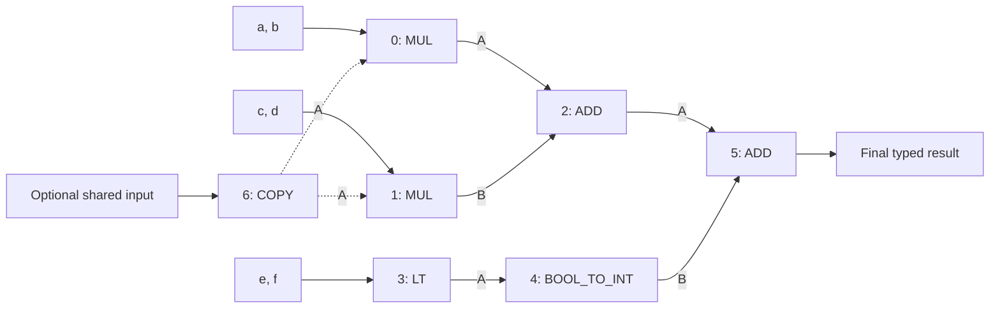
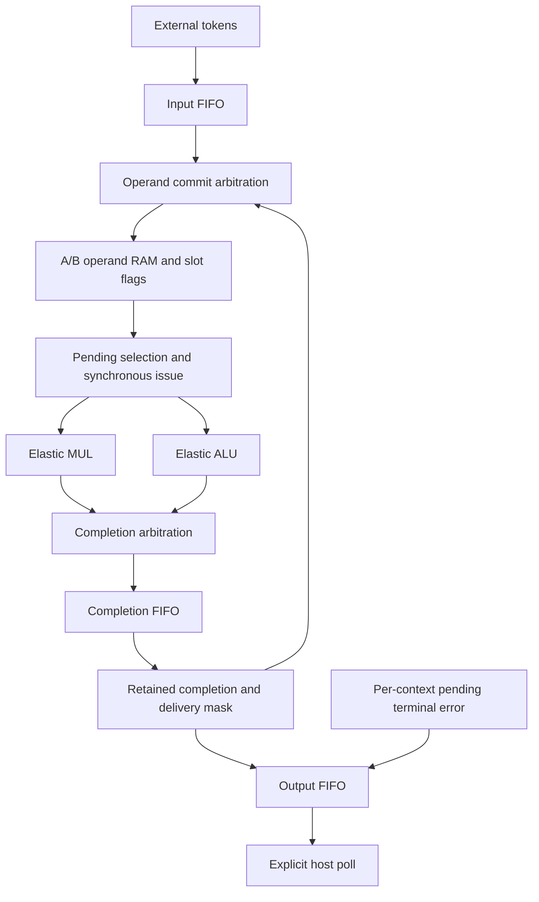
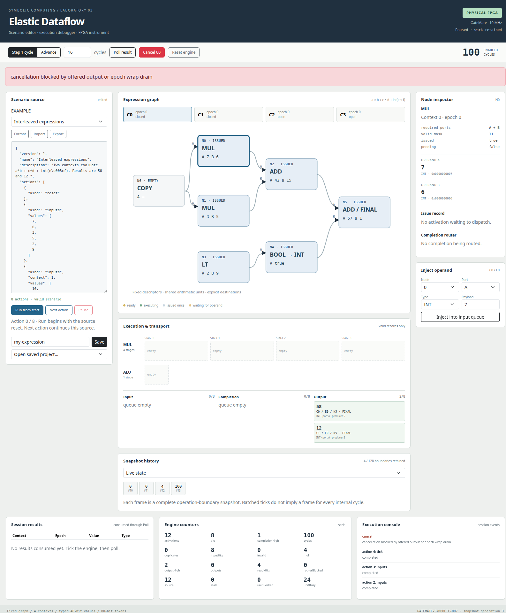
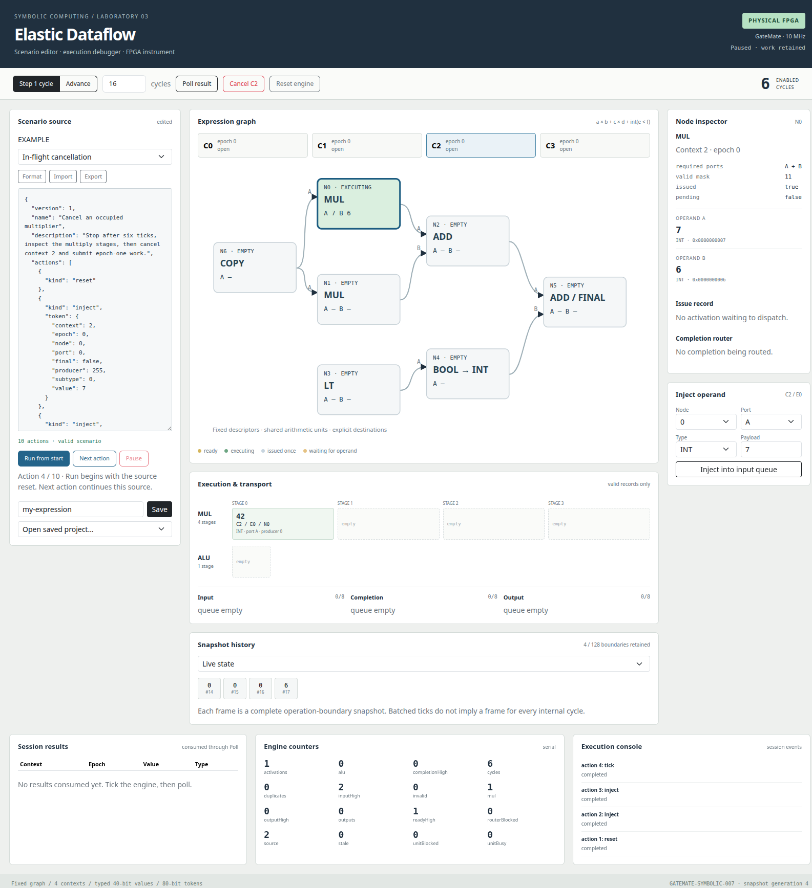
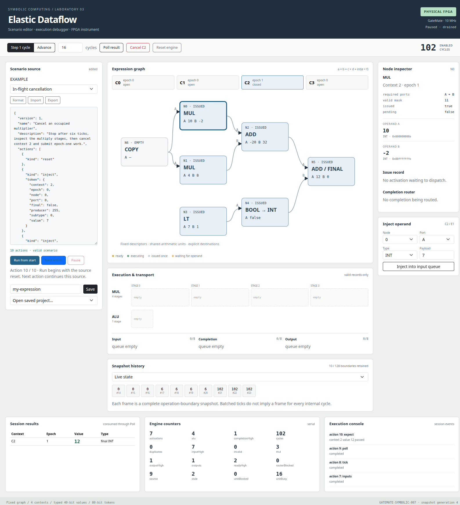
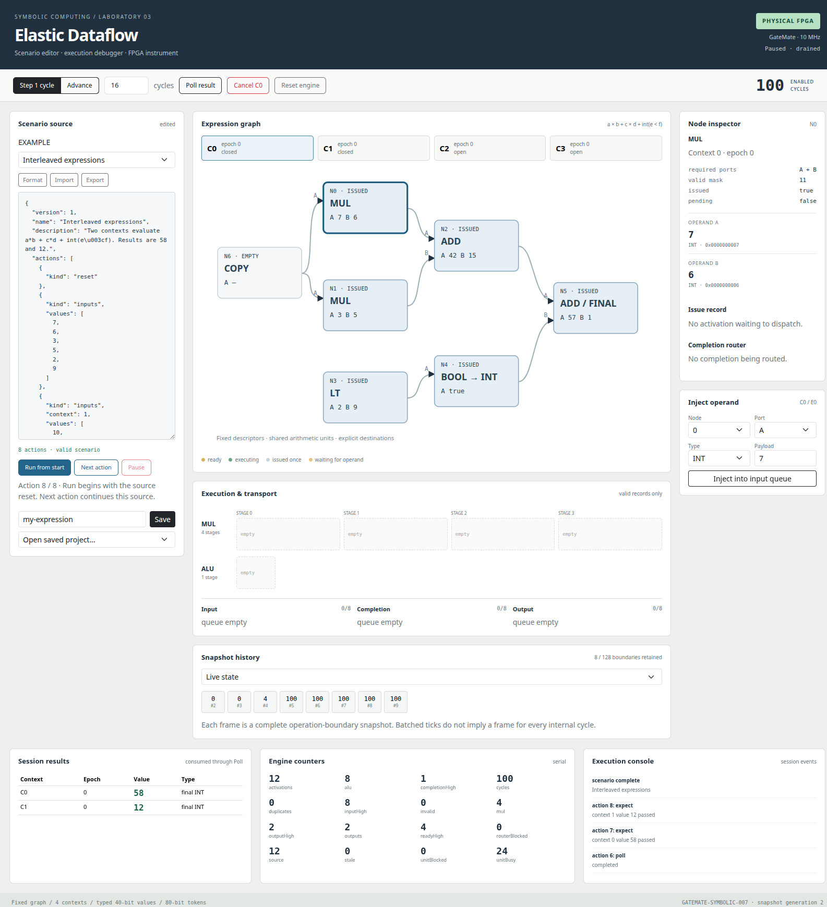
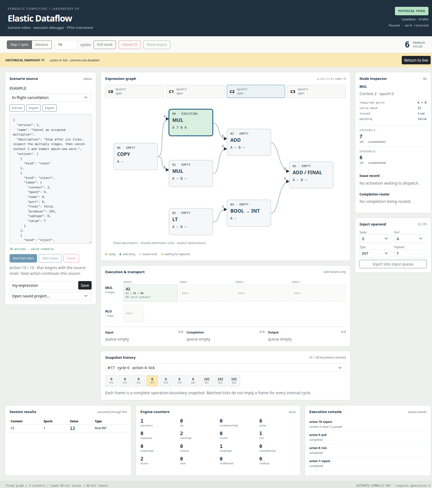

# Inside an Elastic Dataflow Engine: Typed Execution, Bounded Storage, and Physical Inspection

An elastic dataflow engine evaluates operations when their operands are available and retains intermediate work when downstream storage is full. This project implements that execution model on a GateMate FPGA, together with executable Go specifications and a React IDE that can inspect the physical machine. Four independent expression contexts share arithmetic units, operand memories, and finite token queues. Execution can stop with a multiplication in flight, expose its actual operand and pipeline state, cancel its context, and continue a new expression without accepting the canceled result.

The implemented expression is small enough to examine completely: `a*b + c*d + int(e<f)`. Its arithmetic is deliberately simple. The substantial problem is preserving the identity, type, ownership, and delivery of every value while independent operations overlap and storage becomes unavailable. Understanding those rules provides a concrete foundation for reading the RTL and for extending the laboratory without invalidating its execution contract.

This article describes source revision `9953407919247c1d01d50b70d141cd2c6ad170b7` of `/home/manuel/code/wesen/2026-09-04--gatemate-symbolic`. Measurements and screenshots come from the completed laboratory's archived validation records. A physical observation is identified explicitly; an explanatory ordering is not presented as a captured cycle trace.

> [!summary]
> - Operand validity determines eligibility; a per-node pending bit retains the obligation to execute exactly once in a context epoch.
> - Ready/valid handshakes and retained routing state preserve values under finite queue capacity.
> - Cancellation changes an epoch and invalidates obsolete work, with guards for an already offered output and epoch wrap.
> - The IDE presents complete snapshots from either the Go transaction model or the physical FPGA. Those implementations agree on checked results and activation values, without requiring identical cycle timing.

## 1. The expression as a dependency graph

A dataflow node consists of an operation, a set of required input ports, and destinations for its result. An edge identifies both a destination node and a destination port. Two values intended for different ports must remain distinguishable even when they have the same numeric value. The graph supplies dependencies; it does not supply a single sequential instruction order.

For the ordinary expression, the source supplies six signed integers. Nodes 0 and 1 multiply two pairs. Node 2 adds their products. Node 3 compares the last pair, and node 4 converts the resulting Boolean into an integer. Node 5 adds the numeric and predicate branches. The optional node 6 copies one input to both multiplier A ports.

| Node | Operation | Required ports | Result destinations |
|---|---|---|---|
| 0 | MUL | A and B | Node 2, A |
| 1 | MUL | A and B | Node 2, B |
| 2 | ADD | A and B | Node 5, A |
| 3 | Signed LT | A and B | Node 4, A |
| 4 | BOOL_TO_INT | A | Node 5, B |
| 5 | ADD | A and B | Final output |
| 6 | COPY | A | Node 0, A; node 1, A |



The dashed COPY edges denote an alternative source arrangement. Supplying both COPY and the ordinary external A operand to the same destination would duplicate an operand and fault the context. COPY is not an additional arithmetic term.

For `[7,6,3,5,2,9]`, the products are 42 and 15, their sum is 57, the comparison is true, and the converted predicate is 1. The result is 58. For `[10,-2,4,8,7,1]`, the products are −20 and 32, their sum is 12, and the predicate contributes 0. The result is 12.

These calculations define expected values independently of scheduling. The comparison can finish before either multiplication, and context one can progress while context zero waits. Node 5 still requires both of its own context's inputs. A value from another context cannot satisfy that dependency.

The descriptors are fixed in this bitstream. Editing the IDE's JSON changes the experiment's input and control schedule; it does not compile or install a new graph. `pkg/dataflow/types.go` defines the Go descriptor table, and `elastic_dataflow/rtl/dataflow_pkg.sv` defines the RTL operations and graph functions.

## 2. Contexts, epochs, and the identity of work

A context identifies one of four simultaneously represented expression instances. Each context has its own operand slots and completion state, while all contexts share the execution resources. An epoch identifies the current use of that context. Together, `(context, epoch, node)` identifies a node activation; adding the operand port identifies one input location.

The distinction between context and epoch is necessary for reuse. A context can be canceled while its old multiplication remains inside an arithmetic unit. New input then uses the same context number with a different epoch. When the old multiplication emerges, its context number is still valid, but its epoch is obsolete. Equality of both fields is required before it can affect current work.

Each context also has a closed bit. A normal final result closes the context when it is queued; a terminal fault closes it as part of fault handling. More same-epoch input cannot start another expression in that closed context. Reuse requires cancellation, which advances its epoch, or a global reset.

This is a single-activation graph per context epoch. Operand slots are not general streams that repeatedly fire a node whenever another pair arrives. The retained issued bit enforces that contract. A streaming or cyclic graph would need additional activation identity, operand consumption rules, and storage reasoning beyond the current descriptors.

## 3. Typed values and transport envelopes

A value occupies 40 bits. Bits 39–36 are its tag, bits 35–32 are flags, and bits 31–0 are its payload. INT uses tag 0 with a signed two's-complement payload. BOOL uses tag 1 with payload exactly 0 or 1. Both require zero flags. ERROR uses tag 13 and carries an engine-produced terminal fault code.

Tag checks are part of operation semantics. The integer 1 and Boolean true have different encodings and cannot be substituted indiscriminately. BOOL_TO_INT makes the conversion explicit. A malformed Boolean payload such as 2 is rejected, as is a nonzero flag nibble. An ERROR value describes a terminal outcome; it is not a valid arithmetic input.

| Operation | Accepted values | Result rule |
|---|---|---|
| MUL | Two INTs, each in signed 16-bit range | Signed product represented as INT32 |
| ADD, SUB | Two INT32s | Checked signed 32-bit result |
| LT | Two INT32s | Canonical BOOL from signed comparison |
| BOOL_TO_INT | One canonical BOOL | INT payload 0 or 1 |
| COPY | One canonical INT or BOOL | Identical typed value |

SUB is implemented by the evaluator but unused by the fixed graph. Multiplication rejects operands outside −32768 through 32767 even when a particular mathematical product would fit in 32 bits. The operand range is an implemented unit contract, not merely a final-result overflow check. ADD and SUB use wider reasoning in the Go evaluator to detect a result outside signed 32-bit range.

A transport token includes the value and enough metadata to route or reject it. The envelope is ten bytes, or 80 bits:

| Byte | Meaning |
|---|---|
| 0 | Context |
| 1 | Epoch |
| 2 | Node in bits 7–2, port in bit 1, final flag in bit 0 |
| 3 | Producer node; 255 identifies an external source |
| 4 | Subtype, zero for ordinary data and a code for terminal faults |
| 5 | Value tag in the upper nibble and flags in the lower nibble |
| 6–9 | Payload in big-endian byte order |

For example, an external INT(7) targeting context 2, epoch 0, node 0, port A is the byte sequence `02 00 00 FF 00 00 00 00 00 07`. Its node/port/final byte is zero because all three fields are zero. BOOL(true) has value representation `0x1000000001`; INT(−1) has `0x00FFFFFFFF`. Displaying the low 32 bits as signed is therefore separate from displaying the complete typed encoding.

Go stores the value in a `uint64`. Every valid 40-bit encoding is exactly representable by JavaScript's numeric integer representation, so this particular JSON boundary does not require decimal strings for values. That observation applies to the 40-bit value field; the full 80-bit token is transmitted as structured fields or ten bytes, never as one JavaScript number.

## 4. Matching operands without losing ready work

The engine has 28 operand slots: seven nodes for each of four contexts. Slot `7*context + node` has an A value, a B value, a two-bit validity mask, an issued bit, and a pending bit. The two value banks use synchronous 40-bit memories of depth 32. The unused addresses simplify physical memory allocation; only 28 slot identities participate in the graph.

Validity metadata determines whether a stored RAM value belongs to the current expression. Cancellation can clear validity without clearing every memory word. A debugger must therefore ignore the numeric contents of an invalid operand. Reading an old bit pattern from RAM does not mean that operand is available.

A descriptor's required mask is 3 for A and B or 1 for A alone. A slot becomes ready when `(valid & required) == required`. The accepting operation atomically reserves its activation by setting both issued and pending. Issued means the activation has already been reserved in this epoch; pending means that reserved work still awaits issue.

```text
accept a fresh token for an open context:
    validate destination node, port, final flag, and subtype
    slot = operands[token.context][token.node]
    if slot.valid contains token.port:
        close context with DUPLICATE_OPERAND
        return
    write token.value into the selected operand bank
    slot.valid |= bit(token.port)
    if all required ports are valid and not slot.issued:
        slot.issued = true
        slot.pending = true
```

The pending bit is a storage reservation for ready work. A design that first writes the last operand and then attempts to append a node ID to a full shared ready FIFO has an additional obligation: it must preserve that activation somewhere while the FIFO is unavailable. Otherwise it can lose an operation whose operands are already marked complete. Holding the entire operand-commit path until that FIFO has room can also introduce a dependency between committing values and releasing resources needed for execution.

This implementation gives every slot its own pending capacity. The final operand can reserve its activation without obtaining another queue entry. The pending set is finite and bounded by the 28 slots, matching the single-activation contract. It does not establish a general deadlock theorem for arbitrary graphs, but it removes this particular shared-ready-queue dependency.

External input and routed results share operand commit arbitration. They cannot both write conflicting metadata in one commit decision. Alternation between eligible sources prevents a continuously available source from permanently excluding the other under ordinary progressing conditions.

## 5. Scheduling and synchronous operand reads

The scheduler selects an eligible pending slot in circular order. Eligibility includes availability of the target arithmetic unit: multiplication uses the multiplier; the remaining implemented graph operations use the ALU. The next-slot pointer advances after selection so repeated arbitration does not always begin with context zero.

The RTL expresses selection with constant-index scans. One priority pass supplies a wraparound candidate, and another selects the first eligible slot at or above the pointer. Constant node indices also make descriptor lookup and context decoding synthesis-friendly. A mathematical remainder or division written on a runtime integer can imply much more hardware than a fixed small decoder. The source's constant-index structure makes the intended bounded selection explicit.

Selection alone does not provide operands. Synchronous RAM returns a value after a clocked read, and the debug interface can also select a RAM address while computation is paused. The issue state machine tracks which address produced the returning data before copying it into private issue registers.

```text
IDLE:
    select eligible pending slot
    retain its slot identity and token metadata
WAIT:
    allow the synchronous operand read to progress
CAPTURE:
    if the returning address belongs to the issue slot:
        capture A and B into issue registers
DISPATCH:
    if token is fresh and target unit accepts:
        admit token with captured operands
        finish this issue operation
```

The actual RTL names these phases numerically. The explanatory states identify their purpose. `previous_read_slot` associates the RAM response with its requested address. Without that check, resuming after a debug query could capture values from the last inspected slot rather than the selected activation.

Captured issue operands remain separate from the RAM output. This isolates an admitted issue operation from subsequent debug reads. It also makes the issue inspector useful: the reader can distinguish operand memory contents from the operands actually retained for dispatch.

Only one issue operation is active in this controller. Several arithmetic results can nevertheless occupy elastic unit stages, and both arithmetic units can hold work while the scheduler prepares another activation. Four contexts therefore mean four sets of dependency state, not four copies of the arithmetic datapath or four dispatches per cycle.

## 6. Elastic stages, finite queues, and backpressure

A ready/valid channel separates an offered record from its acceptance. The producer asserts valid when it has a record. The consumer asserts ready when it can accept it. An enabled transfer occurs when both are true. While valid is true and ready is false, the producer must retain the record and its metadata.

For a pipeline stage, capacity propagates backward from its consumer:

```text
ready[last] = not valid[last] or downstream_ready
ready[i]    = not valid[i] or ready[i+1]

on an enabled clock edge:
    for each stage whose ready is true:
        replace valid and record from its upstream source
    for each blocked stage:
        retain valid and record
```

The clock enable is part of this laboratory's computational contract. Pausing computation retains unit contents even if the combinational capacity equations would permit movement. The UART control plane continues running so those retained contents can be inspected.

The multiplier has a configurable latency from one through eight stages; the physical configuration uses four. The ALU has one stage. Multiplication is computed at admission, and the result then travels through elastic storage stages. Increasing the configured stage count changes latency and storage capacity. It does not partition the multiplier's combinational arithmetic into smaller operations, so it must not be described as an automatic improvement to arithmetic timing.

Input, completion, and output queues have configurable depths of one through eight, with eight used physically. These are small register-based FIFOs. Their full condition uses current occupancy; a full queue does not accept a push merely because a pop also occurs on that same edge. That conservative rule can insert a bubble. Correct retention and maximum sustained throughput are separate properties.



A full output queue can block final routing. A retained router record can then prevent the next completion from being taken. A full completion queue can block a unit exit, and occupied unit stages can prevent further admission. This is backpressure through actual storage dependencies. It is correct for progress to stop when the host never consumes output; lossless finite storage cannot accept unbounded new work under that condition.

Completion arbitration admits at most one fresh unit completion per cycle. Fair selection handles simultaneous ready exits. Obsolete completions can be discarded without needing completion-queue capacity, which matters when cancellation is used to remove work from a congested machine.

## 7. Routing, fanout, and terminal errors

A completion retains the producer node, context, epoch, and typed result. The descriptor identifies where that result must go. The router takes a completion into retained state and commits one undelivered destination at a time. Ordinary nodes have one destination; COPY has two.

COPY requires explicit delivery state. After its first destination accepts, the second may remain blocked. Replaying the first destination while waiting would duplicate an operand and fault the context. A two-bit delivered mask records successful destination commits and persists until all required deliveries finish.

```text
while router contains a fresh nonfinal completion:
    select an undelivered descriptor destination
    if operand commit accepts that destination:
        mark its delivered bit
    if all destinations are delivered:
        release router record
```

A final completion instead waits for output capacity. Once queued, the context closes. Polling later removes the output, but does not reopen the context. This separates completion of an expression from consumption by its observer.

Fault handling preserves the same finite-storage discipline. Bad destination, duplicate operand, bad tag, integer overflow, and bad descriptor have codes 1 through 5. The first context fault closes that context, clears its pending activations, and retains a terminal error until the output queue can accept it. Fault delivery cannot depend on output space being available at the instant the error is detected.

The physical duplicate-operand experiment produced context-zero ERROR with subtype 2 and encoded value `893353197570`, while context one produced INT(12). The error encoding is `(13 << 36) | 2`; it is not an unusually large integer arithmetic answer. This experiment verifies the intended isolation at the level of observed outcomes. Contexts still share bandwidth and storage, so isolation does not mean independent performance.

## 8. Cancellation, offered outputs, and epoch wrap

Cancellation invalidates one context's current execution by advancing its eight-bit epoch and clearing operand validity, issued state, pending activations, closed state, and pending terminal error state for that context. Old tokens need not be physically removed from every queue and stage at once. They retain their old epoch and are rejected at later processing boundaries.

```text
cancel(c):
    if a fresh output for c is currently offered at the output head:
        reject cancellation without changing c
    if incrementing epoch[c] would wrap and machine is not drained:
        reject cancellation without changing c
    epoch[c] = epoch[c] + 1 modulo 256
    clear c's operand and activation metadata
    reopen c and clear its pending terminal fault

process a retained record:
    if record.epoch differs from current epoch[record.context]:
        discard obsolete record and count stale work
    else:
        apply the ordinary execution or delivery rule
```

The offered-output guard follows from channel stability. If an observer sees a valid final record but has not accepted it, cancellation must not withdraw that record or replace it with something else. The implementation refuses cancellation for that context while its fresh record is at the output head. This refusal leaves the epoch unchanged.

Older records farther back in the output FIFO have not yet been offered at its head. After cancellation they can be discarded when they reach that position. Stale-output cleanup can occur even while computational enable is false, so “paused” should be understood as paused computation rather than a promise that every maintenance bit in the control interface is frozen forever.



*Figure 1. The physical FPGA has retained final outputs. Canceling the context whose fresh result is offered at the head is rejected. The rejection demonstrates the output contract, rather than a failed epoch update.*

Epoch wrap requires an additional guard. After 256 uses, an eight-bit epoch repeats. If an old token with that same numeric epoch remained in flight, an equality comparison could incorrectly accept it as new work. The engine permits wrap only when message queues, pending activations, issue, units, router, and pending terminal errors are drained. Incomplete operand slots alone do not prevent this quiescent condition because their metadata is cleared by cancellation and they are not in-flight messages.

This condition is global, even though ordinary cancellation is per context. It is conservative and easy to inspect. The physical qualification exercised 256 drained cancellations and observed epoch wrap to zero. That evidence covers the tested drained sequence; arbitrary wrap behavior would require broader proof obligations.

## 9. A physical multiplication and its cancellation

The cancellation scenario gives a direct observation of these abstractions. On the physical FPGA after six enabled cycles, context 2 was at epoch 0. Node 0's operand RAM held A=7 and B=6, both valid. Its issued flag was true and pending flag false. Multiplier stage zero held the corresponding result value 42.

Those fields establish more than a final numeric answer. The valid operands show that matching completed. Issued establishes that the activation was reserved. Pending=false and the occupied multiplier show that it had advanced beyond pending selection. Context and epoch identify which expression owned the retained result.



*Figure 2. Actual UART-backed operand and multiplier inspection. The physical multiplier contains value 42 in stage zero at enabled cycle 6. The UI source badge identifies the FPGA; the view is not populated from a simulated fallback.*

Canceling context 2 advanced it to epoch 1. The scenario then supplied new epoch-one inputs and also exercised stale-token rejection. The old multiplication result and an explicitly old-epoch source were discarded. The replacement expression produced 12, with a stale counter of 2.



*Figure 3. Context 2 completes at epoch 1 with INT(12). The two stale discards account for obsolete work exercised by this scenario. The retained records allow cancellation to be checked while arithmetic is genuinely in flight.*

The Go transaction model's corresponding cycle-six view placed value 42 in stage one. This is an expected distinction between implementations, not evidence that either screenshot is mislabeled. The checked equivalence contract covers final results and activation values. Exact microarchitectural stage positions are inspected within each implementation's own timing model.

## 10. The control plane and the meaning of a snapshot

The FPGA runs with a 10 MHz system clock and communicates over 115200-baud 8N1 UART. Computation advances only through an explicit bounded tick command. Requests, responses, and debug reads continue while computation is paused. A developer can therefore stop at a meaningful internal state and read multiple pages without consuming more enabled arithmetic cycles.

The protocol is stop-and-wait. Every request ends with LF, and the host waits for a complete response before issuing another. Binary payload bytes are represented by hexadecimal characters. For commands with a checksum, the XOR of binary payload bytes including the checksum is zero; the leading ASCII command letter is excluded.

| Request | Meaning | Successful response |
|---|---|---|
| `R` | Global reset | `A` |
| `I` plus token and checksum | Inject one token | `A` |
| `T` plus 32-bit count and checksum | Advance up to 1,000,000 enabled cycles | `A` after completion |
| `C` plus context and checksum | Cancel a context | `A` |
| `Q` plus page and checksum | Read a ten-byte debug page | `S` plus data and checksum |
| `P` | Consume one offered output | `O` plus token/checksum, or `N` when empty |

All table entries imply the terminating LF. For example, `T0000000101` advances one cycle, `Q0000` reads capability page zero, and `C0202` requests cancellation of context 2. A zero tick count is legal. Rejections identify syntax/timeout (`!01`), range (`!02`), checksum (`!03`), input full (`!04`), or blocked cancellation (`!05`).

Input-full is a definite rejection: the token was not accepted. The caller may explicitly tick to create credit and retry that token. A missing or corrupt response is different. The mutation may already have executed. Retrying an uncertain inject could create a duplicate operand; retrying uncertain cancellation could advance the epoch twice. The serial host marks itself unsynchronized and requires an explicit reset instead of automatically repeating such a mutation.

The board times out partial commands after 200 ms. The Go exchange has a two-second deadline and checks caller cancellation during serial I/O. Reset waits for partial-command recovery and drains input before sending the reset request. These rules make communication uncertainty visible to the application.

A debug snapshot combines many ten-byte pages:

| Pages | State exposed |
|---|---|
| 0–1 | Capabilities, epochs, closure/error masks, queue counts, quiescence |
| 2–9 | Sixteen 32-bit counters |
| 10–13 | Issue metadata and captured operands; router record and delivery mask |
| 16–25 | Multiplier stages and validity; ALU state |
| 32–59 | Operand A/B pairs for the 28 slots |
| 64–91 | Valid, issued, and pending slot flags |
| 96–103 | Input FIFO entries in logical order |
| 112–119 | Completion FIFO entries |
| 128–135 | Output FIFO entries |
| 144–147 | Retained per-context terminal errors |

Reserved holes in these ranges are described by the detailed register reference. Queue entries are indexed relative to their current head, making the snapshot useful without exposing ring-buffer pointer arithmetic. Validity flags and counts decide which entries are meaningful.

`pkg/dataflow/serial.go` locks the entire multi-page operation. Another command cannot insert a tick between its pages through that same serial instance. `protocol.go` validates and decodes the complete response set before returning a publishable snapshot. A partial read returns an error rather than an apparently complete mixture of old and new state.

Counters include enabled cycles, source acceptance, activations, unit use, stale discards, faults, blocking, output consumption, and queue high-water marks. They are 32-bit observations and can wrap. Enabled-cycle counts exclude the wall-clock time spent requesting pages over UART. A debugger that reads extensive state can be slow to refresh without changing the engine's counted computational progress.

## 11. Two Go models and one application interface

The semantic model in `pkg/dataflow/semantic.go` evaluates the graph without clock timing. It establishes the typed computation, destination rules, and context behavior in a compact executable form. The transaction model in `transaction.go` adds finite queues, unit storage, cycle advancement, scheduling, and cancellation. These models answer different questions: what results should be produced, and how can finite retained work advance under a schedule?

The application boundary is a small Go interface:

```go
type Engine interface {
    Execute(context.Context, Operation) (*Token, error)
    Snapshot(context.Context) (Snapshot, error)
    Close() error
}
```

Operations are reset, inject, tick, cancel, and poll. Only a successful nonempty poll returns a token. Reset can accept a configuration for the model; the physical engine rejects parameter changes because queue depths and unit latency belong to its bitstream. Context-aware operations allow the service to interrupt waiting work without silently converting an uncertain physical outcome into success.

Snapshots clone mutable state before retention. Otherwise a historical frame could change when the live model modifies an underlying slice, leaving the browser with a record that never actually existed at the stated boundary. The model also bounds its retained activation trace to the most recent 4096 activations. Bounded engine storage would not prevent host memory growth if its observational records accumulated without a limit.

The differential checks compare the transaction reference with RTL at the result and activation-value level. Demanding identical cycles would couple the reference to the implementation's RAM and issue staging. Comparing only final sums would be too weak: some wrong intermediate values can conceal each other in a final arithmetic result. Activation checks strengthen the evidence while allowing implementation-specific scheduling.

## 12. The React and Go experiment IDE

The IDE is a scenario editor and execution inspector for the fixed graph. A Go service owns one engine, serializes operations, retains snapshots, and runs scenario actions. React owns the source draft, selected context, view state, and historical selection. Redux Toolkit and RTK Query manage browser state and server requests; Bootstrap supplies styling.

The graph is an SVG rendering of the fixed descriptors. Operand inspectors expose typed A/B values and flags. Separate panels show captured issue operands, multiplier stages, ALU contents, queue entries, router delivery state, counters, and polled results. The frontend labels the source as the transaction model or physical FPGA only after receiving state; it does not replace a failed physical read with model values.



*Figure 4. The physical IDE after the book scenario. Results 58 and 12 correspond to two separate contexts sharing the fixed graph and arithmetic resources. The graph and inspectors show retained execution state, while the results pane records consumed outputs.*

A scenario is versioned JSON with an explicit initial reset and an action sequence. Actions include grouped six-value inputs, raw token injection, ticks, cancellation, polling, and assertions. This abbreviated valid example uses the same values as the archived browser experiment:

```json
{
  "version": 1,
  "name": "Two expression contexts",
  "actions": [
    {"kind": "reset"},
    {"kind": "inputs", "context": 0, "values": [7,6,3,5,2,9]},
    {"kind": "inputs", "context": 1, "values": [10,-2,4,8,7,1]},
    {"kind": "tick", "ticks": 96},
    {"kind": "poll"},
    {"kind": "poll"},
    {"kind": "expect", "context": 0, "value": 58},
    {"kind": "expect", "context": 1, "value": 12}
  ]
}
```

Grouped inputs use the context's current epoch. If the input queue definitively rejects a token as full, that action can advance bounded cycles to obtain credit and retry. Consequently the displayed enabled-cycle total can include credit ticks in addition to the explicit 96-cycle action. The source still describes a reproducible action policy, but a grouped input action is not a promise that all six values arrive simultaneously.

Validation rejects unknown fields, missing reset, malformed actions, source larger than 128 KiB, more than 512 actions, and more than two million explicit ticks. Names and descriptions also have limits. Validation bounds an experiment before execution; it does not promise that arbitrary raw inputs will form a complete successful expression.

Run from start executes the scenario's reset and subsequent actions. Next action advances one source action. Pause takes effect at an action boundary. Manual control supports individual or bounded cycle advances, raw injection, polling, context cancellation, and reset. Manual actions invalidate the source continuation cursor so a subsequent scenario step does not falsely claim uninterrupted execution of an earlier source schedule.

The HTTP API keeps these responsibilities explicit:

| Route | Responsibility |
|---|---|
| `GET /api/dataflow/state` | Read retained session state |
| `POST /api/dataflow/control` | Submit one validated engine operation |
| `POST /api/dataflow/pause` | Request action-boundary pause |
| `POST /api/dataflow/scenario/validate` | Obtain source diagnostics |
| `POST /api/dataflow/scenario/run` | Start or step scenario execution |
| `GET /api/dataflow/history/{id}` | Retrieve a retained frame in a generation |
| `GET /api/dataflow/examples` | Obtain supplied scenarios |
| `GET /api/dataflow/projects` | List saved projects |
| `GET`, `PUT /api/dataflow/projects/{id}` | Read or save one project |

Saved projects use constrained identifiers and an `os.Root` to confine filesystem access. Writes use a temporary file, synchronization, close, and atomic rename. Runtime projects are user data rather than checked-in implementation output. Source import and export operate on JSON that can be archived with an experiment.

The server binds to loopback and checks same-origin mutations. It is a local single-owner laboratory application, with no implemented multi-user device-sharing or remote authentication model. Its embedded build serves the application entry at `/` and static assets beneath `/static/`. The existing graph-coloring frontend remains a separate entry in the same web workspace.

## 13. Historical inspection without reverse execution

History retains up to 128 complete operation-boundary frames. Every frame has an identity, and reset starts a new generation. Selecting history changes the displayed snapshot and disables mutation controls. The server also checks the expected live frame identity on mutations, rejecting stale requests rather than trusting only the disabled browser buttons.

This protects the meaning of the operator's view. A browser tab displaying an earlier state must not silently issue a command under the assumption that the device still has that state. It also prevents a second stale tab from bypassing the intended live-state check with a direct request.



*Figure 5. A retained physical frame can be revisited for inspection. Its pipeline state is a recorded observation; selecting it does not restore the FPGA or reverse its clock.*

History is sampled at operation boundaries. A 96-cycle action does not automatically create 96 historical frames. To inspect intervening states, an experiment must use smaller tick actions or individual cycle controls. Likewise, the live results and console describe session events, while a selected frame's operand and queue inspectors describe that frame. Reset clears the prior generation's session records.

Browser polling retrieves the Go service's retained state approximately every 300 ms. It does not continuously query every physical register page at that rate. This preserves explicit ownership of hardware operations and avoids making ordinary browser refresh an implicit computational command.

## 14. What the measurements establish

The physical configuration has four contexts, seven nodes, eight-entry input/completion/output queues, four multiplier stages, and eight-bit epochs. Place-and-route reported 12.80 MHz against a 10.00 MHz constraint and inferred two operand block RAMs. This supports running the qualified configuration at its chosen clock. It is not a measurement of expression throughput or a statement that every simulated parameter configuration has been physically qualified.

Instrumentation participates in timing. The ready-count debug value is a population count of 28 pending bits. A serial chain of additions creates a long combinational path; the implemented count uses a balanced tree of partial sums. The lesson follows directly from the circuit: debug outputs consume combinational resources and can limit the same timing closure as the execution logic.

The archived physical example summary contains these observations:

| Experiment | Observed output | Enabled cycles | Activations | Distinct evidence |
|---|---|---:|---:|---|
| Two-context book | 58 and 12 | 68 | 12 | Four MUL and eight ALU activations |
| COPY | 78 | 48 | 7 | One COPY activation supplies two destinations |
| Duplicate fault | Context 0 error 2; context 1 result 12 | 48 | 6 | Other context completes despite fault |
| Cancellation | Context 2, epoch 1, result 12 | 54 | 7 | Two stale records discarded |

The book schedule reached input occupancy 8, pending count 4, completion occupancy 1, and output occupancy 2. These are high-water marks for that schedule. They do not prove that completion depth one is sufficient for every schedule, nor do 68 enabled cycles establish the minimum latency of two expressions. The host's injection order, credit handling, tick batches, and polling policy all affect the observed total.

Qualification covered several independent boundaries:

- Directed RTL tests exercised queue depths 1, 2, and 8 against multiplier latencies 1, 2, 4, and 8, producing twelve parameter configurations.
- Randomized RTL checks covered 600 schedules, 2400 expressions, and 14,400 activation values against the Go reference, including output stalls and computational pauses.
- Physical stress exercised 128 randomized expressions, retained-output stability across additional ticks, and the full drained epoch-wrap sequence.
- UART simulation checked request framing, exact ticks, debug RAM reads, bounds, checksum rejection, polling, cancellation, reset, and partial-command timeout.
- Browser validation exercised both sources, occupied units, actual operand pages, scenario validation, project persistence, JSON round trips, historical controls, and physical cancellation.
- The final repository checks passed Go race tests, ordinary and embedded builds, vet, Glazed lint, vulnerability scanning, frontend tests, and TypeScript checks.

These are archived results from implementation qualification, not checks rerun merely to write this article. They provide substantial evidence for the exercised state transitions. A formal proof of arbitrary schedules, fairness, cancellation, and bounded-storage liveness remains outside this report's claims.

## 15. Reading and reproducing the system

Begin with the value and descriptor definitions, then follow a token through operand commit, issue, unit retention, and routing. Read the debug decoder after the core so the validity masks have a concrete meaning. The immutable [source tree at the analyzed revision](https://github.com/wesen/2026-09-04--gatemate-symbolic/tree/9953407919247c1d01d50b70d141cd2c6ad170b7) anchors these references.

| Source path | What to study |
|---|---|
| `pkg/dataflow/types.go` | Value tags, checked evaluation, descriptors, envelope encoding |
| `pkg/dataflow/semantic.go` | Timing-independent graph behavior |
| `pkg/dataflow/transaction.go` | Finite storage, scheduling, cancellation, snapshots |
| `elastic_dataflow/rtl/dataflow_core.sv` | Physical operand matching, issue, routing, context state |
| `elastic_dataflow/rtl/df_unit.sv`, `df_fifo.sv` | Elastic stages and bounded queue handshakes |
| `elastic_dataflow/rtl/dataflow_link.sv` | UART commands and paused debug access |
| `pkg/dataflow/protocol.go`, `serial.go` | Wire validation, snapshot decoding, uncertain outcomes |
| `pkg/dataflow/rtl_differential_test.go`, `physical_test.go` | Comparison contract and physical qualification |
| `internal/dataflowide/scenario.go`, `session.go` | Source validation, execution ownership, frame retention |
| `internal/dataflowide/http.go`, `projects.go` | HTTP contract and project persistence |
| `web/src/dataflow/App.tsx`, `Graph.tsx`, `Inspectors.tsx` | Editor, dependency visualization, physical-state rendering |

The implementation ticket is `ttmp/2026/09/04/GATEMATE-SYMBOLIC-007--laboratory-3-elastic-dataflow-expression-engine`. Its `reference/02-dataflow-api-and-debug-register-reference.md` specifies exact bytes and pages. `reference/validation/P4-physical-summary.json` supplies the table above. The P5 differential and physical stress logs supply the larger test counts, while P6/P7 browser records document screenshot provenance. The archived lab text is in `sources/laboratory-3.md`.

The [ticket evidence directory](https://github.com/wesen/2026-09-04--gatemate-symbolic/tree/9953407919247c1d01d50b70d141cd2c6ad170b7/ttmp/2026/09/04/GATEMATE-SYMBOLIC-007--laboratory-3-elastic-dataflow-expression-engine/reference) also contains the implementation diary and original PNG captures. This vault note embeds copies of five physical screenshots in its own `_assets` directory, so its figures do not depend on another local checkout.

For a model session, the documented commands are:

```sh
pnpm --dir web install --frozen-lockfile
make frontend
tmux new-session -d -s dataflow-ide-model \
  'go run -tags embed ./cmd/dataflow-ide --engine model --listen 127.0.0.1:8087'
```

Open `http://127.0.0.1:8087/`. To use the physical engine, the board must already contain the dataflow bitstream and the UART must have one owner. Stop a server occupying the port with `lsof-who -p 8087 -k`, then run:

```sh
tmux new-session -d -s dataflow-ide-fpga \
  'go run -tags embed ./cmd/dataflow-ide --engine serial --device /dev/ttyACM0 --listen 127.0.0.1:8087'
```

Startup resets the selected engine. `elastic_dataflow/scripts/build-board.sh` and the laboratory Makefile cover board construction and loading under the installed CAD environment. The ticket's retained verification scripts document the exact qualification workflow. Physical tests intentionally reset and exercise the attached device, so their observations belong to a controlled experiment with exclusive ownership.

A useful reading exercise is to stop the cancellation scenario before cancellation, identify the same `(context, epoch, node)` in operand flags and a unit stage, then advance through cancellation and output polling. Another is to withhold polling until a final output is offered and inspect the rejected cancel operation. Both exercises connect a visible state transition to a precise invariant already defined above.

## 16. Boundaries for further work

The current system establishes a complete observable implementation of a fixed acyclic graph. Dynamic graph loading would require validating descriptors, destination ports, operation compatibility, and graph properties before activation. Cyclic or repeatedly firing graphs would additionally require explicit activation numbering or another rule for consuming and reusing operand slots. The current issued bit cannot simply be removed without redefining duplicate detection and bounded pending storage.

A higher-throughput implementation could revisit issue serialization, FIFO acceptance on simultaneous pop, completion bandwidth, and arithmetic partitioning. Each is a different resource constraint. Increasing multiplier latency alone does not address all of them, and a larger queue only postpones blocking when the ultimate consumer remains slower.

Debugger extensions also carry semantic requirements. Breakpoints need an exact stopping boundary. Reverse execution needs restorable machine state and a policy for already delivered outputs. Remote shared use needs ownership and authentication beyond a loopback service. None follows automatically from having a source editor, a history list, or a complete-looking graph diagram.

The implemented engine's central guarantees remain concrete: every accepted operand has a destination and type; every ready node has retained activation state; every blocked result retains its identity; and every cancellation is checked against the visibility and lifetime of existing work. These rules explain the observed results and define what future changes must preserve.

## Related notes

- [[ARTICLE - GateMate Symbolic - Inside a Tagged Stack CPU]] develops the earlier tagged arithmetic execution model.
- [[ARTICLE - GateMate Symbolic - Inside an FPGA Rollback Solver]] examines restoration of search state.
- [[ARTICLE - GateMate Symbolic - Inside the Graph Coloring Search Microscope]] explains the preceding Go/React physical search interface.
