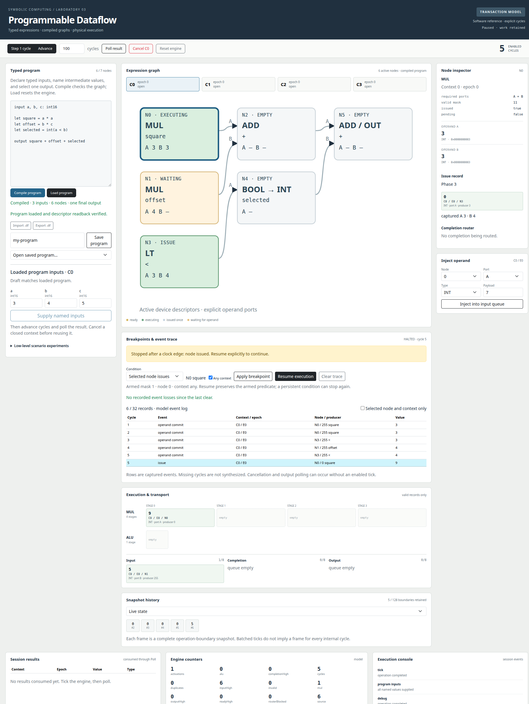
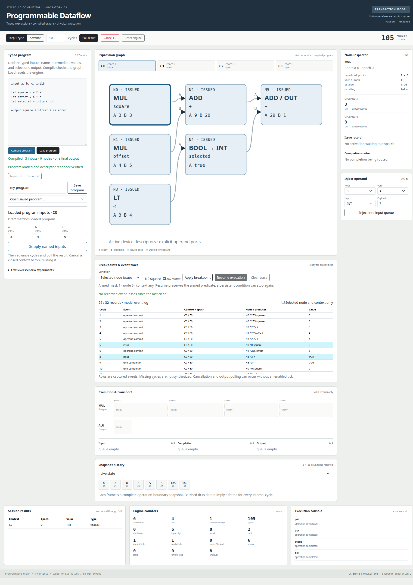
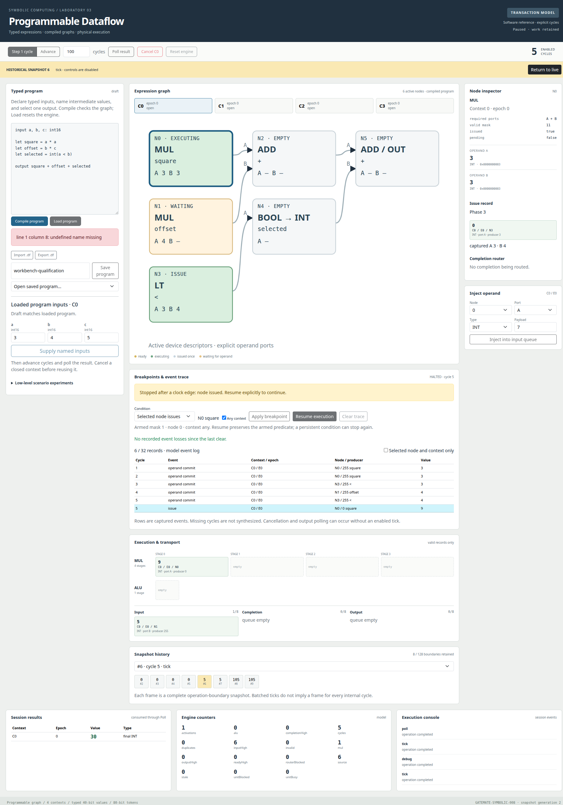

# Implemented programmable workbench API and qualification reference

## The implemented computation contract

The workbench compiles a typed source program into one acyclic graph with one through seven nodes. Four contexts share this graph and the physical arithmetic units. Each node activates once per context epoch. Cancellation and reset retain their existing meanings; this version does not implement streaming iterations, graph cycles, or reverse execution.

The implementation is split between `pkg/dataflow` (compiler, graph validation, reference engines, serial protocol), `elastic_dataflow/rtl` (physical descriptors, execution and debug), `internal/dataflowide` (ownership, HTTP and persistence), and `web/src/dataflow` (source editor, active graph and inspectors). The original intern guide explains the underlying engine. This reference records the final API rather than the preliminary names in that guide.

## Compiler and named input APIs

```go
func Compile(source string) (Program, error)
func (g Graph) Validate() error
func (p Program) Tokens(context, epoch byte, values map[string]int64) ([]Token, error)
func (p *Program) Clone() *Program
```

`Program` contains source, graph, named input bindings, constants, and node source metadata. All returned tokens are constructed only after the complete input map has passed validation. A caller supplies exactly the used named inputs. Unused declarations do not produce external bindings.

```text
input a, b, c: int16
let square = a * a
let offset = b * c
let selected = int(a < b)
output square + offset + selected
```

For a=3, b=4, c=5, the products are 9 and 20, their sum is 29, the comparison is true, and the final result is 30. The compiler emits six active nodes. The same six-node topology resembles the original graph but the input bindings differ: a is used by both multiplier ports and one comparator port.

Statements use newlines or semicolons. The lexer accepts comments; integer literals are decimal. Unary minus applies to a literal. Parentheses, multiplication, addition, subtraction, comparison, `int(bool)`, Boolean constants, and direct input/literal outputs are supported. Types are `int16`, `int32`, and `bool`. Multiplication requires operands with statically known int16 range. General integer arithmetic returns int32 and remains checked at runtime.

Named intermediate references reuse a producer. Two internal consumers fit directly in a descriptor. More consumers insert COPY nodes before final topological ordering. The seven-node limit applies after this lowering. A direct input output creates a final COPY. Undefined names, duplicate names, malformed syntax, inconsistent types, excessive nesting, excessive source size/token count, and excessive lowered node count are reported as errors.

## Graph structure and activation

`Graph` has `count` and a seven-element `descriptors` array. The JSON descriptor fields retain the Go names: `Op`, `Required`, `Destinations`, `Count`, and `Final`. Destination entries have `Node` and `Port`. The opcode numbers are MUL=0, ADD=1, LT=2, BOOL_TO_INT=3, COPY=4, SUB=5.

Loaded graphs use forward-only destinations, exactly one final node, no duplicate destination writers, and no dangling nonfinal nodes. Active descriptors have required mask one for COPY/conversion or three for binary operations. Inactive descriptors and unused destinations must be zero in the host image. Runtime tokens still receive type and duplicate checks.

Graph loading requires a pristine reset state before any accepted input, enabled tick, or cancellation. The physical core retains a dedicated pristine flag, so counter wrap cannot reopen the loading window. The Go transaction model checks its corresponding execution state. Reset restores the original seven-node laboratory graph. That built-in graph has non-topological COPY node IDs; it is initialized directly, not accepted as an arbitrary loaded image.

The physical image is staged first. `W` writes one shadow descriptor and marks its bitmap entry. `G` checks that all active rows were staged and validates the graph before activation. The validity result is registered; G waits three system clocks after selecting its count before deciding, so activation cannot use a stale result. Descriptor writes and commits invalidate the cached result. Rejection leaves the active graph intact. Successful activation clears the staging bitmap and zeros inactive descriptors. All exchanges remain stop-and-wait under one serial owner.

## UART version two

The ten-byte capability page begins with version 2. The other capability fields retain four contexts, seven node slots, physical queue depths, multiplier latency, and epoch width. There is no version-one adapter. Existing R/I/T/C/Q/P command meanings and XOR framing remain unchanged.

Every payload is encoded as two uppercase hexadecimal characters per binary byte, followed by a one-byte XOR checksum and LF. The XOR includes all binary payload bytes and the checksum, but excludes the command letter.

| Command | Binary payload | Meaning |
|---|---|---|
| W | Four bytes: index, flags, destination zero, destination one | Stage one descriptor while pristine |
| G | One byte: active count 1..7 | Validate and activate staged graph |
| B | Three bytes: debug flags, node selector, context selector | Configure breakpoints, optionally resume/clear |

For W, flags bits 6..4 are opcode, bit 3 is final, bits 1..0 are destination count; bits 7 and 2 must be zero. A destination is `(node << 1) | port`, with zero for unused entries. Required ports derive from the opcode on hardware and are independently checked in the host graph.

The two-node program `let p=a*a; output p+p` has these exact requests:

```text
W0002020303
W0118000019
G0202
```

Node zero is MUL with destinations node 1 A and B. Node one is final ADD. Every line above has an implied terminating LF. Success returns `A` plus LF. Bad graph/control arguments return `!02` plus LF. Other existing syntax, checksum, capacity and cancellation errors retain their codes.

B flags bits 0..2 enable issue, completion-full and stale predicates respectively. Bit 6 clears the trace and loss count. Bit 7 resumes by clearing the halt latch and stop reason. Bits 3..5 must be zero. Node is 0..6 or 255 for any; context is 0..3 or 255 for any. Selectors apply to issue breakpoints. Full-queue and stale predicates are engine-wide.

```text
BC100FF3E    # issue node 0 in any context; clear and resume
B80FFFF80    # disarm, any selectors, resume
```

The final byte in each example is the XOR checksum. B always supplies the new mask/selectors, even when used to clear or resume. The UI reads the currently armed configuration when preserving it during Resume or Clear Trace.

A long T request acknowledges early after a breakpoint halt. The caller reads actual enabled cycles and stop reason from debug pages. Reissuing T while halted acknowledges without additional computational cycles. Resume itself does not run the engine; a later T does.

## Descriptor and debug pages

All Q responses still contain ten binary data bytes. Byte indices below are from most significant byte zero to least significant byte nine.

| Page | Layout |
|---|---|
| 148..154 | Bytes 0..5 zero; byte 6 descriptor index; bytes 7..9 descriptor flags and destinations |
| 155 | Byte 0 active count; byte 1 staging bitmap; byte 2 pristine flag; bytes 3..9 zero |
| 156 | Byte 0 trace count; bytes 1..4 dropped count; byte 5 halted; byte 6 stop reason; byte 7 armed mask; byte 8 node selector; byte 9 context selector |
| 157 | Bytes 0..3 stop-cycle count; bytes 4..9 zero |
| 160+2*i | Ten-byte token for trace entry i, 0<=i<32 |
| 161+2*i | Bytes 0..4 zero; bytes 5..8 event cycle; byte 9 event kind |

The original operand, queue, issue, router, and counter pages are unchanged. A physical snapshot reads the new graph and debug pages under the same serial lock as those existing pages. Trace pages outside `trace count` are invalid. Clearing the trace does not zero RAM; the validity count defines its contents.

The trace token and metadata are stored in separate synchronous RAMs. Q's three-clock read delay allows their selected address to settle. A token and its metadata form one logical observation. The serial decoder requires every page needed by the reported count before publishing a snapshot.

## Trace and stopping semantics

The physical recorder retains the first 32 records after reset or Clear Trace. On a cycle with several candidate events, it stores one according to this priority, highest first: cancellation, output acceptance, stale discard, issue, unit completion, route delivery, operand commit. Every unrecorded candidate increments the dropped count, including additional stale records discarded on the same edge. Once full, all subsequent candidates increment dropped while the captured prefix remains unchanged.

| Kind | Meaning |
|---|---|
| 1 | Operand commit |
| 2 | Arithmetic issue, with evaluated typed value |
| 3 | Unit completion admitted to completion FIFO |
| 4 | Routed destination commit |
| 5 | Output accepted through poll |
| 6 | Context cancellation, with new epoch |
| 7 | Stale record discarded |

These are observation points, not a claim that every possible engine transition has its own event. Fault values appear through ordinary completion/output paths. Cancellation does not have an arithmetic payload. An event at a cycle number denotes its associated enabled-cycle count; cancellation and polling can occur without advancing that count.

Issue stopping occurs after the edge that admits the selected operation. Other operations on that same edge are allowed to complete. Completion-full samples the pre-edge occupancy; the post-edge snapshot may include simultaneous movement. Stale stopping records the edge that discards obsolete work. These rules explain why a stopping snapshot can include more changes than a single highlighted trace row.

The Go reference captures all its emitted model events until the same 32-entry capacity is reached. It does not emulate the physical recorder's one-record write bandwidth. It can therefore have different event counts and loss counts at a comparable semantic point. Both sources explicitly identify provenance. Result/activation equivalence does not imply cycle-identical event lists.

## Engine and HTTP boundaries

`Engine.Execute(ctx, Operation)` now accepts `load` with `graph` and `debug` with `debug`, in addition to reset/inject/tick/cancel/poll. `Snapshot` contains `graph` and `debug` alongside the original state. `Frame` contains `program` metadata or null; cloned frames detach program bindings and trace events.

| HTTP route | Request / result |
|---|---|
| POST /api/dataflow/program/compile | `{source}` -> `{program, diagnostics}`; no mutation |
| POST /api/dataflow/program/load | `{source, expectedId}` -> session state; explicit reset, load, readback verification |
| POST /api/dataflow/program/inputs | `{values, context, expectedId}` -> session state after named inputs |
| GET /api/dataflow/programs | Saved `.df` IDs |
| GET /api/dataflow/programs/{id} | `{source}` |
| PUT /api/dataflow/programs/{id} | `{source}` -> `{saved:true}` after successful compilation and atomic save |
| POST /api/dataflow/control | Existing operation route, including debug controls |

Source compilation errors do not mutate the engine. A successful program load starts a new history generation. The source map is attached only after readback equals the compiled graph. Editing the browser draft does not change that loaded source map. A low-level reset or graph operation invalidates its association.

Named input validation occurs before the first injection. Under input backpressure, the service advances one cycle and retries a definitely rejected token, bounded to 128 attempts per token. It refuses grouped input while already halted or while the context is closed. A halt that occurs during credit acquisition can still leave a partially supplied input set; the service captures that actual state and reports the error rather than silently restarting the expression.

The application continues to use one session mutex and expected-frame guards. Historical controls are disabled in React and rejected as stale by the server. Uncertain serial outcomes require explicit reset. The HTTP service remains a loopback application with same-origin mutation checks; no multi-user remote device sharing is provided.

## Persistence and reproduction

Typed programs are UTF-8 `.df` source files inside the same confined project root used for scenarios. Scenario files have `.json` suffixes and are listed separately. Both use constrained IDs, `os.Root`, temporary writes, Sync, Close and atomic rename. Import/export copies source; recompilation derives descriptors and source maps again. Named input values are session/form data and are not persisted in `.df` source files.

```sh
GOCACHE=/tmp/gatemate008-go-cache make dataflow-frontend
tmux new-session -d -s workbench-model \
  'go run -tags embed ./cmd/dataflow-ide --engine model --listen 127.0.0.1:8088'
```

Physical startup requires the new version-two bitstream, exclusive ownership of `/dev/ttyACM0`, and `--engine serial --device /dev/ttyACM0`. Stop a server with `lsof-who -p PORT -k` before replacing it. Server startup resets its selected engine.

## Qualification records

P2/P3/P4 logs contain compiler/model, programmable RTL, UART, breakpoint and trace tests. P5 contains Go ownership tests, fifteen frontend tests, and a model browser run producing result 30. The full P6 repository check summary covers race tests, ordinary/embedded builds, vet, Glazed lint, vulnerability scan and frontend checks. Physical timing and board results are recorded below after qualification; a simulation pass alone is not a board qualification.

### Model screenshots



The model stopped at enabled cycle 5 with issue value 9. The captured frame contains the actual model's issue and unit states, which need not match the FPGA's stage timing.



The resumed program returned 30. The event table reports any loss after its finite storage fills.



The earlier stopped frame retains its associated program while mutation controls are disabled.
