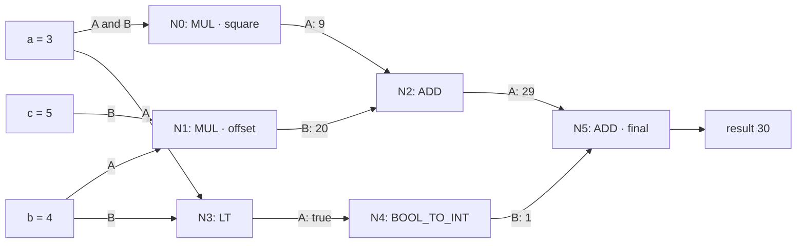
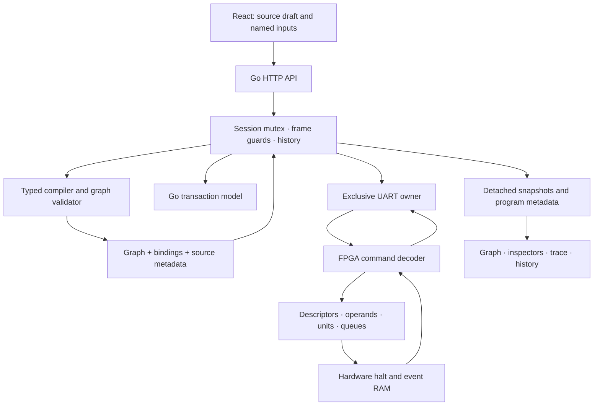

# A Programmable Dataflow Workbench: Typed Graph Compilation and Physical FPGA Debugging

The programmable dataflow workbench compiles typed expressions into small dependency graphs, loads those graphs into a running FPGA, and exposes their execution through a Go service and React interface. A program specifies which values each operation requires and where its result must go. The engine determines when operations can execute from operand availability and available storage. The same physical arithmetic units evaluate different loaded graphs without rebuilding the FPGA bitstream.

The complete system includes a compiler, a graph validation and activation protocol, four execution contexts, bounded intermediate storage, hardware breakpoints, an event recorder, and a browser that associates physical observations with source expressions. These parts share several precise contracts: a node activates once in a context epoch; a graph cannot change after execution begins; a halted engine does not advance its computational state; and a trace explicitly reports observations it could not retain.

This report explains those contracts from the source language through the physical machine. It describes revision `85969b499306dfcc3f0e947264b647ec61cc0554` of `/home/manuel/code/wesen/2026-09-04--gatemate-symbolic`, with measured evidence from ticket GATEMATE-SYMBOLIC-008. The preceding article, [[ARTICLE - GateMate Symbolic - Inside an Elastic Dataflow Engine]], develops the original fixed-expression engine. This article is self-contained but concentrates on what programmability and physical debugging add to that foundation.

> [!summary]
> - Compilation produces descriptors, named input bindings, constants, and source metadata. Hardware executes descriptors; the browser uses the associated metadata to explain them.
> - Bounded fanout, single activation per epoch, and immutable active graphs keep execution state finite and inspectable.
> - Hardware breakpoints stop after a qualifying edge. The physical recorder stores at most one event per clock and counts omitted events.
> - The routed design passed the 10 MHz constraint at 12.01 MHz. Physical qualification checked 224 randomized expression results and directed debugger behavior.

## 1. What the machine executes

A dataflow graph is a set of operations connected by directed edges. Each edge names a destination node and one of its operand ports. A binary operation needs ports A and B; a unary operation needs only A. A node becomes eligible after its required operands have arrived. Eligibility alone does not imply immediate execution: operand memory access, an issue record, arithmetic-unit capacity, and downstream storage also constrain progress.

The workbench supports one through seven active nodes. Four contexts share the same graph and execution units, while maintaining separate operands and execution flags. A context identifies one expression instance. Its epoch identifies the current use of that context, allowing obsolete records to be discarded after cancellation. A node can activate only once during a particular context epoch. These restrictions define a finite expression evaluator; the implementation does not provide graph cycles, repeated stream firings, loops, or general memory operations.

The running example is:

```text
input a, b, c: int16

let square = a * a
let offset = b * c
let selected = int(a < b)

output square + offset + selected
```

For `a=3`, `b=4`, and `c=5`, the required arithmetic is `9 + 20 + 1 = 30`. The comparison branch can become eligible independently of the multiplication branch. Its value eventually participates in the final addition, but the source does not require it to execute before either multiplication. The dependency graph specifies that requirement only at the final consumer.



Node numbers reflect a valid topological ordering, not a schedule. For example, N3 can be ready while N2 still lacks both products. Source names such as `square` are annotations maintained by the compiler and host; the hardware descriptor contains an opcode and destinations, not a string.

## 2. The system boundaries

The browser edits source and submits commands to one Go session. The session compiles source, controls an engine, stores observed frames, and mediates access to program files. The engine can be the Go transaction model or the physical FPGA reached through a serial connection. Both expose the same broad operation and snapshot interface, but the UI labels their provenance because their cycle schedules and trace bandwidth differ.



This separation creates distinct correctness questions. The compiler must produce a legal graph for the source expression. The runtime must preserve that graph's computations under overlapping execution and finite storage. The transport must associate requests with definite outcomes. The debugger must identify what it observed without substituting an inferred execution for missing evidence. A correct arithmetic result does not by itself prove all four properties.

The principal implementation directories are `pkg/dataflow`, `elastic_dataflow/rtl`, `internal/dataflowide`, and `web/src/dataflow`. They contain, respectively, the language and host engine contract; physical execution and UART logic; session and HTTP ownership; and the user interface. The source-reference section at the end provides direct links to the relevant files at the analyzed revision.

## 3. Static types and runtime values

The source language has three types: `int16`, `int32`, and `bool`. These types establish which operations are legal before the engine is modified. Multiplication requires both operands to have statically known `int16` range because the implemented multiplier accepts signed 16-bit operands and produces a signed 32-bit result. Addition and subtraction produce `int32`; comparison produces `bool`; `int(bool)` produces an integer zero or one.

The type system is deliberately conservative. Even when particular input values would make `(a+b)*c` numerically safe, `a+b` has type `int32`, so that multiplication is rejected. The compiler does not perform a general interval analysis or insert a narrowing conversion. A decimal literal within the signed 16-bit range receives the narrower type; larger legal literals use `int32`. Unary minus applies to an integer literal, rather than providing a general unary-negation expression.

| Source operation | Required types | Result type | Relevant runtime rule |
|---|---|---|---|
| `x * y` | Both `int16` | `int32` | Operand ranges are checked again |
| `x + y`, `x - y` | Integer types | `int32` | Signed 32-bit overflow produces a fault |
| `x < y` | Integer types | `bool` | Signed comparison |
| `int(x)` | `bool` | `int32` | Boolean payload becomes zero or one |
| COPY | One canonical value | Preserved | Used for fanout and direct outputs |

Runtime values occupy a 40-bit representation. The high nibble at bits 39 through 36 is a tag, bits 35 through 32 are reserved, and the low 32 bits carry the payload. An integer uses tag zero. A Boolean uses tag one and payload zero or one. Thus Boolean true has raw representation `0x1000000001`, or decimal `68719476737`; that raw number is not its mathematical integer value. The trace decoder must retain the tag to render it correctly.

Input canonicality requires zero reserved bits and a supported tag with a legal payload. Faults use a separate error representation and terminal fault handling. Arithmetic faults are therefore visible machine outcomes rather than host-language exceptions. The low-level injection API still needs runtime validation even when the normal compiler path is typed, because callers can construct tokens independently of the compiler.

## 4. Parsing and constructing a shared expression graph

Compilation begins with a lexer and a precedence parser. Multiplication binds more tightly than addition and subtraction; comparison has lower precedence. Newlines and semicolons separate statements. Input declarations introduce names, `let` binds an expression, and `output` selects the result. Undefined names, duplicate declarations, reserved identifiers, and inconsistent types produce diagnostics before any graph is loaded.

The parser represents expressions as objects with an operation, argument references, a type, and source metadata. A named reference points to the existing expression object. This matters for `let p=a*a; output p+p`: there is one multiplication producer with two uses, rather than two independent multiplications. Repeating the syntax `a*a` separately is not a promise of general common-subexpression elimination; sharing follows explicit object identity established by named bindings.

Only expressions reachable from the output are lowered into active nodes. An unused input declaration does not become a named input requirement. This is reflected in `Program.Tokens`: the caller supplies exactly the used input bindings, rather than every declaration that happened to occur in the source text.

```text
compile(source):
    parse declarations and expressions with type checks
    root = selected output expression
    if root is an external input or literal:
        root = COPY(root), marked as final
    collect reachable internal expressions and their uses
    lower internal fanout to at most two destinations
    order internal expressions after their dependencies
    reject if the lowered graph exceeds seven nodes
    assign node IDs and emit descriptors
    emit external input and constant bindings
    attach source name, line, and type to each node
    validate the completed graph
```

The compiler also imposes explicit complexity limits: 128 KiB of source, a 4096-token limit, and an expression-nesting limit of 128. These bounds make malformed or unnecessarily large inputs terminate predictably. They are separate from the seven-node hardware capacity: a syntactically small expression can still exceed capacity after fanout lowering.

## 5. Fanout consumes hardware resources

A descriptor can name at most two result destinations. Each destination includes a port, so the two operands of one addition are two distinct uses. In `output p+p`, the producer routes its result to both A and B of the final addition. Computing `p` once does not remove either operand delivery obligation.

When an internal producer has more than two consumers, the compiler inserts COPY nodes. It repeatedly groups two uses behind a new COPY until the original producer has at most two direct uses. The resulting distribution can be a chain of COPY operations; the implementation does not promise a balanced distribution tree or minimum latency.

```text
for each internal producer:
    consumers = uses of producer
    while count(consumers) > 2:
        pair = last two consumers
        copy = COPY(producer)
        redirect both consumers in pair to copy
        replace pair in consumers with the copy's input use
```

Consider `let p=a*a; output p+p+p+p`. Left associativity introduces three additions. The multiplication's four uses require two extra COPY nodes under this lowering. The total is one multiplier, three additions, and two copies: six nodes. With `a=7`, the result is `4*49=196`. This program was included among the physical qualification graphs, so the COPY path is exercised by actual compiled execution.

External values follow a different delivery path. If `a` feeds three operand ports, the host can construct three source tokens directly from the named input. It does not need an internal COPY to duplicate a value that has not yet entered the graph. In the running example, `a` maps to N0.A, N0.B, and N3.A; `b` maps to N1.A and N3.B; `c` maps to N1.B. These bindings explain why three named values produce six input tokens.

The capacity check follows fanout lowering so it accounts for every operation the hardware will execute. Counting only arithmetic source operators would accept programs whose actual descriptors cannot fit.

## 6. Descriptors and graph invariants

The host `Graph` contains an active count and a fixed array of seven descriptors. A descriptor contains an opcode, required-port mask, two possible destinations, a destination count, and a final flag. The required mask is one for unary operations and three for binary operations. The physical wire representation derives that mask from the opcode, while host validation checks the explicit field as well.

| Node | Operation | Required mask | Destinations | Final |
|---|---|---|---|---|
| 0 | MUL | `11` | N2.A | No |
| 1 | MUL | `11` | N2.B | No |
| 2 | ADD | `11` | N5.A | No |
| 3 | LT | `11` | N4.A | No |
| 4 | BOOL_TO_INT | `01` | N5.B | No |
| 5 | ADD | `11` | None | Yes |

Loaded edges must point to a higher node ID within the active graph. This establishes acyclicity without running an arbitrary cycle-detection procedure in hardware. Every nonfinal node must have at least one consumer, and exactly one final node must exist with no destinations. In a finite graph with forward edges, repeatedly following a consumer eventually reaches a sink. Since the only allowed sink is the final node, every active node has a path to the output.

Validation also rejects two internal edges targeting the same operand port, invalid opcodes, unary B-port destinations, and nonzero unused destination fields. Inactive host descriptors must be zero. These rules prevent ambiguous ownership of an internal operand and make the graph image canonical. They do not require every operand to have an internal producer, because source inputs and constants supply the remaining ports.

The original reset graph remains a special built-in image. Its COPY node has a high ID and destinations with lower IDs. Reset initializes that known image directly; arbitrary loaded images must satisfy the forward-edge rule. A consumer must therefore distinguish the reset image from a compiler-generated topological graph when interpreting node numbering.

## 7. Activating a graph without mixing computations

The active graph is immutable after execution begins. The FPGA maintains a pristine flag that clears on an enabled execution request, an accepted input, or cancellation. Graph writes and activation are available only while that flag remains set. Reset restores the loading window and the built-in graph. A quiescent engine later in its lifetime is not equivalent to a fresh engine.

This distinction prevents a counter rollover or a temporarily empty queue from reopening graph modification. Existing operand flags, context epochs, or delayed records could otherwise be interpreted under a new operation or destination table. The dedicated state flag expresses the actual lifetime rule independently of diagnostic counters.

Loading uses a staged descriptor array and a bitmap of written rows. A write changes shadow state, not active execution state. A commit selects the active count, validates the complete staged image, and copies valid rows into the active array. Rejection preserves the active image. Success clears the staging bitmap and zeros inactive active rows.

```mermaid
sequenceDiagram
    participant S as Go session
    participant U as UART decoder
    participant G as Graph state
    S->>U: Reset
    U->>G: Restore pristine state
    loop Each active descriptor
        S->>U: W(index, descriptor)
        U->>G: Write staged row; invalidate cached validity
        U-->>S: ACK
    end
    S->>U: G(active count)
    U->>G: Select size and wait for validation
    G-->>U: Valid result for this size
    U->>G: Activate staged image
    U-->>S: ACK
    S->>U: Read descriptor pages
    U-->>S: Active graph
    S->>S: Compare graph, then attach source metadata
```

Graph validation has a real timing cost. The implementation forms independent node and edge predicates, compares active destination pairs for duplicate writers, and reduces the results. It registers validity together with the selected graph size. Writes and commits invalidate that cached result, and the UART commit path waits three clocks after selecting a size before examining acceptance. The additional clock boundary is part of the protocol's correctness, because a validity bit without identity could refer to a previous staged configuration.

The final routed design reports 12.01 MHz against the unchanged 10 MHz requirement. The initial validator implementation reported 9.31 MHz, and a first restructuring reached 9.88 MHz. Registering the independent checks supplied the successful implementation. These measurements illustrate the physical consequence of combinational validation structure; they do not imply a change to the graph's logical acceptance rules.

## 8. Operand ownership and execution under backpressure

Each context-node pair owns two operand locations and validity, issued, and pending state. An arriving source or routed token identifies the context, epoch, node, and port. Once the engine establishes that the record belongs to the current epoch and is otherwise legal, it can commit the value into the selected operand location. A second write to an already valid operand is a duplicate, even if the repeated value is numerically identical.

Readiness follows a mask comparison:

```text
commit_operand(context, node, port, value):
    reject a duplicate valid port
    operand[context, node, port] = value
    valid[context, node] |= bit(port)
    if (valid & required) == required and not issued:
        issued = true
        pending = true
```

The pending state retains the obligation to dispatch an eligible operation when the issue machinery can accept it. Eligibility must survive multiple cycles of resource contention; a transient pulse would lose work. The issued state prevents later arrivals or scans from creating a second activation within the same epoch. The physical issue path also accounts for synchronous operand-memory reads before admitting the evaluated record to an arithmetic unit.

The multiplier has configurable latency, set to four stages on the qualified board. The ALU handles addition, subtraction, comparison, conversion, and copying. Completions enter bounded storage and are then routed to descriptor destinations. A two-destination result retains per-destination delivery state so that delivery to A can complete even if B is temporarily unavailable. The router must not send A again when B later becomes available.

```text
while a routed completion is retained:
    for each destination not yet delivered:
        if destination commit can occur:
            commit the operand
            mark this destination delivered
    release the completion only when all destinations are delivered
```

The input, completion, and output queues each have depth eight in the physical configuration. Finite capacity means a producer sometimes retains a valid record until the consumer can accept it. The engine's correctness depends on preserving values and their identities through that waiting period. Extra queue depth changes how much overlap is possible; it does not remove the need for retained validity and exactly-once delivery.

The workbench exposes these retained states directly: operand validity, pending and issued flags, arithmetic stages, completion queues, and router state. A source graph alone cannot explain why a ready operation has not advanced. The inspectors provide the storage and ownership information needed to interpret that delay.

## 9. Context epochs, cancellation, and output ownership

Four contexts allow independent evaluations to share one graph. Their operand slots are separate, while their records can coexist in shared queues and arithmetic stages. Context alone is insufficient to identify a current evaluation because the same context can be reused. Every record therefore also carries an epoch.

Cancellation increments the selected context's epoch and invalidates its operand and activation state. Records with an older epoch become stale and are discarded as the engine encounters them. This avoids requiring immediate physical removal from every storage element. It also makes stale-discard events meaningful debugger observations: they identify where obsolete work was recognized.

Cancellation has explicit limits. An already offered output must remain stable until it is accepted, so cancellation that would invalidate that output is rejected. Epoch wrap requires the corresponding safety conditions rather than treating an eight-bit counter as globally unique forever. Physical qualification included a held-output check and 256 drained cancellations that returned the epoch to zero.

After an expression finishes, its context is closed. Supplying another grouped input set requires canceling that context first. A graph load instead performs an explicit reset and begins a new session generation. These are different operations: cancellation reuses a context under the same graph, while a program load establishes a new graph and observation history.

## 10. Hardware breakpoint semantics

The debugger supports three predicates: a selected node issues, the completion queue is full, or stale work is discarded. Node and context selectors apply to the issue predicate. The other two predicates describe engine-wide conditions. A selector value of 255 means any node or context where that selector is applicable.

A breakpoint latches the halted flag after a qualifying clock edge. The selected operation can therefore already occupy an arithmetic stage in the stopped snapshot. Other legal transitions on the same edge are also permitted. A completion-full predicate samples pre-edge occupancy, so the resulting snapshot can show simultaneous movement rather than a queue whose visible count alone explains the trigger.

The computational enable is gated by the halt latch:

```text
compute_enable = requested_enable and not cancel_fire and not halted
```

The physical system clock and UART decoder continue to operate while computational progress is disabled. This permits inspection and debugger control. Input acceptance, output polling, or explicit cancellation remain distinct protocol actions; the halt guarantee concerns additional computational ticks, not total electrical inactivity of the FPGA.

The UART tick command stops its requested batch when it observes the halt. Since the core already gates computational enable, the command decoder's response does not cause an extra computational cycle. Repeating a tick request while halted leaves the enabled-cycle count unchanged. Resume clears the latch and stop reason but does not itself request execution; another tick command is needed.


In this captured frame, N0 has issued `3*3`, the first multiplier stage contains 9, and the enabled-cycle count is 6. The graph labels and source text belong to the program whose descriptors were read back from the device. The frame is therefore a physical observation tied to a verified program association.

## 11. A trace with explicit observation limits

The physical trace memory holds 32 records. Each consists of an 80-bit token and 40 bits of metadata containing the cycle and event kind. Separate synchronous RAMs store those portions. Reading a record requires the selected address to settle, so the UART snapshot path includes the necessary delay before returning data.

The recorder can store one event on a clock. Several relevant transitions can occur on the same clock, so it selects one using a fixed priority. From highest to lowest, the order is cancellation, output acceptance, stale discard, arithmetic issue, unit completion, routed delivery, and operand commit. Every candidate that cannot be recorded increments a dropped count. When memory fills, the recorder preserves its existing prefix and counts subsequent candidates as losses.

```text
candidates = events at this observation boundary
if candidates are nonempty:
    if trace_count < 32:
        record highest-priority candidate
        trace_count += 1
        dropped += count(candidates) - 1
    else:
        dropped += count(candidates)
```

This means a trace can be incomplete before it is full. Six records with one dropped event indicate a simultaneous-event loss, not exhausted 32-entry capacity. Clearing the trace resets its validity count and loss count; it does not need to overwrite every RAM cell. Consumers must treat entries beyond the reported count as invalid.

| Kind | Observation |
|---|---|
| 1 | Operand committed |
| 2 | Operation issued, including evaluated typed value |
| 3 | Unit completion admitted to completion storage |
| 4 | Value delivered to a destination operand |
| 5 | Output accepted through polling |
| 6 | Context canceled, with its new epoch |
| 7 | Stale record discarded |

The recorded cycle is the enabled computation counter. Polling or cancellation can occur without increasing it. Two observations with the same cycle number need not represent a single globally ordered set of internal transitions, and missing cycle numbers do not identify which events were absent. The UI therefore presents recorded rows and a loss count without inventing intermediate rows.

## 12. Reading the actual execution

The physical browser test compiled the six-node program, loaded it, verified descriptor equality, supplied the named inputs, and requested 100 ticks with an issue breakpoint on N0. The engine stopped at cycle 6. Another request for 100 ticks left the counter at 6. After explicit resume, a further 100-tick request advanced to observation cycle 106, and polling returned 30.

The archived frame contains the following selected records. Values in this table are decoded according to their runtime tags; the Boolean value is shown as `true` rather than its raw 40-bit integer representation.

| Enabled cycle | Event | Node | Decoded value |
|---|---|---|---|
| 1 | Operand commit | N0 | 3 |
| 2 | Operand commit | N0 | 3 |
| 6 | Issue | N0, square | 9 |
| 10 | Issue | N1, offset | 20 |
| 12 | Route | N2 | 9 |
| 14 | Issue | N3, comparison | true |
| 16 | Route | N2 | 20 |
| 20 | Issue | N2, addition | 29 |
| 24 | Issue | N4, conversion | 1 |
| 31 | Issue | N5, final addition | 30 |
| 32 | Completion | N5 | 30 |
| 106 | Output accepted | N5 | 30 |

The final arithmetic completion is visible at cycle 32. Acceptance is visible at 106 because the test deliberately requested a large tick batch before polling. Reporting 106 as the arithmetic latency would conflate the observation schedule with execution latency. The records establish the completion event and later acceptance; they do not provide an independently recorded event for every intervening transition into or within output storage.


The complete captured trace contains 21 records and eight dropped events. The arithmetic results and selected dependency deliveries are directly observed, but the trace cannot prove the absence of every unrecorded transition. This distinction is part of the debugger contract, not a defect to conceal in the article or interface.

The comparable model run stopped at cycle 5. The Go model captures its emitted events up to the same capacity, but does not emulate the physical recorder's one-write-per-clock bandwidth. It is useful for semantic and transaction reasoning while remaining a separate execution source. Equality of results and checked activations does not imply identical scheduling, trace length, or loss counts.


The model also returns 30. Its event list belongs to its own execution and is retained as separate evidence, rather than used to fill gaps in the physical trace.

## 13. The UART and host API contracts

Protocol version two adds staged descriptor writes, graph commit, and debugger control. Requests encode binary payload bytes as uppercase hexadecimal, append a one-byte XOR checksum, and terminate with LF. The command letter is excluded from the XOR. Descriptor flags encode opcode in bits 6 through 4, finality in bit 3, and destination count in bits 1 through 0. Reserved bits must be zero. A destination byte is `(node << 1) | port`.

For `input a: int16; let p=a*a; output p+p`, node zero is a multiplication with destinations N1.A and N1.B, and node one is a final addition. The exact staged requests are:

```text
W0002020303
W0118000019
G0202
```

The last byte of each line is its checksum. Successful requests return `A` followed by LF. Invalid graph or debugger arguments return `!02` followed by LF. The host maintains exclusive ownership across the entire staged load sequence so another operation cannot interrupt descriptor construction.

Debugger command `B` carries flags, node, and context. Flag bits zero through two select predicates; bit six clears trace state; bit seven resumes. Because the command always supplies a new mask and selectors, the UI preserves the current configuration explicitly when the user chooses Resume or Clear Trace. Those actions cannot be implemented by sending only their individual flag and assuming the old mask remains unchanged.

Snapshot pages expose active descriptors at 148 through 154, graph metadata at 155, debugger state at 156, stop cycle at 157, and paired event pages at 160 through 223. Each page contains ten data bytes. A decoder publishes a snapshot only after acquiring the pages required by the reported valid trace count. The version-two capability check prevents a new decoder from interpreting an older device as though these pages existed.

At the Go boundary, the essential entry points are:

```go
func Compile(source string) (Program, error)
func (g Graph) Validate() error
func (p Program) Tokens(context, epoch byte, values map[string]int64) ([]Token, error)
func (p *Program) Clone() *Program
```

`Program` includes source, graph, input bindings, constants, and node information. It is more than a descriptor array because the host needs to translate human input names into ports and physical node IDs back into source names. Cloning detaches nested slices so historical frames retain their own metadata.

## 14. Session ownership and truthful source association

The Go session serializes device operations under one mutex and guards mutations with an expected frame ID. A browser action based on an obsolete frame can therefore be rejected even if frontend controls were bypassed. The browser's disabled history controls improve usability; the server guard supplies the corresponding ownership rule.

Program loading compiles before resetting the engine. A syntax error must not destroy a currently loaded program. Once compilation succeeds and the frame guard passes, loading explicitly resets, writes the graph, captures active descriptors, and compares them with the compiled image. Source metadata is attached only after that equality check. A mismatch marks the session as requiring reset.

```text
load_program(source, expected_frame):
    compiled = compile(source)
    lock session
    verify expected_frame
    reset engine and begin a new generation
    load compiled.graph
    snapshot = read engine
    if snapshot.graph != compiled.graph:
        require reset
        fail
    attach detached compiled metadata to current frame
```

Named inputs are validated as a complete map before the first injection. Every value must satisfy its declared type, and the set of names must match the used bindings. This prevents a missing final parameter from being discovered only after earlier parameters have already entered the engine. It does not make a multi-token serial transfer physically atomic.

If the input queue is definitely full, the service advances one cycle and retries the rejected token, with a bound of 128 attempts per token. It retries a known rejection rather than a transport outcome whose acceptance is uncertain. A debugger halt during this process can leave part of the grouped input set accepted. The service captures that actual state and reports the failure. It cannot accurately claim that either all tokens or none were supplied.

| HTTP endpoint | Purpose |
|---|---|
| `POST /api/dataflow/program/compile` | Return compiled program or diagnostics without mutation |
| `POST /api/dataflow/program/load` | Compile, reset, activate, and verify readback |
| `POST /api/dataflow/program/inputs` | Supply named values for a selected context |
| `POST /api/dataflow/control` | Execute low-level operations, including debugger control |
| `GET /api/dataflow/programs` | List saved program IDs |
| `GET /api/dataflow/programs/{id}` | Read source |
| `PUT /api/dataflow/programs/{id}` | Compile and atomically save source |

Compile diagnostics use a successful HTTP response containing a null program and diagnostic strings; mutation errors use their applicable error status. The service is a loopback application with same-origin mutation checks. It does not implement concurrent authenticated users sharing a remotely accessible FPGA.

## 15. The browser as a view of versioned observations

The React application maintains a source draft separately from the loaded program. Editing the draft does not change the source map associated with the FPGA. Compilation produces a preview, and loading requires a current successful compilation. Named input controls derive from the loaded program, so changing a draft cannot silently redirect values into a different graph.

The graph view uses active descriptors for topology and associated node metadata for names, lines, and types. Its state decorations come from the selected frame's actual operands and activation flags. The execution panel shows arithmetic stages and finite queues; the debugger shows predicates, stop state, recorded events, and losses. Redux and RTK Query organize application state and HTTP operations, while Bootstrap supplies the interface styling.

Snapshot history retains operation-boundary frames. A request for 100 ticks generally yields an observation after the operation, not 100 separately stored snapshots. Selecting an earlier frame restores the retained observation for display. It does not restore earlier device state or reexecute a recorded event list.


The historical frame includes its own program metadata. Without that ownership rule, loading another graph could relabel an old node using a new source expression. Deep copies and per-frame associations preserve the meaning of earlier observations even as the session continues.

Saved programs are UTF-8 `.df` files under a confined project root. Scenario `.json` files remain a separate namespace. File operations use constrained IDs, `os.Root`, and temporary-file synchronization followed by atomic rename. Import and export preserve source; descriptors and source maps are derived again by compilation. Named input values belong to the current form or session and are not implicitly persisted in the source file.


The mobile screenshot comes from the model UI validation at a 390-pixel viewport. It documents the layout, not an additional physical execution. The saved browser evidence reported no horizontal document overflow and no console warnings or errors during the checked workflows.

## 16. What the qualification establishes

Validation spans different abstraction levels because each catches different classes of error. Compiler tests check syntax, types, sharing, graph capacity, and input construction. Transaction tests check ownership and semantic behavior. Directed RTL tests check graph loading, malformed descriptors, fanout, UART control, breakpoints, and trace loss. Differential tests compare executions across queue depths and multiplier latencies. Physical tests then exercise the packed image and real serial protocol.

| Evidence | Recorded coverage |
|---|---|
| Repository checks | Go race tests, ordinary and embedded builds, vet, Glazed lint, vulnerability scan, TypeScript, and frontend tests |
| Frontend tests | Fifteen tests plus browser workflows |
| Directed RTL matrix | Queue depths 1, 2, and 8 with multiplier latencies 1, 2, 4, and 8 |
| Randomized differential regression | Twelve configurations; 600 schedules, 2400 expressions, 14,400 activations |
| Baseline physical suite | 32 four-context trials, totaling 128 randomized expression results |
| Programmable physical suite | 96 randomized results across three compiled graphs |
| Directed physical debugger checks | Descriptor equality, issue stop, held halt, resume, trace overflow and clearing |
| Physical browser | Six-node source loaded, stopped at cycle 6, resumed, and returned 30 |

The randomized differential run preceded the final registered-validator timing change. After that change, directed graph, UART, and debugger simulations passed, followed by the physical suites. The full randomized regression was not rerun after that last validation-only RTL change. Keeping that boundary explicit prevents the report from implying every test was executed against every intermediate source revision.

Both physical suites passed in a combined 27.637 seconds. The final route used 18,449 of 40,960 reported CPE logic tables, 4,153 of 40,960 flip-flops, and five of 64 RAM halves. Those correspond to approximately 45%, 10%, and 7% utilization. The timing result is a static post-routing maximum-frequency estimate, not a measured application throughput. The board still runs with the 10 MHz constraint and clock configuration.

The evidence supports the checked programs, graph rules, protocol behavior, and selected physical implementation. It is not an exhaustive proof over every source program or placement. In particular, increasing graph capacity would change validator cost, operand storage, scheduling scans, protocol representation, and trace pressure. The current seven-node bound is an architectural parameter with effects throughout the system.

## 17. Reproducing the useful experiments

The frontend is embedded into the Go application for deployment. From the source repository, build the frontend and start the model application in tmux:

```sh
make dataflow-frontend
tmux new-session -d -s workbench-model \
  'go run -tags embed ./cmd/dataflow-ide --engine model --listen 127.0.0.1:8088 --projects elastic_dataflow/projects'
```

For physical execution, use the version-two bitstream and give one process exclusive access to `/dev/ttyACM0`. The corresponding server command is:

```sh
tmux new-session -d -s workbench-fpga \
  'go run -tags embed ./cmd/dataflow-ide --engine serial --device /dev/ttyACM0 --listen 127.0.0.1:8087 --projects elastic_dataflow/projects'
```

Server startup resets its engine. Stop an existing web process with `lsof-who -p 8087 -k` before replacing it or running a test that needs the UART. The ticket's `scripts/20-physical-qualification.sh` programs the board and runs both physical suites; it refuses a timing-failed build or a packed bitstream older than its routing report. FPGA SRAM programming is volatile and must be repeated after power loss.

Three small experiments expose different contracts:

- Run the six-node example with `a=3, b=4, c=5`, break on N0 issue, and inspect the multiplication stage before resuming to 30.
- Run `input a: int16; let p=a*a; output p+p+p+p` with `a=7`. Inspect the inserted COPY nodes and verify result 196.
- Compile `input a,b,c: int16; output (a+b)*c`. Inspect the static multiplication-range diagnostic and verify that compilation alone leaves the loaded program unchanged.

These experiments separate numerical behavior, graph transformation, and mutation ownership. Inspecting all three gives a stronger understanding than repeatedly running one successful arithmetic example.

## 18. Source and evidence references

All references below describe the repository revision identified in the frontmatter. The ticket's detailed diary records implementation history; the article's explanations concern the resulting system. The design guide provides the initial architecture, and the implemented API reference records the final contracts and physical results.

| Source file | Main concepts |
|---|---|
| [compiler.go](https://github.com/wesen/2026-09-04--gatemate-symbolic/blob/85969b4/pkg/dataflow/compiler.go) | Parsing, types, shared expressions, fanout lowering, bindings, source metadata |
| [graph.go](https://github.com/wesen/2026-09-04--gatemate-symbolic/blob/85969b4/pkg/dataflow/graph.go) | Graph invariants, canonical descriptors, pristine load rules |
| [types.go](https://github.com/wesen/2026-09-04--gatemate-symbolic/blob/85969b4/pkg/dataflow/types.go) | Value tags, checked arithmetic, token encoding, operand acceptance |
| [dataflow_core.sv](https://github.com/wesen/2026-09-04--gatemate-symbolic/blob/85969b4/elastic_dataflow/rtl/dataflow_core.sv) | Physical descriptors, registered validation, scheduling, halt and trace state |
| [dataflow_link.sv](https://github.com/wesen/2026-09-04--gatemate-symbolic/blob/85969b4/elastic_dataflow/rtl/dataflow_link.sv) | UART requests, commit wait, tick termination, snapshot reads |
| [protocol.go](https://github.com/wesen/2026-09-04--gatemate-symbolic/blob/85969b4/pkg/dataflow/protocol.go) | Host decoding of graph and debugger pages |
| [program.go](https://github.com/wesen/2026-09-04--gatemate-symbolic/blob/85969b4/internal/dataflowide/program.go) | Compile/load HTTP routes, source association, grouped inputs |
| [Workbench.tsx](https://github.com/wesen/2026-09-04--gatemate-symbolic/blob/85969b4/web/src/dataflow/Workbench.tsx) | Draft and loaded program separation, input editor, breakpoint and trace controls |
| [workbench_physical_test.go](https://github.com/wesen/2026-09-04--gatemate-symbolic/blob/85969b4/pkg/dataflow/workbench_physical_test.go) | Physical compiled expression and debugger qualification |

The source ticket is `ttmp/2026/09/04/GATEMATE-SYMBOLIC-008--programmable-dataflow-workbench-compiler-and-physical-debugger`. Its `reference/validation/p6-browser-fpga.json` contains the observed frames used for the execution table; `p6-physical-tests.log` contains board results; and `p6-timing-final.log.gz` contains the final routing report. The screenshots embedded here are copied into this note's colocated `_assets` directory so the vault remains self-contained.

The implemented system makes a small dependency graph physically programmable and observable. Its strongest design constraints are explicit: one active graph, four contexts, one activation per node and epoch, bounded storage, verified source association, and a finite trace with measured loss. Those constraints determine both how execution works and which conclusions its debugger can support.
