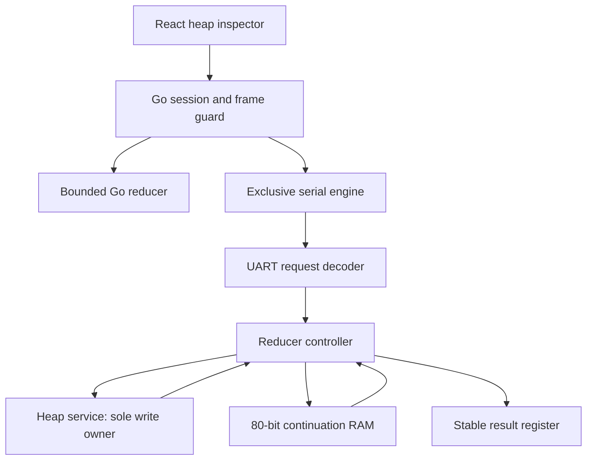

# Lazy graph reducer: intern analysis, design and implementation guide

## 1. The computation and its observable contract

This laboratory evaluates a graph from a selected root by following demand. An ADD demands its left child, saves enough state to resume, demands its right child, and combines the results. A THUNK introduces sharing: the first demand claims and evaluates its body, then replaces the thunk with the result. Every later demand reads that replacement. Evaluation changes the heap; the graph is not an immutable descriptor schedule like Lab 3.

The main graph is `x=delay(21*2); root=(x+x)+(x+x)`. It must return integer 168 with one thunk claim, one update, and one multiplication. A second graph `x=delay(1+x)` must return CYCLIC_THUNK and replace the claimed thunk with that error. Output remains stable until the host polls it. Repeated forcing of a memoized value or error must not run its body again.

We implement one evaluator, a 1024-word heap, and a 512-entry continuation stack. Frames are 80 bits. Hardware uses synchronous RAM. The model uses the same bounded machine states but does not promise identical clock timing. The baseline includes preloaded graph construction; dynamic allocation and multiple evaluators are extensions, not implicit requirements of this build.

## 2. Repository boundaries and existing building blocks

`pkg/lazy` will contain the representation, bounded transition model, independent recursive reference, graph examples, protocol and engine interface. `lazy_reducer/rtl` will contain heap ownership, continuation sequencing, arithmetic, UART control and the board top. `internal/lazyide` will expose serialized HTTP controls and detached history. `web/src/lazy` will render heap nodes, edges, continuation frames, counters and results. `cmd/lazy-lab` will provide model/physical qualification, and `cmd/lazy-ide` will start the inspector.

Reuse the existing synchronous RAM wrapper in `symbolic_eval/rtl/sync_sdp_ram.sv`, reset synchronizer, UART transmitter and graph-microscope UART receiver. Keep laboratory protocols independent: a new magic/version capability identifies the lazy image. Do not adapt a dataflow snapshot into a lazy snapshot. Both use tagged 40-bit words, but node tags describe heap objects while prior dataflow tags described arithmetic values.



## 3. Representation

A heap node is one 40-bit word. Bits 39..36 are the tag, 35..32 are flags/owner, 31..16 are field A, and 15..0 are field B. INT uses A:B as a signed 32-bit value. ADD and MUL use A and B as child addresses. THUNK and IND use A as target and require unused B to be zero. BLACKHOLE belongs to evaluator zero. ERROR uses its payload for a fault code. FREE denotes invalid/unallocated storage. Addresses retain 16-bit format while the physical heap bounds enforce 0..1023.

The node kinds are INT=0, ADD=1, MUL=2, THUNK=3, IND=4, BLACKHOLE=5, ERROR=13, FREE=15. Unknown tags or reserved fields produce TYPE_FAULT. Runtime fault codes distinguish heap address, continuation overflow, recursive thunk demand, indirection cycle, arithmetic overflow and mutation ownership. Signed ADD and MUL use a wider intermediate and fault if the result does not fit int32. Physical multiplication accepts full signed int32 operands through a sequential unit so this lab does not inherit Lab 3's int16 input restriction.

The heap's loaded size is a validity boundary. Reset clears metadata, not 1024 RAM cells. Host writes build a contiguous image while idle, and a force checks every accessed address against that size. Arbitrary graphs may contain cycles; structural rejection of all cycles would prevent the required blackhole experiment. The host cannot edit heap words during evaluation or while output is offered. The inspector reads through the same ownership boundary.

## 4. Continuations and return rules

The evaluator has FETCH/EVAL and RETURN transitions. Recursion is represented in a bounded stack, with three frame kinds: EVAL_RIGHT(op,right), APPLY(op,left_value), UPDATE(thunk_address). The 80-bit format reserves the upper word for frame identity, operation and address and the lower word for the full saved tagged value. Stack capacity must be checked before changing a thunk into a blackhole.

```text
evaluate node:
  INT or ERROR: result=node; RETURN
  IND: increment bounded indirection count; FETCH target
  ADD or MUL:
    reserve stack entry
    push EVAL_RIGHT(op,right)
    FETCH left
  THUNK:
    reserve stack entry
    claim THUNK -> BLACKHOLE through heap owner
    push UPDATE(thunk_address)
    FETCH body
  BLACKHOLE: result=CYCLIC_THUNK; RETURN

return result:
  empty stack: offer result until poll
  EVAL_RIGHT:
    if error: pop and keep returning error
    else replace top with APPLY(op,result); FETCH right
  APPLY:
    pop; evaluate checked arithmetic unless error; RETURN
  UPDATE:
    require matching BLACKHOLE
    replace with result, including ERROR
    pop; RETURN
```

The baseline is left-to-right and fail-fast. If left evaluation fails, the right child is never demanded. ERROR is a terminal value propagated through arithmetic frames and installed into every outstanding UPDATE frame. This guarantees that ordinary errors, including stack overflow and address faults inside a thunk, do not leave permanent blackholes. A direct malformed BLACKHOLE in an externally loaded image is rejected by the host loader; only the heap owner creates claims.

Bound indirection traversal separately from continuation depth. An IND cycle consumes no stack, so a stack limit alone cannot terminate it. A configured hop limit applies to consecutive indirections and faults without counter wrap. Other cycles through strict operators terminate through continuation overflow. Reset is the explicit experiment abort and discards the entire image; there is no live cancellation protocol that could strand a reusable claimed heap.

## 5. Synchronous memory and atomic mutation

The RAM wrapper returns data after a rising edge. The controller must distinguish address presentation, read response, and dispatch. Heap reads and stack reads cannot assume combinational lookup. A controller owns every heap write, selecting idle host loading or reducer claim/update. Claim and UPDATE are serialized with expected-tag checking. While the single evaluator owns execution, no host write can change a claimed word behind it.

On a thunk demand, capacity reservation precedes claim. The UPDATE frame and blackhole write must belong to a transition whose completion is retained across disabled computational clocks. A pause leaves the controller at a valid phase; resuming must not issue the heap write twice. Keep write-enable pulses gated by the execution step and by the appropriate controller state. Register debug read addresses separately so inspecting RAM cannot change the active computation's address.

The result register is another ownership boundary. RETURN with an empty stack installs a result and enters OUTPUT_WAIT. Enabled ticks in that state count output stalls but do not change the result. Poll consumes it and returns the machine to idle while retaining the memoized heap. A second force can then reuse that heap.

## 6. Observability and wire contract

The controller reports current address, state, result validity/value, stack depth, heap size, cycles, heap reads/writes, claims, updates, multiplication and addition applications, indirection count, blackhole observations, maximum stack depth, stalls and faults. Heap mutation events record address, old node and replacement. A bounded trace retains a prefix and explicitly counts loss; it must not pretend to show every cycle. Snapshots include the heap and valid continuation prefix so the browser can explain pending work.

UART operations will cover reset, load word, force root, tick count, poll, and indexed snapshot reads. Requests use the existing stop-and-wait ASCII hexadecimal style with XOR checksum. A distinct capability identifies the lazy reducer and configured capacities. Host-side methods hold a mutex across multi-command operations and treat transport uncertainty as requiring reset. A graph load validates the whole source image before resetting and sending it; physical image readback verifies the transferred contents.

The public Go interface uses context-aware Reset, Load, Force, Tick, Poll, Snapshot and Close methods. Exact bytes and page offsets will be documented alongside implementation and golden wire tests, rather than leaving preliminary offsets here as a competing specification. A snapshot identifies model versus physical source and is detached from mutable engine buffers.

## 7. Inspector behavior

The React application offers book/shared, cyclic, indirection, error and capacity examples plus an editable JSON graph image. It shows each address with decoded tag, children or value, highlights the current address and recently observed mutations, and displays the continuation stack top-first. Controls load, force, step, advance, poll and reset. Loading resets the experiment; forcing an already memoized root preserves heap state. Historical frames disable mutations and never imply hardware rollback.

The Go server serializes controls with expected-frame IDs. Parsing and graph validation happen before device mutation. A stale browser cannot advance a state it did not observe. All static assets are served under /static/ and embedded into the Go binary; API routes are under /api/lazy. The application uses the repository's React, TypeScript, Redux, RTK Query and Bootstrap conventions. It remains a loopback laboratory application.

## 8. Validation plan and physical acceptance

Directed tests cover integers, addition, signed multiplication, indirection chains and cycles, shared and nested thunks, recursive cycles, arithmetic overflow, malformed nodes, heap bounds, stack overflow and held output. Verify both the result and final heap: observing 168 alone cannot prove memoization. The shared graph must have one claim, one update and one multiplier acceptance. Forcing it again must not increase the multiplication count.

An independent recursive reference compares results and memoized heaps with the explicit-stack model for generated bounded graphs. RTL tests compare commit results, mutation sequences and counters, without requiring identical model and hardware clock scheduling. Vary continuation capacity and arithmetic latency where practical. Test reserve-before-claim by exhausting stack capacity at a thunk: the heap word must remain an unclaimed thunk, or an existing caller's UPDATE must unwind correctly.

Run the normal repository Go, frontend and Glazed checks. Build the board with the existing 10 MHz constraint and inspect final routed timing before programming. The book suggests roughly six physical RAM blocks and 8000 CPEs as a simplification threshold; report measured resource classes precisely instead of assuming they are interchangeable. Program only a newly packed timing-passing image. Stop the existing physical IDE before taking UART ownership, preserve its source and evidence, then run actual graph loads, force/poll, sharing and cycle checks. Capture the physical heap inspector and retain screenshots for the diary and final illustrated handoff.

## 9. Delivery phases

- P1 defines this contract, archives the lab and delivers the guide.
- P2 implements bounded Go transitions, independent reference checks and examples.
- P3 implements synchronous RTL, protocol and simulation evidence.
- P4 implements host commands and the React heap/continuation inspector.
- P5 closes timing, qualifies the board, captures screenshots and publishes the handoff.

Each phase has a printed start and completion slip and a diary entry with commands, results, failures and review concerns. Implementation commits separate coherent source changes from diary/delivery checkpoints. The completed API reference will identify any resolved design choices and the exact source revision tested.
