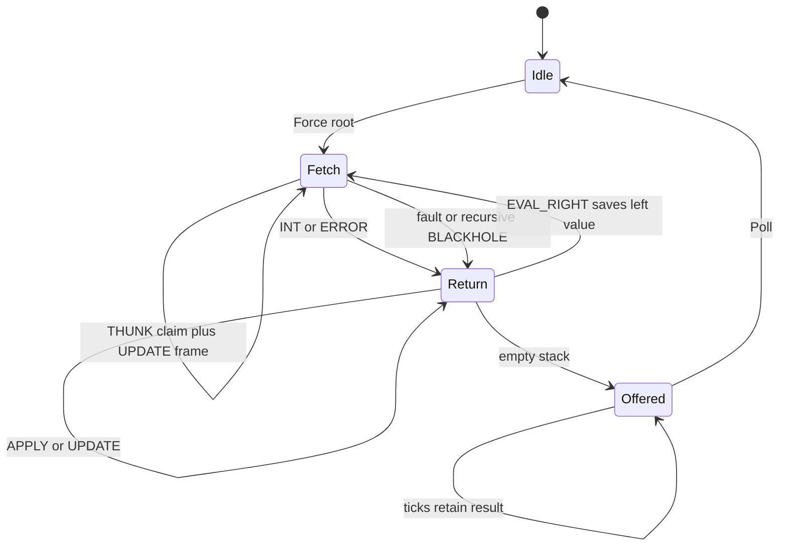

# Implemented lazy reducer: API, execution, and qualification handoff

## Status and evidence boundary

The Go model, recursive reference, physical RTL, UART host, CLI and React inspector are implemented. The first routed image passed the unchanged 10 MHz requirement at 24.65 MHz. Four hundred generated model graphs and 120 generated RTL graphs passed, together with directed core/UART checks and host/frontend validation. The five screenshots in this document are **model observations**.

Physical qualification is pending. The initial programming command failed with `JTAG init failed with: DirtyJtag: fails to open device`. Host inspection showed no GateMate/DirtyJTAG USB device and no `/dev/ttyACM0` or `/dev/ttyACM1`. The physical qualification suite and browser procedure are prepared, but neither simulated results nor timing closure is a substitute for a programmed-board result. P5 remains open until the board is reconnected and these checks pass.

## Computation and memory ownership

The machine evaluates one root in a 1024-word heap with a maximum of 512 outstanding continuation frames. Every word is 40 bits. An operation demands children from left to right. The first demand for a thunk writes BLACKHOLE, pushes UPDATE, evaluates the body, and installs its value or error into the original heap address. A later demand observes that memoized result. The result register remains offered until Poll consumes it; a new Force then reuses the heap.

The controller is the only heap write owner. Idle construction and runtime claim/update share its write mux. The UART cannot write during evaluation or while output is held. Host Load validates the whole image before resetting and transmitting contiguous addresses, then reads the transferred words back. Reset clears validity metadata and aborts the experiment; it does not clear every physical RAM cell. A loaded-size boundary prevents unallocated RAM from becoming a legal node.

Continuation frames are EVAL_RIGHT, APPLY and UPDATE. Overflow is detected before pushing a new frame or claiming a thunk. Failures unwind existing UPDATE frames into memoized errors. For example, if a thunk's body recursively enters strict ADD nodes until the stack fills, the existing outer thunk becomes CONTINUATION_OVERFLOW. A child thunk that could not reserve its UPDATE frame remains unclaimed.



Hardware separates these conceptual transitions into synchronous-memory phases. Numeric state codes are 0 idle, 1 fetch, 2 heap wait, 3 evaluate, 4 return, 5 stack wait, 6 return dispatch, 7 update wait, 8 update, 9 multiply, 10 output. State names in physical snapshots reflect those phases. The Go model uses idle/fetch/return/output and does not claim cycle equivalence.

## Node and continuation encoding

Node bits 39..36 contain a tag; 35..32 are reserved and must be zero for this single-owner implementation. INT uses the low 32 bits as a signed integer. ADD/MUL use fields A at 31..16 and B at 15..0. THUNK/IND use A and require B zero. BLACKHOLE is tag five with zero payload, and may only be created internally. ERROR is tag thirteen with a uint32 code. FREE is tag fifteen and produces a runtime type fault when demanded.

| Tag | Name | Meaning |
|---|---|---|
| 0 | INT | Signed int32 value |
| 1 | ADD | Demand A and B, checked addition |
| 2 | MUL | Demand A and B, checked multiplication |
| 3 | THUNK | Deferred body at A |
| 4 | IND | Follow address A |
| 5 | BLACKHOLE | Evaluator-zero claim |
| 13 | ERROR | Memoized or propagated fault |
| 15 | FREE | Not a reducible value |

Fault codes are 1 HEAP_ADDRESS, 2 CONTINUATION_OVERFLOW, 3 CYCLIC_THUNK, 4 INDIRECTION_CYCLE, 5 TYPE_FAULT, 6 ARITHMETIC_OVERFLOW, and 7 OWNERSHIP_FAULT. Loaded images reject noncanonical encodings and external BLACKHOLE nodes. Child addresses may be outside the loaded image so the laboratory can exercise runtime address faults. IND traversal faults after 1024 consecutive hops; passing through a different node kind resets that consecutive-hop count.

An 80-bit continuation stores kind at 79..76, operation at 75..72, address at 71..56, reserved bits 55..40, and saved value at 39..0. Kind one is EVAL_RIGHT, two APPLY, three UPDATE. A frame can therefore retain a complete signed value without truncating it to fit beside its operation and address.

ADD uses a signed 33-bit intermediate. MUL uses a 32-iteration unsigned magnitude multiplication with 64-bit accumulation, restores the sign, and verifies int32 representability. The multiplication counter increments when a non-error APPLY accepts a multiplication, including an application that later produces an overflow fault. Operand errors propagate without incrementing the application count.

## Wire protocol version one for the lazy machine

The capability signature is ASCII `LAZY`, followed by version one, heap capacity, stack capacity and a reserved byte. This is independent of the prior dataflow protocol's version numbering. It provides no compatibility adapter.

Requests use an uppercase command letter, hexadecimal binary payload, an XOR checksum byte, and LF. XOR covers payload bytes and checksum, excluding the command letter. R and P have no payload or checksum. Successful mutations return `A\n`; empty Poll returns `N\n`; record responses contain a letter, twenty hex data characters, two checksum characters, and LF. Record letters are S for query and O for a consumed output.

| Request | Payload | Meaning |
|---|---|---|
| R | None | Abort/reset experiment and loaded-size metadata |
| W | Address16 + word40 | Write a contiguous image word while idle |
| F | Root16 | Begin evaluation while idle |
| T | Ticks32 | Advance at most 1,000,000 enabled cycles |
| P | None | Consume offered result if present |
| Q | Page16 | Read one 80-bit snapshot page |

Golden requests, with a terminating LF implied:

```text
W0003300002000031   # address 3 = THUNK(body=2)
F000606            # force root 6
Q000000            # capabilities
```

Errors are `!01\n` for framing/timeout, `!02\n` for rejected arguments or state, and `!03\n` for checksum mismatch. The host treats a failed or malformed exchange conservatively as requiring reset. The session prevents ordinary invalid Force operations before sending them, and rejects stale frame IDs independently. No automatic replay occurs after uncertain acceptance.

## Snapshot pages and mutations

Page data bytes are indexed from most significant byte zero. Multi-byte numbers use big-endian order. Unspecified high padding is zero.

| Page | Ten-byte layout |
|---|---|
| 0 | Magic32, version8, heap-capacity16, stack-capacity16, reserved8 |
| 1 | State8, result-valid8, current-address16, heap-size16, stack-depth16, indirection-hops16 |
| 2 | Padding40, result40 |
| 3 | Trace-count16, trace-dropped32, padding32 |
| 16..27 | Padding48, one counter32 |
| 0x1000 + address | Padding40, heap word40 |
| 0x2000 + index | Continuation80, bottom-first |
| 0x3000 + 2*i | Mutation cycle32, address16, padding32 |
| 0x3001 + 2*i | Old word40, replacement word40 |

Counters in page order are cycles, heap reads, runtime heap writes, claims, updates, multiplication applications, addition applications, indirections, blackholes observed, maximum stack depth, output-stall cycles, and newly generated faults. Reads count dispatched evaluation nodes; UPDATE's ownership read is not included. Writes and mutations exclude host image construction. Fault count records newly generated faults, not every later propagation or repeated force of a memoized error.

The mutation recorder stores the first 64 runtime writes and counts every later write as dropped. Each record occupies 160 bits, split across two query pages. One controller can commit at most one mutation per clock, so this trace has capacity loss but does not have Lab 3's arbitration between multiple event kinds. Clearing it is part of experiment reset. Entries beyond the reported count are invalid even if old RAM data remains.

Q selects synchronous memory read addresses and waits three clocks before serializing the response. Computational ticks are disabled during queries. The read address returns to the controller's retained address during response transmission, before the next tick command. A snapshot acquires all required pages under the serial engine mutex so it cannot interleave with another host operation.

## Go and HTTP interfaces

```go
type Engine interface {
    Execute(context.Context, Operation) (*Word, error)
    Snapshot(context.Context) (Snapshot, error)
    Close() error
}
func NewModel() *Model
func NewSerial(path string) (*Serial, error)
func Reference(image Image, stackLimit int) (Word, []Word)
func RunExample(context.Context, Engine, string) ([]Word, Snapshot, error)
```

Operation kinds are reset, load, force, tick and poll. Load requires an Image with numeric word array and root; Force carries root; Tick carries ticks. The loader's root is image metadata rather than an implicit Force. Snapshot contains source, state, current address, held result/validity, heap, continuation stack, counters, mutation prefix and dropped count. Returned slices are detached. The independent recursive Reference returns both result and final heap for semantic comparison.

The HTTP service offers GET `/api/lazy/state`, GET `/api/lazy/examples`, and POST `/api/lazy/control`. Control accepts `{expectedId, operation}` and returns complete session state. State contains current frame, up to 128 historical operation-boundary frames, up to 128 polled results and needsReset. Compile/load source validation is performed before device mutation. Cross-origin mutation, unknown JSON fields, trailing JSON objects and stale frame IDs are rejected.

If a control succeeds physically but its subsequent snapshot fails, the session preserves the last successful observation and marks the engine uncertain. It never presents that old frame as proof that the just-issued command did not execute. Reset or Load is required to recover. Source images in the browser use readable tag objects and are translated into canonical numeric words before the Go loader validates them again.

## Inspector observations


The shared graph is paused after three model cycles. Heap address three is BLACKHOLE, the current address points at its multiplication body, and the continuation stack contains UPDATE(3) above two EVAL_RIGHT frames. The arithmetic body has not yet been accepted. Pausing at this boundary preserves the obligation to install a value or error into address three.


After advancing, the result register offers 168, heap address three is INT(42), and the counters show one claim, one update and one multiplication. The mutation table records THUNK-to-BLACKHOLE followed by BLACKHOLE-to-INT. The large cycle count reflects a requested batch containing idle output-stall cycles; it is not an arithmetic-latency measurement.


The recursive graph returns CYCLIC_THUNK, and its claimed word becomes that error. The continuation stack is empty before output is offered. Repeated forcing reads the error rather than leaving a permanent claim or evaluating the failed body again.


History selects a retained frame, with mutation controls disabled. The physical or model engine is not rolled back. Heap, frames, counters and trace in that view all belong to the selected observation.


The graph viewport scrolls internally on narrow displays while the document fits the viewport. The graph renders addresses zero through 31; the paginated heap table permits inspection of the complete image. The continuation and trace tables retain their valid contents in scrollable panels.

## Reproduction and remaining physical phase

Run `make lazy-frontend`, then `go run -tags embed ./cmd/lazy-ide --engine model --listen 127.0.0.1:18089` in tmux. The physical default port is 18090. Port 8090 was already occupied by another project; that service was preserved. Static resources use `/static/`. The normal Makefile frontend build includes this entry alongside the prior laboratories.

The current source milestones are model b018ae3, RTL/protocol dd29ede, inspector 858edd2, and diary/evidence checkpoint 42cab97. The build reports 6261/40960 CPE logic tables and 8/64 RAM halves. Full flip-flop and detailed RAM/resource figures remain in the archived synthesis/routing reports. The successful final frequency is 24.65 MHz, rather than the earlier placement estimate of 37.54 MHz.

When the board is connected, run `scripts/15-physical-qualification.sh` from this ticket. It verifies the image is newer than the routing log and refuses any routing error before programming. The suite covers five directed examples, 60 generated physical graphs compared with the recursive heap/result reference, live-claim inspection, held output, repeated forcing, 79 nested thunk updates, trace overflow and a 512-frame overflow unwind. Then run the physical inspector and `scripts/16-browser-fpga.js` for physical screenshots. Those steps remain unexecuted until device access is restored.

Key code references are `pkg/lazy/model.go`, `reference.go`, `serial.go`, `physical_test.go`, `lazy_reducer/rtl/lazy_core.sv`, `lazy_link.sv`, `internal/lazyide/session.go`, and `web/src/lazy/App.tsx`. The diary records the exact validation commands, timing result, test-harness corrections and physical device failure.
