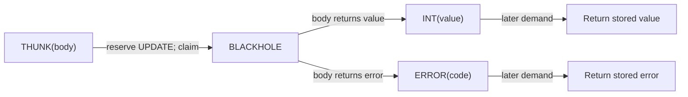
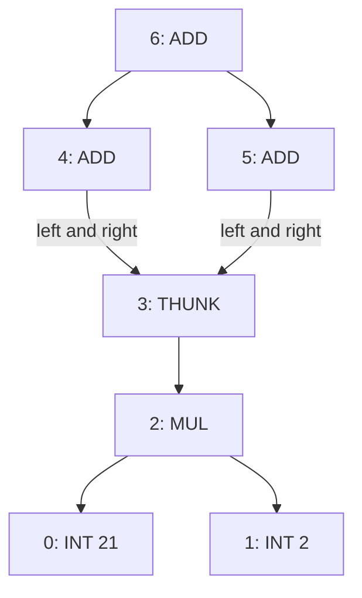
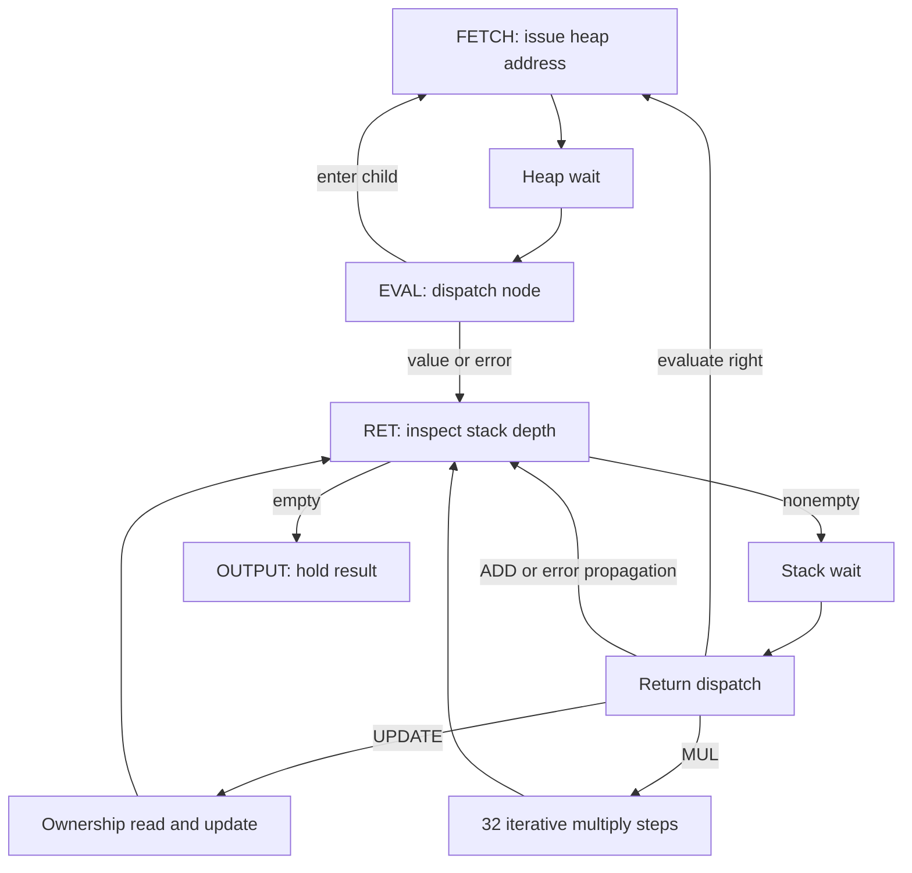
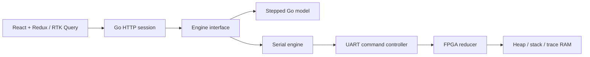

# Inside a Lazy Graph Reducer on GateMate

A lazy graph reducer evaluates a computation by following references in a heap and replacing deferred computations with their results. The replacement is part of the execution semantics. If several references name the same deferred computation, the first demand evaluates its body and subsequent demands observe the stored result. Laboratory 4 implements this mechanism in a bounded FPGA machine and exposes its heap, continuations, counters, and mutations through a Go service and React inspector.

This article explains the implemented machine, from the representation of a node to a physical execution captured on the GateMate. The source revision is 79f28e6 in /home/manuel/code/wesen/2026-09-04--gatemate-symbolic. The implementation includes an independent recursive reference, a stepped Go model, synchronous SystemVerilog hardware, a checked UART protocol, and an inspector that distinguishes model observations from physical observations. Physical qualification passed on 2026-09-05.

## 1. Demand, sharing, and update

Consider the graph described by:

```text
x    = delay(21 * 2)
root = (x + x) + (x + x)
```

There are four demands for x, but x denotes one heap address. The body 21 * 2 is a separate expression node. The delay node initially refers to that body; after evaluation, the delay node itself contains INT(42). The four demands therefore perform one multiplication and four observations of a shared result. The three additions still execute to combine those observations into INT(168).

This is more specific than deferring arithmetic until it is requested. A machine that evaluates the body on every request is lazy about when it starts work but does not provide this update-based sharing. Conversely, merely repeating identical expression syntax does not establish sharing in this machine. Two separately allocated THUNK nodes can have identical bodies and still be claimed independently. Sharing is determined by reference identity.

The implementation memoizes explicit THUNK nodes. It does not automatically replace every ADD or MUL node with its result. After polling the first result, forcing the same root again executes the root's three additions again, while the already updated x remains INT(42). The multiplication count remains one. This distinction gives the counters a precise interpretation and prevents a broader claim that every expression is evaluated at most once.

The language supported today is an explicitly loaded graph of integer arithmetic, thunks, indirections, and errors. There is no source-language parser, function application, dynamic allocator, constructor system, or garbage collector. Those additions need new runtime semantics; they cannot be obtained merely by placing a text editor in front of the current loader.

## 2. A graph encoded in 40-bit words

Each heap location stores one 40-bit word. A four-bit tag selects the interpretation of the low 32 bits. Bits 35 through 32 are reserved and must be zero in the implemented single-evaluator contract. The laboratory text discusses owner fields and environments as possible extensions; the current implementation deliberately uses neither.

| Bits | Interpretation |
|---|---|
| 39..36 | Node tag |
| 35..32 | Reserved, zero |
| 31..16 | Field A, or upper half of an integer/error payload |
| 15..0 | Field B, or lower half of an integer/error payload |

| Tag | Value | Payload meaning |
|---|---:|---|
| INT | 0 | Signed 32-bit integer |
| ADD | 1 | Addresses of left and right children |
| MUL | 2 | Addresses of left and right children |
| THUNK | 3 | Body address in A; B is zero |
| IND | 4 | Target address in A; B is zero |
| BLACKHOLE | 5 | Zero payload; an evaluation is in progress |
| ERROR | 13 | Unsigned fault code |
| FREE | 15 | Zero payload; forcing it causes a type fault |

Although address fields contain 16 bits, the physical heap contains 1024 locations. Field width is an encoding property, not a claim of 65,536 installed nodes. The loader accepts a contiguous image containing between one and 1024 nodes and requires its root to be inside that image. A child may contain an out-of-range address, allowing execution to demonstrate a precise address fault when that child is demanded.

The canonical-word check rejects high bits outside the 40-bit word, nonzero reserved bits, unrecognized tags, and tag-specific malformed payloads. External BLACKHOLE nodes are rejected by image validation: a host cannot claim that a deferred computation is currently owned by an evaluator when no corresponding continuation exists. A canonical FREE node may be loaded, but it is not an evaluable value.

In Go, Word is represented by uint64. Signed integers are encoded using their two's-complement low 32 bits. For example, INT(-42) has low payload 0xffffffd6; decoding must recover int32 rather than interpreting that payload as a positive magnitude. In TypeScript, all 40-bit words fit exactly in Number, but ordinary bitwise operators truncate to 32 bits. The frontend therefore uses division, remainder, and powers of two to decode the upper tag.

The relevant definitions are [types.go](https://github.com/wesen/2026-09-04--gatemate-symbolic/blob/79f28e6/pkg/lazy/types.go) and [frontend types.ts](https://github.com/wesen/2026-09-04--gatemate-symbolic/blob/79f28e6/web/src/lazy/types.ts). They centralize representation rules so the UI and execution engines do not invent separate encodings.

## 3. The machine state and its continuation stack

Recursive evaluation needs somewhere to record unfinished work. In a software interpreter that information may reside in the host language's call stack. The FPGA instead stores it in an explicit continuation RAM. A continuation is a typed record describing what to do when the current expression returns.

The abstract state consists of the current heap address, a control state, the loaded heap, a stack of continuations, a result register, an output-valid bit, and diagnostic counters. The heap has 1024 entries, the continuation stack has 512 entries, and each continuation occupies 80 bits. The width preserves a full 40-bit saved value alongside control metadata; narrowing it would require a different representation or a smaller arithmetic domain.

| Frame | Retained information | Action on return |
|---|---|---|
| EVAL_RIGHT | Arithmetic opcode and right-child address | Save the left result and evaluate the right child |
| APPLY | Arithmetic opcode and left value | Combine the saved value with the returned right value |
| UPDATE | Claimed thunk address | Replace the matching BLACKHOLE with the result |

The physical frame layout places kind in bits 79..76, opcode in 75..72, address in 71..56, reserved zero bits in 55..40, and a saved value in 39..0. Fields unused by a particular frame are zero. The debugger exports stack entries bottom-first; the inspector presents the top frame first to make the next return action apparent.

An arithmetic node reserves one continuation before entering its left child. When that child returns, EVAL_RIGHT is overwritten in place with APPLY. The machine does not need to pop one frame and allocate another at this boundary, so a full stack can still transition from waiting for the left result to waiting for the right result.

```text
evaluate ADD(left, right):
    require room for one continuation
    push EVAL_RIGHT(ADD, right)
    enter left

return value to EVAL_RIGHT(op, right):
    if value is ERROR:
        pop frame
        keep returning value
    else:
        replace top frame with APPLY(op, value)
        enter right

return value to APPLY(op, left):
    pop frame
    if value is ERROR:
        keep returning value
    else:
        return checked_arithmetic(op, left, value)
```

The order is left-to-right and fail-fast. If the left child fails, the right child is not evaluated. This matters even in a pure arithmetic graph because the right child may contain a latent cycle, another fault, or a thunk whose mutation would otherwise become visible. The final heap, not just the result code, depends on the chosen order.

## 4. Claiming a thunk creates an update obligation

A thunk has three observable states during a successful first evaluation: THUNK before demand, BLACKHOLE while its body is being evaluated, and the resulting value afterward. BLACKHOLE is an internal marker that permits the evaluator to detect demand for a computation already being evaluated.



The capacity check must occur before the heap mutation. If the machine wrote BLACKHOLE and then discovered that the continuation stack was full, it would have lost the body address without storing an obligation to restore or update the cell. A later demand could see a permanent BLACKHOLE. The implemented transition checks capacity and writes the complete UPDATE frame together with the claim.

```text
enter THUNK at address a:
    if continuation stack is full:
        return ERROR(CONTINUATION_OVERFLOW)
    else:
        body = heap[a].body
        push UPDATE(a)
        heap[a] = BLACKHOLE
        enter body

return r to UPDATE(a):
    if a is invalid or heap[a] is not the owned BLACKHOLE:
        return ERROR(OWNERSHIP_FAULT)
    heap[a] = r
    pop UPDATE
    keep returning r
```

There is one evaluator, so every internal BLACKHOLE belongs to it. This is not a multi-threaded claim protocol and has no waiter queue or owner-generation mechanism. The single heap-write multiplexer in lazy_core.sv serializes host construction while idle, runtime claims, and runtime updates. Ownership is checked by requiring the expected BLACKHOLE word at update time.

Errors are values in the return path. An ERROR passes through arithmetic continuations without performing arithmetic and is written into each outstanding claimed thunk during UPDATE. This memoized-error policy is why a cycle or stack overflow can terminate without leaving live claims behind.

Reset is the experiment-abort operation. It discards the loaded image and control state, rather than attempting to resume or repair partially evaluated work. There is no supported live cancellation operation that preserves the heap while abandoning UPDATE obligations.

## 5. Following the shared graph on physical hardware

The complete seven-node image is small enough to inspect directly.

| Address | Initial word | Role |
|---:|---|---|
| 0 | INT(21) | First multiplier operand |
| 1 | INT(2) | Second multiplier operand |
| 2 | MUL(0, 1) | Body of x |
| 3 | THUNK(2) | Shared x |
| 4 | ADD(3, 3) | First pair of demands |
| 5 | ADD(3, 3) | Second pair of demands |
| 6 | ADD(4, 5) | Root |



Forcing address 6 first enters address 4, which then demands address 3. At that point, the stack already contains EVAL_RIGHT(ADD, 5) and EVAL_RIGHT(ADD, 3). Claiming the thunk adds UPDATE(3), and evaluation enters body address 2.


This physical snapshot was captured at enabled cycle 9. Address 3 is BLACKHOLE, the current address is 2, and the three-frame stack contains the two arithmetic continuations beneath UPDATE(3). Counters show one claim, one runtime heap write, and three dispatched node reads. Inspection itself does not execute further reducer ticks.

After multiplication returns 42, UPDATE(3) replaces the claimed cell with INT(42). The second demand from address 4 therefore reads that integer directly. The two demands from address 5 do the same. The arithmetic results are 84, 84, and finally 168.


The captured mutation trace contains exactly two events:

| Enabled cycle | Address | Old word | Replacement |
|---:|---:|---|---|
| 9 | 3 | THUNK(2) | BLACKHOLE |
| 61 | 3 | BLACKHOLE | INT(42) |

The result screenshot reports one claim, one update, one multiplication, three additions, and two runtime heap writes. It was taken after a tick batch brought the counter to 1009 cycles, including 917 output-stall cycles. The batch total must not be interpreted as the latency of the arithmetic expression. The mutation timestamps are direct observations of the two writes; the output screenshot is an operation-boundary observation after additional idle waiting.

After Poll accepts the output, forcing root 6 again returns 168 with the multiplication count still one. That second experiment distinguishes stored-result reuse from a coincidental correct first result. The physical test also takes two consecutive snapshots during a live claim and compares them, checking that inspection has not mutated execution state.

## 6. Cycles, indirections, and bounded failure

The directed cycle example loads INT(1), THUNK(body=2), and ADD(0, 1), with root 1. Its definition is x = delay(1 + x). When evaluation reaches the second occurrence of x, address 1 is already BLACKHOLE. The evaluator generates ERROR(CYCLIC_THUNK), unwinds the arithmetic continuation, and updates the original claimed cell with the same error.


On the physical FPGA, the trace records THUNK-to-BLACKHOLE at cycle 3 and BLACKHOLE-to-ERROR at cycle 23. The fault code is 3. One claim and one update occurred, the stack was unwound, and the held result agrees with the error now stored at address 1.

Not every nonterminating graph passes through a thunk. Two IND nodes can point at each other without creating a BLACKHOLE. The machine therefore bounds consecutive indirection traversal at 1024 followed links. Reaching the bound produces INDIRECTION_CYCLE. This is a bounded traversal policy rather than a complete structural cycle detector: an excessively long acyclic chain would also hit the bound if the storage configuration allowed one.

| Code | Fault | Meaning |
|---:|---|---|
| 1 | HEAP_ADDRESS | A demanded address lies outside the loaded heap |
| 2 | CONTINUATION_OVERFLOW | A required frame cannot be reserved |
| 3 | CYCLIC_THUNK | Demand reaches the evaluator's live claim |
| 4 | INDIRECTION_CYCLE | The consecutive indirection bound is exhausted |
| 5 | TYPE_FAULT | The demanded node or arithmetic operand is invalid |
| 6 | ARITHMETIC_OVERFLOW | A result does not fit signed int32 |
| 7 | OWNERSHIP_FAULT | An update cannot find the expected claimed cell |

The physical stack-overflow test uses a thunk over an ADD node that recursively references itself. It reaches 512 frames, returns the overflow fault, and still replaces the outer BLACKHOLE with the error. This tests an obligation that a simple successful expression cannot exercise: error unwinding must complete even when the normal evaluation path has exhausted its capacity.

## 7. Synchronous RAM determines the hardware schedule

The Go model has fetch, return, idle, and output states. Its heap and stack are ordinary in-memory slices. The FPGA uses synchronous RAM, so a read address and the data read from that address occur on different clock boundaries. Hardware control therefore includes explicit wait and dispatch states.

The main read path is FETCH, heap wait, and EVAL. The return path is RET, stack wait, and return dispatch. UPDATE has a separate wait before checking the claimed heap word and writing the replacement. The iterative multiplier occupies its own state. The additional states implement memory and arithmetic timing without changing the graph's evaluation order.



A tick command advances a bounded number of enabled controller cycles. The system clock continues to run during UART activity, but the reducer's computational transitions are disabled during queries. Debug queries temporarily select memory read addresses and allow the synchronous data to settle before serializing it. The controller's retained read address is restored before later execution ticks.

The physical test that compares two live snapshots is useful here. A debugger that accidentally advances the stack or changes which heap word the next evaluation consumes might appear correct on completed computations while corrupting a paused claim. Testing observation during unfinished work targets that boundary.

The key hardware files are [lazy_core.sv](https://github.com/wesen/2026-09-04--gatemate-symbolic/blob/79f28e6/lazy_reducer/rtl/lazy_core.sv), lazy_link.sv, and the shared sync_sdp_ram module. Their role is to make the abstract transitions realizable with the actual memory schedule.

## 8. Checked integer arithmetic

ADD and MUL operate on signed 32-bit integers and return an explicit error on overflow. The Go implementation widens operands to int64 before computing. The hardware adder uses a signed 33-bit sum; disagreement between the two high sign positions indicates that the result cannot be represented in 32 bits.

Multiplication uses 32 iterations of magnitude-based shift-and-add. The machine converts each operand to an unsigned magnitude, remembers the result sign, and accumulates a 64-bit product. After the final iteration, it applies the sign and checks that the upper 32 bits are the sign extension of bit 31.

```text
accumulator = 0
shifted = magnitude(left)
bits = magnitude(right)
negative = sign(left) XOR sign(right)

repeat 32 times:
    if low_bit(bits) == 1:
        accumulator += shifted
    shifted <<= 1
    bits >>= 1

signed_product = negative ? -accumulator : accumulator
if upper32(signed_product) != sign_extension(bit31):
    return ERROR(ARITHMETIC_OVERFLOW)
return INT(low32(signed_product))
```

Unsigned magnitude handling is relevant for -2147483648, whose positive magnitude does not fit in signed int32 but does fit in uint32. The multiplier's wide intermediate avoids treating that edge as an already-overflowed signed negation.

Arithmetic counters describe operation applications, not multiplier clock iterations. One accepted multiplication increments Muls once even though the multiplier requires 32 iterative cycles. Overflowing arithmetic can also count as an application; an error propagated from a child bypasses the arithmetic application. This is why semantic counters can be compared across the Go model and RTL while raw cycle counts cannot.

## 9. Trace retention and measurement

The mutation trace retains the first 64 runtime writes. Each record stores a cycle number, heap address, old word, and replacement word. Its physical width is 160 bits: cycle32, address16, reserved32, old40, new40. Host image-loading writes do not appear as runtime evaluation mutations.

When trace capacity is exhausted, subsequent mutations still execute and increment a dropped counter. The recorded sequence remains a prefix. It is not a ring buffer containing the most recent events, and it is not an exhaustive execution log once loss occurs.

The nested-thunk physical test claims and updates 79 thunks, producing 158 runtime writes. The trace retains 64 and reports 94 dropped records. This checks both continued semantic execution and honest reporting of missing evidence. A UI that omitted the loss count could invite a false inference that a missing update never happened.

The twelve counters cover enabled cycles, dispatched reads, runtime writes, claims, updates, multiplication and addition applications, indirections, blackhole observations, maximum stack depth, output stalls, and newly generated faults. Ownership-check reads are not included in the dispatched-read counter. Reading an already memoized ERROR does not generate a new fault. Each metric therefore needs its definition alongside the display.

## 10. From browser controls to UART operations

The browser sends operations to a Go session. The session checks that the request refers to the latest observed frame, serializes the operation, obtains a complete snapshot, and returns the updated history. The serial engine translates the operation into a stop-and-wait UART exchange at 115200 baud, eight data bits, no parity, and one stop bit.



The implemented Go boundary is deliberately small:

```go
type Engine interface {
    Execute(context.Context, Operation) (*Word, error)
    Snapshot(context.Context) (Snapshot, error)
    Close() error
}
```

Reset clears the experiment. Load validates an image, resets the device, writes every word, and reads every word back. Force begins evaluation at a root while idle. Tick advances up to one million enabled cycles per request. Poll accepts an offered result and returns the machine to idle; polling without a result returns no value. Loading root metadata does not implicitly force that root.

| HTTP endpoint | Responsibility |
|---|---|
| GET /api/lazy/state | Return current observation and retained session history |
| GET /api/lazy/examples | Return the five directed graph images |
| POST /api/lazy/control | Apply an operation with an expected frame ID |
| GET /static/app.js and /static/app.css | Serve embedded frontend assets |

A control request has the shape shown below. The frame ID must come from the live session rather than being hardcoded by a client.

```json
{
  "expectedId": 12,
  "operation": {"kind": "tick", "ticks": 1000}
}
```

The HTTP handler rejects unknown fields and trailing JSON, limits the body to 128 KiB, and rejects a supplied cross-origin mutation request. Session conflicts return HTTP 409. The local service binds to loopback in the normal workflow.

The UART command set is R for reset, W for a heap write, F for force, T for ticks, Q for a query page, and P for poll. Payload-bearing commands encode bytes as ASCII hexadecimal followed by the XOR of the payload bytes and a newline. The command character is excluded from that checksum. Reset and Poll have no payload checksum. Query and output records carry ten data bytes, a checksum, and framing.

The capability page reports LAZY, protocol version 1, heap capacity 1024, and stack capacity 512. The host checks this before using the device. This prevents a different laboratory image from being interpreted as a lazy reducer merely because it also speaks over UART.

Queries expose state, result, trace counts, counters, individual heap words, continuation entries, and two pages per mutation record. Snapshot holds the serial-engine mutex across the complete page sequence, so another operation cannot interleave with it through that engine. This is coherent paused inspection, not an asynchronously sampled hardware trace.

## 11. Observation history and uncertain execution

The inspector retains up to 128 operation-boundary frames and 128 polled results. A historical frame contains detached copies of its heap, stack, counters, and trace. Selecting it changes the displayed observation and disables mutation controls; it does not rewind the physical board.


The expected frame ID is a concurrency check. If another browser or an earlier request has advanced the session, a control referring to an old frame is rejected. This avoids applying a command based on a heap state that is no longer current.

Transport uncertainty is a separate issue. A UART write or a subsequent snapshot can fail after the FPGA has executed a command. The host cannot safely infer that nothing happened. The session therefore marks the engine as requiring reset and preserves the last successful observation rather than presenting it as current proof of nonexecution. Reset or Load establishes a new experiment.

This policy is particularly relevant to Tick and Poll. Blindly retrying Tick can execute additional cycles; blindly retrying Poll can consume a different protocol state. The implemented interface favors explicit recovery over pretending every failed request is side-effect free.


The browser offers a graph view for the first 32 addresses and a paginated table for the complete loaded heap. Continuations and mutation records have their own scrollable panels. The physical mobile check measured document scroll width and client width at 390 pixels, showing no document-wide horizontal overflow. The display is useful for reading the graph, but complete inspection of a large image still requires the heap table.

## 12. What the verification establishes

The semantic reference recursively evaluates a private heap and uses the Go call stack rather than the explicit continuation machine. Its result and final heap are compared with the stepped model and hardware. This structural independence makes it more useful than a second copy of the same state machine, although both Go paths share word definitions and the arithmetic helper.

The verification evidence has several distinct levels:

| Level | Evidence |
|---|---|
| Go semantics | 400 generated graph comparisons and directed bounded-error tests |
| RTL simulation | 120 generated graph comparisons plus directed core and UART checks |
| Physical GateMate | 60 randomized graphs, five directed examples, live claims, stable output, repeated forcing, nested updates, trace loss, and stack overflow unwind |
| Host and frontend | Go checks, seventeen frontend tests across the application, model and physical browser workflows |
| Physical UI | Five retained FPGA screenshots and no browser console errors or warnings |

The physical randomized suite constructs small acyclic arithmetic/thunk graphs using a fixed seed. It is not random coverage of every node tag or every possible cyclic topology. Directed examples separately cover indirections, an indirection cycle, arithmetic overflow, and cyclic thunk demand. The distinction matters when interpreting the evidence.

The final routed design meets the required 10 MHz clock, with a reported maximum frequency of 24.65 MHz. It uses 6261 of 40960 CPE logic tables, 1555 of 40960 CPE flip-flops, and eight of 64 RAM halves. These figures describe the routed implementation, not an estimate from the Go model or an earlier placement pass. The earlier placement estimate of 37.54 MHz is not the final timing result.

The physical qualification suite passed in 15.108 seconds after reconnection. That duration includes many serial operations and snapshots; it is not an FPGA throughput benchmark. Likewise, passing randomized and directed tests is evidence for the exercised cases, not a formal proof over all possible heaps.

## 13. Reproducing and extending the experiment

The model can be exercised without hardware:

```sh
go run ./cmd/lazy-lab --example shared --format json
make lazy-frontend
tmux new-session -d -s lazy-model \
  'go run -tags embed ./cmd/lazy-ide --engine model --listen 127.0.0.1:18089'
```

For the physical image, the existing laboratory Makefile builds and programs the board. Only one process should own its UART; stop the physical web server before running a separate serial qualification process.

```sh
make -C lazy_reducer bit
make -C lazy_reducer load
go test ./pkg/lazy -run TestPhysicalLazyQualification -count=1 -v \
  -lazy-physical-device /dev/ttyACM0
tmux new-session -d -s lazy-fpga \
  'go run -tags embed ./cmd/lazy-ide --engine serial --device /dev/ttyACM0 --listen 127.0.0.1:18090'
```

The FPGA toolchain must be available for the Makefile commands. Programming uses volatile SRAM, so power loss requires programming again. To replace a running web server in this workspace, use lsof-who -p PORT -k.

The next architectural step is a small lazy functional language with closures, runtime allocation, and structured values. That extension needs a definition of weak head normal form, because returning a list constructor must not force its tail. It also needs a representation for captured environments and a way to preserve object identity when a thunk returns a constructor or closure. The current claim/update invariant remains useful, but the integer-only result model is insufficient for those values.

A practical first milestone is a compiled function called through a shared thunk, with its source span attached to the allocated object and its body executed once. That establishes the connection between source binding, runtime identity, and physical mutation before adding recursive lists or garbage collection.

## Source map and further reading

| File or artifact | What to inspect |
|---|---|
| pkg/lazy/types.go | Word encoding, faults, image validation, operation and engine contracts |
| pkg/lazy/model.go | Explicit continuation semantics, capacity reservation, update and error paths |
| pkg/lazy/reference.go | Independent recursive result and final-heap reference |
| pkg/lazy/serial.go | Framing, capability checks, load readback, paused snapshots and recovery |
| pkg/lazy/physical_test.go | Physical assertions and generated-graph scope |
| lazy_reducer/rtl/lazy_core.sv | RAM schedule, write ownership, arithmetic and trace |
| lazy_reducer/rtl/lazy_link.sv | UART command parsing, validation and query timing |
| internal/lazyide/session.go and http.go | Observation history, expected IDs and transport uncertainty |
| web/src/lazy/App.tsx, Graph.tsx and types.ts | Controls, heap rendering and 40-bit frontend decoding |
| GATEMATE-SYMBOLIC-009 reference/validation | Routed timing logs, physical suite, UART log and browser observations |

The [implementation handoff](https://github.com/wesen/2026-09-04--gatemate-symbolic/blob/79f28e6/ttmp/2026/09/05/GATEMATE-SYMBOLIC-009--laboratory-4-lazy-graph-reducer-and-heap-inspector/reference/02-implemented-reducer-api-and-qualification-handoff.md) gives the full UART page map and additional model screenshots. The accompanying diary records the implementation and qualification history; this article concentrates on the machine's behavior.

Related vault articles: [[ARTICLE - GateMate Symbolic - Inside a Tagged Stack CPU]], [[ARTICLE - GateMate Symbolic - Inside an FPGA Rollback Solver]], [[ARTICLE - GateMate Symbolic - Inside an Elastic Dataflow Engine]], and [[ARTICLE - GateMate Symbolic - Programmable Dataflow Workbench]].
