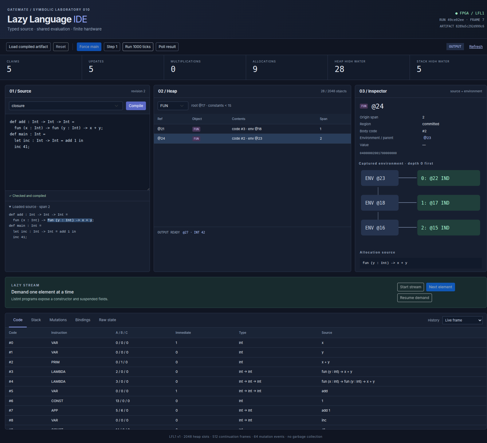
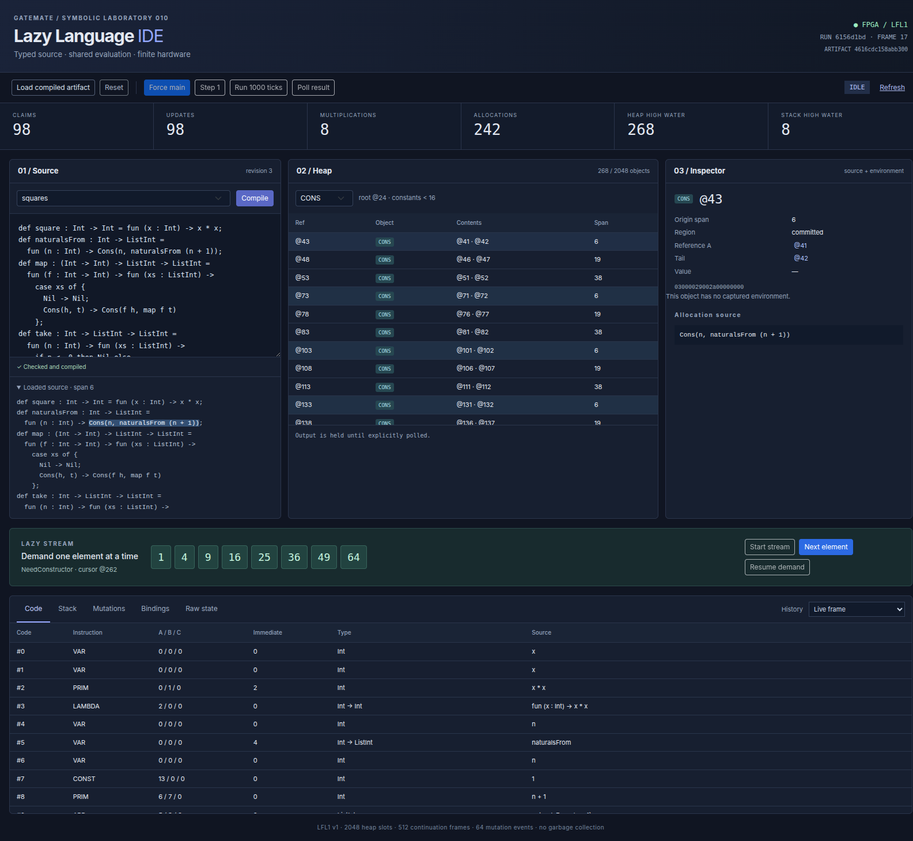

# LFL1: implemented language, machine and source-aware IDE

## Purpose and status

GATEMATE-SYMBOLIC-010 implements a small typed lazy functional language, a compiler, an independent source evaluator, a finite allocated Go machine, a synchronous GateMate implementation and a source-aware React IDE. The complete path from source text to physical FPGA execution is qualified. The FPGA passes a 10 MHz timing constraint with a routed maximum frequency of 21.26 MHz. Six source programs have been loaded over UART and checked against the Go machine at the level of committed heap objects, provenance, semantic counters and mutation events.

This document describes the implemented system. The longer design document in `design-doc/01-lazy-functional-language-intern-analysis-design-and-implementation-guide.md` explains the original alternatives and record layouts. The implementation diary preserves chronological investigation and validation. The later project article can reuse the screenshots indexed here; this handoff does not replace that future article.

The relevant code milestones are 657c706 for checking and independent evaluation, f58a283 for artifacts and compilation, 85bb6a3 for the allocated Go machine, a78ea08 for the synchronous core, e481650 for UART and physical qualification support, and 17c611a for the CLI and IDE.

## 1. Read the system in dependency order

A source program passes through distinct representations. Each representation establishes properties required by the next stage. Parsing establishes syntactic structure and byte spans. Checking resolves variable uses to declarations and verifies monomorphic types. Compilation replaces expression nodes with fixed-width code records and constructs an initial heap. A runtime executes those records and mutates only the dynamic heap region. The IDE displays immutable compilation artifacts alongside snapshots of a particular execution.

```text
source bytes
    |
    v
syntax.Parse ---- diagnostics ----> editor
    |
    v
check.Check ---- binding IDs, lexical depths, types
    |                                  |
    |                                  v
    |                         semantics.Observe
    |                         independent AST evaluator
    v
compile.Compile
    |
    v
immutable artifact: code + initial heap + source metadata
    |                                      |
    v                                      v
machine.New                         serial.Client.Load
Go stepped machine                  reset / write / readback / commit
    |                                      |
    |                                      v
    |                               lfl_link -> lfl_core
    |                                      |
    +---------- detached snapshots --------+
                       |
                       v
              Go session and HTTP API
                       |
                       v
              React / Redux / RTK Query
```

Begin with `pkg/lazylang/syntax/ast.go` and the parser README. Continue with `check.Check`, `compile.Compile`, `machine.step`, and `lfl_core.sv`. Read the UART client only after understanding the packed records. Read `internal/lazylanguageide/session.go` before the React application: the session defines the ownership and history rules that the UI exposes.

| File or directory | Responsibility |
| --- | --- |
| `pkg/lazylang/syntax` | Bounded lexer, handwritten parser, typed annotation syntax, diagnostics |
| `pkg/lazylang/check/check.go` | Binding resolution, lexical depth calculation, monomorphic checking |
| `pkg/lazylang/semantics/reference.go` | Independent lazy evaluation of checked source |
| `pkg/lazylang/ir/records.go` | Object, code and continuation packing |
| `pkg/lazylang/compile/compile.go` | Deterministic artifact construction and validation |
| `pkg/lazylang/machine/machine.go` | Finite heap, continuation stack, allocation and stepping |
| `lazy_language/rtl/lfl_core.sv` | Synchronous hardware execution and memory ports |
| `lazy_language/rtl/lfl_link.sv` | Checked ASCII-hex UART protocol |
| `pkg/lazylang/serial/client.go` | Context-bounded host operations and verified loading |
| `internal/lazylanguageide/session.go` | Run identity, snapshots, history and stream ownership |
| `web/src/lazylanguage/App.tsx` | Source, heap, closure, continuation and stream views |

## 2. Language and static meaning

The language has Int, Bool, ListInt and function types. Function arrows associate to the right. Functions are curried: a function accepting two source arguments is represented as a function returning another function. Every top-level declaration and let binding has an annotation; each lambda parameter is annotated. There is no polymorphic type inference, user-defined algebraic data type declaration, effect system or garbage collector.

```text
def add : Int -> Int -> Int =
  fun (x : Int) -> fun (y : Int) -> x + y;
def main : Int =
  let inc : Int -> Int = add 1 in
  inc 41;
```

`add 1` evaluates to a function whose body still refers to x. The runtime must preserve x's binding after the first application returns. That captured binding is an essential part of the returned function value. Calling inc with 41 extends the captured environment with y and evaluates x + y, producing 42.

The parser retains half-open UTF-8 byte spans. It recognizes application, arithmetic, comparisons, lambdas, let, let rec, if, Cons, Nil and the fixed two-branch list case form. Parsing is bounded by source size, token count, diagnostics, recursive nesting and resulting AST height. An editor may receive recovered complete definitions alongside diagnostics, but compilation rejects any diagnostic.

The checker first declares all top-level names, allowing mutual recursion. It then checks each definition. Local nonrecursive let checks its right-hand side in the outer environment; let rec checks that right-hand side in the extended environment containing its own binding. Shadowing creates a new binding identity. Variable uses record both their binding ID and their lexical depth. Depth zero means the first ENV object visited at runtime.

```text
check let x : T = rhs in body:
    binding = freshBinding(x, T)
    require type(rhs, outerEnvironment) == T
    return type(body, extend(outerEnvironment, binding))

check let rec x : T = rhs in body:
    binding = freshBinding(x, T)
    innerEnvironment = extend(outerEnvironment, binding)
    require type(rhs, innerEnvironment) == T
    return type(body, innerEnvironment)
```

List elements are Int and tails are ListInt. CASE introduces the head binding and then the tail binding, so the tail has lexical depth zero and the head depth one. Arithmetic and comparisons require Int operands; equality is not a polymorphic operation. Integer arithmetic uses checked signed 32-bit results.

## 3. Artifacts and deterministic compilation

`compile.Compile(ctx, source)` returns either an artifact or diagnostics. An artifact contains the exact source, entry type, packed instructions, initial heap, provenance IDs, source spans, binding metadata, variable uses and code types. Its version is `lfl1-go-1`; its profile is `LFL1-2048-512-64-v1`.

Artifact identity is SHA-256 over compact Go `encoding/json` output of the fixed Artifact struct with the ID field set to an empty string. The struct has no map fields. All arrays have defined order, and variable-use records are sorted by source offset before hashing. The same source produces the same artifact. Changing source text, including comments, changes artifact identity because source is part of the hashed representation.

An object is 80 bits: tag8, flags8, A16, B16 and payload32. An instruction is 128 bits: opcode8, flags8, A16, B16, C16, immediate32, span16 and reserved16. JSON transports these records as 20-character and 32-character hexadecimal strings. The frontend receives decoded bounded fields separately; it never converts an entire wide record into a JavaScript Number.

Instructions are emitted after their children. LAMBDA stores its body code ID; APP stores function and argument code IDs; VAR stores lexical depth. Recursive programs do not require cyclic instruction edges. Their recursion travels through heap thunks and environment references.

Heap addresses 0–9 hold errors 1–10. Addresses 10 and 11 hold false and true; 12 holds NIL. Integer literals are deduplicated in first source-occurrence order, starting at 13. The immutable prefix ends at constantEnd. Each global definition then receives a THUNK and an ENV object. All global thunks capture the final ENV head, which makes every top-level definition available recursively.

`Artifact.Validate` checks digest, profile, bounds, pinned objects, initial heap tags and links, code operand ordering and source-span bounds. `serial.Client.Load` invokes validation before sending reset or any other device mutation. Validation establishes the binary shape accepted by the runtime; the runtime still checks dynamic reference, type, stack, heap and ownership faults.

The earlier hand-derived shared fixture assigns constant addresses differently and uses symbolic span IDs. It remains a semantic design fixture. `TestSharedLayout` specifies the compiler's actual layout rather than treating that earlier fixture as exact compiler output.

## 4. Lazy execution and sharing

A THUNK records expression code and its captured environment. Entering the thunk reserves an UPDATE continuation, marks the heap slot BLACKHOLE and evaluates the body. A completed evaluation returns a reference to a terminal object. UPDATE changes the claimed slot to IND(resultRef), preserving its original provenance. A later demand follows that indirection and reuses the result.

```text
enter(reference):
    object = readHeap(reference)
    if object is a terminal value or ERROR:
        return reference
    if object is IND:
        enter(object.target), subject to indirection bound
    if object is BLACKHOLE:
        return pinned CYCLIC_THUNK
    if object is THUNK:
        reserve UPDATE frame before changing the object
        save body and environment
        write BLACKHOLE at reference
        evaluate body in saved environment

return through UPDATE(claimedReference):
    require heap[claimedReference] is BLACKHOLE
    require returned reference denotes a terminal object
    write IND(returnedReference) at claimedReference
    preserve source provenance
    continue returning the same reference
```

BLACKHOLE identifies a thunk whose evaluation is already in progress. Re-entering that thunk produces cycle fault 3. Productive recursion can still construct an infinite list because constructing CONS does not enter its head or tail. The program `let rec xs : ListInt = Cons(1, xs) in xs` therefore returns a constructor and can produce repeated ones under finite observation.

Function application evaluates the function position, then allocates an argument thunk capturing the caller environment and an ENV object extending the function's captured environment. The body executes in that extended closure environment. This distinction between caller and closure environments is necessary for lexical scope.

Arithmetic evaluates left before right. A fault on the left bypasses the right operand. Successful addition, subtraction and multiplication allocate Int results; comparisons return pinned Bool objects. Signed overflow returns fault 6. Fault propagation unwinds UPDATE frames so claimed thunks become memoized error indirections. Heap exhaustion returns a pinned error without requiring another allocation.

## 5. Allocation and synchronous hardware

The profile has a 2,048-object heap and a 512-frame stack. Allocation is a finite bump allocator. There is no reclamation within a run. Each operation first checks its entire allocation requirement: APP and let need two objects, CONS three, CASE two ENV objects, and function or Int results one object.

```text
reserve [base, reservedEnd)
    |
    v
write every private object
    |
    v
write every provenance entry
    |
    v
publish committedTop = reservedEnd
    |
    v
emit each allocation trace event
    |
    v
resume evaluation
```

Tick-budget pauses preserve the allocation stage and next-write index. A private partially initialized object is not reachable through committedTop. The debugger can display that private range as allocation progress without treating it as an executable object.

The FPGA uses five synchronous RAM instances: heap 2048×80, code 2048×128, provenance 2048×16, continuation stack 512×128 and trace 64×256. RAM requests and consumed responses occur in separate controller states. The UART debugger multiplexes memory read addresses while execution is paused. Multiplication uses a 32-step signed shift/add operation.

The Go implementation is an abstract stepped machine with corresponding evaluation and allocation states. It is not currently a cycle-exact hardware simulator. Hardware explicitly rereads returned objects and saved primitive operands through synchronous RAM, while the Go model accesses some of those values directly. Cycle counts, heap-read totals and trace timestamps therefore differ. Semantic counts, final heap/provenance and mutation content are the qualified cross-implementation contract.

Final routed resources are 34 of 64 RAM halves, 3,804 of 40,960 flip-flop resources and 14,359 of 40,960 CPE logic resources. Logic exceeds the preliminary 10,000-resource estimate; RAM remains below the planned 40-half allowance. The implemented design fits and routes at 21.26 MHz maximum against the board's 10 MHz clock constraint. These figures describe this routed build, not a generic guarantee for future changes.

## 6. UART loading and runtime operations

The protocol signature is LFL1 version 1. Payload requests encode bytes as hexadecimal and append a one-byte XOR checksum. The command character is excluded from the checksum. Nonpayload requests contain the command and LF. Query and output records contain a prefix, 16 data bytes, checksum and LF, for 36 ASCII characters.

| Request | Meaning |
| --- | --- |
| R | Reset and discard current execution |
| B | Begin load with code count, heap count, root and constantEnd |
| C | Write the next contiguous 128-bit code record |
| H | Write the next contiguous 80-bit initial heap object |
| V | Write the next contiguous 16-bit provenance value |
| K | Commit a complete load |
| F | Demand a heap reference while idle |
| T | Advance at most 1,000,000 enabled ticks |
| P | Consume an offered result reference, or return empty |
| Q | Read a profile, state, counter or memory page |

The host load sequence is validate, reset, verify signature, begin, write all memories, read every written record back, then commit. Readback mismatch prevents K. Transport errors, malformed responses and uncertain operation outcomes invalidate synchronization. The client does not automatically retry a side-effecting operation. Reset or a fresh verified load establishes a new known run.

Debug pages 0–4 describe profile, state, image bounds, trace and allocation. Counter pages are 16–38. Heap pages start at 0x1000, code at 0x2000, stack at 0x3000 and provenance at 0x4000. Each trace event occupies two pages starting at 0x5000. `Client.Snapshot` assembles these records into detached machine state.

## 7. IDE identity, controls and streaming

Compilation does not load or reset the machine. The editor increments clientRevision after each edit and accepts compilation results only for its current revision. A loaded artifact remains associated with its original source even when the editor contains different text. The source preview and heap provenance use the loaded or historical artifact, not the current textarea contents.

Every execution frame has a monotonically increasing ID and a run ID. Load and reset create new run IDs. Controls must include the current expectedId and runId; stale requests fail before mutation. History retains 128 detached frames and is read-only. Artifact caching preserves artifacts referenced by retained history. An execution or snapshot failure produces a frame marked needsReset instead of presenting an old snapshot as current state.

| HTTP API | Contract |
| --- | --- |
| GET `/api/language/examples` | Six embedded source programs |
| POST `/api/language/compile` | `{source, clientRevision}` to diagnostics or artifactId |
| GET `/api/language/artifacts/{id}` | Immutable artifact and decoded code rows |
| GET `/api/language/state` | Current frame and retained history metadata |
| GET `/api/language/history/{id}` | A detached historical frame |
| POST `/api/language/control` | Operation plus expectedId and runId |

Control kinds are load, reset, force, tick, poll, stream-start, stream-next and stream-resume. The service uses a mutex to serialize complete operations. Compilation performs its expensive source work outside the session lock and stores the resulting immutable artifact under the lock. HTTP mutation bodies require JSON, unknown fields are rejected, and loopback Host/origin checks protect the local device endpoint.

A stream owns execution until reset or load. Its phase is NeedConstructor or NeedHead. A pending request records whether its force command was already sent. Resume continues that same request. After a head becomes Int, the session appends exactly one value and moves its cursor to the tail reference without demanding that tail. A duplicate next while pending is rejected; clients can inspect state after a lost response instead of retrying blindly.

```text
stream-next:
    require no pending request and stream not complete
    pending = true
    advance within tick budget

advance:
    send current demand once
    tick and poll within budget
    if no result before budget ends: retain pending state
    if constructor is NIL: mark complete
    if constructor is CONS: remember tail; demand head next
    if head is Int:
        append one value
        cursor = remembered tail
        pending = false
        stop without demanding cursor
```





## 8. Measured execution results

The physical qualification test loads each artifact independently, performs demands and compares the physical result with the allocated Go machine. It compares every committed heap/provenance record and all semantic counters. Mutation-event comparisons exclude timestamps because the machines have different read timing.

| Program | Observed result | Heap high water | Claims / updates | Multiplications |
| --- | --- | ---: | ---: | ---: |
| shared | 168 | 28 | 4 / 4 | 1 |
| closure | 42 | 28 | 5 / 5 | 0 |
| unused | 7 | 23 | 2 / 2 | 0 |
| cycle | error 3 | 17 | 2 / 2 | 0 |
| productive | eight ones | 21 | 4 / 4 | 0 |
| squares | 1, 4, 9, 16, 25, 36, 49, 64 | 268 | 98 / 98 | 8 |

The checked-in shared program calls a named global double function. Its four claims differ from the inline design fixture's three claims because forcing the global function is another shared thunk. Both perform one multiplication. The inline fixture returns at ref 25 after nine runtime allocations; the named example returns at ref 27.

The squares observation makes 242 runtime allocations and reaches a maximum continuation depth of eight. Its first-64 mutation trace drops 374 later events. The trace is a bounded prefix, not a complete execution history. A prefix of eight values does not prove list termination: a ninth constructor demand is required to observe the terminating NIL in the finite take example.

## 9. Reproduce and review

Use the top-level Go module and pnpm installation. The standard Go build does not require generated embedded assets; production builds use the embed tag after generation. The standalone CLI emits JSON and supports compile, reference and run actions.

```sh
go run ./cmd/lazy-language --source examples/lazylang/shared.lazy --action compile
go run ./cmd/lazy-language --source examples/lazylang/shared.lazy --action reference
go run ./cmd/lazy-language --source examples/lazylang/squares.lazy --action run

go generate ./internal/lazylanguageide
go run ./cmd/lazy-language-ide --listen 127.0.0.1:18091 --engine model
# Run servers in tmux. Only one process may own the physical UART.
go run -tags embed ./cmd/lazy-language-ide --listen 127.0.0.1:18092 --engine serial --device /dev/ttyACM0
```

`--ticks` bounds a CLI observation. A paused model result is emitted as paused state; the CLI does not silently remove that bound. `--prefix` limits list heads. The browser provides persistent Resume controls for longer observations.

```sh
go test ./... -count=1
go test -race ./pkg/lazylang/... ./internal/lazylanguageide
go build ./...
go build -tags embed ./...
go vet ./...
make lint
make govulncheck
pnpm --dir web test
bash lazy_language/scripts/test.sh
bash lazy_language/scripts/build.sh
```

The physical test is skipped unless an explicit device argument is supplied. Stop an owned serial IDE before running it. The retained ticket script `scripts/21-physical-qualification.sh` captures UART traffic and runs the six-program comparison. `scripts/22-validate-implementation.sh` runs the repository/CLI/frontend checks. Browser scripts 19, 23 and 24 reproduce the model flow, physical flow and history/diagnostic boundary checks.

Final validation passes repository tests, affected race tests, default and embedded builds, Go vet, pinned Glazed lint, all 20 frontend tests, the RTL and UART suites, six physical programs and the browser flows. Govulncheck reports zero reachable vulnerabilities; it also notes vulnerabilities in imported packages or required modules whose affected symbols are not called.

## 10. Screenshot and evidence index

All eleven original PNG files are retained under `reference/screenshots`. The first four are model loaded-source, shared-result, closure and stream views. Files 05–08 show the same principal flows on the physical FPGA. Files 09–11 show a paused claim with UPDATE frame, read-only history and a type diagnostic. Prefer the physical images for claims about the board; use the paused model image to explain the continuation invariant.

The validation directory retains routed build output, programming output, physical test output, complete UART capture, Go/frontend/lint logs and work-slip receipts. `implementation-audit.json` indexes and hashes the evidence. The diary records failures as well as successful reruns: a missing default simulator PATH, one reserved-word testbench error, two browser harness selector errors and network-restricted tool installation. None remains an unresolved implementation failure.

The important remaining limits are explicit: finite heap with no GC; monomorphic source types; a 64-event trace prefix; 128 retained UI frames; no cycle-exact equality between Go and hardware; and a local single-device service. These limits do not prevent the qualified examples or interactive inspection. Extending them requires corresponding changes to representation, control ownership and validation rather than only adding frontend controls.
