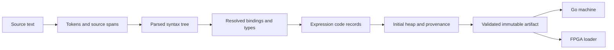
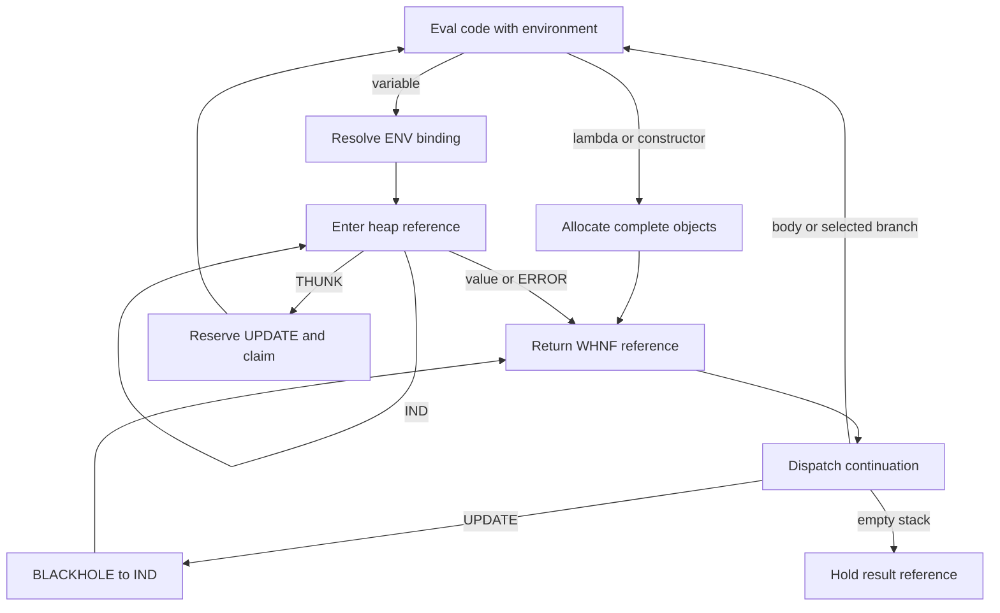
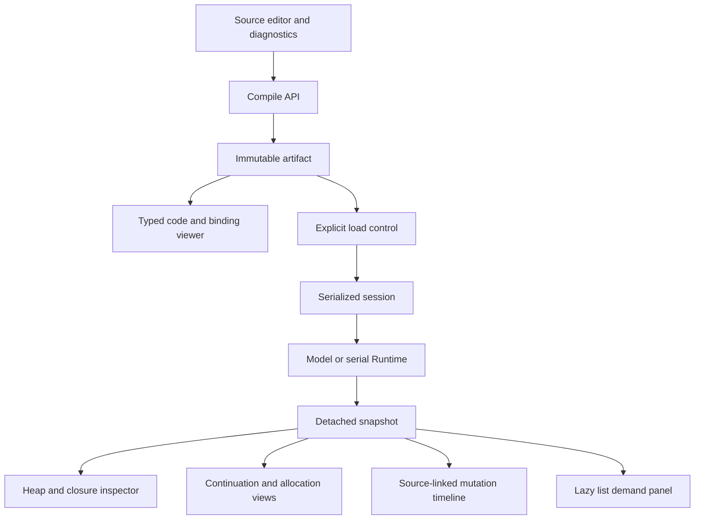

# A Lazy Functional Language and Source-Aware FPGA IDE

## 1. Purpose, status, and first result

This guide specifies a small functional language that compiles to an inspectable, allocated lazy machine on GateMate. Its purpose is to connect a source-level binding to the concrete heap objects, continuation frames, and updates that implement it. The reader should be able to explain why a function argument remains unevaluated, how a closure retains its lexical bindings, and why requesting a finite list prefix does not require constructing the remainder of an unbounded list.

This is a proposed implementation contract for GATEMATE-SYMBOLIC-010. The existing Lab 4 arithmetic graph reducer is implemented and physically qualified at revision 79f28e6; the language compiler and runtime described below do not exist yet. All filenames labeled proposed are work to create, and every acceptance result below is a future test requirement. The design package is the current delivery. Implementation tasks I1 through I6 remain open.

The first complete milestone is deliberately small:

```text
def double : Int -> Int = fun (n : Int) -> n * 2;
def main : Int =
  let x : Int = double 21 in
  (x + x) + (x + x);
```

Main must return 168. The runtime must claim the thunk representing x once, execute one multiplication, and update x to an indirection to the resulting integer object. Clicking the binding in the IDE must identify that thunk and its mutation history. A second demand for the same completed main object must return its stored result without repeating the body. Unlike the old manually constructed graph, top-level main itself is a shared thunk in this language.

The later demonstration is a bounded observation of a recursively defined list: take eight squares from an unbounded sequence of integers. The expected visible values are 1, 4, 9, 16, 25, 36, 49, and 64. The implementation must establish the claim by testing the compiled program, allocation counts, and demand behavior; this guide does not present a hypothetical trace as a measured FPGA result.

## 2. What exists and what must change

Lab 4 stores a contiguous 1024-word image of 40-bit integer, arithmetic, thunk, indirection, blackhole, error, and free nodes. Its explicit continuation stack has 512 entries of 80 bits. It follows child addresses, evaluates checked int32 arithmetic, and replaces a claimed thunk directly with its integer or error word. There is no runtime allocator, variable binding, function application, constructor value, or code memory.

The existing host boundary is pkg/lazy.Engine, with Execute, Snapshot, and Close. The model and serial implementation share this boundary. internal/lazyide.Session serializes operations, checks expected frame IDs, and records detached observations. The React inspector provides heap, stack, trace, and history views. These are useful precedents for ownership and observation, but their types encode the old integer-only experiment.

| Existing element | Design lesson | New requirement |
|---|---|---|
| THUNK claim and UPDATE | Reserve recovery state before mutation | Carry the same obligation for heap-reference results |
| Fixed loaded graph | References establish sharing | Allocate new thunks, closures, environments and constructors |
| Result Word | Scalars fit directly in a cell | Return a reference to a value object |
| EVAL_RIGHT/APPLY | Explicit frames make recursion bounded | Add application, branch, case and update continuations |
| Paused UART snapshots | Inspection must not execute the machine | Inspect code, provenance and allocation transactions too |
| Expected frame IDs | Reject stale controls | Include run identity and immutable compiled artifact identity |
| Model/reference comparison | Independent semantics detects transition errors | Compare source evaluation with compiled-machine observations |

Create a separate experimental target rather than changing the meaning of the qualified LAZY protocol. The proposed package is pkg/lazylang, hardware directory lazy_language, and command names lazy-language and lazy-language-ide. Share established low-level UART and synchronous RAM modules where their interfaces already match. Do not create a compatibility layer or adapt the new public runtime interface to pkg/lazy.Engine. Both laboratories remain directly runnable as separate experiments.

## 3. Semantic foundation

Call-by-need combines deferred evaluation with shared update. A binding refers to an object whose body is evaluated only when demanded. If evaluation succeeds, the binding subsequently forwards to the value. If it fails, it forwards to a memoized error. Multiple variable occurrences refer to that one binding object; copying source text is not the runtime sharing mechanism.

The new machine evaluates to weak head normal form, abbreviated WHNF. For this language, integers, booleans, function closures, Nil, and Cons are WHNF. A Cons object contains head and tail references, but returning that constructor does not evaluate either field. A function closure contains code and an environment, but returning it does not execute its body. ERROR is a terminal runtime outcome propagated through the same return mechanism.

Consider Cons(1 + 2, naturalsFrom 4). To expose its outer constructor, the machine allocates thunks for the two fields and a Cons referencing them. Demanding the head subsequently computes 3. Demanding the tail subsequently enters naturalsFrom 4. These are three different demands. The IDE must not recursively stringify the entire value in a way that accidentally forces both fields.

The STG literature describes the responsibilities of closures, deferred computations, and updates, and heap-based call-by-need semantics distinguishes a program's expression from its suspended bindings. This project adopts those responsibilities but uses its own small expression-code machine, with linked environments and explicit hardware bounds. It is not a port of STG, a Haskell implementation, or a claim that an existing formal proof applies to this runtime. See the [STG publication](https://www.microsoft.com/en-us/research/publication/implementing-lazy-functional-languages-on-stock-hardware-the-spineless-tagless-g-machine/) and [Nakata and Hasegawa](https://arxiv.org/abs/0907.4640); local copies and applicability notes are in reference/02.

## 4. Source language and type rules

Identifiers use ASCII letters, digits and underscore, starting with a letter or underscore; keywords are reserved. Whitespace and // comments to end of line separate tokens, and comments may contain Unicode. The first version is pure and monomorphic. Its types are Int, Bool, ListInt, and right-associative function types T -> U. Int has checked signed 32-bit arithmetic. ListInt contains integer heads and ListInt tails. Restricting lists to integers avoids introducing parametric polymorphism while retaining a useful higher-order map operation.

Top-level definitions require a type signature. Lambda parameters require annotations. Local let and let rec bindings require annotations too. The compiler checks expression types against these annotations; it does not implement Hindley-Milner generalization, type classes, or polymorphic recursion. Function application is curried: each lambda accepts one argument, and applying a function to several arguments is a left-associated sequence of applications.

```text
program ::= definition+ EOF
definition ::= "def" name ":" type "=" expr ";"
type ::= "Int" | "Bool" | "ListInt" | "(" type ")" | type "->" type
expr ::= integer | true | false | name
       | "fun" "(" name ":" type ")" "->" expr
       | expr expr
       | "let" name ":" type "=" expr "in" expr
       | "let" "rec" name ":" type "=" expr "in" expr
       | expr ("+" | "-" | "*" | "==" | "<=") expr
       | "if" expr "then" expr "else" expr
       | "Nil" | "Cons" "(" expr "," expr ")"
       | "case" expr "of" "{" "Nil" "->" expr ";"
           "Cons" "(" name "," name ")" "->" expr "}"
       | "(" expr ")"
```

This grammar is a readable summary; implement explicit precedence, not a parser with unresolved left recursion. Application binds most tightly, then multiplication, then addition/subtraction, then comparisons. Comparisons do not chain. The constructs fun, let, if and case extend as far right as their delimiters permit. Function arrows associate right. The lexer emits a separate minus token. In an expression-atom position, the parser may combine minus with an integer token and range-check the signed magnitude, including -2147483648. In an infix position it denotes subtraction, so n-1 parses identically to n - 1. Unary minus on arbitrary expressions is not in version 1.

Type checking requires arithmetic operands to be Int, comparisons to produce Bool, an if condition to be Bool, and both branches to have equal types. Case accepts ListInt; its Cons branch introduces head : Int and tail : ListInt, and both branches must agree in type. Constructor syntax is fully saturated. Passing Cons itself as a function is not supported initially.

A nonrecursive let checks the right-hand side in the old environment and the body in the extended environment. A let rec checks both in the extended environment. All top-level definitions form one mutually recursive group with declared signatures, so a definition may refer to a later one. Duplicate names in a group are errors; nested shadowing is allowed. Exactly one definition named main is required. Main may have any supported type; the UI selects controls appropriate to its checked result type.

Purity excludes I/O, mutable source variables, exceptions catchable by source code, and nondeterministic primitives. Runtime faults are observable diagnostic outcomes. The specified evaluation order for strict primitives is left-to-right and fail-fast. If and case evaluate only the selected branch. Argument expressions and constructor fields are lazy.

## 5. Worked source programs and their obligations

The shared double example establishes deferred function application and update. Add a non-strictness example:

```text
def ignore : Int -> Int = fun (x : Int) -> 7;
def bad : Int = bad;
def main : Int = ignore bad;
```

The result must be 7. There must be no claim of bad merely because it was passed as an argument. The compiler may allocate an argument thunk; allocating a suspension does not mean entering its body. A separate program with main = bad must report CYCLIC_THUNK and leave all claimed thunks updated to errors.

Closure capture is exercised by partial application:

```text
def add : Int -> Int -> Int =
  fun (x : Int) -> fun (y : Int) -> x + y;
def main : Int =
  let inc : Int -> Int = add 1 in
  inc 41;
```

Evaluating add 1 returns a FUN object whose captured environment contains the binding for x. Applying inc to 41 extends that captured environment with y. The value is 42 even though the original application has returned. This test detects an implementation that mistakenly uses the caller's current environment instead of the closure's saved one.

The full list demonstration uses only the version-1 language:

```text
def square : Int -> Int = fun (x : Int) -> x * x;
def naturalsFrom : Int -> ListInt =
  fun (n : Int) -> Cons(n, naturalsFrom (n + 1));
def map : (Int -> Int) -> ListInt -> ListInt =
  fun (f : Int -> Int) -> fun (xs : ListInt) ->
    case xs of {
      Nil -> Nil;
      Cons(h, t) -> Cons(f h, map f t)
    };
def take : Int -> ListInt -> ListInt =
  fun (n : Int) -> fun (xs : ListInt) ->
    if n <= 0 then Nil else
      case xs of {
        Nil -> Nil;
        Cons(h, t) -> Cons(h, take (n - 1) t)
      };
def main : ListInt = take 8 (map square (naturalsFrom 1));
```

The heap is finite and there is no collection. This program supports a finite observed prefix, not unlimited execution. The 2048-object target must be tested with this exact program during I3. If it does not fit, measure its allocation profile and document a revised target before proceeding to hardware; do not silently evaluate the program on the host and label the result physical.

A productive recursive value and a cyclic demand are different. For example, let rec xs : ListInt = Cons(1, xs) in xs can produce a constructor without entering its tail. It is productive at WHNF. The definition let rec x : Int = x in x immediately demands its own live claim and faults. Tests must include both.

## 6. Compiler pipeline and binding representation

Compilation is deterministic and has no device effects. The frontend submits source text; the Go compiler tokenizes it with spans, parses it, resolves names, checks types, lowers expression descriptors, creates the initial heap, and emits an immutable artifact. Only a later Load operation changes an engine.



Use tokenize, parse, allocate binding IDs, resolve references, type-check, then lower. Both binding analysis and type checking use the same stable binding IDs. Preserve the parsed tree for the semantic reference so it does not execute the emitted descriptors.

The first runtime uses a linked lexical environment. An ENV object stores one binding reference and the previous environment reference. The compiler lowers each variable to its zero-based lexical depth: depth zero refers to the newest binding. Variable lookup follows parent links to that depth and then enters the binding reference. The null environment is the non-address sentinel 0xffff. Heap references are always checked before RAM address truncation.

A function object captures the environment pointer present when its lambda is evaluated. This captures the entire environment chain, not a compact vector containing only free variables. The compiler still computes free-variable information for the IDE and analysis, but does not use it to change the runtime layout in version 1. This makes shadowing and recursive bindings explicit at the cost of lookup cycles and retaining objects the closure may never use.

For an n-definition top-level recursive group, allocate n thunk objects and n ENV objects after the constant pool. Environment cells are ordered deterministically by source definition order, with the last definition at depth zero. Every top-level thunk captures the same final environment head. Each body is compiled against that name order. The main root is its thunk's heap address. Constants and all initial addresses are deterministic for identical source and profile.

For a local nonrecursive binding, allocate a THUNK whose environment is the old environment and an ENV pointing to that thunk and the old environment. The body executes with the new ENV. For a recursive binding, allocate the same two objects but point the thunk's environment to the new ENV itself. Both objects must be initialized before publishing the new environment.

## 7. Object, code, and continuation formats

The baseline profile proposes 2048 heap objects of 80 bits, 2048 code records of 128 bits, 512 continuation frames of 128 bits, one 16-bit allocation-source ID per heap object, and 64 mutation records of 256 bits. These are targets to validate, not routed utilization measurements. All serialized quantities have explicit widths and byte order.

An object occupies exactly 80 bits:

| Bits | Field |
|---|---|
| 79..72 | Tag, unsigned 8 bits |
| 71..64 | Flags, zero in version 1 |
| 63..48 | A, unsigned 16 bits |
| 47..32 | B, unsigned 16 bits |
| 31..0 | Payload, unsigned bits or signed int32 according to tag |

| Tag number | Kind | A | B | Payload |
|---:|---|---|---|---|
| 0 | INT | 0 | 0 | Signed int32 bits |
| 1 | BOOL | 0 | 0 | 0 or 1 |
| 2 | NIL | 0 | 0 | 0 |
| 3 | CONS | Head reference | Tail reference | 0 |
| 4 | FUN | Body code ID | Captured ENV reference | 0 |
| 5 | THUNK | Body code ID | Captured ENV reference | 0 |
| 6 | IND | Target reference | 0 | 0 |
| 7 | BLACKHOLE | 0 | 0 | 0 |
| 8 | ENV | Binding reference | Parent ENV or 0xffff | 0 |
| 13 | ERROR | 0 | 0 | Fault code |
| 15 | FREE | 0 | 0 | 0 |

The runtime returns Ref, a 16-bit heap address, rather than copying a value word through every frame. Enter follows IND until reaching a terminal value, an error, or a thunk to evaluate. UPDATE writes IND(resultRef) into a matching BLACKHOLE. Values and ENV objects are immutable after publication; only THUNK-to-BLACKHOLE and BLACKHOLE-to-IND are ordinary in-place updates. No path compression is included initially.

Reserve ten ERROR constants at addresses 0 through 9 for codes 1 through 10, then false at 10, true at 11, and Nil at 12. Deduplicated integer constants follow in first source-occurrence order. This immutable prefix ensures that reporting an out-of-memory error does not itself require allocation. Record constantEnd in the artifact and forbid mutation below it. Address zero is a valid error-object reference; absence must use 0xffff or a separate validity bit.

Fault codes 1..7 retain the meanings address, continuation overflow, cyclic thunk, indirection bound, type, arithmetic overflow, and ownership. Code 8 is HEAP_FULL, 9 is BAD_CODE, and 10 is BAD_ENVIRONMENT. Retaining the numeric names is a design convenience, not protocol compatibility. Static type checking reduces the frequency of runtime type faults, but the hardware must still reject malformed objects and code.

Code records are fixed 128-bit descriptors, not native instructions and not instructions for the earlier stack CPU:

| Bits | Field |
|---|---|
| 127..120 | Expression opcode |
| 119..112 | Flags, zero |
| 111..96, 95..80, 79..64 | A, B, C, each unsigned 16 bits |
| 63..32 | Immediate, unsigned 32-bit field |
| 31..16 | Source span ID |
| 15..0 | Reserved, zero |

| Opcode | Number | Operands |
|---|---:|---|
| CONST | 0 | A = constant-pool reference |
| VAR | 1 | Immediate = lexical depth |
| LAMBDA | 2 | A = body code ID |
| APP | 3 | A = function code, B = argument code |
| LET | 4 | A = right side, B = body |
| LETREC | 5 | A = right side, B = body |
| PRIM | 6 | A = left, B = right; immediate = primitive number |
| IF | 7 | A = condition, B = then, C = else |
| CONS | 8 | A = head expression, B = tail expression |
| CASE | 9 | A = scrutinee, B = Nil branch, C = Cons branch |

Primitive numbers are ADD=0, SUB=1, MUL=2, EQ=3, LE=4. Unused descriptor fields must be zero. Nil and Bool expressions lower to CONST. Variable depth is restricted below the profile's heap capacity; code IDs must be below codeCount. The compiler emits code children before parents in stable traversal order; recursion occurs through heap environments and variable references, not cyclic code records.

A continuation has kind8, opcode8, A16, B16, C16, D16, savedRef16, span16, and reserved16, from high bits to low bits. This totals 128 bits. Reserve unused fields as zero and define decoding in one package. Frame kinds are ARG=1, PRIM_RIGHT=2, PRIM_APPLY=3, IF=4, CASE=5, UPDATE=6. A holds an argument/right/branch code ID or update address; B normally holds the saved environment, and C holds an alternate branch. The complete per-frame field use appears in the transition section.

## 8. Allocation is a bounded publication transaction

A bump allocator returns consecutive unused object addresses. With no garbage collector, addresses remain stable until reset. A runtime object handle is therefore the pair of run ID and address; an address reused after reset is a different object. Within one run, allocation order also gives a stable order for inspection.

Allocation requests are small but sometimes require several related objects. CONS requires two field thunks and one constructor. Function application requires an argument thunk and an ENV. LET and LETREC require a thunk and an ENV. A case branch requires two ENV cells for the existing head and tail references. LAMBDA and successful integer arithmetic each require one new value object. CONST, VAR, comparison results and fault results need no new object.

Check the complete requested count before any write. Retain an allocation transaction containing the requested objects, their references, the eventual return or continuation action, and the next write index. Use committedTop for the valid heap prefix and reservedEnd for the private transaction limit. Partial writes above committedTop are not published heap objects and are excluded from ordinary snapshots. A paused allocation is represented explicitly in control-state metadata.

```text
allocate_batch(objects, continuation):
    n = length(objects)
    if n > heapCapacity - committedTop:
        return pinned_error(HEAP_FULL)
    base = committedTop
    resolve transaction-local references using base
    reserve [base, base+n) privately
    for each object i:
        write full object and allocation source ID
    committedTop = base+n
    execute continuation using published references
```

On the FPGA, these steps take multiple cycles; the final publication occurs only after the last object and provenance write. Debug reads may interrupt execution but must preserve the transaction registers. Tick-budget exhaustion pauses, leaving the transaction resumable. Reset discards both committed and private state. There is no operation that abandons a live allocation but keeps running the old continuation.

If reservation fails, committedTop and all heap words remain unchanged by that allocation request. The pinned HEAP_FULL reference enters the error-return path, which must still update all outstanding claimed thunks. UPDATE itself requires no allocation because it writes an IND to the already available result reference. This property is necessary for reliable out-of-memory unwinding.

A transaction's initialization writes may be observed in a specialized diagnostic view, but they are never forceable through the public reference API before publication. The version-1 UI only shows the committed prefix and transaction progress counters. Add richer private-memory inspection later if it helps debugging.

## 9. Evaluation and return transitions

The conceptual controller has Eval(code, env), Enter(ref), Return(ref), environment lookup, allocation, arithmetic, and Output states. Hardware adds synchronous code/heap/stack wait states. Eval interprets one expression descriptor; Enter demands an existing heap object. Keeping these operations separate avoids treating a code address as a heap address.



### Enter and update

Entering INT, BOOL, NIL, CONS, FUN or ERROR returns its reference unchanged. Entering ENV or FREE is TYPE_FAULT. Entering a THUNK reserves one UPDATE frame before claiming. Save its body and captured environment in controller registers, push UPDATE(A=thunkRef), write BLACKHOLE, and evaluate the saved body. The complete frame and claim commit together. Any internal BLACKHOLE belongs to the one evaluator and produces CYCLIC_THUNK.

Returning to UPDATE requires a valid address containing BLACKHOLE. The returned reference must name a terminal value or ERROR; returning the claimed cell itself is invalid. Replace the cell with IND(resultRef), pop the frame, and keep returning the same reference. On error, perform the identical update. This leaves the original binding address usable for later demands and preserves a canonical target object for compound values.

Consecutive IND traversal is bounded by heap capacity. Reset the counter when entering a non-IND node. Environment traversal has its own bound and checks that every followed object is ENV; failure yields BAD_ENVIRONMENT. Neither loop may truncate an invalid 16-bit address into a valid physical RAM index.

### Application and closure capture

Eval APP(f, arg) pushes ARG(A=argCode, B=callerEnv) and evaluates f in callerEnv. If f returns ERROR, pop ARG and propagate it. Otherwise require FUN(body, capturedEnv). Reserve two objects: THUNK(argCode, callerEnv) and ENV(argumentRef, capturedEnv). After publication, pop ARG and evaluate body with the new ENV. No separate return-address frame is needed because the caller's remaining continuation is already beneath ARG.

The argument thunk captures the caller's environment; the body environment extends the function's captured environment. Confusing those two pointers breaks lexical scoping. The partial-application example is the first required test of this distinction. A lambda body can itself return another FUN, naturally representing a partially applied curried function without a separate partial-application object type.

### Let, branches, and constructors

LET allocates its two-object binding as described above and evaluates its body with the new environment. LETREC uses the newly allocated environment for both the suspended right side and the body. Neither operation forces the right side. There is no let-return frame because the body is in tail position relative to the current continuation.

IF pushes IF(A=thenCode, B=env, C=elseCode) and evaluates the condition. On BOOL return, pop the frame and evaluate only the selected branch with B. On error, propagate; on any other value, return TYPE_FAULT.

CONS allocates THUNK(headCode, env), THUNK(tailCode, env), and CONS(headRef, tailRef), then returns the constructor reference. The head and tail remain suspended. CASE pushes CASE(A=nilCode, B=env, C=consCode) and evaluates the scrutinee. NIL selects A. CONS allocates ENV(headRef, oldEnv), then ENV(tailRef, headEnv); the branch environment therefore has tail at depth zero and head at depth one. The compiler resolves the pattern names in this exact order. Fields are bound as references and are not copied or forced by the match.

### Primitives and faults

PRIM pushes PRIM_RIGHT(opcode=primitive, A=rightCode, B=env) and evaluates the left expression. On successful INT return, overwrite that frame with PRIM_APPLY(opcode=primitive, savedRef=leftRef), then evaluate the right expression in the saved environment. Errors skip the right side. Returning the right INT performs checked arithmetic or comparison and pops the frame.

ADD and SUB use a widened signed intermediate; MUL uses a 64-bit result and may reuse the old iterative arithmetic algorithm with a directly compatible internal datapath. Successful arithmetic allocates one INT object. Comparisons return the pinned BOOL reference. If arithmetic or result allocation fails, return the corresponding pinned ERROR reference. Type faults and existing errors do not start the arithmetic unit.

All continuation errors pop the current frame before propagating, except an allocation transaction still in progress, which is resumed rather than interpreted as an error. An empty stack offers a result only after a complete WHNF/error reference is available. Output remains stable until Poll. Tick-budget exhaustion never fabricates a language error or unwinds the stack.

## 10. Independent semantics and observable equivalence

Implement the reference evaluator over the resolved source AST with a map-based semantic heap and language-level closures. It must not decode the compiled code records or call the stepped machine. A separate lexical environment maps binding IDs to semantic cells. Recursive lets allocate a cell before installing its suspended expression and environment. Demand marks the cell evaluating, recursively computes WHNF, then records its value or error.

The reference may use Go recursion with an explicit evaluation fuel bound so a malformed or divergent test does not hang the test runner. Exhausted reference fuel is an inconclusive test outcome, not CYCLIC_THUNK or HEAP_FULL. Keep semantic tests comfortably below configured machine capacities when comparing successful outcomes.

```text
force(cell):
    if cell.state == Done: return cell.value
    if cell.state == Evaluating: return CyclicThunk
    cell.state = Evaluating
    value = eval(cell.expression, cell.environment)
    cell.state = Done
    cell.value = value
    return value
```

Machine and reference heaps need not have identical addresses or object counts. Compare observed scalar results, constructor shape to a bounded depth, requested list prefixes, selected-branch behavior, and sharing identities for source bindings. The stepped Go machine and RTL do share an allocation schedule and packed artifact format, so those two implementations can additionally compare final object words, source IDs, semantic counters and ordered mutations, excluding cycle timestamps.

Keep a small specification model of capacities for stack and allocation error tests. Such tests target implementation bounds and error cleanup, rather than pretending the unbounded source semantics has the same resource limits. Random source generators must produce well-typed programs with bounded syntax and demand depth, and shrink failures to a retained source program plus artifact.

## 11. Artifact and source provenance contracts

An artifact contains source text, a compiler version, target profile, typed entry signature, code records, initial heap, constantEnd, root reference, source spans, binding information, and initial allocation-source IDs. Its artifactId is SHA-256 over a specified canonical encoding of all execution-relevant and source-mapping content. Do not hash an ordinary Go map's iteration order. Define the canonical byte sequence as a versioned manifest followed by length-prefixed UTF-8 source and fixed-order binary arrays; include the profile and entry type.

Source spans use half-open UTF-8 byte offsets [start, end) in the exact artifact source. Line and column are derived display data. The browser must translate byte offsets to UTF-16 editor offsets and test non-ASCII source comments. Allocate span ID zero for builtins/unknown and user spans from one through 65534; 0xffff is reserved. Each code record carries its expression span ID. Each heap object's provenance sidecar stores the source span that caused that object's allocation.

Allocation origin is not the same as demand origin. A single lambda span can produce several closures under recursion; one thunk can be demanded by several variable occurrences. The UI stores selections as artifactId, runId, and address, while events separately name their executing span. A completed thunk retains its allocation-source ID when changed to IND. Its target may have a different source origin.

The heap uses 80-bit values and code uses 128-bit values, which cannot be represented safely by JavaScript Number. Serialized packed words are fixed-width lowercase hexadecimal strings: 20 digits for objects and 32 for code/frames. The Go service also returns decoded object DTOs with tag names and bounded numeric fields. React consumes those DTOs rather than independently interpreting packed words. BigInt may be used inside diagnostic codecs, but never implicitly passed to JSON.stringify.

Proposed Go APIs:

```go
func Compile(ctx context.Context, source string, profile Profile) (*Artifact, []Diagnostic)
func ValidateArtifact(a *Artifact) error
func EvaluateReference(ctx context.Context, program *ResolvedProgram, demand Demand) (Observation, error)

type Runtime interface {
    Load(ctx context.Context, artifact *Artifact) error
    Demand(ctx context.Context, ref Ref) error
    Advance(ctx context.Context, ticks uint32) error
    Poll(ctx context.Context) (*Ref, error)
    Snapshot(ctx context.Context) (Snapshot, error)
    Reset(ctx context.Context) error
    Close() error
}
```

A nil Poll result means no output, so reference zero remains representable. Demand requires idle state and a reference below committedTop. Advance allows at most one million ticks per call. Load validates completely before sending a reset; a failed compilation or validation leaves the existing run untouched. After device I/O begins, failure marks the run uncertain and requires explicit recovery. Use context cancellation, pkg/errors wrapping, zerolog and compile-time interface assertions as in the repository's Go conventions.

## 12. Physical memories, trace, and resource gates

The proposed logical storage is 540,672 bits: heap 163,840; code 262,144; continuation stack 65,536; provenance 32,768; and trace 16,384. This sum excludes control registers, packing inefficiency and physical RAM port constraints. It is not a count of inferred GateMate RAM blocks. The initial gate is a routed 10 MHz target, at most 40 RAM halves, and a planning budget of 10,000 CPE logic tables. I4 must report actual synthesis and routing results before these targets can be described as achieved.

Implement code and heap read issue/wait/dispatch states. An environment lookup can require several synchronous heap reads. Allocation serializes writes through the one heap mutation owner, with paired provenance writes before publication. Arithmetic, claim, update, and allocation write ports must be mutually exclusive by construction. Host load writes are allowed only in the nonexecuting load state.

The mutation trace has 64 entries of 256 bits: cycle32, address16, span16, kind8, flags8, reserved16, old80, new80. Kinds distinguish allocation publication, thunk claim and thunk update. For allocation events, the old logical word is FREE even if physical RAM contained stale data outside the committed prefix. These are publication events, not a recording of every private initialization cycle. If several objects publish together, emit one event per object through a bounded commit sequence before resuming evaluation; snapshots expose the transaction until all associated events are accounted for.

Retain the first 64 records and count dropped events. Trace loss cannot stall the evaluator or prevent publication. Provenance remains available for every allocated object even after its event has been dropped. Counters include cycles, code reads, heap reads, allocations by kind, claims, updates, primitive applications, IND steps, ENV steps, maximum stack, maximum committed heap, output stalls, faults, and trace loss. Define whether each read counter includes ownership and debug reads; use semantic counters separately for model/RTL comparison.

The user-facing execution state must distinguish enabled cycle count from wall time. UART queries and browser rendering can dominate elapsed time. Source stepping over several microstates does not establish constant-time evaluation. Long-running streams will eventually fail with HEAP_FULL because unreachable objects are not collected in this version.

## 13. UART loading and observation protocol

Use a distinct capability signature LFL1 and protocol version 1. This protocol is intentionally separate from Lab 4's LAZY version 1. Retain stop-and-wait ASCII hexadecimal framing, payload-byte XOR and LF termination as a simple debug-friendly transport. The checksum detects some transmission errors; artifact readback and validation establish the loaded content. No authentication claim is implied by the XOR checksum.

| Command | Payload bytes, big-endian | Effect |
|---|---|---|
| R | None | Reset execution and invalidate the loaded program |
| B | codeCount16, heapCount16, root16, constantEnd16 | Begin a new load after reset |
| C | address16, code128 | Write the next contiguous code record |
| H | address16, object80 | Write the next contiguous initial object |
| V | address16, sourceId16 | Write the next contiguous initial provenance entry |
| K | None | Commit the complete load and enter idle |
| F | reference16 | Demand an allocated reference while idle |
| T | ticks32 | Advance up to the bounded tick count |
| P | None | Accept a held result or return empty |
| Q | page16 | Query one 128-bit record while computation is paused |

All payload-bearing requests append a one-byte XOR encoded as two hex digits. Nonpayload requests are the command character and LF. A is acknowledgment, N means no offered result, and ! followed by a two-digit status reports a rejected frame, checksum, state, or argument. S query records and O result records contain 16 data bytes plus checksum: one character, 32 data hex digits, two checksum hex digits, and LF, totaling 36 characters. An output record places the reference in its low 16 bits and zeros elsewhere.

Page zero packs signature32, version8, heapCapacity16, stackCapacity16, codeCapacity16, traceCapacity16, and reserved24. Other low pages expose controller state, root, result validity/reference, committedTop, allocation progress, code PC, environment reference, stack depth and bounded-loop counts. Appendix B specifies their subfields. Transcribe that map into I2's schema file and golden request/response examples before writing either the serial host or RTL decoder.

| Page range | Content |
|---|---|
| 0x1000 + address | Heap object in low 80 bits |
| 0x2000 + code ID | Complete 128-bit code record |
| 0x3000 + stack index | Complete 128-bit frame, bottom-first |
| 0x4000 + address | Allocation-source ID in low 16 bits |
| 0x5000 + 2*event | High half of a trace record |
| 0x5001 + 2*event | Low half of a trace record |

The profile bounds keep these ranges disjoint. Initial writes must be contiguous and complete in each memory bank before K. B checks counts, root and constantEnd. The host validates tag/code/reference structure, writes all banks, reads them back, compares every word, and only then sends K. The device also checks framing, counts, sequencing, widths, reserved fields where practical, and runtime bounds. A load in progress cannot be forced. Reset is the only recovery from an incomplete or uncertain load.

Queries do not advance execution. The controller must wait for selected synchronous memory data and restore execution read addresses before later ticks. The serial Runtime locks each complete operation and snapshot; a Session locks the higher-level operation/capture sequence. Only one process may own the physical UART. A broken response must not be automatically retried as if Tick or Poll were idempotent.

## 14. Go service and React IDE

The IDE is a source editor with a compiled-program view and a runtime inspector. Use Go for compilation, artifact storage and session control; React, TypeScript, Redux and RTK Query for the frontend; Bootstrap for styling; and embedded assets under /static/. Use the repository's top-level go.mod and pnpm workspace. New commands use Glazed and expose --log-level, --engine and --device. Serve the application on an available loopback port, proposed 18091.



Provide these proposed HTTP endpoints:

| Method and path | Contract |
|---|---|
| POST /api/lazylang/compile | Source and profile to artifact ID or structured diagnostics; no device mutation |
| GET /api/lazylang/artifacts/{id} | Immutable source, spans, types, decoded code and initial heap |
| GET /api/lazylang/state | Current frame, run ID, artifact ID, bounded history and uncertainty state |
| POST /api/lazylang/control | Expected frame/run identity plus Load, Demand, Advance, Poll or Reset |
| POST /api/lazylang/stream/start | Create a list cursor from a typed reference in the current run |
| POST /api/lazylang/stream/next | Advance one cursor operation within a supplied tick budget |
| POST /api/lazylang/stream/resume | Resume that pending operation after a budget pause |
| GET /static/{asset} | Embedded JavaScript, CSS and editor assets |

Compile requests have source, profileId and clientRevision. The response echoes clientRevision so a late compilation response cannot replace diagnostics for newer text. Artifacts are immutable and addressed by digest. A source edit does not change the currently loaded artifact; show both the edited revision and loaded revision until the user explicitly loads the new result.

A control envelope contains expectedFrameId, runId and a discriminated operation. Enforce exactly one JSON object, reject unknown fields and cross-origin mutation, cap source/body sizes, and use structured errors such as STALE_FRAME, WRONG_RUN, INVALID_ARTIFACT and ENGINE_UNCERTAIN. A failed compile returns diagnostics, not a partial executable. A failed load after transport begins preserves the last successful observation with an explicit uncertainty state.

Use monotonically increasing frame IDs within the server lifetime and a fresh run ID on Load or Reset. Retain 128 frames by default. Each frame includes artifact identity, decoded heap and source IDs, code PC, stack, current allocation transaction, result state, counters and trace-loss count. Historical selection is read-only and never changes hardware. UI selections and RTK Query cache keys include run identity to prevent reused addresses from selecting stale objects.

The editor pane shows syntax errors and type errors with spans. The code pane shows resolved lexical depths and expression descriptors. The closure pane shows body source, captured ENV chain, and the referenced bindings without demanding them. The heap pane distinguishes suspension, active claim, forwarding cell and terminal value. The continuation pane names pending application/primitive/branch/update actions using saved spans. A raw hex/JSON view remains available beside decoded views.

A source click selects a span, then lists all allocated objects whose provenance names it. A heap click selects one object and its allocation origin. If an expression has allocated ten closures, show ten identities rather than implying a one-to-one map. Mutations select both the affected object and the executing span. A dropped trace badge remains visible even when the current heap still has complete provenance.

Version 1 offers cycle Step, bounded Advance, Demand, Poll, and a source-step operation implemented as a bounded series of small machine advances until the executing span changes or output appears. Source-step is a convenience and must report when its budget expires without a span change. Exact hardware breakpoints and reverse execution are separate later features; do not label historical selection as reverse stepping.

## 15. A resumable list-demand operation

A Next control should return one integer without forcing the rest of the list. It requires several engine operations and can exceed a single browser request's tick budget. Keep its phase in server session state so a paused request resumes rather than restarting and accidentally consuming two elements.

```text
Next(cursor):
    phase = NeedConstructor(cursor.ref)
    demand cursor.ref; advance within remaining budget
    if not output: retain phase and return Paused
    constructor = poll()
    if ERROR: retain terminal error and finish
    if NIL: mark cursor finished and finish
    require CONS(head, tail)
    phase = NeedHead(head, tail)
    demand head; advance within remaining budget
    if not output: retain phase and return Paused
    value = poll()
    require INT or handle ERROR
    append integer to cursor output
    cursor.ref = tail                 // do not demand tail yet
    clear pending phase
```

NeedConstructor and NeedHead each also record whether Demand has already been sent and whether a result has already been polled. Persist these substeps under the session lock. Budget exhaustion can occur at any substep; a resume must continue exactly there. Only one compound stream operation may be pending per session. Disable unrelated Demand/Load controls while it is pending, apart from Reset, which aborts the entire run. Do not add a cursor-only cancel operation that abandons live runtime claims.

Reject duplicate Next while pending and require the current frame ID for Resume. A lost HTTP response is resolved by reading state, which exposes the pending phase and already appended outputs. Never automatically resend a Next as an idempotent mutation. The cursor, its output list and the pending phase must appear together in a captured session observation.

Start is limited to a reference whose source type or verified constructor role is ListInt in the current artifact/run. The runtime still validates actual tags. Demand of an ERROR or an unexpected type must leave a readable terminal cursor status, not a partially advanced tail that silently skips an element.

## 16. Implementation sequence and acceptance gates

Implementation starts only after this design delivery. Each phase should begin with a printed work slip, proceed through small reviewed commits and diary entries, and end with a completion slip backed by validation evidence. The current D1–D3 slips document the design package; I1–I6 below are future implementation phases.

| Phase | Build | Required exit evidence |
|---|---|---|
| I1 | Lexer, parser, bindings, monomorphic checker and AST reference | All worked programs parse and type-check; non-strictness, capture and productive recursion tests pass |
| I2 | Deterministic code lowering, initial heap, spans and canonical artifact format | Byte-identical repeated compilation; Unicode spans; malformed artifacts rejected; protocol schema and golden encodings frozen |
| I3 | Allocator and stepped Go runtime | Reference agreement, one-multiplication milestone, closure capture, resumable claims, OOM/stack unwind, exact eight-value prefix within measured capacity |
| I4 | Synchronous RTL, UART loader and serial runtime | Differential simulation, paused reads during allocation, malformed UART rejection, successful route at 10 MHz, hardware capabilities and readback verified |
| I5 | Go service and React IDE | Compile/load separation, source identity, stale-request rejection, read-only history and resumable Next proven in browser tests |
| I6 | Physical qualification and illustrated handoff | All directed examples and bounded generated programs pass on FPGA; source-linked sharing and stream screenshots captured; final guide and report published |

I1 commits should separate syntax/type checking from the independent semantic evaluator. I2 should commit the schema and golden artifacts before consumers. I3 should first run the shared function example, then closures and lists, then boundary faults. I4 should validate memory access and allocation publication before optimizing the multiplier. I5 can begin UI work against the Go runtime after I3; physical claims must wait for I6. The phases describe dependencies, not permission to call unimplemented behavior complete.

Do not add broad optimizations in the first implementation: no common-subexpression elimination, automatic strictness analysis, flat-environment conversion, garbage collection, path compression, concurrent evaluators or speculative evaluation. Each changes allocation, sharing, or observation and would complicate the first equivalence checks. The unused fields and reserved tags are not permission to expose undocumented variants.

## 17. Test plan and failure-focused review

The first directed suite must cover the exact source programs above, plus shadowing, nested nonrecursive and recursive lets, mutual top-level recursion, a thunk returning a FUN, a thunk returning CONS, a cyclic scalar, a productive cyclic list, unused overflowing arguments, selected and unselected branches, arithmetic boundaries, and repeated demand of completed values and errors.

The allocator suite must pause after every private write, inspect repeatedly, resume, and compare with an uninterrupted run. Exercise requests with exactly enough capacity and one fewer free object. For every failed reservation, assert unchanged committedTop and no publication of partial objects. Create HEAP_FULL under multiple UPDATE frames and verify that all claims finish as indirections to the pinned error.

The physical/RTL suite must test bad addresses before slicing them to RAM index width, corrupted code IDs and ENV links, checksum errors, partial loads, stale query data after debug selection, full continuation capacity, trace overflow, stable offered output, reset during allocation and reset during a live claim. Mutation trace overflow must never block evaluation. Retain failing seeds, source, artifacts and UART logs in ticket sources/ or reference/validation as appropriate.

The service suite must inject a failure after Demand succeeds but Snapshot fails, verify ENGINE_UNCERTAIN, and reject further execution until recovery. A Next response lost after appending an element must not produce a duplicate on state refresh. Test stale compilation responses, stale run IDs, Unicode source highlighting, addresses reused after reset, and historical frames with different artifact IDs.

For random tests, generate well-typed finite source terms at bounded size and compare the AST reference with the machine's requested observation. Generate separate graphs/programs for implementation resource faults. The reference and RTL are not required to use equal cycle counts. Require equal semantic outputs and, between the stepped machine and RTL, equal published objects, provenance and mutations after normalizing timestamps.

Validation commands follow existing repository conventions: go test ./..., go test -race for affected Go packages, go build ./..., go vet and the repository's configured lint/Glazed checks; pnpm tests and frontend build; Icarus tests under lazy_language/scripts/; and place-and-route through the target Makefile. Use tmux for servers and stop an owned web server with lsof-who -p PORT -k before replacing it. Keep only the top-level go.mod. Physical tests must be opt-in with an explicit device argument and must not run concurrently with the serial IDE.

## 18. File map, risks, and review checklist

| Proposed path | Responsibility | Existing file to study |
|---|---|---|
| pkg/lazylang/syntax/ | Tokens, AST, source spans and parser | web/src/lazy/types.ts for the old image-input boundary |
| pkg/lazylang/check/ | Binding IDs, lexical depth and type checking | New responsibility |
| pkg/lazylang/semantics/ | Independent AST evaluator and bounded observations | pkg/lazy/reference.go |
| pkg/lazylang/ir/ | Code descriptors, object/frame encodings and artifact validation | pkg/lazy/types.go |
| pkg/lazylang/compile/ | Lowering, constants, recursive bootstrap and provenance | New responsibility |
| pkg/lazylang/machine/ | Stepped controller, allocator, continuations and snapshots | pkg/lazy/model.go |
| pkg/lazylang/serial/ | LFL1 framing, load readback and query decoding | pkg/lazy/serial.go |
| lazy_language/rtl/ | Code/heap/stack scheduler, allocation and UART | lazy_reducer/rtl/lazy_core.sv and lazy_link.sv |
| internal/lazylanguageide/ | Artifact store, sessions, HTTP and stream operation state | internal/lazyide/session.go and http.go |
| web/src/lazylanguage/ | Editor, diagnostics, bindings, heap, stream and history UI | web/src/lazy/App.tsx, Graph.tsx, store.ts |
| cmd/lazy-language/ and cmd/lazy-language-ide/ | Glazed CLI, flags, logging and lifecycle | cmd/lazy-lab/ and cmd/lazy-ide/ |
| examples/lazylang/ | Typed source examples and expected observations | pkg/lazy.Example's directed coverage |

The principal implementation risk is memory growth from linked environments and per-expression thunks. The first response is measurement: allocations by kind, maximum heap, and ENV traversal count for the exact examples. Flattening environments or adding garbage collection should be a later design with a separate correctness argument. Without collection, an unbounded source list means indefinitely describable structure, not indefinitely sustainable physical execution.

A second risk is provenance ambiguity. The editor must distinguish allocation origin, current evaluation span, and demand location. A third is partial publication: constructor fields and recursive environments can reference objects in the same transaction, so complete initialization must precede public reachability. A fourth is host workflow state: a list Next is not one atomic UART command and must survive pauses and lost HTTP responses explicitly.

Before implementing I4, reviewers should be able to answer these questions from the schema and tests:

- Does every claim have a reserved UPDATE frame, and can every error return finish it without allocating?
- Can any published reference name an uninitialized transaction slot?
- Does application capture the caller environment for the argument and the closure environment for the body?
- Can a Cons return without evaluating its head or tail, and can the UI inspect it without forcing either?
- Are all packed words represented without JavaScript precision loss?
- Does an operation that may have reached the device enter uncertainty rather than being retried blindly?
- Are measurements labeled as model, simulation or physical, with trace loss and tick-budget pauses visible?

The design is ready to guide implementation when its packed schema, worked examples, allocation rules and source identities agree. Success will be a compiled program whose lazy behavior can be explained from source and verified in the heap of the physical FPGA, with every intervening representation available for inspection.

## Appendix A. A hand-derived compiled example

The following fixture isolates the first milestone without a separate global double binding. It is a design calculation, not output from an implemented compiler:

```text
def main : Int =
  let x : Int = (fun (n : Int) -> n * 2) 21 in
  (x + x) + (x + x);
```

The constant prefix occupies addresses 0..14: ten errors, false, true, Nil, INT(21), and INT(2). Main's initial thunk is address 15, and its top-level ENV is address 16. The thunk points at code 13 and captures ENV 16. ENV 16 binds main to address 15 and has parent 0xffff.

| Code ID | Descriptor | Explanation |
|---:|---|---|
| 0 | VAR depth=0 | n in the lambda body |
| 1 | CONST 14 | Integer 2 |
| 2 | PRIM MUL(0, 1) | Body of the lambda |
| 3 | LAMBDA body=2 | Function expression |
| 4 | CONST 13 | Integer 21 |
| 5 | APP(3, 4) | Suspended right side of x |
| 6, 7 | VAR depth=0 | First two occurrences of x |
| 8 | PRIM ADD(6, 7) | First pair |
| 9, 10 | VAR depth=0 | Second two occurrences of x |
| 11 | PRIM ADD(9, 10) | Second pair |
| 12 | PRIM ADD(8, 11) | Final addition |
| 13 | LET(rhs=5, body=12) | Definition body of main |

When main is demanded, it is claimed at address 15. LET allocates x's thunk at 17 and its binding ENV at 18. Demanding x claims address 17 and evaluates APP. Evaluating the lambda allocates FUN at 19. Application allocates the argument thunk at 20 and the callee ENV at 21. Entering n claims thunk 20, whose CONST body returns address 13. Its update becomes IND(13).

MUL creates INT(42) at 22. Updating x writes IND(22) at 17. The additions allocate INT(84) at 23, INT(84) at 24, and INT(168) at 25. Updating main writes IND(25) at 15. The expected totals are three claims, three updates, one multiplication, three additions, and nine dynamically allocated objects. The claim count is three because main, x, and the argument each have a sharing cell; the source requirement was one evaluation of x's multiplication, not one total claim in the runtime.

Script scripts/04-contract-check.py serializes this manually lowered fixture and verifies field widths, static references, logical memory arithmetic and framing. It does not execute the language or validate the predicted runtime transitions. sources/shared-design-fixture.json labels its provenance accordingly, and its span IDs are symbolic rather than real byte offsets. I2 should replace or complement it with an independently checked compiler golden; I3 must execute the example and verify the predicted observations.

The checked framing examples are:

```text
B000e0011000f000f1f\n   # 14 code records, 17 objects, root 15, constantEnd 15
F000f0f\n               # demand root 15
H000f0500000d00100000000017\n  # initial THUNK at 15, code 13, ENV 16
```

Here backslash-n denotes the single LF byte, and comments are explanatory text outside the actual command. The checksum excludes the command character. The first VAR code record, with symbolic span 1, is 01000000000000000000000000010000.

## Appendix B. Observation pages and counter numbering

To avoid leaving the host/RTL boundary implicit, use the following low-page schema. Fields are listed from most significant to least significant bits, with widths after their names. Every row totals 128 bits. Ref fields use 0xffff when absent, and all padding is zero.

| Page | Fields, high to low |
|---:|---|
| 0 | signature32, version8, heapCapacity16, stackCapacity16, codeCapacity16, traceCapacity16, reserved24 |
| 1 | state8, flags8, currentRef16, codeId16, envRef16, stackDepth16, committedTop16, resultRef16, reserved16 |
| 2 | rootRef16, codeCount16, initialHeapCount16, constantEnd16, indSteps16, envSteps16, reserved32 |
| 3 | traceCount16, traceDropped32, reserved80 |
| 4 | allocationBase16, reservedEnd16, objectCount16, nextWrite16, transactionKind8, transactionStage8, reserved48 |

Page-1 flags bit 0 means result valid, bit 1 means a load is in progress, bit 2 means a program is committed, and bit 3 means an allocation transaction is active. Other bits are zero. Page 4 is zero when there is no allocation transaction. The initial transaction stages are initialize-object=0, initialize-provenance=1, publish-trace=2, and resume=3. Snapshot conversion must expose named fields rather than asking React to reinterpret these bit positions.

State numbers are IDLE=0, CODE_ISSUE=1, CODE_WAIT=2, EVAL=3, HEAP_ISSUE=4, HEAP_WAIT=5, ENTER=6, ENV_ISSUE=7, ENV_WAIT=8, ENV_DISPATCH=9, RETURN=10, STACK_WAIT=11, RETURN_DISPATCH=12, ALLOCATE=13, UPDATE_ISSUE=14, UPDATE_WAIT=15, UPDATE_WRITE=16, MULTIPLY=17, OUTPUT=18, and LOADING=19. These names define externally observable scheduling categories. The implementation may add internal registers without adding states, but changing the externally exposed numeric map requires updating the schema and protocol version before release.

Counter pages start at 16 and place one uint32 in the low 32 bits, with 96 high zero bits. The counter order is cycles, codeReads, heapReads, allocations, allocatedThunks, allocatedFunctions, allocatedEnvironments, allocatedCons, allocatedIntegers, claims, updates, adds, subtracts, multiplies, equalities, comparisonsLE, indirections, environmentSteps, maxStack, maxHeap, outputStalls, faults, and traceDropped. Thus the last counter page is 38. All counters wrap as uint32; qualification runs must remain below wrap and the UI must not infer monotonicity across a wrap or reset.

CodeReads counts descriptor dispatches, not wait cycles. HeapReads counts runtime object dispatches for Enter, ENV lookup and UPDATE ownership checking. Debug queries and host loading do not increment either read counter. Allocations counts published runtime objects, excluding the initial image. Primitive counters increment once after both integer operands have been accepted, including an application that subsequently overflows or cannot allocate its result. Faults counts newly created runtime faults, not repeated observations of a memoized ERROR.

Transaction kinds are LAMBDA=1, ARGUMENT=2, LET=3, LETREC=4, CONS=5, CASE_ENV=6, and INTEGER_RESULT=7. Field nextWrite is the next object index within the transaction; transactionStage identifies whether the associated object, provenance, or publication trace remains to be handled. The exact private latched object descriptions belong to the controller implementation and are not forceable references in the public API.

## Appendix C. Reviewable implementation substeps

Each row below should become a small commit or a closely related pair of code and diary commits during implementation. Tests should assert semantics and failure boundaries rather than merely repeat the code's field assignments.

| Phase | Substeps |
|---|---|
| I1 | Token spans and precedence; binding IDs and shadowing; monomorphic typing; recursive semantic cells; bounded WHNF and list observation tests |
| I2 | Packed schema and codecs; postorder code lowering; deterministic constants and recursive bootstrap; canonical artifact digest; source/provenance maps; malformed-artifact validation |
| I3 | Immutable values and Enter; thunk update/error unwinding; private allocation batches; closures/application; let and recursion; constructors/case; strict primitives; differential and resource-bound tests |
| I4 | Code/heap RAM schedule; frame RAM dispatch; allocation and provenance publication; arithmetic; trace; loader and query map; serial client; simulation, route and physical capability checks |
| I5 | Artifact API and revision handling; session/run identity; editor diagnostics; code and closure views; source/object selections; history; resumable stream control; browser evidence |
| I6 | Shared function trace; productive/cyclic examples; eight squares; pause/reset/fault tests; generated-program comparisons; final resource figures, screenshots and handoff |

The documentation should be updated whenever these choices change. In particular, a change from linked to flat environments or from object references to copied values is an architecture change, not a local codec refactor. Revise the machine contract and independent tests before propagating such a change through Go, RTL and React.
