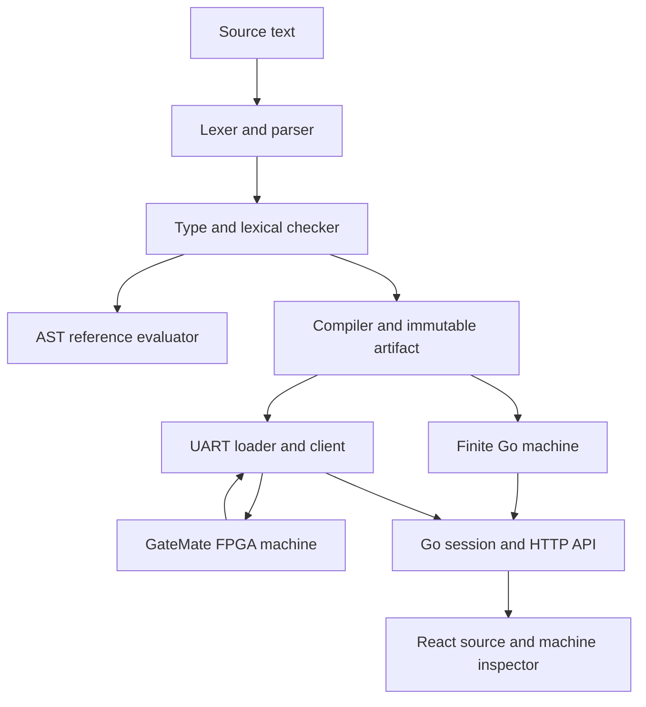
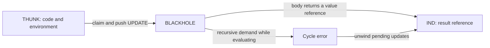

# Inside a Lazy Functional Language on GateMate

LFL1 is a small typed functional language whose programs execute on a finite graph machine implemented in both Go and FPGA logic. Its compiler translates expressions into fixed-width code records and an initial heap. Execution allocates closures, delayed computations, environments, and list constructors; demanding a delayed computation replaces it with a reference to its result. A React IDE exposes these transformations alongside the source that produced them.

This report explains the implemented system at source commit `64ebbe2`, including measurements from an Olimex GateMate board. The central subject is the relationship between language semantics and observable machine state: how lexical scope becomes environment records, how sharing becomes heap mutation, how recursion can produce either a finite observation or a cycle fault, and how a host application observes execution without accidentally demanding additional work.

## 1. Evaluation begins with a demand

An expression denotes a computation, but the machine does not immediately execute every expression it encounters. A delayed computation is represented by a **thunk** containing a code address and an environment reference. The environment identifies the bindings needed to interpret variables in that code. To **force** a thunk is to request enough evaluation to discover its outermost value.

That stopping point is weak head normal form, abbreviated WHNF. An integer is already in WHNF. A function closure is in WHNF even though its body has not run. A list constructor is in WHNF once the machine knows that it is `Cons` and has references to its head and tail; neither field must yet be evaluated. This distinction makes it possible to inspect the beginning of a list without computing its remainder.

LFL1 implements call-by-need: the first demand evaluates a thunk and records its result; later demands reuse that result. This combines deferred execution with sharing. The physical shared-expression example is:

```text
def double : Int -> Int = fun (n : Int) -> n * 2;
def main : Int =
  let x : Int = double 21 in
  (x + x) + (x + x);
```

The result is 168. The board performs one multiplication and three additions. All four occurrences of `x` resolve to the same heap cell, which changes from a suspended computation into an indirection to the integer 42. No compiler optimization is required to establish this sharing: it follows from how a binding is allocated and subsequently updated.

The language deliberately has a small type vocabulary: `Int`, `Bool`, `ListInt`, and function arrows. Integers are signed 32-bit values with checked arithmetic. Functions can take and return functions, so closures and partial application are expressible even without polymorphism. There are no user-defined algebraic data types, garbage collector, or source-level I/O in this version. These limits make the representation finite and the execution rules directly inspectable.

## 2. The complete execution path

The system has three executable interpretations of a program. The AST reference evaluator establishes source-level behavior using host data structures. The Go machine executes the packed artifact using explicit heap and stack limits. The FPGA executes the same artifact through synchronous memories and a hardware controller. Agreement is checked at semantic observation boundaries; the Go and RTL machines are not cycle-identical.



This separation answers different correctness questions. The reference evaluator asks what a well-typed expression means under lazy evaluation. The packed machine asks whether that meaning survives explicit allocation, finite references, and continuation frames. The RTL adds memory latency, protocol sequencing, and physical resource constraints. A successful source result alone cannot establish all three properties.

The compiler artifact is the common execution input. It contains code, initial heap objects, provenance, source spans, binding information, and metadata identifying the entry point and resource profile. The IDE retains that exact artifact, allowing an inspected heap address to be interpreted against the source and code that were actually loaded.


*Figure 1. The FPGA backend after loading a source artifact. Source text, code records, and heap state belong to the same loaded program. Editing the source does not silently replace the running artifact.*

## 3. Parsing and lexical binding

The frontend uses a handwritten lexer and parser. Recursive descent handles declarations, type annotations, lambdas, local bindings, conditionals, and list cases. A Pratt parser handles expression operators and application. Application binds most tightly, multiplication follows, then addition and subtraction, then comparisons. Application is left-associative, so `f x y` means `(f x) y`; function arrows associate to the right, so `Int -> Int -> Int` describes a function returning another function.

The parser distinguishes prefix negation from infix subtraction. A negative argument should be written as `f (-1)`: `f -1` is parsed as subtraction. Comparisons cannot be chained into an implicit multiway comparison. These rules matter because the runtime receives an explicit tree whose structure determines allocation and demand order.

Each syntax node retains a half-open byte span into the original UTF-8 source. These spans are used by diagnostics, code records, and heap provenance. JavaScript string indexing uses UTF-16 code units, so the frontend converts offsets through UTF-8 encoding and decoding when selecting source. Without that conversion, non-ASCII text in comments could shift every later highlight even when all identifiers remain ASCII.

The frontend imposes limits before compilation: source size is at most 1 MiB, token count at most 65,536, diagnostics at most 64, and nesting and AST height at most 256. Checking AST height separately matters because a long left-associated expression can produce a deep tree without equivalent recursive parser nesting. Recovery around malformed declarations tracks braces so a semicolon inside a `case` does not prematurely terminate recovery. Compilation still rejects programs with diagnostics; recovery is for useful feedback, not partial execution.

Lexical checking resolves every variable occurrence to a binding identity and an environment depth. A depth of zero means the nearest binding; following one parent environment reaches depth one. Binding names are useful during checking and inspection, but packed execution needs only the numerical depth.

```text
resolve(name, ordered_scope):
    scan bindings from newest to oldest
    if binding.name == name:
        return binding.id, number_of_parent_links
    report an unbound-variable diagnostic
```

Top-level names are all registered before their bodies are checked, allowing mutual recursion. A nonrecursive `let` checks its right-hand side in the previous scope and its body in the extended scope. A `let rec` checks both in the extended scope. For a `Cons(h, t)` case branch, the head binding is introduced first and the tail second, making `t` depth zero and `h` depth one in that branch.

Type checking is monomorphic and annotation-directed. Arithmetic consumes integers, comparisons produce booleans, conditionals require a boolean condition and matching branch types, and list cases require a `ListInt` scrutinee. The checker also requires `main`. This gives the compiler explicit contracts while runtime checks still detect malformed objects or invalid dynamic state.


*Figure 2. A type error is associated with a source span. Diagnostics belong to the current editor revision; the IDE does not treat a stale successful compilation as permission to load newer text.*

## 4. From syntax to a reproducible artifact

Compilation preserves the expression structure in a compact instruction set. Child expressions are emitted before their parent, so an instruction generally refers to earlier code records. Source span identifiers are assigned during traversal before child emission; span order and code order therefore need not coincide. Parentheses affect parsing and source structure but do not require a runtime instruction.

| Instruction | Meaning of its principal operands |
|---|---|
| `CONST` | A reference to a preloaded constant object |
| `VAR` | An environment depth |
| `LAMBDA` | Body code to capture with the current environment |
| `APP` | Function code and delayed argument code |
| `LET` / `LETREC` | Right-hand-side code and body code |
| `PRIM` | Left code, right code, and arithmetic/comparison operator |
| `IF` | Condition, then-branch, and else-branch code |
| `CONS` | Head code and tail code, both delayed |
| `CASE` | Scrutinee, nil-branch, and cons-branch code |

Each code record occupies 128 bits: opcode and flags, three 16-bit operands, a 32-bit immediate, a 16-bit source span, and reserved bits. Fixed widths permit direct memory loading and independent decoding in Go and Verilog. They also make capacity checks unambiguous: this profile supports 2,048 code records and 2,048 heap objects.

The initial heap begins with ten pinned error objects, followed by false, true, and nil. Integer constants are deduplicated in first source-occurrence order. Each top-level definition then contributes a thunk and an environment node. All top-level thunks capture the completed global environment chain, so an earlier definition can refer to a later one. The artifact root refers to the thunk for `main`.

Artifact identity is a SHA-256 digest of a deterministic JSON representation with its identity field empty. Ordered structures and sorted source-use metadata avoid map iteration nondeterminism. The digest covers source text as well as executable records, so changing a comment changes the artifact identity. This is desirable for an inspector that must associate execution with exact source text. The digest is an integrity identifier, not authentication or proof that an arbitrary artifact was produced by the trusted compiler.

The version is `lfl1-go-1`, and the resource profile is `LFL1-2048-512-64-v1`. The latter identifies 2,048 heap objects, 512 continuation frames, and a 64-entry trace. An artifact validator checks structural constraints before machine construction or serial loading. It does not establish correctness by recompiling the source embedded in an untrusted artifact.

## 5. Heap objects represent values and execution context

Every heap object occupies 80 bits: an 8-bit tag, 8-bit flags, two 16-bit reference-sized fields, and a 32-bit payload. References are 16-bit integers; `FFFF` is the absent reference. The tag determines how the other fields are interpreted.

| Tag | A | B | Payload or interpretation |
|---|---|---|---|
| `INT` | zero | zero | Signed 32-bit integer |
| `BOOL` | zero | zero | Zero or one |
| `NIL` | zero | zero | Empty list |
| `CONS` | Head reference | Tail reference | Unevaluated fields are permitted |
| `FUN` | Body code | Captured environment | Function closure |
| `THUNK` | Expression code | Captured environment | Suspended computation |
| `IND` | Target reference | zero | Memoized result reference |
| `BLACKHOLE` | zero | zero | Evaluation currently owns this cell |
| `ENV` | Binding reference | Parent environment | Lexical environment node |
| `ERROR` | zero | zero | Fault code |
| `FREE` | zero | zero | Unallocated storage |

An environment is a linked sequence of bindings. Looking up depth three performs three parent traversals and selects the binding at that node. A closure captures a reference to this sequence, so it continues to resolve its free variables after the expression that created it has returned.

This representation also separates a binding from the value it may eventually produce. An environment usually refers to a thunk. Updating that thunk leaves the environment unchanged, and every variable occurrence that reaches it observes the shared result. The heap graph can therefore change operationally while lexical scope remains stable.

## 6. Claiming, evaluating, and updating a thunk

A suspended computation has three relevant states: unevaluated, currently evaluating, and evaluated. LFL1 represents them as `THUNK`, `BLACKHOLE`, and `IND`. Before entering a thunk body, the machine reserves an update continuation and replaces the thunk with a blackhole. When the body returns, that continuation rewrites the owned blackhole into an indirection to the returned value.



The ordering is a correctness condition. If the machine marked a thunk before ensuring that it could push the update frame, stack exhaustion could leave a blackhole without a continuation capable of completing it. The implementation prepares the continuation before claiming the cell.

```text
enter(reference):
    object = read_heap(reference)
    if object is a terminal value:
        return its reference
    if object is IND:
        enter(object.target), subject to a traversal bound
    if object is BLACKHOLE:
        return pinned cycle error
    if object is THUNK:
        push UPDATE(reference), or return stack-full error
        replace reference with BLACKHOLE
        evaluate object.code in object.environment

return_through_UPDATE(owner, result):
    require heap[owner] is the expected owned BLACKHOLE
    heap[owner] = IND(result)
    preserve the owner's source provenance
    continue returning result
```

Errors follow the same update discipline. Returning an error discards ordinary computation continuations, but pending update frames still memoize the error. Repeating a demand therefore reaches the recorded failure instead of restarting a known failing computation. Pinned errors allow this unwinding to work even when the heap has no free allocation capacity.


*Figure 3. A paused model execution exposes the transient blackhole and its update continuation. This image shows a Go machine boundary; it is not evidence of a particular physical FPGA cycle.*

The continuation stack makes unfinished work explicit. `ARG` remembers an application argument and its caller environment while the function expression is forced. `PRIM_RIGHT` remembers the right operand while the left is evaluated; it becomes `PRIM_APPLY` after obtaining the left result. `IF` and `CASE` remember their alternatives. `UPDATE` remembers the claimed heap cell. Every frame is 128 bits, with only the fields relevant to its kind populated.

## 7. A complete shared-expression execution

The named `double` program provides a small execution whose allocations can be inspected in full. Its initial constants are integer 2 at address 13 and integer 21 at address 14. The global `double` thunk is at 15, its environment node at 16, `main` at 17, and the final global environment at 18.

Forcing `main` claims address 17. Its local binding allocates a thunk for `double 21` at 19 and an environment node for `x` at 20. The first use of `x` claims 19, then demands `double`. Evaluating the lambda allocates a function object at 21 and updates the global thunk at 15 to point to it.

Application allocates the delayed argument at 22 and a callee environment at 23. The body `n * 2` demands `n`, updating the argument thunk to the existing constant at 14. Multiplication allocates integer 42 at 24, and the pending update for `x` changes address 19 to `IND(24)`. The remaining uses follow that indirection. The additions allocate 84 at 25, another 84 at 26, and 168 at 27. Finally, `main` becomes `IND(27)`.

| Address | Role after execution |
|---|---|
| 15 | `IND(21)`: the global function has been evaluated |
| 17 | `IND(27)`: `main` has result 168 |
| 19 | `IND(24)`: the shared binding has result 42 |
| 21 | Closure for `double` |
| 22 | `IND(14)`: argument computation resolves to constant 21 |
| 24 | Integer 42, reused by all four occurrences of `x` |
| 25, 26 | Two separately allocated integer 84 results |
| 27 | Integer 168 |

This explains the measured totals: nine runtime allocations, four claims, four updates, one multiplication, and three additions. Four syntactic uses do not imply four evaluations. Conversely, equal results do not imply automatic deduplication: the two addition expressions allocate separate integer 84 objects.


*Figure 4. Physical execution returns 168 with four claims and updates. The named global function introduces an additional thunk demand compared with an inline-lambda version of the expression; counters must be compared against the exact source artifact.*

## 8. Closures distinguish caller scope from captured scope

Consider the essential structure of the closure example:

```text
def add : Int -> Int -> Int =
  fun (x : Int) -> fun (y : Int) -> x + y;
def main : Int =
  let inc : Int -> Int = add 1 in
  inc 41;
```

Evaluating the outer lambda creates a closure capturing the global environment. Applying it to 1 allocates a thunk for that argument and an environment node binding `x`. Evaluating the inner lambda then creates a new closure whose captured environment includes `x`. The body has still not added anything: its result is a function value.

When `inc` is applied to 41, the argument thunk captures the caller's environment, because the argument expression must resolve names where the call appears. The callee environment extends the function's captured environment, because the body must resolve free variables where the function was defined. Mixing these two environments would break lexical scope even if simple constant-only calls appeared to work.

```text
apply(function_code, argument_code, caller_environment):
    closure = force(evaluate(function_code, caller_environment))
    argument = allocate THUNK(argument_code, caller_environment)
    callee_environment = allocate ENV(argument, closure.environment)
    evaluate(closure.body, callee_environment)
```

Inside `x + y`, `y` is depth zero and `x` depth one. The physical closure screenshot shows the returned inner function at address 24, capturing environment 23, whose parents reach 18 and 16. The final result is 42 at address 27, with five claims and five updates. Inspecting these links establishes how scope is represented; the numerical result alone would provide weaker evidence.


*Figure 5. The function inspector follows captured environment references. Environment nodes retain binding references, including indirections created by earlier demands.*

## 9. Recursion, productivity, and exact list observations

Recursive definitions are not necessarily faults. A recursive computation fails when evaluating a claimed thunk immediately requires that same unfinished computation. For example, forcing `let rec x : Int = x in x` encounters its own blackhole. The physical cycle example returns error code 3 and updates both claimed computations to that failure.

A recursively defined list can produce a constructor before demanding its recursive reference:

```text
let rec xs : ListInt = Cons(1, xs) in xs
```

Constructing `Cons` allocates delayed head and tail fields. It does not demand `xs` again. The outer binding can therefore finish and become an indirection to the constructor before the tail is inspected. A later tail demand reaches the already completed list. The physical productive-list example yields eight ones with a final heap of only 21 objects and five runtime allocations. The repeated observations traverse a finite cyclic graph.

The squares example combines a source of natural numbers, a mapping function, and a bounded list consumer. The board returns `[1, 4, 9, 16, 25, 36, 49, 64]`. Its allocation counts expose the intermediate structure: 24 list constructors correspond to eight source cells, eight mapped cells, and eight output cells. Laziness controls which cells are demanded; it does not eliminate these intermediate allocations.

The observer must define its stopping rule precisely. To produce one element, it first demands the current list reference. If the result is `Cons`, it remembers the tail reference and demands the head. Once the head is an integer, it appends that value and stops with the tail still undemanded.

```text
next_element(cursor):
    constructor = demand(cursor)
    if constructor is NIL:
        mark complete
    if constructor is CONS:
        saved_tail = constructor.tail
        value = demand(constructor.head)
        append value
        cursor = saved_tail
        stop without demanding cursor
```

The actual session makes this procedure resumable. It records whether it needs a constructor or a head, whether a demand was already sent, and whether the output is pending. It advances in bounded tick chunks and resumes without resending a completed demand. This matters when an element takes more work than one HTTP control operation permits.

After eight elements from `take 8`, the session has eight values but has not yet observed the terminating nil. Completion becomes known only when the next constructor demand returns `NIL`. This boundary explains why the captured squares state says `NeedConstructor` with an undemanded tail. Reporting completion early would claim an observation the machine had not performed.


*Figure 6. Eight integers have been observed. The saved tail is the next demand boundary, and the machine is idle. The trace contains only its retained prefix, while aggregate counters cover the full execution.*

## 10. Finite allocation and synchronous hardware

The runtime uses a bump allocator without garbage collection. Runtime objects occupy consecutive addresses after the initial heap. Operations reserve their entire allocation batch before writing: application and local binding need two objects, list construction needs three, and a closure or integer result needs one. A failed capacity check can therefore return a pinned heap-full error without publishing a partially constructed object graph.

Allocation has an additional ordering requirement because provenance resides in separate memory. The controller writes object contents, writes their source spans, publishes the new committed heap bound, emits allocation trace records, and then resumes evaluation. Inspection must not treat an object as committed while its provenance is incomplete. Claiming and updating an existing thunk preserve its origin span, allowing an evaluated indirection to remain associated with the expression that created the delayed computation.

The FPGA implements code, heap, continuation stack, provenance, and trace in synchronous RAM. A read address is presented before the corresponding data can be consumed. The controller consequently has explicit issue, wait, and dispatch states for code, heap, environment lookup, and stack return. Treating these memories as combinational arrays in the controller would produce incorrect data dependencies after synthesis.

| Logical memory | Capacity and width | Bits |
|---|---|---:|
| Heap | 2,048 × 80 | 163,840 |
| Code | 2,048 × 128 | 262,144 |
| Stack | 512 × 128 | 65,536 |
| Provenance | 2,048 × 16 | 32,768 |
| Trace | 64 × 256 | 16,384 |
| Total | Logical payload storage | 540,672 |

This is 66 KiB of logical storage. Physical block allocation depends on supported RAM widths and depths, so logical bytes alone do not predict utilization. The qualified implementation uses 34 of 64 RAM halves, 14,359 of 40,960 CPE logic resources, and 3,804 flip-flops. Reported timing reaches 21.26 MHz against a 10 MHz target. The RAM planning bound was met; the original 10,000-CPE planning target was exceeded even though the design fits the device and passes timing.

Multiplication proceeds over 32 progress cycles, with RTL using shift-and-add logic. Checked signed arithmetic returns a fault when its mathematical result lies outside the 32-bit range. Addition and subtraction evaluate the left operand before the right; a left-side error bypasses the right-side computation. These demand-order rules affect both failures and observable claim counts.

The machine has bounded indirection and environment traversal as well as bounded allocation and stack depth. A well-typed source program can still exhaust finite resources. In particular, generating an unbounded sequence of fresh list cells eventually exhausts this heap, even though observing a cyclic list can reuse a fixed set of cells indefinitely.

## 11. Loading and controlling the physical machine

The board runs at 10 MHz and communicates through a 115,200-baud UART using 8N1 framing. The host serial client serializes exchanges and loads an artifact through a staged protocol. It validates the artifact locally, resets the device, checks its profile signature, sends metadata and contiguous code/heap/provenance records, reads those records back, and only then commits the load.

| Command | Purpose |
|---|---|
| `R` | Reset the device session |
| `B` | Begin a load with code count, heap count, root, and constant boundary |
| `C`, `H`, `V` | Write code, heap objects, and provenance |
| `K` | Commit a completed load |
| `F` | Demand a heap reference |
| `T` | Advance a bounded number of enabled ticks |
| `P` | Poll and consume a completed output reference |
| `Q` | Query status, counters, or memory pages |

Payloads use hexadecimal encoding and an XOR checksum; the command byte is excluded from that checksum. Successful acknowledgements, empty polls, and syntax/state/checksum errors have distinct response forms. Wide object and instruction words remain hexadecimal strings in JSON rather than becoming JavaScript numbers that would lose precision.

The link performs framing, state, and basic record checks. Full structural artifact validation is a host responsibility, while runtime checks protect execution against invalid addresses, tags, code, environments, and update ownership. These are separate validation layers with different knowledge of the program.

A communication failure marks the client unsynchronized and requires reset. Automatically retransmitting a command would be ambiguous: a timeout does not establish that the device failed to execute it. Retrying a tick or output-consuming poll could advance computation or consume a result twice. The IDE therefore exposes uncertain state and a reset requirement rather than treating the last successful snapshot as current hardware truth.

## 12. The IDE preserves observation identity

The Go session owns either the model machine or the serial client and serializes complete control operations. Each successful observation produces a detached frame with a frame identifier, a random run identifier, artifact identity, backend, operation, and machine data. Reset and load establish new run identities, including failed attempts that invalidate the previous run.

Mutating requests must supply the expected frame identifier and run identifier. The server rejects stale controls before execution. This prevents an old browser view from advancing a machine that has since been reset or loaded with a different artifact. A heap address alone is not a durable identity: address 24 in one run can denote a completely different object in the next.

The React application uses Redux and RTK Query for state and HTTP interaction. Compile requests include an editor revision; responses for obsolete revisions cannot enable loading new text. The loaded source remains tied to the artifact under inspection. Changing runs clears selections that would otherwise point to reused addresses.

| HTTP API | Role |
|---|---|
| `GET /api/language/examples` | Retrieve the six embedded example programs |
| `POST /api/language/compile` | Compile source with a client revision and return diagnostics or artifact identity |
| `GET /api/language/artifacts/{id}` | Retrieve the retained artifact and decoded code |
| `GET /api/language/state` | Read the latest cached frame and history metadata |
| `GET /api/language/history/{id}` | Retrieve a detached historical frame |
| `POST /api/language/control` | Load, reset, force, tick, poll, or advance a stream |

History retains 128 frames. Reading history is an inspection operation, not a hardware read or replay. Controls are disabled for historical views, and the server's stale-identity checks independently enforce the mutation boundary. The compiler cache is bounded separately and retains artifacts needed to interpret saved frames.


*Figure 7. A saved model frame remains inspectable while execution controls are disabled. Returning to live state restores control against the current run and frame identity.*

The interface provides source selection, code inspection, heap and provenance views, environment traversal, stack decoding, counters, and mutation trace inspection. It supports explicit stepping and bounded runs; it does not implement source breakpoints or function-level step-over. Source association identifies the origin of code and allocated objects, which is different from reconstructing a complete source-level debugger stack.

## 13. What the measurements establish

The physical qualification ran six source programs through compilation, UART loading, execution, and readback. The following counters are from `reference/validation/i4-physical-tests.log` in the ticket, rather than estimates from the Go model.

| Program | Observation | Final heap | Allocations | Claims / updates | Maximum stack |
|---|---|---:|---:|---:|---:|
| Shared | 168 | 28 | 9 | 4 / 4 | 6 |
| Closure | 42 | 28 | 9 | 5 / 5 | 5 |
| Unused argument | 7 | 23 | 3 | 2 / 2 | 3 |
| Immediate cycle | Error 3 | 17 | 2 | 2 / 2 | 2 |
| Productive recursion | Eight ones | 21 | 5 | 4 / 4 | 2 |
| Squares | First eight squares | 268 | 242 | 98 / 98 | 8 |

The unused-argument case establishes that a function can return without demanding its argument. The immediate cycle and productive recursion cases establish distinct behaviors for re-entering an unfinished computation and revisiting a completed recursive structure. The closure case exercises retained lexical context. The shared example exposes memoization through arithmetic and update counts.

The squares allocation breakdown is 96 thunks, 20 functions, 80 environments, 24 constructors, and 22 integers. Eight multiplications produce the squares; seven additions advance the source between the eight requested elements, and seven subtractions advance the bounded consumer. Eight less-than-or-equal comparisons select the consumer branches. These counts reflect an exact prefix observation with no speculative ninth element.

Mutation tracing has finite retention. Squares produces 242 allocation events plus 98 claims and 98 updates, for 438 events. The trace stores its first 64 and reports 374 dropped events. A short trace therefore does not imply that the machine stopped mutating. The aggregate counters continue to describe the whole run after trace storage fills.

Cycle counters require similar care. The physical shared test requested 100,000 enabled ticks and recorded 99,772 output-stall ticks. Their difference is 228 non-stall enabled ticks. That derived quantity describes controller activity under this test; the raw 100,000 count is not expression latency. UART wall time, disabled clocks, and host query time are different measurements. The Go model also uses different memory-access details in some return paths, so semantic parity does not imply cycle parity.

Verification includes the independent AST evaluator, finite-machine tests, RTL tests over 15 compiled program vectors, serial protocol tests, physical execution, and browser checks. The final repository frontend suite has 20 tests across six files, including tests for earlier applications; it should not be described as 20 tests solely for this IDE. The qualification records establish the exercised cases, not a proof for every well-typed program or every possible protocol interruption.

## 14. Reading and extending the implementation

A useful source-reading order follows the representations. Start with the AST and checker to understand which expressions are admitted and how variables are resolved. Read the record definitions before the compiler so code and heap construction have concrete meanings. Then follow thunk entry and return handling in the machine, followed by allocation publication. Finally compare those transitions with the synchronous RTL and inspect the session's control boundaries.

All paths below are relative to `/home/manuel/code/wesen/2026-09-04--gatemate-symbolic`. The linked source is pinned to the report's implementation commit.

| File or directory | What to study |
|---|---|
| [syntax/parser.go](https://github.com/wesen/2026-09-04--gatemate-symbolic/blob/64ebbe291a4a1e23c8cb21a6dcb2db2be767b9f2/pkg/lazylang/syntax/parser.go) | Recursive descent, Pratt parsing, depth limits, and recovery |
| [check/check.go](https://github.com/wesen/2026-09-04--gatemate-symbolic/blob/64ebbe291a4a1e23c8cb21a6dcb2db2be767b9f2/pkg/lazylang/check/check.go) | Binding identities, lexical depths, and type rules |
| [semantics/reference.go](https://github.com/wesen/2026-09-04--gatemate-symbolic/blob/64ebbe291a4a1e23c8cb21a6dcb2db2be767b9f2/pkg/lazylang/semantics/reference.go) | Independent lazy cells, memoization, and prefix observation |
| [ir/records.go](https://github.com/wesen/2026-09-04--gatemate-symbolic/blob/64ebbe291a4a1e23c8cb21a6dcb2db2be767b9f2/pkg/lazylang/ir/records.go) | Packed records, resource profile, encoding, and validation |
| [compile/compile.go](https://github.com/wesen/2026-09-04--gatemate-symbolic/blob/64ebbe291a4a1e23c8cb21a6dcb2db2be767b9f2/pkg/lazylang/compile/compile.go) | Postorder code emission and initial heap construction |
| [machine/machine.go](https://github.com/wesen/2026-09-04--gatemate-symbolic/blob/64ebbe291a4a1e23c8cb21a6dcb2db2be767b9f2/pkg/lazylang/machine/machine.go) | Explicit states, continuation frames, allocation, and update ownership |
| [lfl_core.sv](https://github.com/wesen/2026-09-04--gatemate-symbolic/blob/64ebbe291a4a1e23c8cb21a6dcb2db2be767b9f2/lazy_language/rtl/lfl_core.sv) | Synchronous implementation of the graph machine |
| [lfl_link.sv](https://github.com/wesen/2026-09-04--gatemate-symbolic/blob/64ebbe291a4a1e23c8cb21a6dcb2db2be767b9f2/lazy_language/rtl/lfl_link.sv) | UART command state and memory inspection |
| [serial/client.go](https://github.com/wesen/2026-09-04--gatemate-symbolic/blob/64ebbe291a4a1e23c8cb21a6dcb2db2be767b9f2/pkg/lazylang/serial/client.go) | Load/readback protocol and synchronization failure handling |
| [session.go](https://github.com/wesen/2026-09-04--gatemate-symbolic/blob/64ebbe291a4a1e23c8cb21a6dcb2db2be767b9f2/internal/lazylanguageide/session.go) | Run identity, immutable frames, and resumable list observation |
| `web/src/lazylanguage/` | React inspectors, source selection, state, and HTTP integration |

The central Go API boundary is small: `syntax.Parse` produces syntax and diagnostics; `check.Check` produces resolved, typed syntax; the compiler produces an artifact; `machine.New` validates and instantiates that artifact; `Demand`, `Tick`, `Poll`, and `Snapshot` expose explicit execution and observation. `semantics.Observe` provides an independently implemented source observation. Its fuel exhaustion or context cancellation is an inconclusive host error, rather than a language-level fault or a claim about FPGA capacity.

The durable evidence is under `ttmp/2026/09/05/GATEMATE-SYMBOLIC-010--lazy-functional-language-compiler-and-source-aware-fpga-ide/`. The implementation handoff is `reference/04-implemented-language-runtime-and-ide-intern-handoff.md`; physical measurements are in `reference/validation/i4-physical-tests.log`; `implementation-audit.json` and `completion-check.json` in that validation directory preserve qualification metadata. Screenshots in this article are copies of the ticket's original captures, with the backend identified in each caption.

Future extensions must preserve the same observable contracts. Garbage collection would need to enumerate roots held in environments, continuation frames, pending allocation state, and host-visible stream cursors. Source breakpoints would need a definition tied to machine boundaries, since one expression can allocate and update across many cycles. A richer type system would need coordinated changes to syntax, checking, artifacts, runtime tags, and inspectors. Each extension can be evaluated against the existing concrete invariants: delayed arguments capture caller scope, function bodies use captured scope, every claimed thunk has an update obligation, and observations stop at the demand the user actually requested.

## Related project reports

- [[ARTICLE - GateMate Symbolic - Inside a Lazy Graph Reducer]] describes the preceding reducer and its narrower input model.
- [[ARTICLE - GateMate Symbolic - Inside a Tagged Stack CPU]] explains the earlier tagged processor.
- [[ARTICLE - GateMate Symbolic - Inside an Elastic Dataflow Engine]] develops the earlier dataflow execution architecture.
